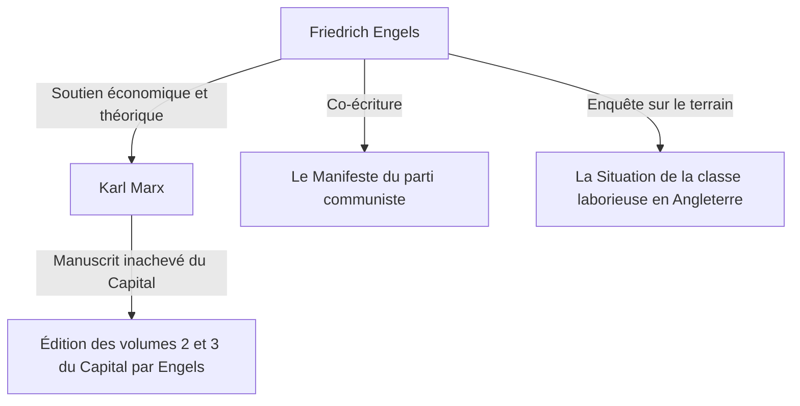

## Introduction : Le vrai visage d'un géant caché dans l'ombre de l'histoire

Il n'y a personne qui ne connaisse le nom de Karl Marx. Cependant, le nom de son allié idéologique, "Friedrich Engels", qui a continué à soutenir les bases théoriques et physiques de sa critique du capitalisme, a souvent tendance à être caché dans l'ombre de Marx. Engels n'était pas un simple mécène ou éditeur. Il était lui-même un théoricien exceptionnel, un journaliste, et surtout, il avait une position extrêmement unique et apparemment contradictoire d'être "un capitaliste mais aussi un révolutionnaire".

Dans cet article, nous explorerons en profondeur la vie d'Engels et sa philosophie, en particulier son rôle décisif dans l'établissement de la conception matérialiste de l'histoire, et la réalité de la classe ouvrière du 19ème siècle à laquelle il a été confronté, d'un point de vue historique, économique et philosophique. Sa vie incarne la lumière et l'ombre à l'aube du capitalisme moderne, et sa pensée continue de briller fortement pour déchiffrer les contradictions de la société contemporaine.

## Chapitre 1 : Famille de la bourgeoisie et rébellion de jeunesse

### 1. En tant que fils d'un riche propriétaire d'usine de filature
Le 28 novembre 1820, Friedrich Engels est né à Barmen, dans le royaume de Prusse (l'actuelle Allemagne). Son père était un riche propriétaire d'usine de filature et un piétiste strict. Engels, en tant qu'enfant de la classe bourgeoise, était censé succéder à son père en tant qu'homme d'affaires à l'avenir. Cependant, il a très tôt développé une rébellion contre l'autorité religieuse et l'environnement familial autoritaire.

### 2. Rencontre avec les jeunes hégéliens
Bien qu'Engels ait été contraint d'abandonner le lycée (Gymnasium) et ait commencé à travailler comme apprenti dans une entreprise commerciale, son cœur était toujours tourné vers la philosophie et la littérature. Pendant son service militaire à Berlin, il a assisté à des conférences à l'Université de Berlin et a rejoint le cercle radical des "Jeunes hégéliens". C'est là qu'il a appris à interpréter radicalement la dialectique de la philosophie de Hegel et à l'utiliser comme une arme pour critiquer l'État et la religion du statu quo.

## Chapitre 2 : La réalité de Manchester — "La Situation de la classe laborieuse en Angleterre"

### 1. Vers le centre de la révolution industrielle
En 1842, Engels s'est rendu à Manchester, en Angleterre, pour travailler chez Ermen & Engels, une entreprise dans laquelle son père était co-partenaire. Manchester, à cette époque, était surnommée "l'atelier du monde" et était une ville à la pointe de la révolution industrielle. Cependant, ce qu'Engels y a vu, c'était la réalité misérable et inimaginable de la classe ouvrière, derrière l'accumulation de richesses.

### 2. Rencontre avec Mary Burns et exploration des bidonvilles
Durant cette période, il a rencontré Mary Burns, une ouvrière d'origine irlandaise, et a noué une relation avec elle qui a duré toute sa vie. Guidé par elle, Engels a caché son identité de fils de propriétaire d'usine et a pénétré au fond des quartiers résidentiels des travailleurs (les bidonvilles). Un environnement de vie insalubre, de longues heures de travail, le travail des enfants et des épidémies endémiques. Il a enregistré cette réalité infernale avec les yeux froids d'un journaliste et une indignation brûlante.

### 3. La naissance du reportage historique
Basé sur cette enquête de terrain, "La Situation de la classe laborieuse en Angleterre" a été publié en 1845. Cet ouvrage n'était pas seulement un livre de dénonciation, mais il est devenu un chef-d'œuvre pionnier en sociologie et en économie, révélant le mécanisme par lequel le système capitaliste exploite structurellement les travailleurs et reproduit la pauvreté.

## Chapitre 3 : Une relation d'allié fatidique avec Marx

### 1. Retrouvailles à Paris et sympathie mutuelle
En 1844, Engels a retrouvé Karl Marx à Paris. Bien que Marx ait été froid lors de leur première rencontre, cette fois c'était différent. Marx, qui avait lu l'"Esquisse d'une critique de l'économie politique" à laquelle Engels avait contribué, a été impressionné par la profonde compréhension d'Engels de l'économie. Les deux hommes ont discuté toute la nuit dans un café parisien et ont confirmé que leurs idées correspondaient parfaitement. À partir de là, a commencé une coopération intellectuelle solide, sans précédent dans l'histoire.

### 2. Soutien économique et "double vie"
Marx était un excellent théoricien, mais il n'avait presque aucune capacité à gagner sa vie et était toujours dans un état d'extrême pauvreté. Engels a décidé de se résigner à une vie d'"homme d'affaires bourgeois", ce qui était contraire à sa propre idéologie, afin que Marx puisse se concentrer sur l'écriture du "Capital". Il a continué à travailler dans l'entreprise commerciale de Manchester et a envoyé une grande partie de ses revenus pour subvenir aux besoins de la famille Marx. Pendant près de 20 ans, il a mené une dure "double vie" : agir comme un capitaliste froid le jour et écrire pour la révolution la nuit.

## Chapitre 4 : Établissement de la conception matérialiste de l'histoire et travail collaboratif

### 1. "L'Idéologie allemande" et le matérialisme historique
Marx et Engels ont co-écrit "L'Idéologie allemande", critiquant radicalement l'idéalisme des jeunes hégéliens. Ils y ont établi la thèse de base de la conception matérialiste de l'histoire (le matérialisme historique) : "Ce n'est pas la conscience des hommes qui détermine leur existence, c'est au contraire leur existence sociale qui détermine leur conscience". Cette découverte selon laquelle la force motrice de l'histoire n'est pas l'esprit ou les idées, mais le mode de production matériel et la lutte des classes, a provoqué un changement de paradigme dans les sciences sociales.

### 2. La rédaction du "Manifeste du parti communiste"
En 1848, alors qu'une tempête de révolutions balayait l'Europe, les deux hommes ont publié "Le Manifeste du parti communiste". Cette brochure, qui commence par la célèbre phrase "L'histoire de toute société jusqu'à nos jours n'a été que l'histoire de luttes de classes", déclarait avec force la mission historique du prolétariat (la classe ouvrière) et est devenu le programme du mouvement communiste.

## Chapitre 5 : L'achèvement du "Capital" et la fin de vie d'Engels

### 1. La mort de Marx et l'organisation de ses manuscrits posthumes
En 1883, Marx est décédé avec seulement le premier volume du "Capital" publié. Ce qu'il a laissé derrière lui, c'était une montagne de notes et de brouillons non triés, écrits avec une mauvaise écriture. Engels a abandonné toutes ses propres recherches (telles que la dialectique de la nature) et a consacré tout le reste de sa vie à déchiffrer et éditer les manuscrits posthumes de son meilleur ami.

### 2. Publication des tomes 2 et 3
Luttant contre la détérioration de sa vue, Engels a compris les intentions de Marx, a comblé les lacunes logiques, et a publié le volume 2 (1885) et le volume 3 (1894) du "Capital". La seconde moitié du "Capital" que nous lisons aujourd'hui n'aurait pas pu exister sans le travail d'édition dévoué d'Engels.

## Conclusion : Ce qu'Engels remet en question aujourd'hui

Friedrich Engels détestait l'hypocrisie de la classe bourgeoise à laquelle il appartenait, et a consacré sa vie et sa fortune à l'émancipation du prolétariat. Sa vie est un exemple rare où la théorie et la pratique, la pensée et l'action se sont miraculeusement rejointes.

Aujourd'hui, nous sommes confrontés à de nouvelles formes de contradictions capitalistes, telles que le développement de l'IA et des technologies d'automatisation, et l'élargissement des inégalités dû à la mondialisation. Le mécanisme d'"exploitation structurelle" qu'Engels a découvert dans le Manchester du 19ème siècle existe toujours dans notre société sous différentes formes.

Les profondes intuitions qu'il a laissées derrière lui et son esprit passionné de solidarité envers la détresse des travailleurs ne sont pas confinés dans les manuels d'histoire. Ils continuent de nous interpeller aujourd'hui comme de puissantes armes intellectuelles pour concevoir une société plus juste et égalitaire.
