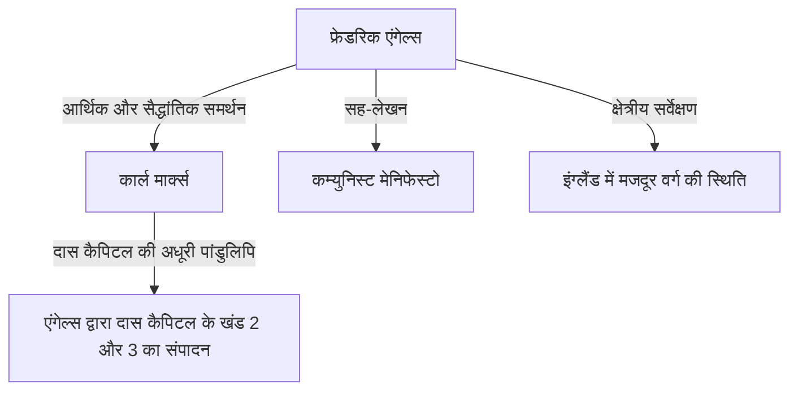

## प्रस्तावना: इतिहास की छाया में छिपे विशाल व्यक्तित्व का असली रूप

कार्ल मार्क्स का नाम कौन नहीं जानता होगा। हालाँकि, उनके वैचारिक सहयोगी, और उनकी पूँजीवाद की आलोचना के सैद्धांतिक और भौतिक आधार का समर्थन करने वाले "फ्रेडरिक एंगेल्स (Friedrich Engels)" का नाम अक्सर मार्क्स की छाया में छिप जाता है। एंगेल्स केवल एक संरक्षक या संपादक नहीं थे। वे स्वयं एक उत्कृष्ट सिद्धांतकार, एक पत्रकार, और सबसे महत्वपूर्ण बात, एक "पूंजीपति होते हुए भी क्रांतिकारी" थे, एक स्पष्ट रूप से विरोधाभासी और अत्यंत अद्वितीय स्थिति रखने वाले व्यक्ति थे।

इस लेख में, हम एंगेल्स के जीवन और उनके दर्शन, विशेष रूप से ऐतिहासिक भौतिकवाद की स्थापना में उनकी निर्णायक भूमिका, और 19वीं सदी के मजदूर वर्ग की जिस वास्तविकता का उन्होंने सामना किया, उसकी ऐतिहासिक, आर्थिक और दार्शनिक दृष्टिकोण से गहराई से जांच करेंगे। उनका जीवन आधुनिक पूंजीवाद की शुरुआत के प्रकाश और अंधकार का प्रतीक है, और उनके विचार आज भी आधुनिक समाज के विरोधाभासों को समझने के लिए मजबूत प्रकाश डालते हैं।

## अध्याय 1: बुर्जुआ परिवार और युवावस्था का विद्रोह

### 1. एक धनी कताई मिल मालिक के बेटे के रूप में
28 नवंबर, 1820 को फ्रेडरिक एंगेल्स का जन्म बर्मेन, किंगडम ऑफ प्रशिया (आधुनिक जर्मनी) में हुआ था। उनके पिता एक धनी कताई मिल के मालिक और एक सख्त पीटीस्ट (Pietist) थे। एंगेल्स से, बुर्जुआ वर्ग के एक बच्चे के रूप में, भविष्य में एक व्यवसायी के रूप में अपने पिता के नक्शेकदम पर चलने की उम्मीद थी। हालाँकि, उन्होंने कम उम्र से ही धार्मिक और सत्तावादी पारिवारिक माहौल के खिलाफ विद्रोह करना शुरू कर दिया था।

### 2. युवा हेगेलियन से मुलाकात
जिमनैजियम से बाहर निकाले जाने के बाद और एक ट्रेडिंग कंपनी में प्रशिक्षु के रूप में काम करना शुरू करने के बाद भी, एंगेल्स का दिल हमेशा दर्शन और साहित्य की ओर था। बर्लिन में अपनी सैन्य सेवा के दौरान, उन्होंने बर्लिन विश्वविद्यालय में व्याख्यान में भाग लिया और "यंग हेगेलियन" के कट्टरपंथी चक्र में शामिल हो गए। यहाँ उन्होंने हेगेलियन द्वंद्वात्मकता की मौलिक व्याख्या करना सीखा और इसे वर्तमान राज्य और धर्म की आलोचना करने के लिए एक हथियार के रूप में उपयोग करना सीखा।

## अध्याय 2: मैनचेस्टर की वास्तविकता — 'इंग्लैंड में मजदूर वर्ग की स्थिति'

### 1. औद्योगिक क्रांति के केंद्र में
1842 में, एंगेल्स इंग्लैंड के मैनचेस्टर गए, जहाँ उन्होंने एर्मेन और एंगेल्स की फर्म में काम किया, जो उनके पिता की कंपनी की सह-स्वामित्व वाली फर्म थी। उस समय, मैनचेस्टर को "दुनिया का कारखाना" कहा जाता था और यह औद्योगिक क्रांति में सबसे आगे रहने वाला शहर था। हालाँकि, वहाँ एंगेल्स ने धन के संचय के पीछे मजदूर वर्ग की अकल्पनीय और दयनीय वास्तविकता देखी।

### 2. मैरी बर्न्स से मुलाकात और मलिन बस्तियों की खोज
इस समय के दौरान, वह मैरी बर्न्स नामक एक आयरिश महिला कार्यकर्ता से मिले और जीवन भर का रिश्ता कायम किया। उनके मार्गदर्शन में, एंगेल्स ने कारखाने के मालिक के बेटे के रूप में अपनी पहचान छुपाई और श्रमिकों के आवासीय क्षेत्रों (मलिन बस्तियों) की गहराई में कदम रखा। अस्वच्छ रहने की स्थिति, लंबे समय तक काम करना, बाल श्रम और व्यापक महामारियां। उन्होंने एक ठंडे पत्रकार की नजर और जलते हुए आक्रोश के साथ इस नरक जैसी वास्तविकता को दर्ज किया।

### 3. ऐतिहासिक रिपोर्टेज का जन्म
इस क्षेत्रीय जांच के आधार पर, 'इंग्लैंड में मजदूर वर्ग की स्थिति' 1845 में प्रकाशित हुई थी। यह पुस्तक सिर्फ एक आरोप की किताब नहीं थी, बल्कि समाजशास्त्र और अर्थशास्त्र की एक अग्रणी उत्कृष्ट कृति बन गई, जिसने उस तंत्र का खुलासा किया जिसके द्वारा पूंजीवाद की व्यवस्था संरचनात्मक रूप से श्रमिकों का शोषण करती है और गरीबी को पुन: उत्पन्न करती है।

## अध्याय 3: मार्क्स के साथ नियत गठबंधन

### 1. पेरिस में पुनर्मिलन और घनिष्ठता
1844 में, एंगेल्स पेरिस में कार्ल मार्क्स से फिर से मिले। जब वे पहले एक बार मिले थे, तो मार्क्स का रवैया ठंडा था, लेकिन इस बार यह अलग था। एंगेल्स द्वारा योगदान की गई 'राजनीतिक अर्थव्यवस्था की आलोचना की रूपरेखा' को पढ़ने के बाद, मार्क्स एंगेल्स की अर्थशास्त्र की गहरी समझ से प्रभावित हुए थे। दोनों ने पेरिस के एक कैफे में पूरी रात बात की और पुष्टि की कि उनके विचार पूरी तरह से मेल खाते हैं। यहीं से इतिहास में एक अभूतपूर्व और मजबूत बौद्धिक सहयोग शुरू हुआ।

### 2. आर्थिक सहायता और "दोहरा जीवन"
मार्क्स एक उत्कृष्ट सिद्धांतकार थे, लेकिन उनमें जीवन कौशल का अभाव था और वे हमेशा अत्यधिक गरीबी की स्थिति में रहते थे। एंगेल्स ने एक "बुर्जुआ व्यवसायी" के रूप में जीने का फैसला किया, जो उनकी अपनी विचारधारा के विपरीत था, ताकि मार्क्स 'दास कैपिटल' (Das Kapital) लिखने पर ध्यान केंद्रित कर सकें। उन्होंने मैनचेस्टर की फर्म में काम किया और अपनी आय का एक बड़ा हिस्सा मार्क्स के परिवार के रहने के खर्च के रूप में भेजना जारी रखा। दिन में एक ठंडे पूंजीपति के रूप में कार्य करना और रात में क्रांति के लिए लिखना, उन्होंने लगभग 20 वर्षों तक यह भीषण "दोहरा जीवन" जारी रखा।

## अध्याय 4: ऐतिहासिक भौतिकवाद की स्थापना और सहयोगात्मक कार्य

### 1. 'द जर्मन आइडियोलॉजी' और ऐतिहासिक भौतिकवाद
मार्क्स और एंगेल्स ने 'द जर्मन आइडियोलॉजी' को सह-लिखा और यंग हेगेलियन के आदर्शवाद की पूरी तरह से आलोचना की। यहाँ उन्होंने ऐतिहासिक भौतिकवाद का मूल सिद्धांत स्थापित किया: "मनुष्यों की चेतना उनके अस्तित्व को निर्धारित नहीं करती है, बल्कि इसके विपरीत, उनका सामाजिक अस्तित्व उनकी चेतना को निर्धारित करता है।" यह खोज कि इतिहास को चलाने वाली प्रेरक शक्ति भावना या विचार नहीं बल्कि उत्पादन के भौतिक तरीके और वर्ग संघर्ष हैं, ने सामाजिक विज्ञान में एक आदर्श बदलाव लाया।

### 2. 'कम्युनिस्ट मेनिफेस्टो' का मसौदा तैयार करना
1848 में, जब क्रांति का तूफान पूरे यूरोप में बह रहा था, दोनों ने 'कम्युनिस्ट मेनिफेस्टो' प्रकाशित किया। "अब तक मौजूद सभी समाजों का इतिहास वर्ग संघर्ष का इतिहास है," प्रसिद्ध शुरुआती पंक्ति के साथ, इस पैम्फलेट ने सर्वहारा वर्ग (मजदूर वर्ग) के ऐतिहासिक मिशन को दृढ़ता से घोषित किया और कम्युनिस्ट आंदोलन का कार्यक्रम बन गया।

## अध्याय 5: 'दास कैपिटल' का पूरा होना और एंगेल्स का बाद का जीवन

### 1. मार्क्स की मृत्यु और पांडुलिपियों का संपादन
1883 में, मार्क्स का निधन केवल 'दास कैपिटल' के पहले खंड को प्रकाशित करने के बाद हो गया। उनके पीछे जो बचा था वह खराब लिखावट में लिखे गए बड़े पैमाने पर असंगठित नोट्स और ड्राफ्ट का पहाड़ था। एंगेल्स ने अपने स्वयं के शोध (जैसे कि प्रकृति की द्वंद्वात्मकता) को छोड़ दिया और अपने बाद के वर्षों को अपने सबसे अच्छे दोस्त की पांडुलिपियों को समझने और संपादित करने के लिए समर्पित कर दिया।

### 2. खंड 2 और 3 का प्रकाशन
दृष्टि की गिरावट से लड़ते हुए, एंगेल्स ने मार्क्स के इरादों को समझा, तार्किक अंतराल को भरा, और 'दास कैपिटल' का खंड 2 (1885) और खंड 3 (1894) प्रकाशित किया। 'दास कैपिटल' का उत्तरार्ध जो हम आज पढ़ते हैं, वह एंगेल्स के समर्पित संपादन कार्य के बिना मौजूद नहीं होता।

## निष्कर्ष: एंगेल्स आधुनिक समय में क्या पूछते हैं

फ्रेडरिक एंगेल्स को उस बुर्जुआ वर्ग के पाखंड से नफरत थी जिससे वे संबंधित थे, और उन्होंने अपना जीवन और संपत्ति सर्वहारा वर्ग की मुक्ति के लिए समर्पित कर दी। उनका जीवन सिद्धांत और व्यवहार, विचार और कार्य के चमत्कारी संरेखण का एक दुर्लभ उदाहरण है।

आज, हम पूंजीवादी अंतर्विरोधों के नए रूपों का सामना कर रहे हैं, जैसे कि एआई और स्वचालन प्रौद्योगिकियों का विकास और वैश्वीकरण के कारण बढ़ती असमानता। "संरचनात्मक शोषण" का तंत्र जिसे एंगेल्स ने 19वीं सदी के मैनचेस्टर में पाया था, वह आज भी एक अलग रूप में हमारे समाज में मौजूद है।

श्रमिकों की दुर्दशा के प्रति उनकी गहरी अंतर्दृष्टि और भावुक एकजुटता की भावना इतिहास की पाठ्यपुस्तकों तक सीमित नहीं है। यह आज भी हमारे साथ अधिक न्यायसंगत और समान समाज की कल्पना करने के लिए एक शक्तिशाली बौद्धिक हथियार के रूप में बात कर रहा है。
