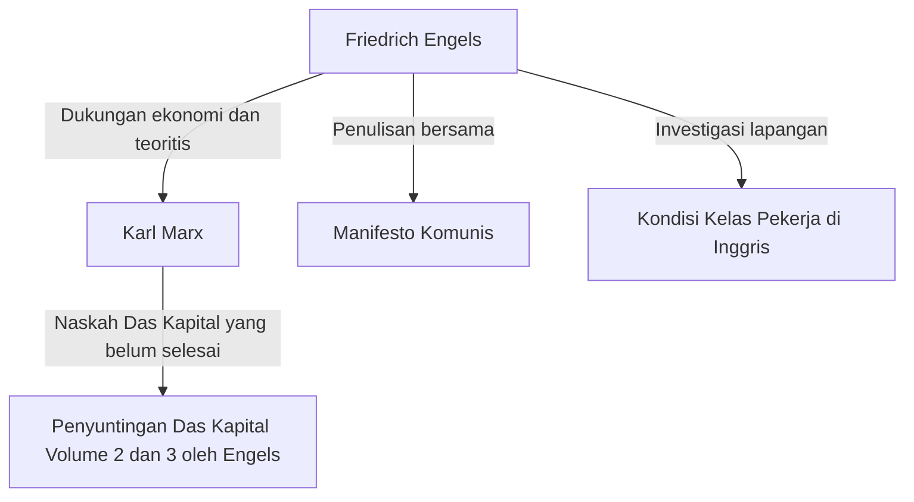

## Pendahuluan: Wajah Raksasa di Balik Bayang-bayang Sejarah

Tidak ada yang tidak tahu nama Karl Marx. Namun, nama "Friedrich Engels", sekutu ideologisnya yang terus mendukung landasan teoritis dan fisik dari kritiknya terhadap kapitalisme, sering kali tersembunyi di balik bayang-bayang Marx. Engels bukan sekadar penyokong dana atau editor. Dia sendiri adalah seorang ahli teori yang luar biasa, seorang jurnalis, dan di atas segalanya, memiliki posisi yang sangat unik yang tampak kontradiktif: "seorang kapitalis sekaligus revolusioner".

Artikel ini akan mendalami kehidupan Engels dan filosofinya, khususnya peran pentingnya dalam pembentukan materialisme historis, dan realitas kelas pekerja abad ke-19 yang dihadapinya, dari perspektif historis, ekonomi, dan filosofis. Kehidupannya mewujudkan cahaya dan bayangan di awal mula kapitalisme modern, dan pemikirannya masih memancarkan cahaya terang dalam memecahkan kontradiksi masyarakat modern.

## Bab 1: Keluarga Borjuis dan Pemberontakan Masa Muda

### 1. Sebagai Putra Pemilik Pabrik Pemintalan yang Kaya
Pada 28 November 1820, Friedrich Engels lahir di Barmen, Kerajaan Prusia (sekarang Jerman). Ayahnya adalah pemilik pabrik pemintalan yang kaya dan penganut Pietisme yang taat. Sebagai anak dari kelas borjuis, Engels diharapkan untuk meneruskan jejak ayahnya sebagai pengusaha di masa depan. Namun, sejak awal ia mulai memendam penolakan terhadap otoritas agama dan lingkungan keluarga yang otoriter.

### 2. Pertemuan dengan Pemuda Hegelian
Meskipun dipaksa keluar dari gimnasium dan mulai bekerja sebagai magang di perusahaan dagang, hatinya selalu tertuju pada filosofi dan sastra. Selama dinas militernya di Berlin, ia menghadiri kuliah di Universitas Berlin dan bergabung dengan lingkaran radikal "Pemuda Hegelian". Di sini, ia belajar menafsirkan dialektika filosofi Hegel secara radikal dan menggunakannya sebagai senjata untuk mengkritik negara dan agama saat itu.

## Bab 2: Realitas Manchester — 'Kondisi Kelas Pekerja di Inggris'

### 1. Menuju Pusat Revolusi Industri
Pada tahun 1842, Engels pergi ke Manchester, Inggris, untuk bekerja di Ermen & Engels, tempat ayahnya menjadi mitra bisnis. Manchester pada waktu itu disebut "pabrik dunia" dan merupakan kota terdepan dalam Revolusi Industri. Namun, apa yang disaksikan Engels di sana adalah realitas kelas pekerja yang sangat menyedihkan di balik akumulasi kekayaan.

### 2. Pertemuan dengan Mary Burns dan Eksplorasi Daerah Kumuh
Selama periode ini, ia bertemu dengan seorang pekerja wanita keturunan Irlandia, Mary Burns, dan menjalin hubungan seumur hidup dengannya. Dengan bimbingannya, Engels menyembunyikan identitasnya sebagai putra pemilik pabrik dan melangkah ke kedalaman pemukiman pekerja (daerah kumuh). Lingkungan perumahan yang tidak higienis, jam kerja yang panjang, pekerja anak, dan penyakit yang merajalela. Ia mencatat kenyataan seperti neraka ini dengan mata seorang jurnalis yang dingin dan kemarahan yang membara.

### 3. Lahirnya Reportase Historis
Berdasarkan investigasi lapangan ini, buku 'Kondisi Kelas Pekerja di Inggris' diterbitkan pada tahun 1845. Karya ini tidak hanya sekadar buku dakwaan, tetapi menjadi mahakarya perintis sosiologi dan ekonomi yang mengungkap mekanisme struktural di mana sistem kapitalisme mengeksploitasi pekerja dan mereproduksi kemiskinan.

## Bab 3: Hubungan Sekutu Takdir dengan Marx

### 1. Reuni dan Kesamaan Pemikiran di Paris
Pada tahun 1844, Engels bertemu kembali dengan Karl Marx di Paris. Saat mereka bertemu sebelumnya, sikap Marx dingin, tetapi kali ini berbeda. Marx, yang telah membaca 'Garis Besar Kritik Ekonomi Politik' yang dikontribusikan Engels, terkesan oleh pemahaman mendalam Engels tentang ekonomi. Keduanya berbincang sepanjang malam di sebuah kafe di Paris dan memastikan bahwa pemikiran mereka sepenuhnya sejalan. Dari sinilah, hubungan kerja sama intelektual yang belum pernah terjadi sebelumnya dalam sejarah dimulai.

### 2. Dukungan Finansial dan "Kehidupan Ganda"
Meskipun Marx adalah ahli teori yang brilian, kemampuannya untuk bertahan hidup hampir tidak ada, dan ia selalu dalam keadaan sangat miskin. Agar Marx dapat berkonsentrasi menulis 'Das Kapital', Engels memutuskan untuk menerima kehidupan sebagai "pengusaha borjuis" yang bertentangan dengan ideologinya sendiri. Ia bekerja di perusahaan dagang di Manchester dan terus mengirimkan sebagian besar pendapatannya sebagai biaya hidup keluarga Marx. Siang hari ia bertindak sebagai kapitalis yang dingin, dan malam hari ia menulis untuk revolusi. Ia menjalani "kehidupan ganda" yang keras ini selama hampir 20 tahun.

## Bab 4: Pembentukan Materialisme Historis dan Kerja Sama

### 1. 'Ideologi Jerman' dan Materialisme Historis
Marx dan Engels bersama-sama menulis 'Ideologi Jerman' dan mengkritik keras idealisme Pemuda Hegelian. Di sini mereka menetapkan tesis dasar materialisme historis: "Bukan kesadaran manusia yang menentukan keberadaan mereka, melainkan keberadaan sosial mereka yang menentukan kesadaran mereka." Penemuan bahwa kekuatan pendorong sejarah bukanlah roh atau ide, melainkan mode produksi material dan perjuangan kelas, membawa perubahan paradigma dalam ilmu sosial.

### 2. Penyusunan 'Manifesto Komunis'
Pada tahun 1848, di tengah badai revolusi yang melanda seluruh Eropa, mereka berdua merilis 'Manifesto Komunis'. Pamflet ini, yang diawali dengan kalimat terkenal "Sejarah semua masyarakat yang ada hingga saat ini adalah sejarah perjuangan kelas," mendeklarasikan dengan kuat misi historis proletariat (kelas pekerja) dan menjadi program gerakan komunis.

## Bab 5: Penyelesaian 'Das Kapital' dan Tahun-tahun Terakhir Engels

### 1. Kematian Marx dan Penataan Naskah yang Belum Selesai
Pada tahun 1883, Marx meninggal dunia setelah hanya menerbitkan volume pertama dari 'Das Kapital'. Yang tersisa adalah tumpukan besar catatan dan draf yang tidak teratur, yang ditulis dengan tulisan tangan yang buruk. Engels mengesampingkan semua penelitiannya sendiri (seperti dialektika alam) dan mendedikasikan seluruh sisa hidupnya untuk menguraikan dan mengedit naskah-naskah sahabatnya yang tertinggal.

### 2. Penerbitan Volume 2 dan Volume 3
Sambil berjuang melawan penglihatan yang menurun, Engels memahami niat Marx, mengisi celah-celah logika, dan menerbitkan Volume 2 (1885) dan Volume 3 (1894) dari 'Das Kapital'. Bagian akhir 'Das Kapital' yang kita baca hari ini tidak akan ada tanpa kerja keras pengeditan Engels yang penuh dedikasi.

## Kesimpulan: Apa yang Ditanyakan Engels pada Era Modern

Friedrich Engels membenci kemunafikan kelas borjuis tempat ia berasal dan mendedikasikan hidup serta kekayaannya untuk pembebasan proletariat. Kehidupannya adalah contoh langka di mana teori dan praktik, pemikiran dan tindakan, selaras secara ajaib.

Di era modern, kita menghadapi bentuk-bentuk baru kontradiksi kapitalis, seperti perkembangan AI dan teknologi otomatisasi, serta meluasnya kesenjangan akibat globalisasi. Mekanisme "eksploitasi struktural" yang ditemukan Engels di Manchester abad ke-19 masih ada di masyarakat kita hari ini dalam bentuk yang berbeda.

Wawasan mendalam dan semangat solidaritas yang menyala-nyala terhadap penderitaan para pekerja yang ditinggalkannya, tidak hanya sebatas di buku pelajaran sejarah. Hal itu terus berbicara kepada kita saat ini sebagai senjata intelektual yang kuat untuk membayangkan masyarakat yang lebih adil dan setara.
