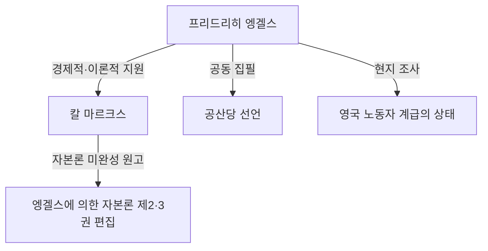

## 서론: 역사의 그늘에 가려진 거인의 민낯

칼 마르크스라는 이름을 모르는 사람은 없을 것입니다. 그러나 그의 사상적 맹우이자, 그 자본주의 비판의 이론적·물리적 기반을 계속해서 지원한 '프리드리히 엥겔스(Friedrich Engels)'의 이름은 종종 마르크스의 그늘에 가려지곤 합니다. 엥겔스는 단순한 후원자나 편집자가 아니었습니다. 그는 스스로도 뛰어난 이론가이자 언론인이었으며, 무엇보다도 '자본가이면서 동시에 혁명가'라는 언뜻 모순되는 듯한 매우 특이한 입장을 가진 인물이었습니다.

본고에서는 엥겔스의 생애와 그의 철학, 특히 유물사관 확립에 있어서 그의 결정적인 역할, 그리고 그가 직면했던 19세기 노동자 계급의 현실에 대해 역사적·경제적·철학적 관점에서 깊이 파헤쳐 봅니다. 그의 삶은 근대 자본주의 여명기의 빛과 그림자를 대변하고 있으며, 그의 사상은 현대 사회의 모순을 해독하는 데 있어서도 여전히 강한 빛을 발하고 있습니다.

## 제1장: 부르주아지 가정과 젊은 날의 반역

### 1. 부유한 방적 공장주의 아들로서
1820년 11월 28일, 프로이센 왕국(현재의 독일)의 바르멘에서 프리드리히 엥겔스가 태어났습니다. 그의 아버지는 부유한 방적 공장주였으며 엄격한 경건주의자(피에티스트)였습니다. 엥겔스는 부르주아 계급의 총아로서 장차 실업가로서 아버지의 뒤를 이을 것으로 기대되었습니다. 그러나 그는 일찍부터 종교적 권위나 권위주의적인 가정 환경에 대해 반발을 품게 됩니다.

### 2. 청년 헤겔파와의 만남
김나지움을 중퇴당하고 상회에서 수습생으로 일하기 시작한 엥겔스였지만, 그의 마음은 항상 철학과 문학을 향해 있었습니다. 베를린에서의 병역 복무 중 그는 베를린 대학의 강의를 청강하며 '청년 헤겔파'의 급진적인 서클에 가입합니다. 이곳에서 그는 헤겔 철학의 변증법을 급진적으로 해석하고, 현재의 국가나 종교를 비판하는 무기로 사용하는 방법을 배웠습니다.

## 제2장: 맨체스터의 현실 — 『영국 노동자 계급의 상태』

### 1. 산업 혁명의 중심지로
1842년, 엥겔스는 아버지 회사의 공동 경영처인 에르멘 & 엥겔스 상회에서 일하기 위해 영국 맨체스터로 향합니다. 당시 맨체스터는 '세계의 공장'으로 불리며 산업 혁명의 최첨단을 달리는 도시였습니다. 그러나 그곳에서 엥겔스가 목격한 것은 부의 축적 이면에 있는 노동자 계급의 상상을 초월하는 비참한 현실이었습니다.

### 2. 메리 번스와의 만남과 빈민가 탐색
이 시기 그는 아일랜드계 여성 노동자 메리 번스와 만나 평생에 걸친 관계를 맺게 됩니다. 그녀의 안내로 엥겔스는 공장주의 아들이라는 신분을 숨긴 채 노동자 거주구(빈민가) 깊숙한 곳으로 발을 들여놓았습니다. 비위생적인 주거 환경, 장시간 노동, 아동 노동, 만연하는 전염병. 그는 이 지옥 같은 현실을 냉철한 언론인의 눈과 불타는 의분으로 기록했습니다.

### 3. 역사적 르포르타주의 탄생
이 현지 조사를 바탕으로 1845년에 출판된 것이 『영국 노동자 계급의 상태』입니다. 이 저작은 단순한 고발의 서적에 그치지 않고, 자본주의라는 시스템이 구조적으로 노동자를 착취하고 빈곤을 재생산하는 메커니즘을 밝혀낸 사회학·경제학의 선구적인 명저가 되었습니다.

## 제3장: 마르크스와의 운명적 맹우 관계

### 1. 파리에서의 재회와 의기투합
1844년, 엥겔스는 파리에서 칼 마르크스와 재회합니다. 이전에 한 번 만났을 때는 냉담한 태도였던 마르크스였지만 이번에는 달랐습니다. 엥겔스가 기고한 「국민경제학 비판 대강」을 읽은 마르크스는 엥겔스의 경제학에 대한 깊은 이해에 감명을 받았던 것입니다. 두 사람은 파리의 카페에서 밤새워 이야기하며 서로의 사상이 완전히 일치함을 확인합니다. 이로부터 역사상 유례없는 견고한 지적 협력 관계가 시작되었습니다.

### 2. 경제적 지원과 '이중생활'
마르크스는 뛰어난 이론가였지만 생활 능력은 전무하다시피 하여 항상 극빈 상태에 있었습니다. 엥겔스는 마르크스가 『자본론』 집필에 전념할 수 있도록 자신의 이데올로기와는 상반되는 '부르주아 실업가'로서의 생활을 감수하기로 결심합니다. 그는 맨체스터의 상회에서 일하며 얻은 수입의 대부분을 마르크스 일가의 생활비로 계속 송금했습니다. 낮에는 냉철한 자본가로 행동하고, 밤에는 혁명을 위한 집필을 하는 가혹한 '이중생활'을 그는 20년 가까이 계속했던 것입니다.

## 제4장: 유물사관의 확립과 공동 작업

### 1. 『독일 이데올로기』와 사적 유물론
마르크스와 엥겔스는 『독일 이데올로기』를 공동 집필하여 청년 헤겔파의 관념론을 철저히 비판했습니다. 여기서 그들은 "인간의 의식이 그들의 존재를 결정하는 것이 아니라, 반대로 그들의 사회적 존재가 그들의 의식을 결정한다"는 유물사관(사적 유물론)의 기본 명제를 확립했습니다. 역사를 움직이는 원동력은 정신이나 이념이 아니라 물질적인 생산 양식과 계급 투쟁이라는 이 발견은 사회과학에 패러다임 전환을 가져왔습니다.

### 2. 『공산당 선언』의 기초
1848년, 유럽 전역에 혁명의 폭풍이 몰아치는 가운데 두 사람은 『공산당 선언』을 세상에 내놓았습니다. "지금까지 존재한 모든 사회의 역사는 계급 투쟁의 역사이다"라는 유명한 첫 문장으로 시작하는 이 팸플릿은 프롤레타리아트(노동자 계급)의 역사적 사명을 힘차게 선언하며 공산주의 운동의 강령이 되었습니다.

## 제5장: 『자본론』의 완성하고 엥겔스의 후반생

### 1. 마르크스의 죽음과 유고의 정리
1883년, 마르크스는 『자본론』 제1권만을 출판한 상태로 세상을 떠났습니다. 남겨진 것은 악필로 쓰인 방대한 미정리 노트와 초고 더미였습니다. 엥겔스는 자신의 연구(자연의 변증법 등)를 모두 팽개치고, 절친한 친구의 유고 해독과 편집에 말년의 모든 것을 바쳤습니다.

### 2. 제2권·제3권의 출판
시력 저하와 싸우면서 엥겔스는 마르크스의 의도를 파악하고 논리의 공백을 메우며 『자본론』 제2권(1885년)과 제3권(1894년)을 출판했습니다. 오늘날 우리가 읽는 『자본론』의 후반부는 엥겔스의 헌신적인 편집 작업 없이는 존재할 수 없었던 것입니다.

## 결론: 엥겔스가 현대에 던지는 질문

프리드리히 엥겔스는 자신이 속한 부르주아 계급의 위선을 증오하고, 프롤레타리아트의 해방을 위해 그 생애와 재산을 바쳤습니다. 그의 삶은 이론과 실천, 사상과 행동이 기적적으로 일치한 희귀한 예입니다.

현대의 우리는 AI와 자동화 기술의 발전, 세계화로 인한 격차 확대 등 새로운 형태의 자본주의적 모순에 직면해 있습니다. 엥겔스가 19세기 맨체스터에서 발견한 '구조적 착취'의 메커니즘은 형태를 바꾸어 지금도 우리 사회에 존재하고 있습니다.

그가 남긴 깊은 통찰과 노동자의 고경에 대한 뜨거운 연대의 정신은 역사 교과서 속에만 머무르는 것이 아닙니다. 그것은 보다 공정하고 평등한 사회를 구상하기 위한 강력한 지적 무기로서 현재도 여전히 우리에게 계속해서 말을 걸어오고 있습니다.
