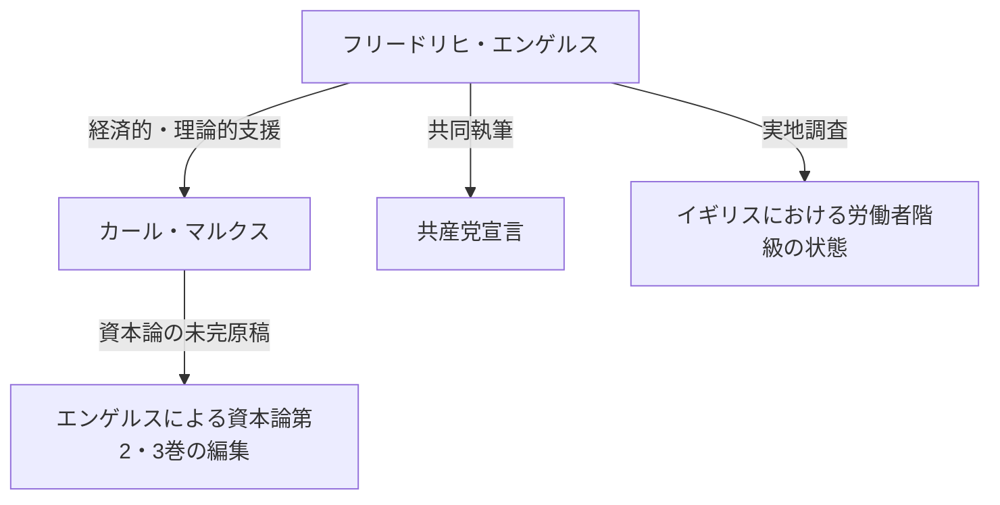

## 序論：歴史の影に隠れた巨人の素顔

カール・マルクスという名を知らない者はいないでしょう。しかし、彼の思想的盟友であり、その資本主義批判の理論的・物理的基盤を支え続けた「フリードリヒ・エンゲルス（Friedrich Engels）」の名は、しばしばマルクスの影に隠れがちです。エンゲルスは単なるパトロンや編集者ではありませんでした。彼は自身も優れた理論家であり、ジャーナリストであり、何よりも「資本家でありながら革命家である」という、一見矛盾するような極めて特異な立ち位置を持った人物でした。

本稿では、エンゲルスの生涯とその哲学、とりわけ唯物史観の確立における彼の決定的な役割、そして彼が直面した19世紀の労働者階級の現実について、歴史的・経済的・哲学的な視点から深掘りします。彼の人生は、近代資本主義の黎明期における光と影を体現しており、その思想は現代社会の矛盾を読み解く上でも依然として強い光を放っています。

## 第一章：ブルジョアジーの家庭と若き日の反逆

### 1. 裕福な紡績工場主の息子として
1820年11月28日、プロイセン王国（現在のドイツ）のバルメンで、フリードリヒ・エンゲルスは生まれました。彼の父親は裕福な紡績工場主であり、厳格な敬虔主義者（ピエティスト）でした。エンゲルスは、ブルジョア階級の申し子として、将来は実業家として父の跡を継ぐことを期待されていました。しかし、彼は早くから宗教的権威や権威主義的な家庭環境に対して反発を抱くようになります。

### 2. 青年ヘーゲル派との出会い
ギムナジウムを中退させられ、商会で見習いとして働き始めたエンゲルスですが、彼の心は常に哲学と文学に向かっていました。ベルリンでの兵役中、彼はベルリン大学の講義を聴講し、「青年ヘーゲル派」の急進的なサークルに加わります。ここで彼は、ヘーゲル哲学の弁証法を急進的に解釈し、現状の国家や宗教を批判する武器として用いる方法を学びました。

## 第二章：マンチェスターの現実 — 『イギリスにおける労働者階級の状態』

### 1. 産業革命の中心地へ
1842年、エンゲルスは父の会社の共同経営先であるエルメン＆エンゲルス商会で働くため、イギリスのマンチェスターへ赴きます。当時のマンチェスターは「世界の工場」と呼ばれ、産業革命の最先端を走る都市でした。しかし、そこでエンゲルスが目にしたのは、富の集積の裏側にある、労働者階級の想像を絶する悲惨な現実でした。

### 2. メアリー・バーンズとの出会いとスラム街の探索
この時期、彼はアイルランド系の女性労働者メアリー・バーンズと出会い、生涯にわたる関係を築きます。彼女の案内で、エンゲルスは工場主の息子という身分を隠し、労働者の居住区（スラム）の深部へと足を踏み入れました。不衛生な住環境、長時間労働、児童労働、蔓延する疫病。彼はこの地獄のような現実を冷徹なジャーナリストの眼と、燃えるような義憤を持って記録しました。

### 3. 歴史的ルポルタージュの誕生
この実地調査をもとに1845年に出版されたのが『イギリスにおける労働者階級の状態』です。この著作は、単なる告発の書にとどまらず、資本主義というシステムが構造的に労働者を搾取し、貧困を再生産するメカニズムを明らかにした、社会学・経済学の先駆的な名著となりました。

## 第三章：マルクスとの運命的盟友関係

### 1. パリでの再会と意気投合
1844年、エンゲルスはパリでカール・マルクスと再会します。以前に一度会った時には冷淡な態度だったマルクスですが、この時は違いました。エンゲルスが寄稿した「国民経済学批判大綱」を読んだマルクスは、エンゲルスの経済学に対する深い理解に感銘を受けていました。二人はパリのカフェで語り明かし、互いの思想が完全に一致していることを確認します。ここから、歴史上類を見ない強固な知的協力関係が始まりました。

### 2. 経済的支援と「二重生活」
マルクスは優れた理論家でしたが、生活能力は皆無に等しく、常に極貧状態にありました。エンゲルスは、マルクスが『資本論』の執筆に専念できるよう、自らのイデオロギーとは相反する「ブルジョア実業家」としての生活に甘んじる決意をします。彼はマンチェスターの商会で働き、得た収入の多くをマルクス一家の生活費として送金し続けました。日中は冷徹な資本家として振る舞い、夜は革命のための執筆を行うという過酷な「二重生活」を、彼は20年近くも続けたのです。

## 第四章：唯物史観の確立と共同作業

### 1. 『ドイツ・イデオロギー』と史的唯物論
マルクスとエンゲルスは『ドイツ・イデオロギー』を共同執筆し、青年ヘーゲル派の観念論を徹底的に批判しました。ここで彼らは「人間の意識が彼らの存在を決定するのではなく、逆に彼らの社会的な存在が彼らの意識を決定する」という唯物史観（史的唯物論）の基本テーゼを確立しました。歴史を動かす原動力は、精神や理念ではなく、物質的な生産様式と階級闘争であるというこの発見は、社会科学にパラダイムシフトをもたらしました。

### 2. 『共産党宣言』の起草
1848年、ヨーロッパ全土を革命の嵐が吹き荒れる中、二人は『共産党宣言』を世に問いました。「これまで存在したすべての社会の歴史は、階級闘争の歴史である」という有名な書き出しで始まるこのパンフレットは、プロレタリアート（労働者階級）の歴史的使命を力強く宣言し、共産主義運動の綱領となりました。

## 第五章：『資本論』の完成とエンゲルスの後半生

### 1. マルクスの死と遺稿の整理
1883年、マルクスは『資本論』の第1巻のみを出版した状態でこの世を去りました。残されたのは、悪筆で書かれた膨大な未整理のノートや草稿の山でした。エンゲルスは、自らの研究（自然の弁証法など）をすべて投げ打ち、親友の遺稿の解読と編集に晩年のすべてを捧げました。

### 2. 第2巻・第3巻の出版
視力の低下と戦いながら、エンゲルスはマルクスの意図を汲み取り、論理の空白を補いながら、『資本論』第2巻（1885年）と第3巻（1894年）を出版しました。今日私たちが読む『資本論』の後半部分は、エンゲルスの献身的な編集作業なしには存在し得なかったのです。

## 結論：エンゲルスが現代に問いかけるもの

フリードリヒ・エンゲルスは、自らが属するブルジョア階級の偽善を憎み、プロレタリアートの解放のためにその生涯と財産を捧げました。彼の人生は、理論と実践、思想と行動が奇跡的に一致した稀有な例です。

現代の私たちは、AIや自動化技術の発展、グローバル化による格差の拡大など、新たな形態の資本主義的矛盾に直面しています。エンゲルスが19世紀のマンチェスターで見出した「構造的な搾取」のメカニズムは、形を変えて今も私たちの社会に存在しています。

彼が残した深い洞察と、労働者の苦境に対する熱い連帯の精神は、歴史の教科書の中に留まるものではありません。それは、より公正で平等な社会を構想するための、力強い知的武器として、現在もなお私たちに語りかけ続けているのです。
