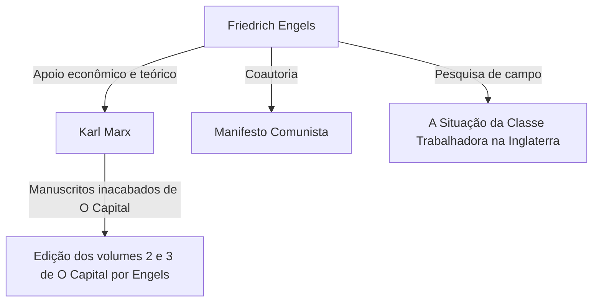

## Introdução: A verdadeira face de um gigante escondido nas sombras da história

Quase não há quem não conheça o nome de Karl Marx. No entanto, o nome de seu aliado ideológico, "Friedrich Engels", que continuou a apoiar os fundamentos teóricos e físicos de sua crítica ao capitalismo, é frequentemente escondido à sombra de Marx. Engels não era apenas um patrono ou editor. Ele próprio era um notável teórico, jornalista e, acima de tudo, uma figura com uma posição extremamente singular que parecia contraditória: "um capitalista, mas também um revolucionário".

Neste artigo, aprofundaremos, a partir de perspectivas históricas, econômicas e filosóficas, a vida de Engels e sua filosofia, especialmente seu papel decisivo no estabelecimento da concepção materialista da história, e a realidade da classe trabalhadora do século 19 que ele enfrentou. Sua vida encarna a luz e as sombras do alvorecer do capitalismo moderno, e seus pensamentos ainda emitem uma forte luz para desvendar as contradições da sociedade contemporânea.

## Capítulo 1: A família da burguesia e a rebelião da juventude

### 1. Como filho de um rico dono de fábrica de fiação
Em 28 de novembro de 1820, em Barmen, no Reino da Prússia (atual Alemanha), nasceu Friedrich Engels. Seu pai era um rico proprietário de uma fábrica de fiação e um estrito pietista. Engels, como um filho legítimo da classe burguesa, era esperado para seguir os passos de seu pai como empresário no futuro. No entanto, desde cedo ele passou a abrigar uma rebelião contra a autoridade religiosa e o ambiente familiar autoritário.

### 2. O encontro com os Jovens Hegelianos
Obrigado a abandonar o Gymnasium, Engels começou a trabalhar como aprendiz em uma firma comercial, mas seu coração sempre se voltou para a filosofia e a literatura. Durante seu serviço militar em Berlim, ele frequentou palestras na Universidade de Berlim e se juntou ao círculo radical dos "Jovens Hegelianos". Lá, ele aprendeu a interpretar radicalmente a dialética da filosofia hegeliana e a usá-la como uma arma para criticar o estado e a religião vigentes.

## Capítulo 2: A realidade de Manchester — "A Situação da Classe Trabalhadora na Inglaterra"

### 1. Em direção ao centro da Revolução Industrial
Em 1842, Engels viajou para Manchester, Inglaterra, para trabalhar na firma Ermen & Engels, que era de co-propriedade da empresa de seu pai. Naquela época, Manchester era chamada de "A Oficina do Mundo" e era uma cidade na vanguarda da Revolução Industrial. No entanto, o que Engels testemunhou lá foi a realidade inimaginavelmente miserável da classe trabalhadora, escondida por trás do acúmulo de riqueza.

### 2. O encontro com Mary Burns e a exploração das favelas
Durante esse período, ele conheceu uma trabalhadora de ascendência irlandesa, Mary Burns, e construiu um relacionamento ao longo da vida com ela. Com ela como guia, Engels escondeu sua identidade como filho de um dono de fábrica e entrou nas profundezas dos bairros residenciais dos trabalhadores (favelas). Condições de vida insalubres, longas jornadas de trabalho, trabalho infantil e doenças epidêmicas generalizadas. Ele registrou essa realidade infernal com os olhos frios de um jornalista e com ardente indignação.

### 3. O nascimento de uma reportagem histórica
Com base nesta pesquisa de campo, "A Situação da Classe Trabalhadora na Inglaterra" foi publicado em 1845. Este trabalho não era apenas um livro de acusações, mas tornou-se uma obra pioneira de sociologia e economia, que revelou o mecanismo pelo qual o sistema capitalista explorava estruturalmente os trabalhadores e reproduzia a pobreza.

## Capítulo 3: A aliança fatídica com Marx

### 1. Reencontro em Paris e espíritos afins
Em 1844, Engels reencontrou Karl Marx em Paris. Embora Marx tivesse sido frio quando se conheceram antes, desta vez foi diferente. Depois de ler o "Esboço de uma Crítica da Economia Política" que Engels havia contribuído, Marx ficou impressionado com a profunda compreensão de Engels sobre economia. Os dois conversaram a noite toda num café em Paris e confirmaram que seus pensamentos combinavam perfeitamente. A partir daqui, começou uma aliança de cooperação intelectual sólida e sem precedentes na história.

### 2. Apoio econômico e a "vida dupla"
Marx era um teórico brilhante, mas não tinha praticamente nenhuma capacidade de sustento, estando sempre em estado de extrema pobreza. Engels decidiu se resignar a uma vida como um "empresário burguês", o que contrariava sua própria ideologia, para que Marx pudesse se dedicar a escrever "O Capital". Ele trabalhou na firma em Manchester e continuou a enviar a maior parte de sua renda para cobrir as despesas de subsistência da família de Marx. Ele continuou essa rigorosa "vida dupla" – agindo como um frio capitalista durante o dia e escrevendo para a revolução à noite – por quase 20 anos.

## Capítulo 4: O estabelecimento da concepção materialista da história e o trabalho conjunto

### 1. "A Ideologia Alemã" e o materialismo histórico
Marx e Engels foram coautores de "A Ideologia Alemã", criticando veementemente o idealismo dos Jovens Hegelianos. Aqui eles estabeleceram a tese básica da concepção materialista da história (materialismo histórico): "Não é a consciência dos homens que determina o seu ser, mas é, ao contrário, o seu ser social que determina a sua consciência". A descoberta de que a força motriz que impulsiona a história não é o espírito ou as ideias, mas sim o modo de produção material e a luta de classes, provocou uma mudança de paradigma nas ciências sociais.

### 2. A redação do "Manifesto Comunista"
Em 1848, enquanto as tempestades da revolução varriam a Europa, os dois publicaram o "Manifesto Comunista". Começando com a famosa frase: "A história de todas as sociedades até hoje existentes é a história da luta de classes", este panfleto declarou poderosamente a missão histórica do proletariado (classe trabalhadora) e tornou-se o programa do movimento comunista.

## Capítulo 5: A conclusão de "O Capital" e a fase final da vida de Engels

### 1. A morte de Marx e a organização de seus manuscritos
Em 1883, Marx faleceu com apenas o primeiro volume de "O Capital" publicado. O que ele deixou para trás foi uma enorme montanha de cadernos e rascunhos não organizados escritos com caligrafia difícil de ler. Engels abandonou todas as suas próprias pesquisas (como "A Dialética da Natureza") e dedicou tudo de seus últimos anos para decifrar e editar os manuscritos póstumos de seu melhor amigo.

### 2. Publicação do Volume 2 e 3
Lutando contra a deterioração da visão, Engels decifrou as intenções de Marx, preenchendo as lacunas da lógica, e publicou os volumes 2 (1885) e 3 (1894) de "O Capital". A segunda metade de "O Capital" que lemos hoje não poderia existir sem o devotado trabalho de edição de Engels.

## Conclusão: O que Engels questiona na era moderna

Friedrich Engels odiava a hipocrisia da classe burguesa à qual pertencia, e dedicou sua vida e fortuna à libertação do proletariado. Sua vida é um raro exemplo no qual a teoria e a prática, o pensamento e a ação, milagrosamente coincidiram.

Hoje, enfrentamos novas formas de contradições capitalistas, como o desenvolvimento da IA e das tecnologias de automação, e o alargamento da desigualdade devido à globalização. O mecanismo de "exploração estrutural" que Engels encontrou na Manchester do século 19 ainda existe em nossa sociedade, sob outras formas.

Suas profundas percepções e seu ardente espírito de solidariedade com a situação dos trabalhadores não estão restritos aos livros de história. Eles ainda continuam a falar conosco hoje como poderosas armas intelectuais para conceber uma sociedade mais justa e igualitária.
