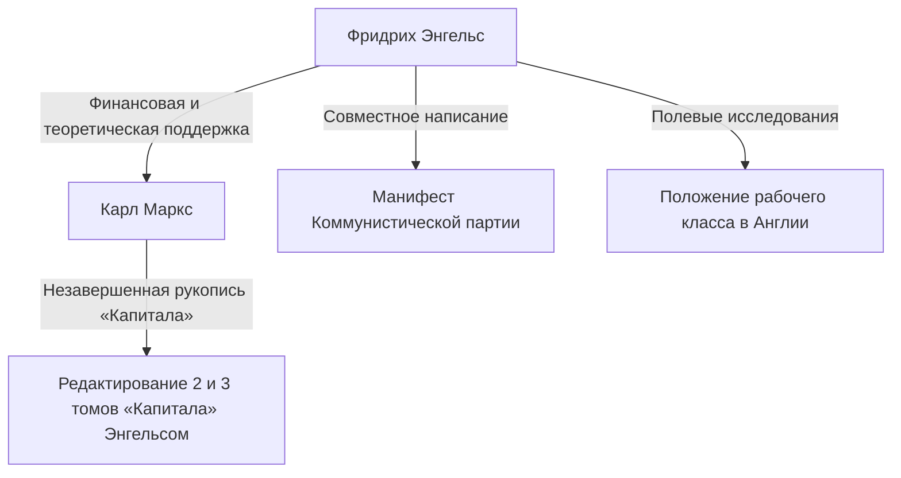

## Введение: Истинное лицо гиганта, скрытого в тени истории

Нет такого человека, который бы не знал имени Карла Маркса. Однако имя его идейного союзника, «Фридриха Энгельса (Friedrich Engels)», который постоянно обеспечивал теоретическую и физическую основу для критики капитализма, часто остается в тени Маркса. Энгельс не был просто меценатом или редактором. Он сам был выдающимся теоретиком, журналистом и, прежде всего, человеком с крайне уникальной и на первый взгляд противоречивой позицией — «капиталистом и одновременно революционером».

В этой статье мы подробно рассмотрим жизнь Энгельса и его философию, особенно его решающую роль в утверждении исторического материализма, а также ту реальность рабочего класса XIX века, с которой он столкнулся, с исторической, экономической и философской точек зрения. Его жизнь олицетворяет свет и тень на заре современного капитализма, а его идеи по-прежнему ярко освещают противоречия современного общества.

## Глава 1: Буржуазная семья и юношеский бунт

### 1. Как сын богатого владельца прядильной фабрики
28 ноября 1820 года в Бармене, Королевство Пруссия (современная Германия), родился Фридрих Энгельс. Его отец был богатым владельцем прядильной фабрики и строгим пиетистом. От Энгельса, как от дитя буржуазного класса, ожидали, что в будущем он станет бизнесменом и пойдет по стопам отца. Однако он рано начал испытывать неприязнь к религиозному авторитету и авторитарной семейной атмосфере.

### 2. Встреча с младогегельянцами
Хотя Энгельс был вынужден бросить гимназию и начать работать учеником в торговой компании, его сердце всегда тянулось к философии и литературе. Во время прохождения военной службы в Берлине он посещал лекции в Берлинском университете и присоединился к радикальному кружку «младогегельянцев». Здесь он научился радикально интерпретировать диалектику гегелевской философии и использовать ее как оружие для критики существующего государства и религии.

## Глава 2: Реалии Манчестера — «Положение рабочего класса в Англии»

### 1. В центр промышленной революции
В 1842 году Энгельс отправился в Манчестер, Англия, чтобы работать в компании «Эрмен и Энгельс», соучредителем которой был его отец. В то время Манчестер называли «мастерской мира», он был городом, шедшим в авангарде промышленной революции. Однако то, что увидел там Энгельс за фасадом накопления богатства, было невообразимо ужасающей реальностью рабочего класса.

### 2. Встреча с Мэри Бернс и исследование трущоб
В этот период он встретил работницу ирландского происхождения Мэри Бернс, с которой у него завязались отношения на всю жизнь. Под ее руководством Энгельс, скрыв свое происхождение как сына владельца фабрики, ступил вглубь рабочих кварталов (трущоб). Антисанитарные жилищные условия, долгий рабочий день, детский труд и свирепствующие эпидемии. Он задокументировал эту адскую реальность с холодным взглядом журналиста и горящим праведным гневом.

### 3. Рождение исторического репортажа
На основе этих полевых исследований в 1845 году была опубликована книга «Положение рабочего класса в Англии». Это произведение стало не просто обвинительным актом, а новаторским шедевром социологии и экономики, раскрывающим механизмы, с помощью которых капиталистическая система структурно эксплуатирует рабочих и воспроизводит бедность.

## Глава 3: Судьбоносный союз с Марксом

### 1. Воссоединение в Париже и духовное родство
В 1844 году Энгельс вновь встретился с Карлом Марксом в Париже. Во время их предыдущей встречи Маркс был холоден, но на этот раз все было иначе. Прочитав статью Энгельса «Наброски к критике политической экономии», Маркс был впечатлен его глубоким пониманием экономики. Они проговорили всю ночь в парижском кафе и убедились в полном совпадении их взглядов. Так началось беспрецедентное в истории прочное интеллектуальное сотрудничество.

### 2. Финансовая поддержка и «двойная жизнь»
Маркс был выдающимся теоретиком, но практически не умел зарабатывать на жизнь и постоянно находился в крайней нищете. Энгельс решил смириться с жизнью «буржуазного бизнесмена», противоречащей его собственной идеологии, чтобы Маркс мог сосредоточиться на написании «Капитала». Он работал в торговой компании в Манчестере и продолжал посылать большую часть своего дохода на содержание семьи Маркса. Эту изнурительную «двойную жизнь» — днем он выступал в роли холодного капиталиста, а по ночам писал ради революции — он вел почти 20 лет.

## Глава 4: Утверждение исторического материализма и совместная работа

### 1. «Немецкая идеология» и исторический материализм
Маркс и Энгельс совместно написали «Немецкую идеологию», в которой подвергли жесткой критике идеализм младогегельянцев. Здесь они утвердили основной тезис исторического материализма: «Не сознание людей определяет их бытие, а, наоборот, их общественное бытие определяет их сознание». Это открытие о том, что движущей силой истории является не дух или идеи, а материальный способ производства и классовая борьба, привело к сдвигу парадигмы в социальных науках.

### 2. Написание «Манифеста Коммунистической партии»
В 1848 году, когда по всей Европе бушевали бури революций, они представили миру «Манифест Коммунистической партии». Эта брошюра, начинающаяся со знаменитых слов: «История всех до сих пор существовавших обществ была историей борьбы классов», мощно провозгласила историческую миссию пролетариата (рабочего класса) и стала программой коммунистического движения.

## Глава 5: Завершение «Капитала» и последние годы жизни Энгельса

### 1. Смерть Маркса и систематизация его рукописей
В 1883 году Маркс ушел из жизни, опубликовав только первый том «Капитала». После него осталась гора несистематизированных заметок и черновиков, написанных неразборчивым почерком. Энгельс отложил все свои собственные исследования (такие как «Диалектика природы») и посвятил весь остаток своей жизни расшифровке и редактированию рукописей своего лучшего друга.

### 2. Публикация 2 и 3 томов
Борясь с ухудшающимся зрением, Энгельс, улавливая намерения Маркса и заполняя логические пробелы, опубликовал второй (1885) и третий (1894) тома «Капитала». Вторая половина «Капитала», которую мы читаем сегодня, не могла бы существовать без самоотверженной редакторской работы Энгельса.

## Заключение: Что Энгельс говорит современности

Фридрих Энгельс ненавидел лицемерие буржуазного класса, к которому сам принадлежал, и посвятил свою жизнь и богатство освобождению пролетариата. Его жизнь — редкий пример удивительного совпадения теории и практики, мысли и действия.

Мы сегодня сталкиваемся с новыми формами капиталистических противоречий, такими как развитие ИИ и технологий автоматизации, а также расширение неравенства из-за глобализации. Механизм «структурной эксплуатации», который Энгельс обнаружил в Манчестере XIX века, в измененном виде продолжает существовать в нашем обществе.

Его глубокие прозрения и дух горячей солидарности с трудностями рабочих не остаются лишь на страницах учебников истории. Они продолжают говорить с нами и сегодня как мощное интеллектуальное оружие для создания более справедливого и равного общества.
