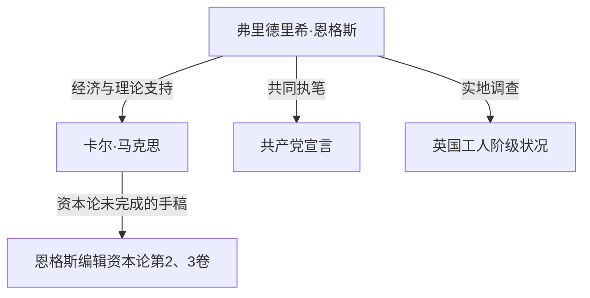

## 导言：隐藏在历史阴影下的巨人真面目

没人不知道卡尔·马克思的名字。然而，作为他思想上的盟友，持续支撑其资本主义批判理论和物质基础的“弗里德里希·恩格斯（Friedrich Engels）”，却经常被隐藏在马克思的光环之下。恩格斯不仅仅是赞助人或编辑。他本人也是一位杰出的理论家、记者，更重要的是，他有着“既是资本家又是革命家”这种看似矛盾却极其特殊的立场。

本文将从历史、经济和哲学的角度，深入探讨恩格斯的生平与哲学，特别是他在确立唯物史观中的决定性作用，以及他所面对的19世纪工人阶级的现实。他的人生体现了近代资本主义黎明时期的光与影，其思想在解读现代社会的矛盾时依然闪耀着强烈的光芒。

## 第一章：资产阶级家庭与年轻时的反叛

### 1. 作为富裕纺织厂主的儿子
1820年11月28日，弗里德里希·恩格斯出生于普鲁士王国（现德国）的巴门。他的父亲是一位富裕的纺织厂主，也是一位严格的虔敬派教徒（Pietist）。作为资产阶级的骄子，恩格斯被寄予厚望，将来要作为实业家继承父业。然而，他很早便对宗教权威和专制的家庭环境产生了反感。

### 2. 与青年黑格尔派的相遇
虽然被迫从文理中学退学并开始在商行当学徒，但恩格斯的心始终向往着哲学与文学。在柏林服兵役期间，他旁听了柏林大学的课程，并加入了“青年黑格尔派”的激进圈子。在这里，他学习了对黑格尔哲学辩证法进行激进解释，并将其作为批判现状国家与宗教的武器。

## 第二章：曼彻斯特的现实 ——《英国工人阶级状况》

### 1. 前往工业革命的中心
1842年，恩格斯前往英国曼彻斯特，在他父亲公司的合资企业欧门-恩格斯商行工作。当时的曼彻斯特被称为“世界工厂”，是走在工业革命最前沿的城市。然而，恩格斯在那里看到的，却是财富积累背后，工人阶级难以想象的悲惨现实。

### 2. 与玛丽·伯恩斯的相遇与探索贫民窟
这一时期，他结识了爱尔兰裔女工玛丽·伯恩斯，并建立了终生的关系。在她的向导下，恩格斯隐藏了工厂主儿子的身份，深入工人居住区（贫民窟）的深处。恶劣的居住环境、长时间劳动、童工、蔓延的疾病。他以冷峻的记者眼光和燃烧的义愤记录下了这个地狱般的现实。

### 3. 历史性报告文学的诞生
基于这些实地调查，1845年出版了《英国工人阶级状况》。这部著作不仅仅是一本控诉书，它揭示了资本主义系统在结构上剥削工人、再生产贫困的机制，成为社会学和经济学的先驱名著。

## 第三章：与马克思的命运盟友关系

### 1. 在巴黎的重逢与情投意合
1844年，恩格斯在巴黎再次见到了卡尔·马克思。之前两人曾见过一面，当时马克思态度冷淡，但这次不同。马克思读了恩格斯寄稿的《国民经济学批判大纲》，对恩格斯在经济学上的深刻理解留下了深刻印象。两人在巴黎的咖啡馆里彻夜长谈，确认了彼此的思想完全一致。从此，历史上绝无仅有的坚固思想合作关系开始了。

### 2. 经济支持与“双重生活”
马克思虽然是优秀的理论家，但生活能力几乎为零，经常处于极度贫困之中。为了让马克思能专心写作《资本论》，恩格斯决定甘愿过着与自己意识形态相悖的“资产阶级实业家”生活。他在曼彻斯特的商行工作，将获得的大部分收入不断汇给马克思一家作为生活费。白天扮演冷酷的资本家，晚上则为了革命进行写作，这种严酷的“双重生活”他坚持了近20年。

## 第四章：唯物史观的确立与合作

### 1. 《德意志意识形态》与历史唯物主义
马克思和恩格斯共同执笔了《德意志意识形态》，彻底批判了青年黑格尔派的唯心主义。在这里，他们确立了唯物史观（历史唯物主义）的基本论点：“不是人们的意识决定人们的存在，相反，是人们的社会存在决定人们的意识”。推动历史前进的动力不是精神或理念，而是物质的生产方式与阶级斗争，这一发现为社会科学带来了范式转变。

### 2. 起草《共产党宣言》
1848年，在革命风暴席卷整个欧洲之际，两人向世人发表了《共产党宣言》。这本小册子以著名的一句“至今一切社会的历史都是阶级斗争的历史”开篇，强有力地宣告了无产阶级（工人阶级）的历史使命，成为了共产主义运动的纲领。

## 第五章：《资本论》的完成与恩格斯的后半生

### 1. 马克思的逝世与遗稿整理
1883年，马克思在仅出版了《资本论》第一卷的情况下离开了人世。留下的是堆积如山的、字迹潦草且未整理的笔记和草稿。恩格斯放下了自己所有的研究（如自然辩证法等），将晚年的全部精力都奉献给了解读和编辑挚友的遗稿。

### 2. 第二卷、第三卷的出版
在与视力衰退作斗争的同时，恩格斯体会马克思的意图，弥补逻辑上的空白，最终出版了《资本论》第二卷（1885年）和第三卷（1894年）。今天我们读到的《资本论》后半部分，如果没有恩格斯无私的编辑工作，是不可能存在的。

## 结论：恩格斯向现代提出的诘问

弗里德里希·恩格斯痛恨自己所属的资产阶级的虚伪，为了无产阶级的解放奉献了自己的一生和财产。他的人生是理论与实践、思想与行动奇迹般一致的罕见例子。

现代的我们面临着AI和自动化技术的发展、全球化导致的贫富差距扩大等新形态的资本主义矛盾。恩格斯在19世纪曼彻斯特发现的“结构性剥削”机制，正以不同的形式依然存在于我们的社会中。

他留下的深刻洞察，以及对工人苦境的热情团结精神，并未停留在历史教科书中。作为构想一个更加公正、平等社会的强大思想武器，它至今依然在向我们诉说。
