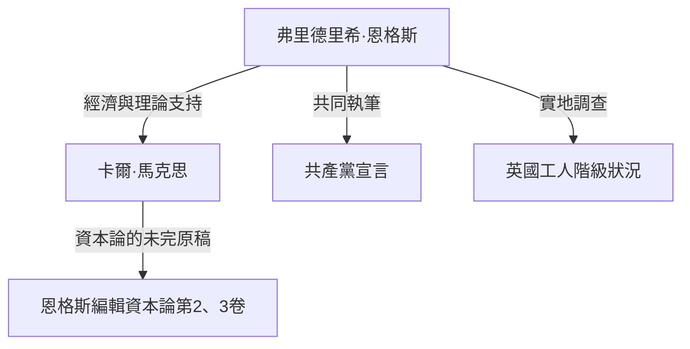

## 導論：隱藏在歷史陰影下的巨人真面目

沒有人不知道卡爾·馬克思（Karl Marx）的名字。然而，他的思想盟友、持續支持其資本主義批判的理論與物質基礎的「弗里德里希·恩格斯（Friedrich Engels）」，卻經常被隱藏在馬克思的陰影之下。恩格斯不僅僅是贊助人或編輯。他本身也是一位傑出的理論家、記者，更重要的是，他擁有一個看似矛盾卻極其獨特的立場：「既是資本家，又是革命家」。

本文將從歷史、經濟與哲學的角度，深入探討恩格斯的生平與哲學，特別是他在確立唯物史觀中的決定性作用，以及他所面臨的19世紀工人階級的現實。他的一生體現了近代資本主義黎明期的光與影，其思想在解讀現代社會矛盾時，依然閃耀著強烈的光芒。

## 第一章：資產階級家庭與年輕時代的反叛

### 1. 富裕紡織廠主的兒子
1820年11月28日，弗里德里希·恩格斯出生於普魯士王國（現德國）的巴門。他的父親是一位富裕的紡織廠主，也是一名嚴格的敬虔派教徒。身為資產階級的驕子，恩格斯被期望未來能成為實業家，繼承父業。然而，他很早便對宗教權威與威權主義的家庭環境產生了反感。

### 2. 與青年黑格爾派的相遇
恩格斯被迫從文理中學輟學，並開始在商行當學徒，但他的心始終嚮往著哲學與文學。在柏林服兵役期間，他旁聽了柏林大學的課程，並加入了「青年黑格爾派」的激進圈子。在這裡，他學會了對黑格爾哲學的辯證法進行激進的解釋，並將其作為批判現狀國家與宗教的武器。

## 第二章：曼徹斯特的現實 ——《英國工人階級狀況》

### 1. 前往工業革命的中心
1842年，恩格斯為了在父親公司的合資企業「歐門-恩格斯商行」工作，前往了英國的曼徹斯特。當時的曼徹斯特被稱為「世界工廠」，是走在工業革命最尖端的城市。然而，恩格斯在那裡看到的，卻是財富積累背後，工人階級難以想像的悲慘現實。

### 2. 與瑪麗·伯恩斯的相遇及貧民窟探索
在這個時期，他結識了愛爾蘭裔的女工瑪麗·伯恩斯（Mary Burns），並建立了一生的關係。在她的帶領下，恩格斯隱瞞了工廠主兒子的身分，深入工人居住區（貧民窟）。惡劣的居住環境、長時間勞動、童工、蔓延的瘟疫。他以冷峻的記者眼光和燃燒的義憤，記錄下了這個地獄般的現實。

### 3. 歷史性報導文學的誕生
基於這些實地調查，他在1845年出版了《英國工人階級狀況》。這本書不僅是一部控訴之作，更揭示了資本主義體制如何結構性地剝削工人、再生產貧困的機制，成為社會學與經濟學的先驅名著。

## 第三章：與馬克思的命運盟友關係

### 1. 巴黎的重逢與意氣相投
1844年，恩格斯在巴黎與卡爾·馬克思重逢。以前兩人曾見過一面，當時馬克思態度冷淡，但這次不同了。馬克思讀了恩格斯投稿的《國民經濟學批判大綱》後，對恩格斯在經濟學上的深刻理解印象深刻。兩人在巴黎的咖啡館裡徹夜長談，確認了彼此的思想完全一致。從此，歷史上無與倫比的堅固知識合作關係便開始了。

### 2. 經濟支持與「雙重生活」
馬克思是一位傑出的理論家，但幾乎沒有謀生能力，總是處於極度貧困的狀態。恩格斯為了讓馬克思能專心撰寫《資本論》，決心甘於過著與自己意識形態相悖的「資產階級實業家」生活。他在曼徹斯特的商行工作，將賺得的大部分收入不斷匯給馬克思一家作為生活費。白天扮演冷酷的資本家，夜晚則為了革命從事寫作，這種嚴酷的「雙重生活」，他持續了近20年。

## 第四章：唯物史觀的確立與共同作業

### 1. 《德意志意識形態》與歷史唯物主義
馬克思與恩格斯共同執筆了《德意志意識形態》，徹底批判了青年黑格爾派的唯心主義。在這裡，他們確立了唯物史觀（歷史唯物主義）的基本命題：「不是人們的意識決定人們的存在，相反，是人們的社會存在決定人們的意識」。推動歷史的原動力不是精神或理念，而是物質生產方式與階級鬥爭，這一發現為社會科學帶來了典範轉移。

### 2. 起草《共產黨宣言》
1848年，當革命的風暴席捲全歐洲時，兩人發表了《共產黨宣言》。這本以「至今一切社會的歷史都是階級鬥爭的歷史」這句名言開篇的小冊子，強有力地宣告了無產階級（工人階級）的歷史使命，並成為共產主義運動的綱領。

## 第五章：《資本論》的完成與恩格斯的晚年

### 1. 馬克思的逝世與遺稿整理
1883年，馬克思在僅出版了《資本論》第一卷的情況下與世長辭。留下的，是堆積如山、字跡潦草且未經整理的筆記與草稿。恩格斯放棄了自己所有的研究（如《自然辯證法》等），將晚年的全部精力奉獻給了解讀與編輯摯友的遺稿。

### 2. 第二卷、第三卷的出版
在與視力衰退抗爭的同時，恩格斯揣摩馬克思的意圖，填補邏輯的空白，先後出版了《資本論》第二卷（1885年）和第三卷（1894年）。今天我們讀到的《資本論》後半部，如果沒有恩格斯無私奉獻的編輯工作，是絕對無法存在的。

## 結論：恩格斯對現代的叩問

弗里德里希·恩格斯憎恨自己所屬的資產階級的虛偽，為了無產階級的解放，奉獻了他的一生與財產。他的一生是理論與實踐、思想與行動奇蹟般一致的罕見範例。

現代的我們正面臨著AI與自動化技術的發展、全球化帶來的貧富差距擴大等新形式的資本主義矛盾。恩格斯在19世紀曼徹斯特發現的「結構性剝削」機制，改變了形式，至今依然存在於我們的社會中。

他留下的深刻洞察與對工人苦境的熱烈團結精神，並沒有停留在歷史教科書中。作為構想一個更公正、平等社會的強有力知識武器，它在今天依然不斷地向我們發出叩問。
