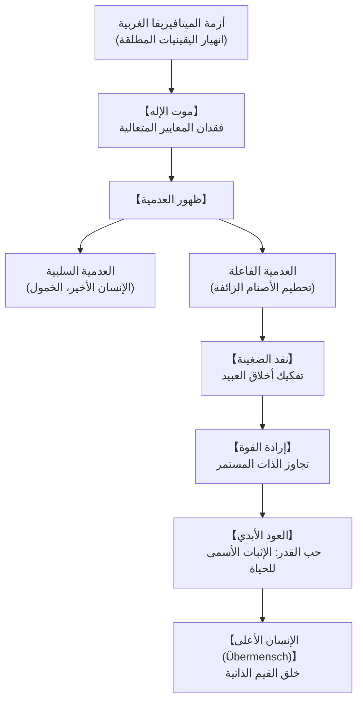

## مقدمة: التفلسف بالمطرقة وأفول الأصنام الغربية

في أواخر القرن التاسع عشر، وجه الفيلسوف الألماني فريدريك ويلهلم نيتشه (1844-1900) ضربة قاضية لأسس الفكر الغربي. معلناً أنه «ديناميت» جاء «ليتفلسف بالمطرقة»، فكك نيتشه قرنين من الميتافيزيقا الأخلاقية المستمدة من أفلاطون والمسيحية، كاشفاً أن القيم المطلقة ليست سوى أوهام اخترعها الضعفاء للهروب من واقع الحياة.

## 1. المسار الحيوي والفكري
ولد نيتشه في روكن لعائلة قس لوثري، وبرع في الفيلولوجيا الكلاسيكية حتى عُيّن أستاذاً في جامعة بازل وهو في الرابعة والعشرين من عمره. تأثر بشوبنهاور وصادق فاغنر، وأصدر كتابه الأول «مولد التراجيديا» (1872).

أجبرته معاناته الجسدية المستمرة (الصداع النصفي المزمن وضعف البصر) على الاستقالة عام 1879 ليعيش حياة ترحال في سويسرا وإيطاليا، حيث أنتج روائعه: «هكذا تكلم زرادشت»، «ما وراء الخير والشر»، و«جينالوجيا الأخلاق». انهار عقلياً في تورينو عام 1889 وتوفي عام 1900.

## 2. «موت الإله» ومأزق العدمية
في كتاب «العلم الجذل» (§125)، يصرخ الرجل المجنون: «مات الإله! ونحن الذين قتلناه!»
يعني هذا زوال كل المرجعيات المطلقة التي كانت تمنح الوجود معنى. تتجلى العدمية في نمطين:
- **العدمية السلبية**: الاستسلام للخمول وظهور **«الإنسان الأخير»** الباحث عن الراحة التافهة وتجنب المعاناة.
- **العدمية الفاعلة**: الشجاعة في تدمير الأوهام الساقطة لإفساح المجال لخلق قيم جديدة.

## 3. جينالوجيا الأخلاق والضغينة
- **أخلاق السادة (الطيب والرديء)**: الأقوياء والنبلاء يؤكدون تفوقهم وحيويتهم على أنها «طيبة»، ويعتبرون الضعفاء «رديئين» باحتقار عفوي.
- **أخلاق العبيد (الخير والشر)**: نابعة من **الضغينة (Ressentiment)**. لعدم قدرتهم على الفعل، يصف الضعفاء السيد القوي بأنه «شرير»، ويحولون عجزهم إلى «فضيلة وخير».

## 4. إرادة القوة والمنظورية
جوهر الحياة ليس مجرد البقاء، بل **إرادة القوة (Wille zur Macht)**: الدافع للتوسع وتجاوز العقبات والسمو بالغرائز. وفي المعرفة، يرى نيتشه أن «لا وجود لحقائق مطلقة، بل لتأويلات متعددة».

## 5. العود الأبدي وحب القدر
فكرة **العود الأبدي** تمثل الاختبار الأقسى: هل تقبل أن تعيش حياتك ذاتها بتفاصيلها وآلامها إلى ما لا نهاية؟ الإجابة الإيجابية تعبر عن **حب القدر (Amor Fati)**، أي تقديس الحياة بكل أبعادها.

## 6. الإنسان الأعلى (Übermensch)
الإنسان جسر معلق بين الحيوان والإنسان الأعلى. يمر الروح بثلاثة تحولات:
1. **الجمل («يجب عليك»)**: يحمل أثقال الواجبات الموروثة.
2. **الأسد («أنا أريد»)**: يحطم القيود القديمة ليكتسب حريته.
3. **الطفل («نعم مقدسة»)**: براءة وبداية جديدة ولعب خلاق لقيم جديدة.

## 7. نيتشه في القرن الحادي والعشرين
في عصر التكنولوجيا والذكاء الاصطناعي، تظل فلسفة نيتشه دعوة ملحة لتجاوز السلبية، ومواجهة العدم بشجاعة، والاحتفاء بالوجود بحرية تامة.
