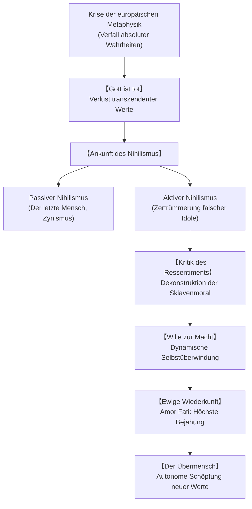

## Einleitung: Philosophieren mit dem Hammer und die Götzen-Dämmerung

Im ausgehenden 19. Jahrhundert, auf dem Zenit des europäischen Fortschrittsglaubens und der bürgerlich-christlichen Moral, erhob Friedrich Wilhelm Nietzsche (1844–1900) den philosophischen Hammer, um die Fundamente der abendländischen Metaphysik zu zerschlagen. Als „Dynamit“ und „Schicksal“ entlarvte er die platonisch-christliche Tradition der absoluten Wahrheit und moralischen Universalität als lebensfeindliche Fiktionen einer geschwächten Menschheit.

## 1. Biografie und Denkweg: Vom Pfarrhaus zur Einsamkeit von Sils-Maria
1844 im sächsischen Röcken als Pfarrerssohn geboren, verlor Nietzsche früh Vater und Bruder. Nach brillanten Studien an der Fürstenschule Pforta und in Leipzig wurde er 1869 bereits mit 24 Jahren ohne Dissertation zum außerordentlichen Professor für klassische Philologie an die Universität Basel berufen.

Die Begegnung mit Schopenhauers *Die Welt als Wille und Vorstellung* und die leidenschaftliche Freundschaft mit Richard Wagner prägten sein Frühwerk *Die Geburt der Tragödie aus dem Geiste der Musik* (1872). Doch Nietzsches Absage an den Philologismus isolierte ihn akademisch; der Bruch mit Wagner und seine schweren chronischen Leiden (Migräne, Sehstörungen, Magenkrämpfe) führten 1879 zum Rücktritt vom Lehramt.

Als wandernder Denker zwischen Genua, Nizza, Turin und den Schweizer Alpen schuf er in existentieller Isolation seine epochalen Werke: *Menschliches, Allzumenschliches*, *Morgenröthe*, *Die fröhliche Wissenschaft*, *Also sprach Zarathustra*, *Jenseits von Gut und Böse*, *Zur Genealogie der Moral* und *Götzen-Dämmerung*. Am 3. Januar 1889 brach er in Turin geistig zusammen. Nach seinem Tod im Jahr 1900 fälschte seine antisemitische Schwester Elisabeth Förster-Nietzsche seinen Nachlass (*Der Wille zur Macht*), was zu jahrzehntelangen Missbräuchen führte, die erst durch die Colli-Montinari-Kritikerausgabe bereinigt wurden.

## 2. „Gott ist tot“ und das Wesen des Nihilismus
In §125 der *Fröhlichen Wissenschaft* verkündet der tolle Mensch auf dem Marktplatz:
> „Gott ist todt! Gott bleibt todt! Und wir haben ihn getödtet! Wie trösten wir uns, die Mörder aller Mörder?“

Der Tod Gottes meint nicht bloßen religiösen Atheismus, sondern den Zusammenbruch jedes metaphysischen Fundaments. Der heraufziehende Nihilismus spaltet sich in zwei Formen:
- **Passiver Nihilismus**: Resignation, Lebensmüdigkeit und Flucht in die behagliche Mittelmäßigkeit des **„letzten Menschen“**, der das Risiko scheut und nur nach harmloser Gesundheit und kleinem Vergnügen strebt.
- **Aktiver Nihilismus**: Schöpferische Zerstörung alter Werte, die den Abgrund der Sinnlosigkeit annimmt, um aus eigener Kraft neue Werte zu gebären.

## 3. Die Genealogie der Moral: Herren- und Sklavenmoral
In *Zur Genealogie der Moral* (1887) untersucht Nietzsche die psychologische Entstehung moralischer Urteile:
- **Herrenmoral (Gut und Schlecht)**: Die Mächtigen, Vornehmen und Stolzen bejahen primär ihr eigenes Wirken als „gut“; die Ohnmächtigen werden erst sekundär und mit herablassendem Mitleid als „schlecht“ eingestuft.
- **Sklavenmoral (Gut und Böse)**: Entsteht aus dem giftigen **Ressentiment** der Unterdrückten. Weil sie keine Tatkraft besitzen, stempeln sie den starken Herren zuerst zum „Bösen“ ab und deklarieren ihre eigene Ohnmacht, Demut und Feigheit reaktiv als moralisch „gut“.

## 4. Der Wille zur Macht und der Perspektivismus
Gegen Schopenhauers bloße Selbsterhaltung setzt Nietzsche den **Willen zur Macht**:
> „Alles Leben ist Wille zur Macht.“

Damit meint Nietzsche keine rohe physische Gewaltherrschaft, sondern die Selbstüberwindung und Sublimierung der Triebe zur geistigen und künstlerischen Vollendung. Erkenntnistheoretisch mündet dies im **Perspektivismus**: Es gibt keine Tatsachen an sich, sondern nur Interpretationen aus der Perspektive eines bestimmten Lebenswillens.

## 5. Die Ewige Wiederkunft und Amor Fati
In Sils-Maria erlebte Nietzsche den Gedanken der **ewigen Wiederkunft des Gleichen**: dass dieses Leben mit all seinen Freuden und Qualen unendlich oft identisch wiederkehren müsse. Dieser Gedanke dient als härtester Prüfstein der Existenz. Wer ihn jubelnd bejahen kann, erreicht die Haltung des **Amor Fati** (Liebe zum Schicksal): nichts anders haben zu wollen, vorwärts nicht, rückwärts nicht, in alle Ewigkeit.

## 6. Der Übermensch und die drei Verwandlungen
In *Zarathustra* beschreibt Nietzsche den Menschen als Seil über einem Abgrund zwischen Tier und Übermensch. Die drei Verwandlungen des Geistes markieren den Reifeprozess:
1. **Das Kamel („Du sollst“)**: Trägt demütig die Last fremder Werte.
2. **Der Löwe („Ich will“)**: Zerschlägt das Gebot des Drachen und erkämpft negative Freiheit.
3. **Das Kind („Ein heiliges Ja-sagen“)**: Unschuld, Neubeginn, schöpferisches Spiel aus sich selbst heraus.

## 7. Rezeption und Ausblick im 21. Jahrhundert
Nach der Entgiftung vom nationalsozialistischen Missbrauch inspirierte Nietzsche Philosophen wie Heidegger, Jaspers, Deleuze, Foucault und Derrida. Im Zeitalter von Digitalisierung, Post-Truth und Transhumanismus warnt Nietzsche davor, technologische Schmerzvermeidung mit wahrer Größe zu verwechseln. Der Übermensch bleibt der Aufruf zur existentiellen Selbstüberwindung in einer entzauberten Welt.
