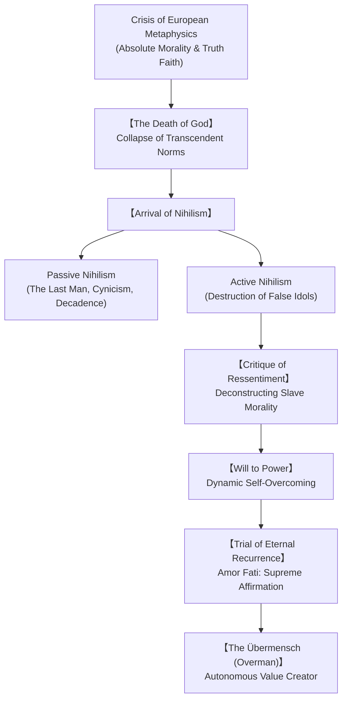

## Introduction: The Philosopher with a Hammer and the Twilight of Western Metaphysics

In the late nineteenth century, as European civilization basked in the technological triumphs of the Industrial Revolution and the perceived moral supremacy of Christian humanism, a solitary thinker shattered the foundations of Western thought: Friedrich Wilhelm Nietzsche (1844–1900).

Declaring that he was "dynamite" and resolved to "philosophize with a hammer," Nietzsche dismantled two millennia of metaphysical assumptions rooted in Plato and Christian theology. He exposed absolute truth, transcendent morality, and universal teleology as psychological defense mechanisms born of human weakness. Today, in an era marked by digital atomization, post-truth politics, institutional decadence, algorithmic echo chambers, and transhumanist aspirations, Nietzsche's radical existential critique resonates with unprecedented urgency.



## Chapter 1: The Existential Trajectory: From Prodigy to Wandering Iconoclast

### 1.1 The Prussian Parsonage and Classical Philology
Friedrich Nietzsche was born on October 15, 1844, in Röcken near Leipzig, into a devout Lutheran pastor's household. The tragic loss of his father at age four and his infant brother shortly thereafter steeped his childhood in solemnity and solitary contemplation. Educated at the elite Schulpforta boarding school, Nietzsche excelled in ancient Greek and Latin literature.

At the University of Leipzig, under the mentorship of Friedrich Ritschl, Nietzsche established himself as an extraordinarily brilliant classical philologist. In 1869, at the unprecedented age of twenty-four, he was appointed extraordinary professor of classical philology at the University of Basel in Switzerland before even submitting a formal doctoral dissertation.

### 1.2 Schopenhauer's Pessimism and the Wagnerian Fellowship
While in Leipzig, Nietzsche discovered Arthur Schopenhauer's masterpiece, *The World as Will and Representation*. Schopenhauer's radical premise—that beneath rational cognition lies an insatiable, blind metaphysical Will to Live—liberated Nietzsche from academic complacency.

Simultaneously, Nietzsche forged a tempestuous friendship with Richard Wagner in Tribschen. Nietzsche saw in Wagner's music dramas a Dionysian renaissance destined to revitalize Western culture from bourgeois decline. In 1872, Nietzsche published his audacious debut, *The Birth of Tragedy out of the Spirit of Music*. Straying from orthodox philological rigor into speculative aesthetic philosophy, the book provoked vicious academic condemnations from Ulrich von Wilamowitz-Moellendorff, fatally derailing Nietzsche's academic career.

### 1.3 Solitude, Chronic Agony, and the Engadin Heights
Disillusioned by Wagner's nationalist pandering and Christian redemption motif in *Parsifal*, Nietzsche broke decisively with the composer in 1876. Crippled by excruciating migraines, violent gastric spasms, and near-blindness, he resigned from Basel in 1879.

Living on a modest university pension, Nietzsche became a wandering philosopher, migrating between alpine summers in Sils-Maria (Upper Engadin) and Mediterranean winters in Genoa, Nice, and Turin. It was amid severe physical suffering that he composed his most revolutionary aphoristic works: *Human, All Too Human* (1878), *Daybreak* (1881), *The Gay Science* (1882), *Thus Spoke Zarathustra* (1883–1885), *Beyond Good and Evil* (1886), *On the Genealogy of Morality* (1887), *Twilight of the Idols* (1888), and *Ecce Homo* (1888).

### 1.4 Collapse in Turin and the Archive's Betrayal
On January 3, 1889, in Turin's Piazza Carlo Alberto, Nietzsche saw a carriage driver brutally flogging an exhausted horse. Weeping uncontrollably, he flung his arms around the animal's neck and collapsed into irreversible madness. 

Cared for by his mother and sister Elisabeth Förster-Nietzsche until his death on August 25, 1900, Nietzsche remained oblivious to his posthumous fame. Elisabeth, an ardent anti-Semite married to a prominent nationalist, hijacked the Nietzsche-Archiv in Weimar. She forged and mutilated his late notebooks into the fraudulent volume *The Will to Power*, presenting her brother as a proto-fascist imperialist. Only the monumental critical edition (KGW/KSA) by Giorgio Colli and Mazzino Montinari in the late 1960s restored Nietzsche's authentic philosophical legacy.

## Chapter 2: "God is Dead" and the Pathology of Modern Nihilism

### 2.1 The Madman's Announcement
In Section 125 of *The Gay Science*, Nietzsche introduces the Madman who runs into a crowded marketplace with a lantern in broad daylight, crying: "I seek God!" When greeted by the mocking laughter of secular atheists, the Madman declares:

> "Whither is God? I will tell you. We have killed him—you and I! All of us are his murderers! But how did we do this? How could we drink up the sea? Who gave us the sponge to wipe away the entire horizon? What were we doing when we unchained this earth from its sun? Whither is it moving now? Away from all suns? Are we not plunging continually? Backward, sideward, forward, in all directions? Is there still any up or down? Are we not straying as through an infinite nothing?"

The death of God does not merely signify secular skepticism. It announces the structural collapse of all transcendental coordinates: Platonic Ideals, Cartesian foundations, Kantian moral laws, and Hegelian historical teleology. When humanity eliminated transcendent anchors through scientific rationality, it dissolved the horizon of objective meaning.

### 2.2 Passive versus Active Nihilism
Nietzsche defined nihilism with surgical precision: "What does nihilism mean? That the highest values devaluate themselves. The aim is lacking; 'why?' finds no answer."

| Category | Fundamental Posture | Psychological Dynamics | Societal Manifestation |
| :--- | :--- | :--- | :--- |
| **Passive Nihilism** | Weariness, retreat, resignation | Paralyzed by the void; clings to trivial comforts and avoids conflict. | **The "Last Man"**<br/>Consumerism, moral cynicism, risk aversion, therapeutic escapism |
| **Active Nihilism** | Vitality, destruction, overcome | Deliberate shattering of outworn dogmas; embracing groundlessness to forge new values. | **Bridge to the Übermensch**<br/>Transvaluation of values, bold existential experimentation |

### 2.3 The Portrait of the "Last Man" (Der Letzte Mensch)
In *Zarathustra*, Nietzsche sketches the tragic archetype of the Last Man:
> "'What is love? What is creation? What is longing? What is a star?' thus asks the Last Man, and he blinks. The earth has become small, and upon it hops the Last Man, who makes everything small... 'We have discovered happiness,' say the Last Men, and they blink."

The Last Man seeks only frictionless survival, moderate entertainment, and painless health. He detests greatness because greatness requires suffering. Nietzsche saw in the Last Man the ultimate danger: a sanitized cultural desert devoid of creative fire.

## Chapter 3: The Anatomy of Ressentiment and Slave Morality

### 3.1 Historical Genealogy of Moral Prejudices
In *On the Genealogy of Morality* (1887), Nietzsche pioneered genealogical inquiry to dismantle moral absolutes. He argued that concepts of good and evil are historical fabrications born from bitter power struggles.

### 3.2 Master Morality versus Slave Morality
1. **Master Morality (Good vs. Bad / Gut und Schlecht)**: Formulated by noble, physically vigorous warriors who affirm their own strength, wealth, and aristocratic daring as "good." Those who are weak, cowardly, and downtrodden are designated "bad" as an afterthought, with condescending pity rather than vindictive malice.
2. **Slave Morality (Good vs. Evil / Gut und Böse)**: Formulated by the oppressed, subjugated underclass unable to retaliate through physical deed. Driven by *ressentiment*, they first define the powerful master as "evil," and then construct their own impotent traits—meekness, obedience, ascetic restraint, poverty—as "good."

```mermaid
flowchart LR
    subgraph Master Morality
        A1["Primary Self-Affirmation:<br/>'We noble ones are Good!'"] --> B1["Secondary Distinction:<br/>'The weak are Bad'"]
    end

    subgraph Slave Morality (Ressentiment Inversion)
        A2["Ressentiment Fuel:<br/>'The powerful oppressor is Evil!'"] --> B2["Reactive Self-Justification:<br/>'We who endure are Good'"]
    end
```

### 3.3 The Mechanics of Ressentiment
Ressentiment is not simple envy; it is poisoned, festering hostility that cannot discharge itself in action and instead takes refuge in imaginary, metaphysical revenge. The weak invent hellfire for the strong and paradise for the humble, converting biological incapacity into moral superiority.

### 3.4 Ascetic Ideals and the Guilt of Bad Conscience
When primitive instincts of cruelty and aggression were curbed by the rise of state structures, humans turned their violent drives inward upon themselves. This internal torture gave birth to "bad conscience" (guilt). The ascetic priest capitalized on this internal wound, telling sufferers that their agony was their own fault—the punishment for "sin."

## Chapter 4: The Will to Power (Wille zur Macht)

### 4.1 Beyond Schopenhauer's Self-Preservation
Rejecting Schopenhauer's passive "Will to Live" and Darwin's mere "survival of the fittest," Nietzsche insisted that life's primal drive is not self-preservation, but self-expansion and overcoming resistance:
> "A living thing seeks above all to discharge its strength—life itself is Will to Power; self-preservation is only one of the indirect and most frequent results."

### 4.2 Spiritualized Power vs. Coarse Brutality
Contrary to vulgar fascist distortions, Nietzsche regarded physical violence as the lowest, most defective expression of power. True mastery is internal: the aesthetic shaping of chaotic passions into sublime creative achievements (Sublimation / *Sublimierung*). Goethe, Beethoven, and Shakespeare embody the highest Will to Power.

### 4.3 Perspectivism: The Epistemological Revolution
Nietzsche abolished the metaphysical illusion of absolute objective truth: "There are no facts, only interpretations." Knowledge is always perspectival—an interpretive schema forged by a specific organism to enhance its vitality and command over reality.

## Chapter 5: The Eternal Recurrence and Amor Fati

### 5.1 The Revelation at Sils-Maria
In August 1881, beside a massive pyramidal rock by Lake Silvaplana, Nietzsche was struck by the supreme thought of his philosophy: the **Eternal Recurrence of the Same (Ewige Wiederkunft des Gleichen)**.

### 5.2 The Heaviest Weight
In *The Gay Science* (Section 341), Nietzsche presents the thought experiment:
> "What if some day or night a demon were to steal into your loneliest loneliness and say to you: 'This life as you now live it and have lived it, you will have to live once more and innumerable times more; and there will be nothing new in it, but every pain and every joy and every thought and sigh and everything unutterably small or great in your life will have to return to you, all in the same succession and sequence...' Would you not throw yourself down and gnash your teeth and curse the demon? Or have you once experienced a tremendous moment when you would have answered him: 'You are a god and never have I heard anything more divine'?"

The Eternal Recurrence strips away linear salvation, heaven, and historical utopias. It acts as an existential filter: only a spirit possessing immense fortitude can embrace an infinity where every agony and humiliation repeats identically forever.

### 5.3 Amor Fati: Love of Fate
This ultimate test is answered by **Amor Fati**:
> "My formula for greatness in a human being is *amor fati*: that one wants nothing to be different, not forward, not backward, not in all eternity. Not merely bear what is necessary, still less conceal it... but *love* it."

## Chapter 6: The Übermensch (Overman) and the Metamorphoses of Spirit

### 6.1 Man as a Rope across an Abyss
In *Thus Spoke Zarathustra*, Nietzsche proclaims:
> "I teach you the Übermensch. Man is something that must be overcome... What is great in man is that he is a bridge and not an end: what is lovable in man is that he is an *overture* and a *going under*."

The Übermensch is neither a biological mutant nor a ruthless tyrant, but an autonomous individual who stands courageously in the void left by God's death, generating original values through boundless creative vitality.

### 6.2 The Three Metamorphoses of the Spirit
1. **The Camel ("Thou Shalt")**: Bears heavy burdens of duty, convention, and ascetic law across the desert.
2. **The Lion ("I Will")**: Confronts the great dragon of social conformity, shattering sacred commandments to claim negative freedom.
3. **The Child ("A Sacred Yes")**: Innocent play, joyful forgetfulness, a self-rolling wheel that creates new values without ressentiment.

## Chapter 7: The Masterworks: An Analytical Guide to Eight Major Texts

1. **Human, All Too Human (1878)**: The dawn of the free spirit; dissecting art, religion, and metaphysics through psychological rationalism.
2. **Daybreak (1881)**: Subversion of moral prejudices; reclaiming bodily joy and sensory instinct.
3. **The Gay Science (1882)**: The joyous affirmation of life; introduction of the "Death of God" and "Eternal Recurrence."
4. **Thus Spoke Zarathustra (1883–1885)**: The lyrical masterpiece synthesising the Übermensch, Will to Power, and Eternal Recurrence.
5. **Beyond Good and Evil (1886)**: The philosophical manifesto of perspectivism and the critique of modern democratic mediocrity.
6. **On the Genealogy of Morality (1887)**: The structural dissection of ressentiment, guilt, and ascetic ideals.
7. **Twilight of the Idols & The Antichrist (1888)**: The combat treatises striking at Western idols with a diagnostic hammer.
8. **Ecce Homo (1888)**: The singular intellectual autobiography surveying an extraordinary destiny.

## Chapter 8: Postmodern Reception and Twentieth-Century Reclamation

Following de-Nazification efforts led by Walter Kaufmann in America and Colli-Montinari in Europe, Nietzsche became the philosophical catalyst of late twentieth-century Continental thought:
- **Martin Heidegger**: Read Nietzsche as the culmination of Western metaphysics.
- **Gilles Deleuze**: Championed Nietzsche as the philosopher of difference, multiplicity, and radical affirmation against Hegelian dialectics.
- **Michel Foucault**: Adopted Nietzsche's genealogy to expose how carceral, psychiatric, and sexual discourses construct institutional power.
- **Jacques Derrida**: Analyzed Nietzsche's polymorphic styles as the foundation for deconstruction.

## Chapter 9: Nietzsche in the Twenty-First Century: Post-Truth, AI, and Transhumanism

In the contemporary world, Nietzsche's perspectivism is frequently misunderstood as license for post-truth cynicism and conspiracy narratives. However, Nietzsche judged interpretations rigorously by their capacity to promote flourishing rather than resentment.

Simultaneously, transhumanist advocates claim that technological self-modification fulfills Nietzsche's Übermensch. Yet Nietzsche would view the quest for painless, risk-free immortality not as transcendence, but as the quintessential triumph of the Last Man. The authentic challenge remains existential: whether humanity, amid algorithmic automation, can cultivate the heroic courage to transvaluate its values and affirm existence unconditionally.

## Conclusion: Love Your Fate with Hammer in Hand
Friedrich Nietzsche offers no comfortable dogmas or tranquil harbors. He leaves us standing on an unchartered coastline beneath an infinite sky. In an age haunted by ideological dogma and technological conformity, his hammer continues to shatter our illusions, inviting us to dance across the abyss and say to life: "Once more, for all eternity!"
