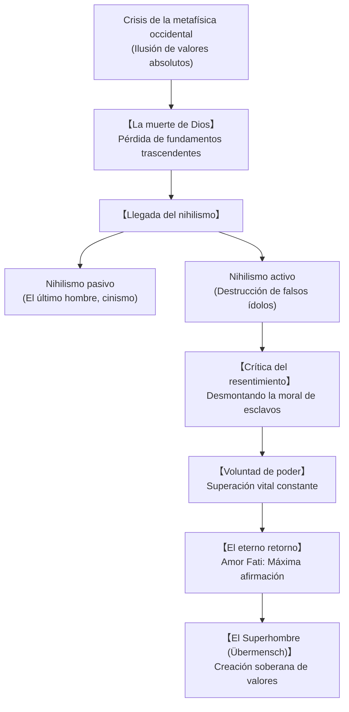

## Introducción: El filósofo del martillo y el crepúsculo de la metafísica

A finales del siglo XIX, Friedrich Nietzsche (1844-1900) asestó un golpe demoledor a la civilización occidental. Proclamándose «dinamita» y decidido a «filosofar a martillazos», demolió dos milenios de verdades absolutas cimentadas en Platón y el cristianismo, revelando que la moral tradicional era un síntoma de decadencia vital.

## 1. Trayectoria biográfica e intelectual
Nacido en Röcken, Prusia, en el seno de una familia pastoral luterana, Nietzsche descolló desde muy joven en la filología clásica. Con apenas 24 años fue nombrado catedrático extraordinario en la Universidad de Basilea. Marcado por la filosofía de Schopenhauer y la amistad con Richard Wagner, publicó *El nacimiento de la tragedia* (1872), obra incomprendida por el academicismo tradicional.

Tras romper con Wagner y aquejado de graves dolencias físicas crónicas, renunció a la cátedra en 1879 para iniciar una vida errante por Suiza e Italia. En esa soledad concibió sus cumbres literarias y filosóficas: *Humano, demasiado humano*, *Así habló Zaratustra*, *Más allá del bien y del mal* y *La genealogía de la moral*. Su colapso mental en Turín en 1889 cerró su actividad creadora, quedando su legado temporalmente distorsionado por las manipulaciones de su hermana Elisabeth.

## 2. «Dios ha muerto» y el desafío del nihilismo
En *La gaya ciencia* (§125), el hombre loco proclama: «¡Dios ha muerto! ¡Y nosotros lo hemos matado!»
La caída de los valores supremos engendra el **nihilismo**:
- **Nihilismo pasivo**: Agotamiento vital que culmina en el **«Último Hombre»**, ser acomodaticio de la sociedad de consumo que evita el riesgo y solo aspira a una felicidad tibia.
- **Nihilismo activo**: Fuerza enérgica que destruye los ídolos caducos para abrir espacio a la creación libre y soberana.

## 3. Genealogía de la moral y resentimiento
Nietzsche investiga el origen terrenal y psicológico de las valoraciones morales:
- **Moral de señores (Bueno y Malo)**: Los nobles afirman jubilosamente su propia fuerza y excelencia como «buena», considerando a los débiles simplemente como «malos» o inferiores con desdén compasivo.
- **Moral de esclavos (Bueno y Malvado)**: Impulsada por el **resentimiento**. Los débiles, incapaces de rebelarse en la acción real, califican primero al fuerte de «malvado» y, por antítesis reactiva, ensalzan su propia impotencia y sumisión como virtudes santas.

## 4. La voluntad de poder y el perspectivismo
La esencia de la vida no es la autoconservación darwiniana, sino la **Voluntad de poder (Wille zur Macht)**: el impulso intrínseco de expandirse, vencer obstáculos y sublimar las pasiones en creación artística y espiritual. Su epistemología, el **perspectivismo**, sentencia: «No hay hechos, solo interpretaciones».

## 5. El eterno retorno y el Amor Fati
La revelación de Sils-Maria plantea el **Eterno retorno de lo idéntico**: la posibilidad de revivir la misma vida, con cada dolor y alegría, infinitas veces. Esta prueba extrema de la voluntad halla su respuesta en el **Amor Fati**: amar el propio destino sin desear cambiar ni un solo instante en toda la eternidad.

## 6. El Superhombre y las tres transformaciones
En *Zaratustra*, el ser humano es un puente tendido hacia el **Superhombre (Übermensch)**. Las tres transformaciones del espíritu son:
1. **El Camello («Tú debes»)**: Carga sumisa con los deberes tradicionales.
2. **El León («Yo quiero»)**: Destruye el mandato del dragón y conquista la libertad negativa.
3. **El Niño («Un santo decir sí»)**: Inocencia, juego creador, nuevo comienzo y afirmación plena.

## 7. Relevancia en el siglo XXI
Rescatado por pensadores como Deleuze, Foucault y Vattimo, Nietzsche interpela directamente a nuestro presente digital. Frente a las promesas del transhumanismo y la anestesia consumista, su filosofía nos convoca a rechazar el resentimiento y a abrazar la existencia con audacia creadora.
