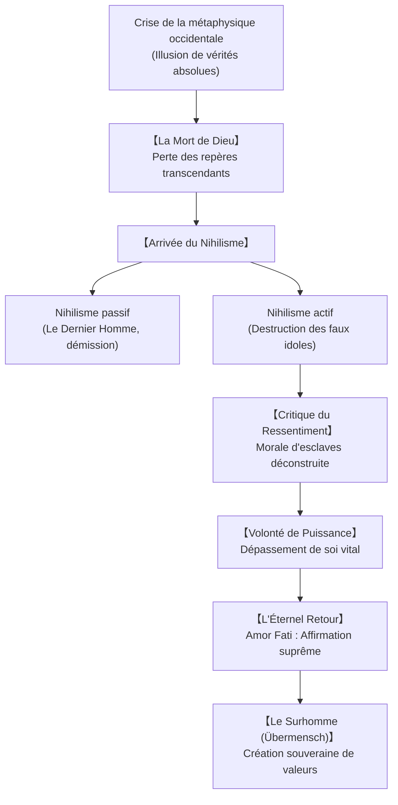

## Introduction : Philosopher à coups de marteau

À la fin du XIXe siècle, Friedrich Nietzsche (1844-1900) porte un coup fatal à la métaphysique occidentale. En proclamant la « mort de Dieu », il ne se contente pas de contester le dogme chrétien : il démasque deux mille ans d'idéalisme platonicien et de certitudes morales comme des refuges inventés par la faiblesse humaine pour fuir le tragique de l'existence.

## 1. La trajectoire d'une vie tragique
Fils de pasteur luthérien né à Röcken, Nietzsche se distingue dès sa jeunesse par son génie philologique à l'école de Schulpforta puis à l'université de Leipzig. Nommé professeur extraordinaire à Bâle à seulement 24 ans, il subit l'influence décisive de Schopenhauer et s'enthousiasme pour l'art de Richard Wagner (*La Naissance de la tragédie*, 1872).

Rompu avec le wagnérisme nationaliste et accablé par d'insupportables migraines et troubles digestifs, il démissionne en 1879 pour mener une existence errante entre Sils-Maria, Gênes, Nice et Turin. C'est dans cette solitude extrême qu'il forge ses chefs-d'œuvre : *Humain, trop humain*, *Aurore*, *Le Gai Savoir*, *Ainsi parlait Zarathoustra*, *Par-delà bien et mal* et *Généalogie de la morale*. Son effondrement psychique à Turin en janvier 1889 met fin à sa vie intellectuelle. Sa sœur Elisabeth défigure ensuite ses textes posthumes au profit du nationalisme.

## 2. « Dieu est mort » et l'avènement du nihilisme
Dans *Le Gai Savoir* (§125), l'homme fou s'écrie au milieu de la place publique : « Dieu est mort ! Et c'est nous qui l'avons tué ! »
La disparition des vérités absolues plonge l'humanité dans le **nihilisme** :
- **Nihilisme passif** : Fatigue de vivre, renoncement et avènement du **« Dernier Homme »**, figure médiocre de la société de consommation qui recherche le confort sans douleur ni grandeur.
- **Nihilisme actif** : Force destructrice des idoles vermoulues, ouvrant la voie à une nouvelle création de valeurs.

## 3. La Généalogie de la morale et le ressentiment
Nietzsche démontre que les notions morales ne sont pas d'origine divine mais résultent de conflits historiques :
- **Morale des maîtres (Bon et Mauvais)** : Les forts affirment spontanément leur noblesse comme « bonne », considérant les faibles avec un mépris bienveillant comme « mauvais ».
- **Morale des esclaves (Bon et Mal)** : Née du **ressentiment**, poison psychologique des impuissants. Incapables d'agir, ils posent d'abord le maître puissant comme « mauvais/maléfique », puis déclarent par ruse leur propre faiblesse comme « bonne » et vertueuse.

## 4. La Volonté de puissance et le perspectivisme
La vie n'est pas simple conservation de soi, mais **Volonté de puissance (Wille zur Macht)** : pulsion d'expansion, de dépassement et de sublimation des forces intérieures. Sur le plan de la connaissance, le perspectivisme nietzschéen affirme : « Il n'y a pas de faits, seulement des interprétations. »

## 5. L'Éternel retour et l'Amor Fati
L'idée de l'**Éternel retour du même** confronte l'homme à une épreuve absolue : vouloir revivre chaque seconde de son existence, avec ses joies et ses atrocités, une infinité de fois. L'affirmer relève de l'**Amor Fati** (l'amour du destin) : accepter la nécessité sans réserve et bénir la vie dans toute sa dureté.

## 6. Le Surhomme et les trois métamorphoses
Dans *Zarathoustra*, l'homme est défini comme un pont tendu entre l'animal et le **Surhomme (Übermensch)**. L'esprit accomplit trois métamorphoses :
1. **Le Chameau** : Porte docilement le fardeau des devoirs moraux (« Tu dois »).
2. **Le Lion** : Détruit l'autorité du dragon pour conquérir sa liberté (« Je veux »).
3. **L'Enfant** : Innocence, oubli bienheureux, jeu sacré et création pure.

## 7. Portée contemporaine au XXIe siècle
Après les dérives fascistes dénoncées par Deleuze et Foucault, la pensée de Nietzsche résonne puissamment face aux algorithmes modernes et au transhumanisme. Nietzsche nous rappelle que la véritable grandeur ne réside pas dans l'évitement technologique de la souffrance, mais dans le courage héroïque d'affirmer la vie ici et maintenant.
