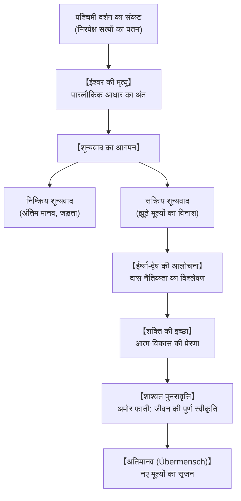

## प्रस्तावना: हथौड़े से दर्शन और पश्चिमी तत्वमीमांसा का अवसान

उन्नीसवीं सदी के उत्तरार्ध में जर्मन दार्शनिक फ्रेडरिक विल्हेम नीत्शे (1844-1900) ने पश्चिमी दर्शन की नींव हिला दी। स्वयं को "डायनामाइट" घोषित करने वाले नीत्शे ने प्लेटो और ईसाई धर्म की स्थापित नैतिक मान्यताओं को भ्रम साबित किया।

## 1. जीवन और विचार यात्रा
रॉकेन में जन्मे नीत्शे ने बॉन और लीपज़िग विश्वविद्यालयों से शास्त्रीय भाषाशास्त्र में महारत हासिल की। मात्र 24 वर्ष की आयु में वे बेसेल विश्वविद्यालय में प्रोफेसर बने। शोपेनहावर के दर्शन और रिचर्ड वैगनर की मित्रता ने उनके प्रारंभिक विचारों को गढ़ा।

गंभीर अस्वस्थता के कारण 1879 में पद छोड़कर वे एकांत चिंतन में जुट गए। इसी दौर में उन्होंने *द गे साइंस*, *दस स्पोक ज़राथुस्ट्र*, *बियॉन्ड गुड एंड एविल* और *ऑन द जेनेलॉजी ऑफ मोरैलिटी* जैसी महान कृतियाँ रचीं। 1889 में मानसिक पतन के बाद 1900 में उनका निधन हुआ।

## 2. "ईश्वर मर चुका है" और शून्यवाद
*द गे साइंस* में नीत्शे ने घोषणा की: "ईश्वर मर चुका है! और हमने उसे मार डाला है!"
इसका अर्थ है कि जीवन को सहारा देने वाले सभी निरपेक्ष मूल्य समाप्त हो चुके हैं।
- **निष्क्रिय शून्यवाद**: जीवन से निराशा और **"अंतिम मानव" (The Last Man)** का जन्म जो केवल अल्पकालिक सुख और सुरक्षा चाहता है।
- **सक्रिय शून्यवाद**: पुराने खोखले मूल्यों को तोड़कर नए अर्थ गढ़ने का साहसी प्रयास।

## 3. नैतिकता की वंशावली और दास नैतिकता
- **स्वामी नैतिकता (अच्छा बनाम बुरा)**: शक्तिशाली लोग अपनी शक्ति और उमंग को "अच्छा" कहते हैं।
- **दास नैतिकता (अच्छा बनाम दुष्ट)**: दमित वर्ग की **ईर्ष्या (Ressentiment)** से उपजी नैतिकता, जहाँ शक्तिशाली को "दुष्ट" और अपनी कमजोरी को "पुण्य" मान लिया जाता है।

## 4. शक्ति की इच्छा और दृष्टिकोणवाद
जीवन का मूल नियम केवल आत्म-रक्षा नहीं, बल्कि **शक्ति की इच्छा (Will to Power)** है—स्वयं को उत्कृष्ट बनाने की तीव्र ललक। ज्ञान के संदर्भ में नीत्शे का मानना है कि कोई निरपेक्ष सत्य नहीं होता, केवल अलग-अलग दृष्टिकोण (Perspectivism) होते हैं।

## 5. शाश्वत पुनरावृत्ति और अमोर फाती
**शाश्वत पुनरावृत्ति (Eternal Recurrence)** का विचार एक कठिन परीक्षा है: क्या आप अपने इसी जीवन को उसके हर दुख और सुख सहित अनंत बार जीने को तैयार हैं? जो इसे सहर्ष स्वीकार करता है, वही **अमोर फाती (Amor Fati - भाग्य से प्रेम)** के शिखर पर पहुँचता है।

## 6. अतिमानव (Übermensch)
मनुष्य पशु और **अतिमानव** के बीच बंधी एक रस्सी है। आत्मा के तीन रूपांतरण हैं:
1. **ऊँट**: आज्ञाकारी बनकर बोझ उठाना।
2. **शेर**: स्थापित नियमों को तोड़कर स्वतंत्रता छीनना।
3. **शिशु**: निर्दोष भाव से नए जीवन मूल्यों का सृजन करना।

## 7. 21वीं सदी में प्रासंगिकता
आज की डिजिटल दुनिया में नीत्शे का दर्शन हमें निराशा से उबरकर अपने जीवन की कमान स्वयं संभालने और साहसपूर्वक जीने की प्रेरणा देता है।
