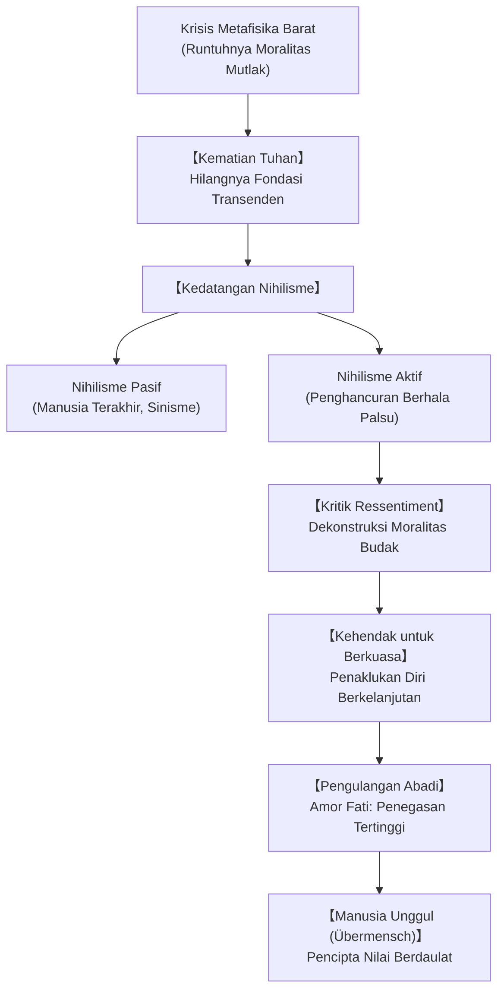

## Pengantar: Berfilsafat dengan Palu dan Senja Berhala Barat

Pada akhir abad ke-19, Friedrich Wilhelm Nietzsche (1844-1900) mengguncang fondasi peradaban Barat. Menyatakan dirinya sebagai "dinamit" yang "berfilsafat dengan palu", ia membongkar ilusi metafisika Platonik dan Kristen yang telah berkuasa selama dua milenium. Nietzsche memperlihatkan bahwa moralitas konvensional dan kebenaran mutlak hanyalah mekanisme pertahanan psikologis dari kelemahan manusia.

## 1. Lintasan Hidup: Dari Cendekiawan Muda ke Pengembara Sunyi
Lahir di Röcken dari keluarga pendeta Lutheran, Nietzsche menunjukkan bakat luar biasa dalam filologi klasik di Schulpforta dan Universitas Leipzig. Pada usia 24 tahun, ia diangkat menjadi profesor di Universitas Basel tanpa perlu menulis disertasi formal.

Perjumpaan dengan pemikiran Schopenhauer dan persahabatannya dengan Richard Wagner melahirkan karya perdananya, *Lahirnya Tragedi* (1872). Namun, isolasi akademis, keretakan hubungan dengan Wagner, dan penyakit fisik parah memaksanya mengundurkan diri pada 1879. Mengembara di Swiss dan Italia, ia menulis mahakarya seperti *Zarathustra*, *Beyond Good and Evil*, dan *Genealogi Moral*. Pada 1889, ia mengalami keruntuhan mental di Turin hingga wafatnya pada 1900.

## 2. "Tuhan Telah Mati" dan Kedatangan Nihilisme
Dalam *The Gay Science* (§125), orang gila berteriak di pasar: "Tuhan telah mati! Dan kitalah yang membunuhnya!"
Ini menandai runtuhnya seluruh kerangka transenden yang memberi makna hidup. Nihilisme terbagi menjadi dua:
- **Nihilisme Pasif**: Keputusasaan yang melahirkan **"Manusia Terakhir" (The Last Man)**, sosok yang hanya mencari kenyamanan dangkal tanpa keberanian mengejar keagungan.
- **Nihilisme Aktif**: Kekuatan berani yang menghancurkan nilai-nilai lama demi menciptakan makna baru secara mandiri.

## 3. Genealogi Moral dan Ressentiment
Dalam *On the Genealogy of Morality* (1887), Nietzsche membedah asal-usul moralitas:
- **Moralitas Tuan (Baik vs Buruk)**: Bangsawan yang kuat menegaskan kemuliaan dan keberanian mereka sebagai "baik", memandang yang lemah sebagai "buruk" tanpa kebencian.
- **Moralitas Budak (Baik vs Jahat)**: Lahir dari **ressentiment** (dendam terpendam). Karena tidak berdaya melawan, kaum lemah mencap sang tuan sebagai "jahat" dan memuliakan kelemahan diri mereka sebagai "kebaikan".

## 4. Kehendak untuk Berkuasa dan Perspektivisme
Hakikat kehidupan adalah **Kehendak untuk Berkuasa (Will to Power)**: dorongan dinamis untuk melampaui diri, mengatasi rintangan, dan menyublimasikan nafsu menjadi karya agung. Secara epistemologis, berlaku **perspektivisme**: "Tidak ada fakta, yang ada hanyalah penafsiran."

## 5. Pengulangan Abadi dan Amor Fati
Gagasan **Pengulangan Abadi (Eternal Recurrence)** menantang manusia: sanggupkah engkau mengulang seluruh detik kehidupanmu, baik derita maupun bahagia, secara identik tanpa akhir? Mereka yang sanggup mencapainya memiliki **Amor Fati** (mencintai takdir): menerima dan memeluk kehidupan seutuhnya.

## 6. Manusia Unggul (Übermensch) dan Tiga Metamorfosis
Manusia adalah jembatan menuju **Übermensch**. Tiga tahap perubahan jiwa:
1. **Unta ("Engkau Harus")**: Patuh memikul beban kewajiban moral.
2. **Singa ("Aku Mau")**: Meruntuhkan naga aturan demi merebut kebebasan.
3. **Anak ("Ya yang Kudus")**: Kepolosan, permainan kreatif, dan penciptaan nilai-nilai baru.

## 7. Relevansi di Abad ke-21
Di tengah modernitas yang mekanistik, filsafat Nietzsche menginspirasi manusia kontemporer untuk tidak menyerah pada keputusasaan, melainkan berani menari di atas jurang eksistensi dan mencintai kehidupan sepenuhnya.
