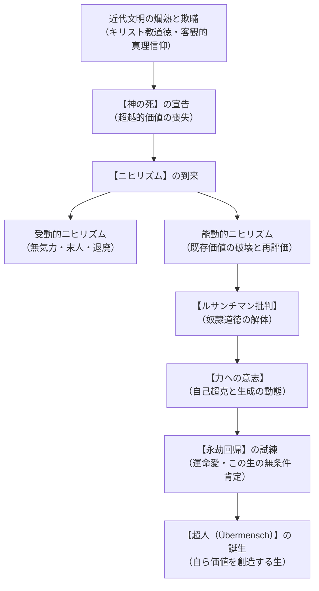
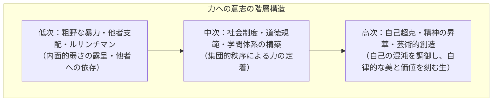
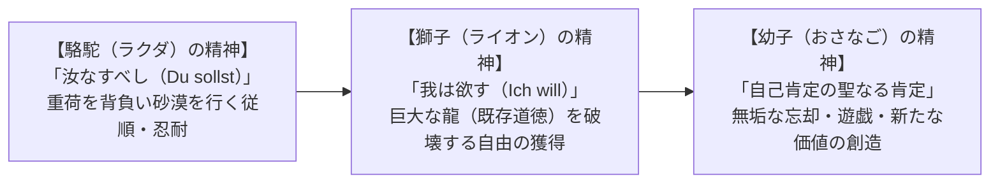
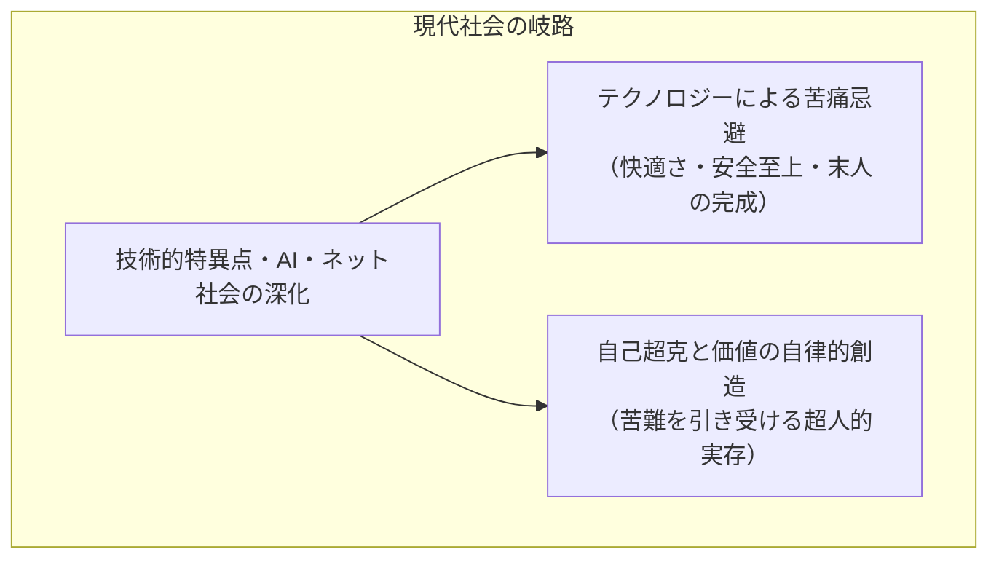

## 序論：金槌を振るう哲学者と近代形而上学の黄昏

19世紀後半、ヨーロッパ文明が科学技術の未曾有の発展と産業革命の恩恵に沸き立ち、キリスト教的ヒューマニズムとブルジョワ道徳の爛熟期を迎えていた時代に、一人の孤高の思想家が人類の精神史を根底から揺るがす鉄槌を打ち下ろした。フリードリヒ・ヴィルヘルム・ニーチェ（Friedrich Wilhelm Nietzsche, 1844-1900）である。

自らを「運命（Schicksal）」であり「ダイナマイト」であると呼び、「金槌で哲学する（mit dem Hammer philosophieren）」と宣言したニーチェは、古代ギリシャのプラトン以来二千数百年以上にわたって西洋形而上学を支配してきた「客観的真理」「神」「普遍的道徳」という超越論的価値体系の欺瞞を徹底的に暴き立てた。彼が突きつけた問いは、単なる知的遊戯や学術的批判の域をはるかに越え、現代を生きる我々人類の実存を全方位から撃ち抜く根源的な警鐘であり続けている。

近代社会の構造的閉塞感、意味の喪失、ポピュリズムの蔓延、ソーシャルメディア時代におけるルサンチマンの過剰流動、そして人工知能（AI）やバイオテクノロジーの急速な進展によって人間の定義そのものが揺らぐ21世紀において、ニーチェの思想はかつてないほどの切実さをもって再召喚されている。本稿では、ニーチェの全生涯と主要著作群を丹念に辿り、彼の哲学的中核をなす「神の死」「ニヒリズム」「ルサンチマン批判」「力への意志」「永劫回帰」「超人」「運命愛」といった概念を重層的かつ学術的に解読し、それらが現代文明に投げかける強烈な光と影を浮き彫りにする。




## 第1章：実存的転回と生の軌跡――神童から放浪の哲学者へ

### 1.1 プロイセンの牧師館と早熟の古典文献学者
フリードリヒ・ニーチェは1844年10月15日、プロイセン王国ザクセン州の小村レッケン（Röcken）において、ルター派の敬虔な牧師カール・ルートヴィヒ・ニーチェの長男として生を受けた。生家を取り巻く厳格なプロテスタント的信仰と道徳的敬虔さは、若きニーチェの人格形成に決定的な影響を与えたが、わずか4歳の時に敬愛する父が脳疾患により急逝し、翌年には幼い弟ルートヴィヒ・ヨーゼフをも喪失するという苛烈な運命に見舞われた。母、祖母、二人の叔母、そして妹エリザベートという女性ばかりの家庭で育ったニーチェは、孤独と深い内省の精神を育んでいった。

名門プフォルタ学院において卓越した語学の才能を発揮したニーチェは、古代ギリシャ・ローマの古典文学を原典で読み解く中で、キリスト教的教条主義への懐疑を深めていった。ボン大学を経てライプツィヒ大学へと進学したニーチェは、当代屈指の碩学フリードリヒ・ヴィルヘルム・リッチュル教授のもとで古典文献学（フィロロジー）に没頭した。その精密無比な文献批判能力と古代ギリシャ文学への深い洞察は瞬く間に学会の注目を集め、1869年、ニーチェは博士論文の提出を免除され、24歳の異例の若さでスイス・バーゼル大学の古典文献学員外教授に招聘された。

### 1.2 ショーペンハウアーとの邂逅とヴァーグナーとの熱情的な友情
ライプツィヒ時代、古書店で偶然手に取ったアルトゥル・ショーペンハウアーの主著『意志と表象としての世界』との出会いは、ニーチェの知的魂を激しく揺さぶった。理性至上主義の近代哲学に対して、盲目的で理不尽な「生への意志」が世界の本質であると喝破したショーペンハウアーのペシミズム（悲観主義）は、ニーチェに強烈な形而上学的覚醒をもたらした。

さらに、ルツェルン近郊のトリープシェンに滞在していた作曲家リヒャルト・ヴァーグナーとの知己を得たことは、若きニーチェの運命を決定づけた。ヴァーグナーの総合芸術論とゲルマン神話の音楽的再生に、ギリシャ悲劇の復活と近代退廃文明の克服を見出したニーチェは、ヴァーグナーの熱狂的な信奉者となり、家族同然の親交を結んだ。

1872年、28歳のニーチェは記念碑的処女作『悲劇の誕生（Die Geburt der Tragödie aus dem Geiste der Musik）』を公刊する。しかし、文献学の厳密な実証的手法を逸脱し、大胆な哲学的直観と芸術論を展開した同書は、当時の正統派文献学会（特にウルリヒ・フォン・ヴィラモーヴィッツ＝メレンドルフら）から激しい批判と冷笑を浴び、大学教授としてのニーチェの名声は失墜していった。

### 1.3 ルー・ザロメとの悲恋と孤高の放浪期
ヴァーグナーとの蜜月は長くは続かなかった。1876年の第1回バイロイト音楽祭において、キリスト教的救済劇『パルジファル』へと傾倒し、大衆的迎合とドイツ民族主義に染まっていくヴァーグナーの姿にニーチェは幻滅し、決定的な決別へと至る。

さらに1882年、ニーチェの生涯において唯一、魂の対等な対話者となり得たロシア出身の才女ルー・フォン・ザロメ（Lou Andreas-Salomé）との運命的出会いがあった。友人の哲学者パウル・レーとともにスイスのオルタ湖やローマで語り合い、ニーチェは彼女に求婚したが、ザロメは知的な三位一体の共同生活（三人の研究共同体）のみを望み、求婚を拒絶した。この激しい失恋と人間関係の破綻は、ニーチェを耐え難い孤独と絶望の底に突き落としたが、同時に彼を人間的な執着から完全に解放し、『ツァラトゥストラ』という不滅の高峰へと登攀させる最大の契機となった。

青年期より彼を苦しめていた激しい偏頭痛、胃痙攣、極度の視力低下といった持病が悪化の一途をたどり、1879年にバーゼル大学教授の職を辞任したニーチェは、北イタリアのトリノ、ジェノヴァ、ヴェネツィア、フランスのニース、スイスの高地シルス・マリア（Engadin）などを転々とする「孤独な放浪の哲学者」となった。この極限の肉体的苦痛と完全な孤立の中で、人類思想史上類を見ない圧倒的密度の著作群が産み落とされた。

### 1.4 トリノの広場における精神の崩壊と死後の神話化
1889年1月3日、イタリア・トリノのカルロ・アルベルト広場において、御者に鞭打たれる老いた馬を見て激しく慟哭し、馬の首に抱きついたまま卒倒したニーチェは、精神の深淵へと没入した。友人オーヴァーベックによってバーゼルの精神病院へと移送された後、母フランツィスカと妹エリザベートの手によって介護されたが、二度と明晰な精神を取り戻すことなく、1900年8月25日、ヴァイマルにおいて55年の波乱に満ちた生涯を閉じた。

死後、反ユダヤ主義者であった妹エリザベート・フェルスター＝ニーチェがニーチェ・アーカイブ（Nietzsche-Archiv）を牛耳り、遺稿を恣意的に改竄・編纂して『権力への意志（Der Wille zur Macht）』を仕立て上げ、後のナチズム・国家社会主義へと迎合させたことは、20世紀におけるニーチェ思想の最大の悲劇と誤読の源泉となった。戦後、ジョルジョ・コッリとマッツィーノ・モンティナーリによる徹底的な文献学的批判校訂版（KGW / KSA）の刊行によって、ようやくニーチェの真の肉声が復元されることとなった。


## 第2章：「神の死」とニヒリズムの本質――近代文明の病理診断

### 2.1 狂人の叫び：「神は死んだ。我々が彼を殺したのだ」
ニーチェの思想を象徴する最も有名なフレーズ「神は死んだ（Gott ist tot）」は、1882年に公刊された『悦ばしい知識（Die fröhliche Wissenschaft）』第125節の「狂人（Der tolle Mensch）」の寓話において、鮮烈なドラマツルギーを伴って提示される。

白昼、提灯を灯して市場へ走り込み、「私は神を探している！」と叫ぶ狂人に対し、神を信じなくなった市場の無神論者たちは嘲笑を浴びせる。狂人は彼らの輪の中に飛び込み、彼らを射るように見つめながらこう宣言する。

> 「神はどこへ行ったのか？ お前たちに教えてやろう。我々が神を殺したのだ――お前たちと私が！ 我々全員が神の殺害者なのだ！ だが、我々はいかにしてこれを成し遂げたのか？ いかにして我々は海を飲み干すことができたのか？ 地平線全体を拭い去る海綿を我々に与えたのは誰だったのか？ この地球を太陽の鎖から解き放ったとき、我々は何をしていたのか？ 今や地球はどこへ向かって動いているのか？ 我々はあらゆる太陽から離れていくのではないか？ 我々は絶えず墜落し続けているのではないか？ 後ろへ、横へ、前へ、あらゆる方向へ？ 上と下というものがまだ存在するのか？ 我々は無限の虚無の中を彷徨っているのではないか？」

ニーチェがここで告発しているのは、単なる素朴な無神論や教条的唯物論の勝利ではない。市場の人々は神の不在を自明のものとして平然と冷笑しているが、彼らは「神を失うことの宇宙的・実存的意味」の底知れぬ恐ろしさを何一つ理解していない。

「神」とは、単に教会で礼拝される人格神のみを指すのではない。それは、古代ギリシャのイデア論、キリスト教の天国、デカルトの明晰判明な理性の保証、カントの道徳法則と物自体、ヘーゲルの絶対精神、さらには近代科学が信奉する「普遍客観的な真理」や「歴史の不可避的進歩」に至るまで、**人間の生に究極の意味、目的、秩序、根拠を与えていたあらゆる「超越的・絶対的基準（超感覚的世界）」の象徴**であった。

その超越的基準が、人間の理性自身の徹底した探求（批判的精神、科学の発展）によって自己崩壊したこと――これこそが「神の死」の真意である。足元を支えていた絶対的基盤が消失した今、人類は上下左右の座標軸を失い、冷酷な宇宙の虚無の中へと際限なく落下し始めているのである。

### 2.2 ニヒリズム（虚無主義）の到来と二つの類型
「神の死」が不可避的にもたらす帰結、それこそが**ニヒリズム（Nihilismus）**である。ニーチェは遺稿において、ニヒリズムを次のように冷徹に定義した。

> 「ニヒリズムとは何か。――最高諸価値がその価値を剥奪されること。目標が欠けている。『何のために』への答えが欠けている。」

人間は長きにわたり、世界の苦痛や不条理を耐え忍ぶために、「彼岸の天国」「将来のユートピア」「普遍的道徳」という虚構の価値を作り出し、そこに生の根拠を仮託してきた。しかし、それらの価値が人間の作った捏造に過ぎないことが暴露された瞬間、世界は一切の意味と目的を喪失し、圧倒的な無意味さとなって人間に襲いかかる。

ニーチェは、このニヒリズムの展開において、二つの決定的に対立する形態を見出した。

| 概念区分 | 本質的態度 | 特徴と心理構造 | 帰結・現代的表象 |
| :--- | :--- | :--- | :--- |
| **受動的ニヒリズム**<br/>（Passiver Nihilismus） | 生の衰弱・諦念・退嬰 | 「すべては空しく、意味がない」として精神の力を落とし、苦痛を恐れて現状維持と安寧のみを希求する。疲弊した精神の自己防衛。 | **「末人（der Letzte Mensch）」**<br/>快楽主義、消費社会への埋没、事なかれ主義、シニシズム、リスク回避 |
| **能動的ニヒリズム**<br/>（Aktiver Nihilismus） | 生の充実・破壊・自己超克 | 偽りの最高価値が崩壊したことを歓喜し、一切の既成価値を自らの力で完膚なきまでに破壊・解体する。精神の過剰な活力の表現。 | **「超人（Übermensch）」への橋渡し**<br/>既存道徳の徹底的批判、無根拠の深淵における新しい価値の自律的創造 |

### 2.3 「末人（der Letzte Mensch）」の肖像と現代大衆社会
受動的ニヒリズムが極限まで進行したときに出現する人間類型を、ニーチェは『ツァラトゥストラ』において**「末人（まつじん / der Letzte Mensch）」**と名付けた。末人は、現代の高度消費社会に生きる我々自身の姿を戦慄するほどの精度で予見している。

> 「『愛とは何か？ 創造とは何か？ 憧れとは何か？ 星とは何か？』――こうして末人は問い、まばたきをする。大地は小さくなり、その上をすべてを小さくする末人がピョンピョン跳ね回る。……彼らは昼のための小さな快楽と、夜のための小さな快楽を持ち、健康を崇拝する。『我らは幸福を発見した』――末人たちはそう言って、まばたきをする。」

末人は、偉大な情熱も、自己を乗り越えようとする過酷な創造の苦しみも持たない。争いを嫌い、過度な野心を避け、適度な娯楽と温室のような安全の中で、互いに傷つけ合わない「小さな幸福」に安住する。彼らは何者にも憧れず、自己の平庸さに完全に満足している。

ニーチェが真に恐れたのは、神を失った人類が、この「末人」の群れへと堕落し、人類の精神が低俗な快適さの泥沼の中で窒息死していくことであった。だからこそ、能動的ニヒリズムの鉄槌を振り下ろし、自己を超克する新たな生の地平を切り拓くことが切望されたのである。


## 第3章：ルサンチマンの解剖学と道徳の系譜学――奴隷道徳の逆転構造

### 3.1 『道徳の系譜学』における歴史批判的アプローチ
哲学史上、道徳（善と悪の概念）は神聖にして不可侵な普遍原理とみなされてきた。しかしニーチェは1887年の主著『道徳の系譜学（Zur Genealogie der Moral）』において、「道徳的価値そのものの価値」を疑い、それらがいかなる心理的力学、権力闘争、歴史的条件の下で「捏造（fabriziert）」されたのかを、冷徹な系譜学（ジェネアロジー）の手法によって解剖した。

ニーチェは問う。「善悪の観念は、天から降ってきたのか？ それとも、極めて人間的な、あまりに人間的な情念の産物に過ぎないのではないか？」

### 3.2 貴族道徳（高貴な道徳）と奴隷道徳の対立
言語学と歴史の深層を探索したニーチェは、古代社会における本来の「善」の概念が、現代の道徳的「善」とは全く異なる起源を持っていたことを突き止めた。

1. **貴族道徳（Herren-Moral）：「良い（Gut）」と「悪い（Schlecht）」**
   - 起源：身体的に強健で、生命力に溢れ、富と権力を持つ支配階級（貴族、戦士）が、まず自分自身の卓越性、誇り、行動力、寛大さを無邪気に肯定して**「良い（gut）」**と呼んだ。
   - 「悪い（schlecht）」の成立：その後に、自分たちとは対照的な、弱く、卑屈で、貧しい大衆（被支配者）を、軽蔑と同情を込めて単に**「劣ったもの、拙劣なもの（schlecht）」**として副次的に区別したに過ぎない。ここには憎悪や復讐心はなく、自己肯定が出発点である。

2. **奴隷道徳（Sklaven-Moral）：「善（Gut）」と「悪（Böse）」**
   - 起源：抑圧され、虐げられ、自力で行動を起こして復讐（反撃）することができない無力な弱者階層（奴隷、被支配民）の情念から生じる。
   - 「悪（böse）」の先行：彼らは、自らを苦しめる強者、支配者、貴族的精神を憎悪し、まずそれを敵視して**「悪（böse）」**と名指す。
   - 「善（gut）」の受動的捏造：その上で、「悪である強者とは正反対の存在」、すなわち「反撃しないこと＝忍耐」「復讐できないこと＝寛容」「弱さ＝神への従順」「貧困＝清貧」といった自己の無力さを、美徳としての**「善（gut）」**へとすり替えた。

```mermaid
flowchart LR
    subgraph 貴族道徳の論理
        A1["自己肯定：我々は高貴で美しい！<br/>【良い（Gut）】"] --> B1["他者軽蔑：彼らは貧弱で拙劣だ<br/>【悪い（Schlecht）】"]
    end

    subgraph 奴隷道徳の論理（ルサンチマンによる逆転）
        A2["ルサンチマン：支配する強者が憎い！<br/>【悪（Böse）】"] --> B2["自己正当化：強者ではない我々は正しい<br/>【善（Gut）】"]
    end
```

### 3.3 ルサンチマン（Ressentiment）のメカニズム
奴隷道徳を駆動する中核的な心理的エネルギーこそが、フランス語の**ルサンチマン（Ressentiment：怨恨、怨念、報復感情）**である。

ルサンチマンとは、単なる一過性の嫉妬や怒りではない。それは、**「自らの無力さのゆえに、実際の行動（肉体的復讐や現実的闘争）によって解消することができず、心の内底に鬱積し、発酵し、想像上の復讐（観念的報復）へと向かう心理的毒素」**である。

弱者は、強者に対して直接戦って勝つことができない。そのため、彼らは頭の中で「価値の転倒（Umwertung der Werte）」という壮大かつ狡猾な詐術を行う。
- 「強い者は邪悪であり、地獄へ落ちる」
- 「弱き者、貧しき者、苦しむ者こそが神に愛される正しい存在であり、天国に入る」

この価値の転倒によって、弱者は自らの無力さを克服することなく、「道徳的正義」という免罪符を手に入れ、精神的な優越感に浸る。ニーチェはこの精神的力学を、人類史上最大の奴隷反乱――ユダヤ・キリスト教的道徳の勝利として捉えた。

### 3.4 禁欲主義的理想（アスケティシズム）と自虐の内面化
さらにニーチェは、『道徳の系譜学』第3論文において「禁欲主義的理想（Asketisches Ideal）」の病理を追及する。

人間は、苦痛そのものに耐えられないのではない。「無意味な苦痛」に耐えられないのである。原始社会において国家や共同体が成立し、人間の外的な攻撃本能（残虐性、野獣性）の発散が禁じられたとき、その破壊衝動は内面へと向けられた。これが**「良心の呵責（Schlechtes Gewissen）」**の誕生である。

キリスト教の司祭（聖職者）は、この内面化された苦痛に対して「お前が苦しんでいるのは、お前自身に罪（原罪）があるからだ」という説明を与えた。苦痛に「罪と罰」という狂信的な意味を与えることで、人間は苦痛を耐え忍ぶ目的を獲得したが、その代償として、自らの身体、性、欲望、地上の生そのものを忌み嫌い、自虐的に否定する自己破壊的心理構造へと囚われることとなった。ニーチェはこの生を否定する道徳病理を完膚なきまでに告発したのである。


## 第4章：「力への意志（Wille zur Macht）」――形而上学批判と生命の本質

### 4.1 ショーペンハウアー「生への意志」の批判的克服
ニーチェが自らの思索の到達点として提示した中心概念が**「力への意志（Der Wille zur Macht）」**である。

青年期のニーチェを捉えたショーペンハウアーの「生への意志（Wille zum Leben）」は、個体が自己の生存を盲目的に維持しようとする生物学的・保存的本能に根ざしていた。しかし、円熟期のニーチェはこれを真っ向から批判した。

> 「生きている者は、何よりもまず自らの力を発散させようと欲する。生命そのものが『力への意志』なのだ。自己保存など、生命の無数の結果のうちの、付随的で稀な一結果に過ぎない！」

もし生命の目的が単なる「生存（現状維持・自己保存）」であるならば、なぜ動物は命を賭して縄張りを争い、人間は生命の危険を冒してまで名誉、真理、芸術的傑作、冒険へと身を投じるのか。生命の本質は、安全な自己保存ではなく、**「自己の限界を突破し、外部の抵抗を克服し、より強く、より豊かに自己を拡張・生成しようとする衝動（自己超克）」**にこそある。

### 4.2 「力」の本質：物理的暴力の否定と精神的昇華
「力への意志」という言葉は、しばしばナチスや軍国主義者によって「軍事力」「他者への物理的支配」「弱肉強食の帝国主義」として悪用・誤読されてきた。しかし、ニーチェ自身が説いた「力（Macht）」の概念は、粗野な物理的暴力や他者抑圧とは正反対のものである。

ニーチェにとって、最も低劣な力への意志こそが「他者を力ずくで屈服させる暴力」である。なぜなら、他者を暴力で支配しようとする衝動は、内面的な弱さと不安、自己不信の裏返し（ルサンチマンの変種）に過ぎないからである。

真に最高の「力への意志」とは、**「自分自身に対する支配（自己抑制、自己形成、精神的規律）」**であり、衝動や感情を高度な文化、芸術、学問、哲学的創造へと高める**「昇華（Sublimierung）」**のプロセスである。自己の弱さ、苦痛、混沌とした衝動を厳格に調御し、偉大な作品や独自の生へと結晶化させる創造者こそが、ニーチェのいう「最強の力への意志」の体現者なのである。



### 4.3 存在論・認識論としての「力への意志」：パースペクティヴィズム
ニーチェにおいて、「力への意志」は単なる心理学にとどまらず、世界の本質を捉える存在論的・認識論的原理へと深化する。

近代合理主義は、固定的な「実体（物質や魂）」や、誰から見ても不変な「客観的事実」が存在すると信じてきた。だがニーチェは、世界には固定した実体など存在せず、絶えず変動し、抗争し、関係を結び直す「力の中心（Kraft-Zentren）」のダイナミックな力学系しか存在しないと論じた。

ここから、ニーチェの画期的な認識論である**パースペクティヴィズム（Perspektivismus：遠近法主義 / 展望主義）**が導き出される。

> 「事実は存在しない、存在するのは解釈のみである（Es gibt keine Tatsachen, nur Interpretationen）。」

あらゆる認識、道徳、科学理論は、特定の生命形態が自己の保存と力の増大のために世界を特定の角度から切り取った「遠近法的解釈」に過ぎない。「神の視点」「絶対的客観性」などというものは、自己欺瞞の幻影に過ぎない。認識の豊かさとは、絶対的一つの真理に固執することではなく、より多くの多様な遠近法（パースペクティブ）を縦横に駆使できる精神の柔軟性と強度にこそ宿るのである。


## 第5章：「永劫回帰（Ewige Wiederkunft）」の思想的衝撃――運命愛と生の極限的肯定

### 5.1 シルス・マリアの啓示：「海抜6000フィート、人間と時間の彼方で」
1881年8月初旬、スイス・エンガディン地方のシルス・マリア湖畔、シルヴァプラーナの森にそびえるピラミッド状の巨大な岩の傍らを散策していたとき、ニーチェの脳裏に電撃のような閃光とともに一つの思想が降り注いだ。自らの思想体系の最高峰であり、「ツァラトゥストラの根本思想」と位置づけられる**「永劫回帰（Ewige Wiederkunft des Gleichen：同一物の永遠回帰）」**の思想である。

### 5.2 永劫回帰とは何か：最大の重荷としての思考実験
永劫回帰の思想は、『悦ばしい知識』第341節「最大の重荷（Das grösste Schwergewicht）」において、身の毛もよだつ問いかけとして読者に突きつけられる。

> 「ある日、あるいはある夜、一人の悪霊（デーモン）がお前の最も深い孤独の中へ忍び込み、こう告げたとしたらどうだろう。
> 『お前が今生きており、これまで生きてきたこの生涯を、お前はもう一度、そしてさらに無数回生き直さねばならない。そこには何一つ新しいものはなく、あらゆる苦痛、あらゆる歓喜、あらゆる微小なことも巨大なことも、すべてお前へ同じ順序と連鎖で帰ってこなければならない――この蜘蛛も、木立の間の月光も、そしてこの瞬間と私自身すらも。存在の永遠の砂時計が何度も何度もひっくり返され、その中の塵芥に過ぎないお前も共にひっくり返されるのだ！』
> ……お前は地面に身を投げ、歯ぎしりし、そう語った悪霊を呪うだろうか？ それとも、かつて悪霊に対して『あなたこそは神だ、これほど神聖な言葉を聞いたことがない！』と答えるような、途方もない瞬間を一度でも体験したことがあるだろうか？」

永劫回帰とは、進歩史観（歴史はより良い未来へと一直線に進む）やキリスト教的終末論（最後の審判によって救済される）を完全に打ち砕く。
- 来世もなければ、天国もない。
- 人類が到達すべき究極のユートピアもなければ、宇宙の壮大な目的もない。
- 過去の失敗や過ち、耐え難いトラウマ、病の苦痛、愛する者との死別、そして凡庸で無意味な日常の細部に至るまで、**寸分違わぬ同一の生が、永遠に、円環を描いて無限に繰り返される**。

これこそが、人間の実存にとって考え得る最も重い負荷――「最大の重荷」である。救済もやり直しもゴールもないこの無限の円環を突きつけられたとき、凡庸な精神は絶望と虚無の淵へと叩き落とされる。

### 5.3 存在の無意味さを超克する「運命愛（Amor fati）」
しかし、ニーチェの真の目的は、人間を絶望させることではない。この「最大の重荷」を歓喜をもって引き受け、存在の絶対的無意味さを絶対的肯定へと反転させることにある。ここに**「運命愛（Amor fati）」**の至高の境地が開かれる。

> 「人間における偉大さに対する私の処方箋は、運命愛（Amor fati）である。未来に対しても、過去に対しても、永遠にわたって、何ものをも他のようであって欲しないこと。必然的なものを単に耐え忍ぶだけでなく、それを愛すること……。」

永劫回帰を肯定するとは、「あの時こうしていれば」「もし別の選択をしていれば」という後悔や過去への怨恨（「かつてあったこと」に対する意志の無力な歯ぎしり）を完全に捨て去ることである。苦難や悲劇をも含めた自らの運命のすべてを「私自身がまさにそれを欲したのだ！ 私は永遠に何度でもこれを欲する！」と叫び得る精神の強度。

この瞬間、時間の円環は呪いから祝福へと変容し、刹那の一瞬一瞬が無限の重みと永遠の輝きを帯びることになるのである。


## 第6章：「超人（Übermensch）」と精神の三段変化――『ツァラトゥストラ』の寓話的読解

### 6.1 人間とは「動物と超人の間に張り渡された一本の綱」である
ニーチェの主著『ツァラトゥストラはこう言った（Also sprach Zarathustra）』は、哲学論文の形式を捨て、旧約聖書や古代東洋の預言書を模した詩的・寓話的な文体で書かれた人類への叙事詩である。

30歳で山に籠もり、10年間の瞑想を経て智恵に満ちた預言者ツァラトゥストラは、人類に英知を分け与えるために山を下り、市場の人々に呼びかける。

> 「私はお前たちに超人を教える。人間とは克服されるべき或るものである。お前たちは人間を克服するために何をしたか？
> ……人間において偉大な点は、彼が目的ではなく一つの橋であるということだ。人間において愛されるべき点は、彼がひとつの『過渡（Übergang）』であり、ひとつの『没落（Untergang）』であるということだ。」

ニーチェの説く**超人（Übermensch）**とは、空を飛ぶスーパーヒーローでも、遺伝子工学で作られた新人類でもない。それは、**「神の死という徹底的なニヒリズムの荒野に立ち、外的な権威や既存の道徳に一切依存せず、自らの力への意志によって、ゼロから自分自身の価値と意味を創造し、永劫回帰の試練を運命愛をもって肯定できる自律的存在」**である。

人間は完成された定常状態ではない。動物という過去と、超人という未来の間に張り渡された、深淵の上の危険な綱渡りである。人間が自己の平庸さに安住することをやめ、自らを乗り越えて没落（自己変革）していく勇気を持つとき、超人への道が開かれる。

### 6.2 精神の三段変化：駱駝、獅子、そして幼子
『ツァラトゥストラ』の冒頭「三つの変化について」において、人間の精神が超人へと至る魂の進化プロセスが、鮮烈な動物のメタファーによって語られる。



1. **駱駝（ラクダ）の精神：「汝なすべし（Du sollst）」**
   - 駱駝は、重い荷物を背負って黙々と砂漠を進む。これは、伝統的権威、宗教、家族、社会規範の命令に従順に従い、「我慢」「自己犠牲」「義務」を果たす精神段階である。自己の欲望を抑圧し、他者から与えられた価値基準を重荷として耐え忍ぶ。

2. **獅子（ライオン）の精神：「我は欲す（Ich will）」**
   - 砂漠の孤独の中で、駱駝は獅子へと変貌する。獅子は「汝なすべし」と輝く巨大な黄金の龍（既存の道徳・神の掟）に立ち向かい、「我は欲す」と咆哮して龍を打ち倒す。これは、一切の既成価値を否定し、束縛から自己を解放する「能動的ニヒリズムの破壊の段階」である。
   - しかし、獅子の精神は「破壊と反抗の自由（何々からの自由）」を獲得することはできても、「新たな価値を創造する自由（何々への自由）」を生み出すことはできない。獅子は依然として、否定すべき対象（龍）に依存しているからである。

3. **幼子（おさなご）の精神：「聖なる肯定（Ein heiliges Ja-sagen）」**
   - 最後に、獅子は幼子にならねばならない。幼子は無垢であり、忘却であり、新たな始まりであり、自ら転がる車輪、遊戯である。
   - 幼子は過去への恨みも、敵への反抗心も持たない。自らの純粋な生を楽しみ、砂浜で城を作るように、ルールそのものを自ら無邪気に生み出す。これこそが、ルサンチマンを完全に脱却し、無根拠の世界の中で無上の喜びをもって新しい価値を肯定・創造する超人の究極の境地である。


## 第7章：アポロン的とディオニュソス的――『悲劇の誕生』から晩年思想への伏線

### 7.1 芸術の二大衝動：秩序の造形美と陶酔の根源的合一
ニーチェの処女作『悲劇の誕生』において提示された「アポロン的（Apollinisch）」と「ディオニュソス的（Dionysisch）」という対概念は、古代ギリシャ文化の分析にとどまらず、ニーチェ哲学全体を貫く生のダイナミズムを解き明かす鍵概念である。

| 概念 | 象徴する神 | 芸術的領域 | 精神状態・哲学的原理 | 人間の実存的機能 |
| :--- | :--- | :--- | :--- | :--- |
| **アポロン的衝動** | 太陽と光明、予言と造形の神アポロン | 彫刻、建築、叙事詩、視覚芸術 | **「夢（Traum）」・個別化の原理（principium individuationis）**<br/>明晰な輪郭、調和、均整、理性的秩序、境界の維持 | 過酷で恐ろしい現実の世界に対して、美しい仮象（イメージ）の皮膜を張り、生を耐え得るものにする防壁。 |
| **ディオニュソス的衝動** | 酒と豊穣、狂乱と再生の神ディオニュソス | 音楽、舞踏、悲劇のコロス（合唱） | **「陶酔（Rausch）」・個の融解と根源的一者への回帰**<br/>自我の崩壊、狂喜、法悦、混沌、破壊と再生の根源的エネルギー | 個人という個別の殻を打ち破り、自然の底知れぬ生命の奔流と一体化する根源的体験。 |

### 7.2 ギリシャ悲劇における二重奏とソクラテス主義による没落
古代アテネにおけるアイスキュロスやソフォクレスの「ギリシャ悲劇」の真の偉大さは、この一見正反対の二つの衝動が奇跡的な均衡を保って融合した点にあった。悲劇の舞台において、観客はコロス（合唱隊）のディオニュソス的音楽によって自我の限界を融解させ、宇宙の恐るべき運命と合一しながら、同時にアポロン的な美しい仮象（悲劇の主人公の明確なドラマ）を通してその恐怖を直視し、生への深い歓喜とカタルシス（生の肯定）を獲得したのである。

しかし、エウリピデスの悲劇と、その背後にいた哲学者ソクラテスによって、この偉大な悲劇精神は死滅させられたとニーチェは弾劾する。

ソクラテスは「知は徳である」「理性によって世界は完全に理解でき、正しく生きることができる」という**知性至上主義・合理主義（ソクラテス主義）**を打ち立てた。神秘や混沌、不条理な生命のエネルギーを「非合理的で悪しきもの」として排除し、論理的な正しさだけで生を覆い尽くそうとするソクラテス主義は、ギリシャ悲劇を殺害し、後のプラトニズムおよびキリスト教へと連なる「生の衰弱・デカダンス（退廃）」の起点となったのである。

晩年のニーチェは、このディオニュソス的肯定をさらに純化させ、自らを「ディオニュソスの弟子」と名乗り、苦痛と破壊に満ちた現実の世界をそのままの姿で無条件に愛し、祝福する精神の象徴として確立した。


## 第8章：ニーチェ主要著作徹底解題――魂の軌跡をたどる8大主著

ニーチェの著作は、従来の大学哲学者のような体系的論文ではなく、警句（アフォリズム）、詩、寓話、痛烈な論争文という多様な形式で記されている。ここでは、彼の思想的変遷を辿る上で不可欠な8つの主要著作を精緻に解題する。

### 8.1 『人間的な、あまりに人間的な（Menschliches, Allzumenschliches）』（1878年）
ヴァーグナーおよびショーペンハウアーの形而上学から決別し、ニーチェが「自由精神（Freigeist）」としての第一歩を踏み出した画期的なアフォリズム集。
- **執筆背景**：持病の悪化とバーゼル大学辞職の前夜、ヴォルテール没後100周年に捧げられた。
- **中核的メッセージ**：宗教、形而上学、道徳、芸術といった人類が崇高とみなしてきた文化的事象を、心理学的・歴史的・生理学的な起源へと還元し、「すべては人間的な、あまりに人間的なものに過ぎない」と冷徹に分析。理性的・批判的啓蒙の精神が前面に出ている。

### 8.2 『朝焼け（Morgenröthe）』（1881年）
道徳的偏見に対する徹底的な解体作業を本格化させたアフォリズム集。副題は「道徳的偏見についての考察」。
- **中核的メッセージ**：「慣習の道徳性（Sittlichkeit der Sitte）」の概念を提示。人間が道徳的であるとは、単に共同体の慣習に盲目的に従順であることに過ぎないと喝破した。自己の生理的欲望や身体の感覚に耳を傾ける重要性を説き、次作『悦ばしい知識』へと連なる光に満ちた生の肯定が芽生えている。

### 8.3 『悦ばしい知識（Die fröhliche Wissenschaft）』（1882年）
ニーチェの全著作の中で最も軽やかで、知的な歓喜に満ちた傑作。プロヴァンスの吟遊詩人（トルバドゥール）の精神を称賛する。
- **中核的メッセージ**：前述の「神の死」（第125節）および「永劫回帰」（第341節）が初めて公表された歴史的著作。「偉大な健康」「運命愛」といった概念が提示され、暗鬱なペシミズムを完全に脱却した能動的生の謳歌が語られる。

### 8.4 『ツァラトゥストラはこう言った（Also sprach Zarathustra）』（1883-1885年）
ニーチェ哲学の最高峰をなす哲学的詩篇。全4部構成。古代ペルシャのゾロアスター教の開祖ツァラトゥストラを語り手に据え、かつて「善悪二元論」を発明した人物自身に、自らの手で道徳を乗り越えさせるという壮大な構想をとる。
- **中核的メッセージ**：「超人」「力への意志」「永劫回帰」「末人」というニーチェの全根本概念が、重層的な寓話、比喩、歌を通じて統合された「人類への最大の贈り物」。

### 8.5 『善悪の彼岸（Jenseits von Gut und Böse）』（1886年）
副題は「未来の哲学への序曲」。『ツァラトゥストラ』で詩的に語られた直観を、厳密で鋭利な散文によって哲学的に基礎づけ直した主著。
- **中核的メッセージ**：従来の哲学者たちが「真理への意志」を無批判に信じてきたことを暴き、「なぜ真理であって虚偽であってはならないのか？」と問う。パースペクティヴィズム（遠近法主義）と力への意志の存在論を展開し、近代民主主義や功利主義の凡庸さを激しく批判する。

### 8.6 『道徳の系譜学（Zur Genealogie der Moral）』（1887年）
『善悪の彼岸』の補足として書かれた、ニーチェの著作中最も論理的で体系的な構成を持つ論考集。
- **中核的メッセージ**：第1論文「善と悪、良いと悪い（ルサンチマンと奴隷道徳）」、第2論文「罪、やましい心、その他（良心の呵責と刑罰の歴史）」、第3論文「禁欲主義的理想は何を意味するか（聖職者と科学の病理）」の3論文からなり、フーコーをはじめとする現代思想に決定的な方法論的影響を与えた。

### 8.7 『偶像の黄昏（Götzen-Dämmerung）』＆『アンチクリスト（Der Antichrist）』（1888年）
狂気へと倒れる直前、超人的な執筆熱の中で生み出された晩年の戦闘的著作群。
- **『偶像の黄昏』**：副題「いかにして金槌をもって哲学するか」。プラトン、ソクラテス、カント、キリスト教、ルソー、近代進歩思想といった人類のあらゆる「永遠の偶像」を金槌で軽く叩き、その中身が空洞であることを暴き立てる。
- **『アンチクリスト』**：キリスト教に対する全霊をかけた宣戦布告。イエス・キリスト本人の純粋な福音（生の実践）と、パウロによってルサンチマンの道具へと歪曲された教会組織・キリスト教神学を鋭く区別し、キリスト教を「生に対する唯一の巨大な汚点」と断罪した。

### 8.8 『この人を見よ（Ecce Homo）』（1888年）
ニーチェが自らの全生涯と著作を振り返って著した、空前絶後の自伝。「なぜ私はこれほど賢いのか」「なぜ私はこれほど利口なのか」「なぜ私はこれほど良い本を書くのか」「なぜ私はひとつの運命であるのか」という衝撃的な章題の下、極限の明晰さと自己肯定の精神で自己の思想的使命を総括した。


## 第9章：ニーチェ受容史と脱神話化――誤読の悲劇と20世紀思想への決定打

### 9.1 ナチズムによる政治的悪用と妹エリザベートの罪責
ニーチェほど、死後に甚大な誤解と政治的歪曲に晒された思想家は稀である。その最大の要因は、前述の通り妹エリザベート・フェルスター＝ニーチェの策謀にある。

エリザベートは、ニーチェの死後、彼が遺した膨大な草稿・断片を恣意的に切り貼りし、自らの反ユダヤ主義的かつ国家主義的な趣味に合わせて編集した偽書『権力への意志』を刊行した。アドルフ・ヒトラーはヴァイマルのニーチェ・アーカイブを幾度も訪れ、エリザベートからニーチェのステッキを贈呈され、ニーチェを「アーリア民族の優越と強者の支配を正当化した先駆者」としてプロパガンダに利用した。

しかし、実際のニーチェのテクストを読めば、彼が狂信的なドイツ民族主義や粗野な国家主義を最も軽蔑し（「国家とは、あらゆる冷酷な怪物の中でも最も冷酷な怪物である」と『ツァラトゥストラ』で断言している）、反ユダヤ主義者を「卑劣なルサンチマンの塊」として唾棄していたことは火を見るより明らかである。ニーチェが称揚した「超人」は、特定の民族的優位性とは無縁の、自己の限界を越克する精神的・倫理的実存に他ならなかった。

### 9.2 ハイデガー、ヤスパースによる実存的・存在論的救出
第二次世界大戦後、ナチスの泥塗れにされたニーチェを真の哲学者として救出したのが、カール・ヤスパースとマルティン・ハイデガーである。

ハイデガーは1936年から1940年にかけてフライブルク大学で行った記念碑的な「ニーチェ講義」において、ニーチェを単なる詩人や狂信的道徳破壊者ではなく、**「西洋形而上学の歴史を締めくくる最後の完成者」**として位置づけた。「力への意志」を存在者の根本性格、「永劫回帰」を存在者のあり方として厳密に読解したハイデガーの解釈は、賛否両論を巻き起こしながらも、ニーチェを第一級の哲学的巨星としてアカデミズムの舞台に復権させた。

### 9.3 フランス現代思想（ポストモダニズム）における爆発的開花
1960年代から70年代にかけてのフランスにおいて、ニーチェはマルクス、フロイトと並ぶ「疑惑の三大家（ポール・リクール）」として、構造主義・ポスト構造主義の最大の思想的起爆剤となった。

1. **ジル・ドゥルーズ『ニーチェと哲学』（1962年）**
   - ヘーゲル的弁証法（対立と否定による止揚）に対する痛烈な反駁としてニーチェを読解。能動的な力と反動的な力の差異、肯定の哲学としての永劫回帰を鮮やかに浮き彫りにし、現代の「差異と反復」の哲学の礎を築いた。
2. **ミシェル・フーコー『言葉と物』『監獄の誕生』**
   - ニーチェの「系譜学」の手法を歴史学・社会学へと導入。「狂気」「監獄」「性」などの近代的制度がいかなる権力関係と知の編成によって生み出されたかを暴き、近代的「人間」概念の終焉を告げた。
3. **ジャック・デリダ『拍車：ニーチェの文体』**
   - 脱構築（ディコンストラクション）の観点から、ニーチェの多層的な文体、比喩、多義性を分析し、西洋のロゴス中心主義を解体する契機をニーチェの中に見出した。


## 第10章：21世紀のニーチェ――ポスト真実・加速主義・AI・トランスヒューマニズムへの射程

### 10.1 「ポスト真実（Post-Truth）」社会と遠近法主義の再考
21世紀の現代社会は、インターネットとソーシャルメディアの普及によって、「事実」よりも「感情や個人の信条への訴求」が世論を左右する「ポスト真実（Post-Truth）」の時代に突入した。SNS上ではアルゴリズムによるエコーチェンバー現象が加速し、人々は自らに都合のよい「物語（ナラティブ）」に閉じこもっている。

この状況を見て、「ニーチェの『事実は存在しない、解釈のみが存在する』という遠近法主義が、陰謀論やフェイクニュースの横行をもたらしたのではないか」という批判がなされることがある。

しかし、ニーチェの遠近法主義の真意は、「あらゆる解釈が等価値である」というような安直な相対主義ではない。ニーチェは、解釈の価値を**「その解釈が、生命をどれほど豊かにし、力強くし、自己超克へと導くか（健康な力への意志であるか、それとも生の衰弱とルサンチマンであるか）」**という過酷な基準によって厳格に峻別した。現代のネット社会に満ちる他者への誹謗中傷や陰謀論は、まさに無力な精神が自らを慰めるための「典型的なルサンチマンの産物」であり、ニーチェ哲学はそれらを最も鋭利に批判・治療する解毒剤となる。

### 10.2 トランスヒューマニズムと「超人」の行方：AI時代の人間性
生成AI、遺伝子工学、ブレイン・マシン・インターフェース（BMI）の急速な発展に伴い、「テクノロジーによって人間の生物学的限界を突破し、ポストヒューマンへと進化する」ことを掲げるトランスヒューマニズム（Transhumanism）が台頭している。彼らは自らの試みを「ニーチェ的超人の科学的実現」と呼ぶことさえある。

だが、テクノロジーによる身体の強化や寿命の延長は、ニーチェのいう「超人」と同一視できるだろうか。
ニーチェが説いたのは、外部の機械や技術によって「苦痛のない完全な肉体を手に入れること」ではない。もし人間が苦痛や死の恐怖からテクノロジーによって逃避し、単に快適でリスクのない不老不死を求めるのだとすれば、それは超人どころか、**「テクノロジーで武装した究極の末人」**に過ぎない。

真の超人とは、苦痛、有限性、不条理から逃げるのではなく、それらを引き受けた上で自己の精神を自律的に乗り越えていく「生の肯定者」である。AIが人間の知性を凌駕しようとする時代において、「人間とは何のために存在するのか」「いかに生きるべきか」という問いを自律的に引き受けることこそ、我々がニーチェから受け継ぐべき本質的挑戦である。



### 10.3 結語：金槌を手に自らの運命を愛せよ
フリードリヒ・ニーチェが遺した哲学は、読者を心地よく慰めるための甘美な説教ではない。それは、足元の地面を揺るがし、自明としていた常識を粉砕し、裸の実存として荒野に立たせる過酷な挑戦状である。

「神」という絶対的拠り所を失い、AIという未知の他者と対峙する現代において、我々は他者へのルサンチマンに逃げ込み、末人として安らかな死を待つのか。それとも、金槌を手に自らの内なる偶像を打ち砕き、幼子のように無心に、この唯一無二の生を、その苦難とともに「もう一度！ 永遠に何度でも！」と愛し抜くのか。

ニーチェの叫びは、時代を超えて今なお、我々の魂の最深部を揺さぶり続けている。
