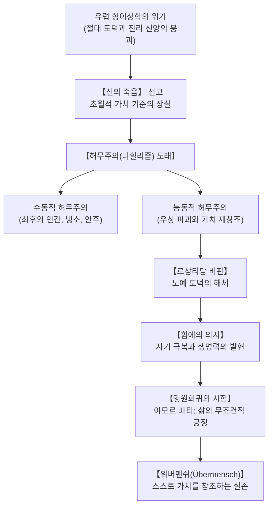

## 서론: 망치를 든 철학자와 서구 형이상학의 황혼

19세기 후반, 유럽 문명이 산업혁명의 기술적 성취와 기독교적 도덕주의의 안락함에 도취해 있을 때, 프리드리히 빌헬름 니체(Friedrich Wilhelm Nietzsche, 1844-1900)는 인류 정신사의 기반을 뒤흔드는 일격을 가했습니다.

스스로를 "다이너마이트"이자 "운명"이라 칭하며 "망치로 철학하겠다"고 선언한 니체는, 플라톤 이래 이천 년 넘게 서양 철학을 지배해 온 객관적 진리, 보편 도덕, 초월적 신앙의 허구성을 철저히 폭로했습니다. 고독, 포스트 진실, 기술적 불안이 팽배한 21세기 현대 사회에서 니체의 실존주의적 사유는 그 어느 때보다 날카로운 빛을 발하고 있습니다.

## 1. 생애와 사유의 궤적: 천재 문헌학자에서 방랑의 철학자로
1844년 프로이센 작센주의 뢰켄에서 루터교 목사의 아들로 태어난 니체는 어린 시절 아버지와 남동생을 연이어 여의는 비극 속에서 깊은 사색의 소년기를 보냈습니다. 명문 슐포르타에서 고전어의 정수를 체득한 그는 라이프치히 대학에서 두각을 나타내어 1869년 24세의 나이로 바젤 대학 고전문헌학 교수로 파격 임용되었습니다.

쇼펜하우어의 저작과 작곡가 리하르트 바그너와의 우정은 초기 대표작 《비극의 탄생》(1872)으로 결실을 맺었으나, 학계의 혹평과 바그너와의 결별, 극심한 만성 두통과 위장병으로 인해 1879년 교수직을 사임했습니다. 스위스 실스마리아와 이탈리아 각지를 떠도는 고독한 방랑 속에서 《인간적인 너무나 인간적인》, 《즐거운 학문》, 《차라투스트라는 이렇게 말했다》, 《도덕의 계보》를 집필했습니다. 1889년 토리노 광장에서 마부에게 채찍질당하는 말을 부둥켜안고 쓰러진 후 1900년 바이마르에서 생을 마감했습니다.

## 2. "신은 죽었다"와 허무주의의 본질
《즐거운 학문》 제125절에서 광인은 대낮에 등불을 들고 시장으로 달려가 외칩니다.
> "신은 어디로 갔는가? 우리가 그를 죽였다! 너희와 내가! 우리 모두가 그의 살해자다!"

신의 죽음은 단순한 무신론의 승리가 아니라, 인간 삶에 궁극적 의미와 질서를 부여하던 모든 초월적 기준의 붕괴를 뜻합니다.
- **수동적 허무주의**: 삶의 목표를 잃고 안락과 무사안일에 매몰되는 **'최후의 인간(der Letzte Mensch)'**의 탄생.
- **능동적 허무주의**: 낡은 가치의 붕괴를 직시하고 스스로 새로운 삶의 의미를 벼려내는 창조적 파괴.

## 3. 도덕의 계보학과 르상티망(Ressentiment)
《도덕의 계보》(1887)에서 니체는 도덕이 신성한 천계의 산물이 아님을 밝힙니다.
- **귀족 도덕 (좋음과 나쁨)**: 강건하고 탁월한 자들이 자신의 행위와 생명력을 무조건 긍정하며 '좋다(gut)'고 선언하고, 열등한 자들을 부차적으로 '나쁘다(schlecht)'고 규정함.
- **노예 도덕 (선과 악)**: 무력한 약자들의 원한과 복수심, 즉 **르상티망**에서 비롯됨. 강자를 먼저 '악(böse)'으로 규정한 뒤, 그 반대편에 있는 자신의 무력함, 인내, 복종을 도덕적 '선(gut)'으로 둔갑시킴.

## 4. 힘에의 의지(Wille zur Macht)와 원근법주의
생명의 본질은 단순한 생존 본능이 아니라, 끊임없이 자신의 한계를 돌파하고 저항을 극복하려는 **힘에의 의지**입니다. 니체가 말하는 힘은 야만적 폭력이 아니라, 혼돈된 내면의 충동을 예술과 숭고한 정신으로 승화시키는 자기 지배의 힘입니다. 인식론적으로는 절대적 사실이란 존재하지 않으며 오직 다양한 관점의 해석만이 존재한다는 **원근법주의**를 확립했습니다.

## 5. 영원회귀(Ewige Wiederkunft)와 아모르 파티(Amor fati)
실스마리아의 호숫가에서 번뜩인 영원회귀는 가장 무거운 짐입니다. 만약 당신이 살아온 고통과 환희의 모든 순간이 영원히 똑같이 무한 반복된다면, 당신은 그 운명을 저주할 것인가, 환호할 것인가?
이 극한의 시험을 통과하는 태도가 바로 **아모르 파티(운명애)**입니다. 지나간 삶의 단 한 순간도 다르게 되기를 바라지 않고, 필연적인 운명을 온전히 사랑하는 실존의 높이입니다.

## 6. 위버멘쉬(Übermensch)와 정신의 세 단계 변화
《차라투스트라》에서 인간은 동물과 위버멘쉬 사이에 걸쳐진 밧줄로 묘사됩니다.
1. **낙타 ("너는 마땅히 해야 한다")**: 규범과 의무의 무거운 짐을 지고 사막을 묵묵히 걷는 복종의 단계.
2. **사자 ("나는 원한다")**: 거대한 용(기존 도덕)을 타도하고 자유를 쟁취하는 파괴의 단계.
3. **아이 ("신성한 긍정")**: 순수한 망각, 놀이, 스스로 굴러가는 바퀴로서 새로운 가치를 자율적으로 창조하는 위버멘쉬의 궁극적 단계.

## 7. 21세기적 의의: 운명을 사랑하라
AI와 알고리즘의 시대, 고통을 회피하며 안락만을 좇는 현대인들에게 니체의 철학은 준엄한 경종을 울립니다. 외부의 구원에 기대지 않고, 망치를 들고 자신의 내면을 개척하며 이 유일무이한 삶을 "다시 한번, 영원히!" 긍정하는 용기야말로 니체가 남긴 불멸의 유산입니다.
