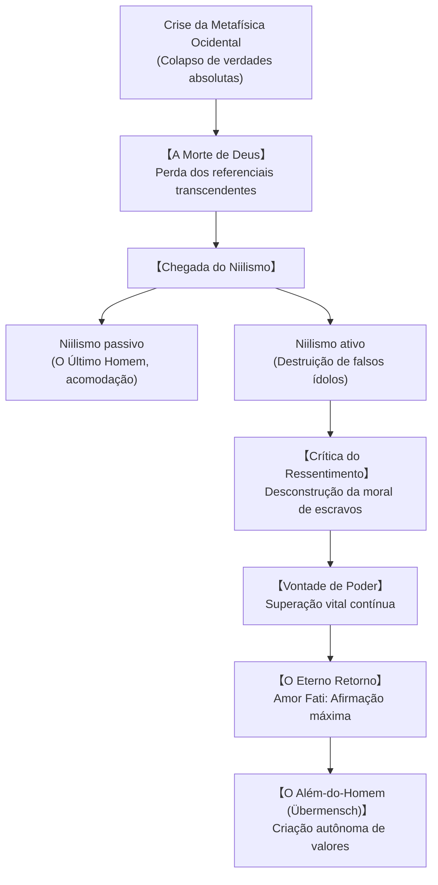

## Introdução: Filosofar com o Martelo

Friedrich Nietzsche (1844-1900) provocou uma reviravolta sem precedentes no pensamento ocidental. Declarando-se «dinamite», o filósofo alemão utilizou o martelo para auscultar os ídolos sagrados da metafísica platônico-cristã, revelando que os ideais universais de verdade e moralidade nasceram do ressentimento e da negação da vida.

## 1. O Trajeto Biográfico: Do Seminário ao Exílio Solitário
Filho de pastor luterano em Röcken, Nietzsche destacou-se precocemente em filologia clássica em Schulpforta e na Universidade de Leipzig. Aos 24 anos, tornou-se professor extraordinário na Universidade de Basileia. Fascinado por Schopenhauer e amigo íntimo de Richard Wagner, escreveu *O Nascimento da Tragédia* (1872).

Após romper com Wagner e devastado por cefaleias crônicas e distúrbios gástricos, abandonou a docência em 1879. Em refúgios alpinos e mediterrâneos (Sils-Maria, Gênova, Turim), redigiu obras-primas como *Aurora*, *A Gaia Ciência*, *Assim Falou Zaratustra* e *Genealogia da Moral*. Em janeiro de 1889, sofreu um colapso psíquico definitivo em Turim. Sua irmã manipulou postumamente seus cadernos, até que edições críticas modernas restauraram seu pensamento original.

## 2. «Deus está Morto» e as Facetas do Niilismo
Em *A Gaia Ciência* (§125), o homem louco brada na praça: «Deus está morto! E nós o matamos!»
A dissolução do transcendente impõe o **niilismo**:
- **Niilismo passivo**: Desânimo que gera o **«Último Homem»**, indivíduo medíocre da modernidade que busca apenas conforto mediano, evitando qualquer dor ou grandeza.
- **Niilismo ativo**: Potência vigorosa que demoliu os ídolos para dar lugar a uma nova afirmação da existência.

## 3. A Genealogia da Moral e o Ressentimento
Em *Genealogia da Moral* (1887), Nietzsche disseca as raízes psicológicas da ética:
- **Moral de senhores (Bom e Mau)**: Os nobres e fortes afirmam sua vitalidade como «boa»; os fracos são vistos como «maus» com condescendência.
- **Moral de escravos (Bom e Mal)**: Impulsionada pelo **ressentimento**. Incapazes de vingança concreta, os oprimidos rotulam o forte de «mau/maléfico» e transformam sua própria covardia em «bondade» virtuosa.

## 4. Vontade de Poder e Perspectivismo
A vida não é mera sobrevivência darwiniana, mas **Vontade de Poder (Wille zur Macht)**: impulso de expansão, superação e sublimação espiritual. No campo do conhecimento, vigora o **perspectivismo**: «Não há fatos, apenas interpretações».

## 5. O Eterno Retorno e o Amor Fati
O pensamento do **Eterno Retorno** desafia o indivíduo a aceitar que cada momento de sua vida se repetirá eternamente. Esse desafio culmina no **Amor Fati**: amar o próprio destino incondicionalmente, sem desejar apagar nada do passado.

## 6. O Além-do-Homem e as Três Metamorfoses
Em *Zaratustra*, o ser humano é uma corda sobre o abismo rumo ao **Além-do-Homem (Übermensch)**. As metamorfoses do espírito são:
1. **O Camelo («Tu deves»)**: Carrega resignado o peso dos deveres.
2. **O Leão («Eu quero»)**: Destrói os mandamentos sagrados para conquistar a liberdade negativa.
3. **A Criança («Um sagrado sim»)**: Inocência, recomeço, jogo e criação de novos valores.

## 7. Desafios Contemporâneos
Resgatado no pós-guerra por Deleuze, Foucault e Kaufmann, o pensamento nietzschiano ilumina as contradições do século XXI. Contra o escapismo tecnicista e a anestesia cultural, Nietzsche permanece como um brado de autoafirmação heroica da existência.
