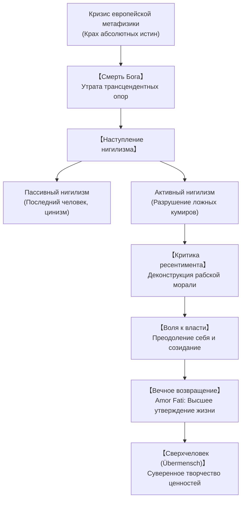

## Введение: Философия с молотом и сумерки кумиров

В конце XIX века Фридрих Вильгельм Ницше (1844–1900) нанес сокрушительный удар по основам европейской цивилизации. Назвав себя «динамитом» и объявив метод «философствования молотом», он разоблачил двухтысячелетнюю метафизическую традицию Платона и христианства как спасительную иллюзию, рожденную из страха перед хаосом и страданием жизни.

## 1. Жизненный путь: От профессорской кафедры к скитальчеству
Ницше родился в Рёккене в семье лютеранского пастора. Получив классическое образование в Шульпфорте и Лейпцигском университете, он в возрасте 24 лет без защиты диссертации стал экстраординарным профессором классической филологии в Базеле. 

Испытав влияние Шопенгауэра и Рихарда Вагнера, Ницше опубликовал трактат «Рождение трагедии из духа музыки» (1872). После разрыва с Вагнером и резкого ухудшения здоровья (невыносимые мигрени, потеря зрения) он оставил преподавание в 1879 году. Скитаясь по Швейцарии и Италии (Зильс-Мария, Генуя, Турин), он создал свои ключевые произведения: «Человеческое, слишком человеческое», «Веселая наука», «Так говорил Заратустра», «По ту сторону добра и зла» и «К генеалогии морали». Душевный коллапс в Турине в 1889 году оборвал его творчество.

## 2. «Бог умер» и природа нигилизма
В 125-м фрагменте «Веселой науки» безумец кричит на рыночной площади: «Бог умер! И мы убили его!»
Это означает утрату абсолютных трансцендентных ориентиров. Ницше различает:
- **Пассивный нигилизм**: Усталость духа, порождающая **«Последнего человека»**, который ищет лишь мелкого комфорта, безболезненного существования и потребительского покоя.
- **Активный нигилизм**: Мощная созидательная сила, уничтожающая ветхие идеалы ради утверждения новых смыслов.

## 3. Генеалогия морали и психология ресентимента
В труде «К генеалогии морали» (1887) Ницше показывает земные истоки этических норм:
- **Мораль господ (Хорошее и Дурное)**: Благородные люди утверждают свою силу и доблесть как «хорошее», снисходительно относясь к слабым как к «дурному».
- **Мораль рабов (Добро и Зло)**: Продукт **ресентимента** — затаенной злобы бессильных. Не имея возможности отомстить в реальности, они объявляют сильного «злым», а свою беспомощность и кротость — «добром».

## 4. Воля к власти и перспективизм
Подлинная сущность жизни — не дарвиновское выживание, а **Воля к власти (Wille zur Macht)**: стремление к росту, преодолению препятствий и сублимации страстей в культуру и искусство. В гносеологии Ницше провозглашает **перспективизм**: «Фактов нет, есть только интерпретации».

## 5. Вечное возвращение и Amor Fati
Мысль о **вечном возвращении того же самого** — абсолютное испытание: прожить каждую секунду своей жизни бесконечное число раз. Принятие этого круговорота рождает **Amor Fati** (любовь к судьбе) — способность безоговорочно любить жизнь во всей ее полноте и трагизме.

## 6. Сверхчеловек и три превращения духа
В «Заратустре» человек определяется как канат над пропастью между животным и **Сверхчеловеком (Übermensch)**. Три превращения духа:
1. **Верблюд («Ты должен»)**: Безропотно несет груз навязанных законов.
2. **Лев («Я хочу»)**: Сокрушает дракона моральных догм, завоевывая свободу.
3. **Ребенок («Священное Да»)**: Невинность, чистое творчество и радостная игра созидания.

## 7. Значение в XXI веке
Философия Ницше находит мощный отклик в эпоху искусственного интеллекта и цифрового отчуждения. Он предостерегает человечество от превращения в «последних людей» и призывает к суверенному утверждению духа перед лицом бесконечной бездны.
