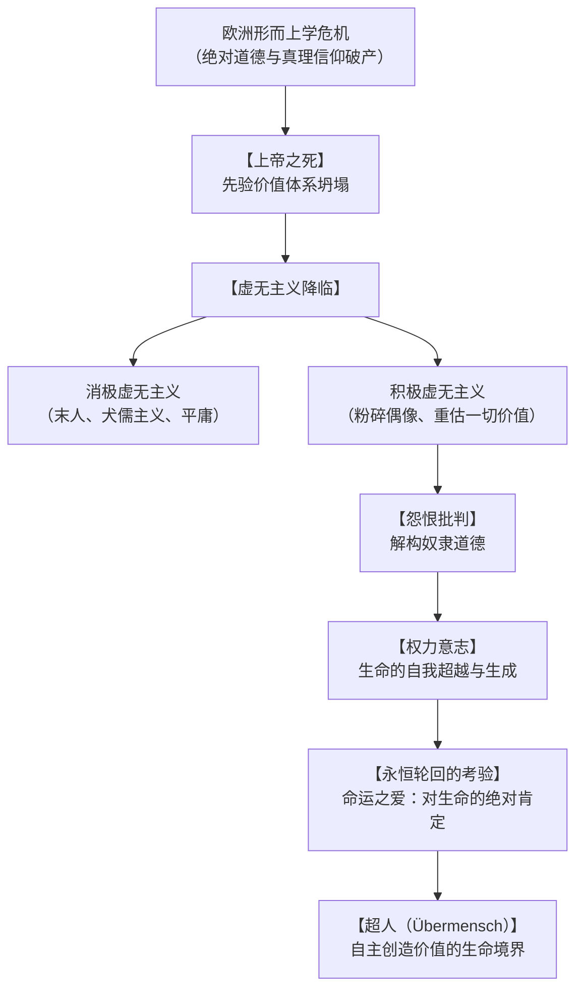

## 导论：重锤敲击下的西方形而上学黄昏

19世纪后半叶，在欧洲文明沉浸于工业革命的物质繁荣与基督教人道主义的道德自满之际，孤傲的思想家弗里德里希·威廉·尼采（Friedrich Wilhelm Nietzsche, 1844-1900）以哲学之锤，彻底击碎了西方思想的两千年基石。

自称“炸药”与“命运”的尼采，彻底拆解了源自柏拉图与基督教神学的客观真理、先验道德与终极目的论，指认其本质不过是人类面对生存苦难时虚构的心理慰藉。在数字异化、后真相时代以及超人类主义浪潮席卷全球的21世纪，尼采的存在主义批判展现出前所未有的思想穿透力。

## 第一章 思想家的生命轨迹：从神童学者到孤独浪客

### 1.1 普鲁士牧师家庭与古典语文学的天才
尼采于1844年10月15日出生于普鲁士萨克森省勒肯镇的虔诚路德派牧师家庭。四岁时敬爱的父亲病故，幼弟亦不幸夭折，使尼采童年笼罩在内省与静穆之中。在名校普福塔学院，尼采展现出对古希腊罗马文学的惊人禀赋。

在莱比锡大学导师里奇尔的极力推崇下，1869年年仅24岁的尼采在尚未提交正式博士论文的情况下，被破格聘为瑞士巴塞尔大学古典语文学副教授，震惊学术界。

### 1.2 叔本华的冲击与瓦格纳的挚友情仇
青年尼采在莱比锡偶读叔本华的《作为意志和表象的世界》，其揭示的非理性盲目“生存意志”使尼采摆脱了学院理性的平庸。

同时，尼采结识了著名作曲家理查德·瓦格纳。尼采在瓦格纳的综合艺术论中看到了希腊悲剧复兴的希望，并于1872年出版处女作《悲剧的诞生》。然而，该书跳脱传统语文学实证规范的大胆哲学直觉遭到正统学界的猛烈抨击，尼采的学院声誉一落千丈。

### 1.3 绝交、流亡与恩嘎丁高地的沉思
因瓦格纳在《帕西法尔》中迎合大众民族主义与基督教救赎，尼采与其彻底决裂。伴随长年剧烈偏头痛、胃痉挛和近乎失明的重度眼疾，尼采于1879年辞去巴塞尔教职，成为隐遁于阿尔卑斯山席尔斯·玛利亚与地中海沿岸（热那亚、尼斯、都灵）的孤独旅人。

在极端肉体煎熬与绝对孤寂中，尼采爆发了人类思想史上罕见的创作力，写就了《人性的，太人性的》、《朝霞》、《快乐的科学》、《查拉图斯特拉如是说》、《善恶的彼岸》、《道德的谱系》及《偶像的黄昏》。1889年1月，尼采在都灵卡洛·阿尔贝托广场抱住受鞭笞的老马痛哭，精神彻底崩溃，直至1900年逝世。其妹伊丽莎白对遗稿的篡改导致了20世纪法西斯主义对尼采的严重误读。

## 第二章 “上帝之死”与虚无主义的深渊

### 2.1 疯子的呐喊
在《快乐的科学》第125节中，疯子在光天化日之下提灯奔向集市高呼：“我寻找上帝！”面对无神论市民的嘲笑，疯子直言：
> “上帝到哪里去了？让我告诉你们！我们杀了他——你们和我！我们大家都是谋杀他的凶手！……当天文地平线被擦去，当大地脱离太阳的锁链，我们正向何处坠落？难道我们不是在无尽的虚无中彷徨吗？”

“上帝之死”绝非简单的无神论宣告，而是指支撑西方文明两千年的所有超越性终极标准（理念、天国、普遍理性、历史进步）的自我解体。

### 2.2 积极虚无主义与消极虚无主义
- **消极虚无主义**：面对意义丧失而陷入虚脱，屈从于安逸平庸，演化为尼采笔下的**“末人（der Letzte Mensch）”**——他们缺乏崇高激情，追求微小的快乐与绝对的安全，在麻木中眨着眼自称发现了幸福。
- **积极虚无主义**：欢呼虚假最高价值的崩溃，主动挥舞铁锤砸碎旧偶像，在绝对的虚空中自主确立崭新的生命价值。

## 第三章 道德的谱系与怨恨的机制

在《道德的谱系》（1887）中，尼采指出传统善恶观念绝非天启，而是历史与权力角逐的产物：
- **主人道德（好与坏）**：身体强健、充满统治力量的贵族阶层，首先无条件肯定自身的卓越、开朗与勇气为“好（gut）”；随后才轻蔑地将卑微软弱者区分为“坏（schlecht）”。
- **奴隶道德（善与恶）**：源自无法反抗的被压迫阶层的**“怨恨（ressentiment）”**。他们无法在行动中复仇，便在精神上进行价值颠倒：首先将强大的主人判定为“恶（böse）”，继而将自身的软弱、顺从与隐忍美化为“善（gut）”。

## 第四章 权力意志与透视主义

尼采超越了叔本华消极的“生存意志”，提出**权力意志（Der Wille zur Macht）**：
> “生命本身就是权力意志；自我保存不过是生命扩张过程中的副产品。”

尼采所言的权力意志并非野蛮的物理暴力，而是对自我的克服、精神的升华与艺术的创造。在认识论层面，尼采创立了**透视主义（Perspektivismus）**：“没有客观事实，只有视角的解释。”

## 第五章 永恒轮回与命运之爱

1881年夏，在席尔斯·玛利亚湖畔的金字塔巨石旁，尼采悟出了**永恒轮回（Ewige Wiederkunft）**的思想：
如果某个恶魔告诉你，你所经历的一切苦难与欢愉都将以完全相同的顺序无限次回放，你是否会咒骂恶魔，还是将其视为神圣的恩赐？
这一沉重的思想实验打破了一切来世救赎，促使人类转向**命运之爱（Amor fati）**：不仅坦然忍受必然发生的一切，更发自内心地热爱自己的命运，以无条件的勇气肯定每一个刹那。

## 第六章 超人与精神的三段蜕变

在《查拉图斯特拉如是说》中，尼采宣告“人是架在动物与超人之间的一根绳索”。精神通向**超人（Übermensch）**必须经历三次蜕变：
1. **骆驼（“你应当”）**：顺从地背负传统道德与戒律的重担在荒漠前行。
2. **狮子（“我渴望”）**：向盘踞在沙漠中的黄金巨龙发起挑战，夺取否定旧戒律的自由。
3. **婴儿（“神圣的肯定”）**：天真、遗忘、自转的轮子，在纯真的创造中确立生命的新价值。

## 结语：以锤为器，爱汝命运
弗里德里希·尼采留给人类的绝非廉价的慰藉，而是在神圣坐标坍塌之后直面深渊的豪情。面对21世纪技术扩张与价值迷茫，尼采的呼声依旧震耳欲聋：砸碎内心的偶像，以赤诚的生命力迎向永恒的宇宙风暴。
