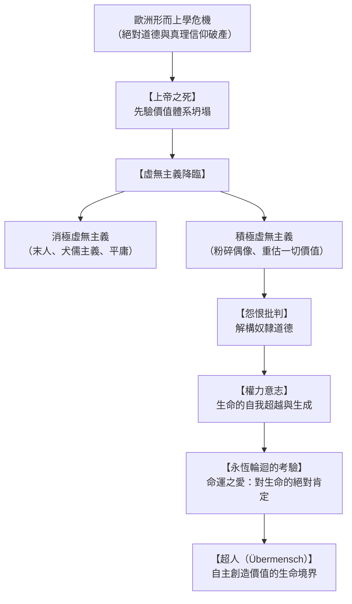

## 導論：重槌敲擊下的西方形而上學黃昏

19世紀後半葉，在歐洲文明沉浸於工業革命的物質繁榮與基督教人道主義的道德自滿之際，孤傲的思想家弗里德里希·威廉·尼采（Friedrich Wilhelm Nietzsche, 1844-1900）以哲學之槌，徹底擊碎了西方思想的兩千年基石。

自稱「炸藥」與「命運」的尼采，徹底拆解了源自柏拉圖與基督教神學的客觀真理、先驗道德與終極目的論，指認其本質不過是人類面對生存苦難時虛構的心理慰藉。在數位異化、後真相時代以及超人類主義浪潮席捲全球的21世紀，尼采的存在主義批判展現出前所未有的思想穿透力。

## 第一章 思想家的生命軌跡：從神童學者到孤獨浪客

### 1.1 普魯士牧師家庭與古典語言學的天才
尼采於1844年10月15日出生於普魯士薩克森省勒肯鎮的虔誠路德派牧師家庭。四歲時敬愛的父親病故，幼弟亦不幸夭折，使尼采童年籠罩在內省與靜穆之中。在名校普福塔學院，尼采展現出對古希臘羅馬文學的驚人稟賦。

在萊比錫大學導師里奇爾的極力推崇下，1869年年僅24歲的尼采在尚未提交正式博士論文的情況下，被破格聘為瑞士巴塞爾大學古典語言學副教授，震驚學術界。

### 1.2 叔本華的衝擊與華格納的摯友情仇
青年尼采在萊比錫偶讀叔本華的《作為意志和表象的世界》，其揭示的非理性盲目「生存意志」使尼采擺脫了學院理性的平庸。

同時，尼采結識了著名作曲家理查·華格納。尼采在華格納的綜合藝術論中看到了希臘悲劇復興的希望，並於1872年出版處女作《悲劇的誕生》。然而，該書跳脫傳統語言學實證規範的大膽哲學直覺遭到正統學界的猛烈抨擊，尼采的學院聲譽一落千丈。

### 1.3 絕交、流亡與恩嘎丁高地的沉思
因華格納在《帕西法爾》中迎合大眾民族主義與基督教救贖，尼采與其徹底決裂。伴隨長年劇烈偏頭痛、胃痙攣和近乎失明的重度眼疾，尼采於1879年辭去巴塞爾教職，成為隱遁於阿爾卑斯山席爾斯·瑪利亞與地中海沿岸（熱那亞、尼斯、杜林）的孤獨旅人。

在極端肉體煎熬與絕對孤寂中，尼采爆發了人類思想史上罕見的創作力，寫就了《人性的，太人性的》、《朝霞》、《快樂的科學》、《查拉圖斯特拉如是說》、《善惡的彼岸》、《道德的譜系》及《偶像的黃昏》。1889年1月，尼采在杜林卡洛·阿爾貝托廣場抱住受鞭笞的老馬痛哭，精神徹底崩潰，直至1900年逝世。其妹伊麗莎白對遺稿的篡改導致了20世紀法西斯主義對尼采的嚴重誤讀。

## 第二章 「上帝之死」與虛無主義的深淵

### 2.1 瘋子的吶喊
在《快樂的科學》第125節中，瘋子在光天化日之下提燈奔向集市高呼：「我尋找上帝！」面對無神論市民的嘲笑，瘋子直言：
> 「上帝到哪裡去了？讓我告訴你們！我們殺了他——你們和我！我們大家都是謀殺他的兇手！……當天文地平線被擦去，當大地脫離太陽的鎖鏈，我們正向何處墜落？難道我們不是在無盡的虛無中徬徨嗎？」

「上帝之死」絕非簡單的無神論宣告，而是指支撐西方文明兩千年的所有超越性終極標準（理念、天國、普遍理性、歷史進步）的自我解體。

### 2.2 積極虛無主義與消極虛無主義
- **消極虛無主義**：面對意義喪失而陷入虛脫，屈從於安逸平庸，演化為尼采筆下的**「末人（der Letzte Mensch）」**——他們缺乏崇高激情，追求微小的快樂與絕對的安全，在麻木中眨著眼自稱發現了幸福。
- **積極虛無主義**：歡呼虛假最高價值的崩潰，主動揮舞鐵槌砸碎舊偶像，在絕對的虛空中自主確立嶄新的生命價值。

## 第三章 道德的譜系與怨恨的機制

在《道德的譜系》（1887）中，尼采指出傳統善惡觀念絕非天啟，而是歷史與權力角逐的產物：
- **主人道德（好與壞）**：身體強健、充滿統治力量的貴族階層，首先無條件肯定自身的卓越、開朗與勇氣為「好（gut）」；隨後才輕蔑地將卑微軟弱者區分為「壞（schlecht）」。
- **奴隸道德（善與惡）**：源自無法反抗的被壓迫階層的**「怨恨（ressentiment）」**。他們無法在行動中復仇，便在精神上進行價值顛倒：首先將強大的主人判定為「惡（böse）」，繼而將自身的軟弱、順從與隱忍美化為「善（gut）」。

## 第四章 權力意志與透視主義

尼采超越了叔本華消極的「生存意志」，提出**權力意志（Der Wille zur Macht）**：
> 「生命本身就是權力意志；自我保存不過是生命擴張過程中的副產品。」

尼采所言的權力意志並非野蠻的物理暴力，而是對自我的克服、精神的昇華與藝術的創造。在認識論層面，尼采創立了**透視主義（Perspektivismus）**：「沒有客觀事實，只有視角的解釋。」

## 第五章 永恆輪迴與命運之愛

1881年夏，在席爾斯·瑪利亞湖畔的金字塔巨石旁，尼采悟出了**永恆輪迴（Ewige Wiederkunft）**的思想：
如果某個惡魔告訴你，你所經歷的一切苦難與歡愉都將以完全相同的順序無限次回放，你是否會咒罵惡魔，還是將其視為神聖的恩賜？
這一沉重的思想實驗打破了一切來世救贖，促使人類轉向**命運之愛（Amor fati）**：不僅坦然忍受必然發生的一切，更發自內心地熱愛自己的命運，以無條件的勇氣肯定每一個剎那。

## 第六章 超人與精神的三段蛻變

在《查拉圖斯特拉如是說》中，尼采宣告「人是架在動物與超人之間的一根繩索」。精神通向**超人（Übermensch）**必須經歷三次蛻變：
1. **駱駝（「你應當」）**：順從地背負傳統道德與戒律的重擔在荒漠前行。
2. **獅子（「我渴望」）**：向盤踞在沙漠中的黃金巨龍發起挑戰，奪取否定舊戒律的自由。
3. **嬰兒（「神聖的肯定」）**：天真、遺忘、自轉的輪子，在純真的創造中確立生命的新價值。

## 結語：以槌為器，愛汝命運
弗里德里希·尼采留給人類的絕非廉價的慰藉，而是在神聖座標坍塌之後直面深淵的豪情。面對21世紀技術擴張與價值迷惘，尼采的呼聲依舊震耳欲聾：砸碎內心的偶像，以赤誠的生命力迎向永恆的宇宙風暴。
