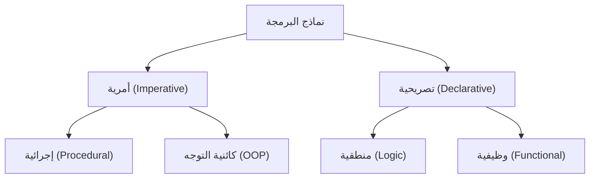
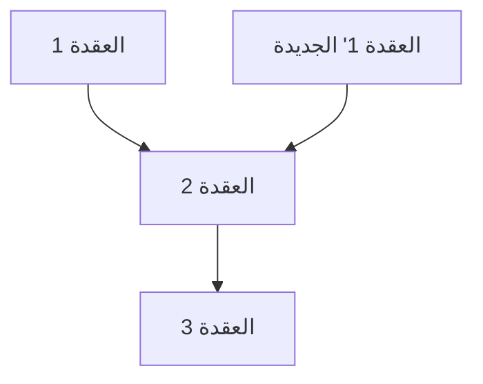

# 1. مقدمة: نقلة نوعية في البرمجة الوظيفية

في تطوير البرمجيات الحديثة، لم تعد **البرمجة الوظيفية (Functional Programming, FP)** مجرد مجال أكاديمي، بل أصبحت معترف بها على نطاق واسع كنموذج عملي.
مقارنة بالبرمجة الأمرية والبرمجة كائنية التوجه التي كانت سائدة تاريخياً، تتخذ البرمجة الوظيفية نهجاً مختلفاً جذرياً يتمثل في "التعامل مع الحسابات كتقييم للدوال الرياضية وتجنب تغيير الحالة والبيانات القابلة للتغيير".

في هذا المقال، سنشرح بشكل مفصل ومنهجي للغاية المفاهيم الأساسية للبرمجة الوظيفية مثل الدوال النقية والثبات، وصولاً إلى المفهوم المتقدم "الموناد" الذي يتعثر فيه الكثير من المتعلمين.

## 1.1 تصنيف نماذج البرمجة



## 1.2 حساب اللامدا: الأساس الرياضي

الأساس النظري للبرمجة الوظيفية يكمن في **حساب اللامدا (Lambda Calculus)** الذي ابتكره ألونزو تشيرش وآخرون في ثلاثينيات القرن العشرين.
يتمتع هذا النموذج الحسابي، الذي يعتمد على تطبيق الدوال وربط المتغيرات، بقدرة حسابية تعادل آلة تورنغ.

رياضياً، يتم تعريف تعبير اللامدا على النحو التالي:

$$
E ::= x \mid \lambda x. E \mid E_1 E_2
$$

هنا، $x$ يمثل متغيراً، $\lambda x. E$ تمثل تجريداً (تعريف دالة)، و $E_1 E_2$ تمثل تطبيق دالة.

# 2. الدوال النقية (Pure Functions)

المفهوم الأهم والذي يشكل جوهر البرمجة الوظيفية هو **الدالة النقية**.

## 2.1 تعريف الدالة النقية

يُقال إن الدالة "نقية" إذا كانت تستوفي الشرطين التاليين في نفس الوقت:

1. **الشفافية المرجعية (Referential Transparency)** : إرجاع نفس المخرجات دائماً لنفس المدخلات. هذا يعني أن نتيجة الدالة لا تعتمد على الحالة المحلية، أو الحالة العامة، أو الإدخال/الإخراج (I/O)، وما إلى ذلك.
2. **غياب الآثار الجانبية (No Side Effects)** : عدم تغيير أي حالة في النظام نتيجة تنفيذ الدالة. تشمل الآثار الجانبية تعديل المتغيرات العامة، الكتابة في الملفات، تحديث قواعد البيانات، أو الإخراج إلى وحدة التحكم (Console).

### مثال على دالة نقية

```javascript
// دالة نقية
function add(a, b) {
    return a + b;
}
```

### مثال على دالة غير نقية

```javascript
let total = 0;
// دالة غير نقية (الاعتماد على حالة خارجية وتعديلها)
function addToTotal(a) {
    total += a;
    return total;
}
```

## 2.2 مزايا الدوال النقية

تتمتع الدوال النقية بمزايا قوية مثل:

- **سهولة الاختبار** : لا حاجة لإعداد حالات خارجية، فالاختبار يكتمل فقط باستخدام أزواج المدخلات والمخرجات.
- **أمان المعالجة المتزامنة** : نظراً لعدم مشاركة وتغيير الحالة، لا تحدث حالات التسابق (Race Condition) في البيئات متعددة الخيوط (Multithreaded).
- **الخزْن المؤقت (Memoization)** : لأنها ترجع دائماً نفس المخرجات لنفس المدخلات، يمكن تخزين النتائج مؤقتاً لتحسين الأداء.

# 3. الثبات (Immutability)

الثبات هو الخاصية التي تنص على أن هيكل البيانات أو الحالة لا تتغير أبداً بعد إنشائها.

## 3.1 تجنب تغيير الحالة

في البرمجة الأمرية، تتقدم العمليات الحسابية من خلال تحديث قيم المتغيرات، ولكن في البرمجة الوظيفية، بدلاً من تعديل البيانات الموجودة، يتم اتباع نهج **إنشاء بيانات جديدة وإرجاعها**.

```python
# نهج أمري (تغيير مدمر)
numbers = [1, 2, 3]
numbers.append(4)

# نهج وظيفي (غير مدمر)
numbers1 = [1, 2, 3]
numbers2 = numbers1 + [4]
```

## 3.2 هياكل البيانات المستدامة

قد يبدو نسخ بيانات جديدة في كل مرة للحفاظ على الثبات غير فعال. ومع ذلك، تستخدم العديد من اللغات الوظيفية **هياكل البيانات المستدامة (Persistent Data Structures)** لتحسين كفاءة الذاكرة وسرعة التنفيذ عن طريق مشاركة جزء من هيكل البيانات قبل وبعد التغيير.



بهذه الطريقة، تعيد القائمة الجديدة استخدام العقد الحالية.

# 4. مفهوم الموناد (Monads)

أكبر عقبة عند تعلم البرمجة الوظيفية هي **الموناد (Monad)**.

## 4.1 ما هو الموناد؟

ببساطة، الموناد هو "نمط تصميم يغلف سياق (Context) العملية الحسابية". يُستخدم في لغات البرمجة الوظيفية النقية للتعامل مع الآثار الجانبية (مثل الإدخال/الإخراج، تغيير الحالة، معالجة الاستثناءات، إلخ) بطريقة آمنة ونقية.

في نظرية الفئات (Category Theory)، يُعرَّف الموناد على أنه مونويد (Monoid) في فئة الموثقات الذاتية (Endofunctors):

$$
\text{موناد}(M) = \langle M, \eta, \mu \rangle
$$

في سياق البرمجة، يتم التعبير عن الموناد كفئة نوع (Type Class) تحتوي على العناصر الثلاثة التالية:

1. **منشئ النوع (Type Constructor)** : يغلف أي نوع $a$ في سياق $M\ a$
2. **return (أو pure)** : دالة تغلف القيمة في سياق الموناد (النوع: $a \to M\ a$)
3. **bind (أو >>=, flatMap)** : دالة تستخرج القيمة من الموناد، وتمررها إلى الدالة التالية، وتعيد النتيجة كموناد مرة أخرى (النوع: $M\ a \to (a \to M\ b) \to M\ b$)

## 4.2 موناد Maybe

أوضح مثال على الموناد هو موناد Maybe (أو Option). وهو يعبر عن سياق "قد لا تكون القيمة موجودة".

```haskell
data Maybe a = Just a | Nothing
```

باستخدام موناد Maybe، يمكن كتابة سلسلة عمليات التحقق من الأخطاء بشكل موجز.

## 4.3 قوانين الموناد

لكي يتصرف كـ موناد، يجب أن يفي بالقوانين الثلاثة التالية (قوانين الموناد).

1. **العنصر المحايد الأيسر (Left Identity)** : return a >>= f $\equiv$ f a
2. **العنصر المحايد الأيمن (Right Identity)** : m >>= return $\equiv$ m
3. **قانون التجميع (Associativity)** : (m >>= f) >>= g $\equiv$ m >>= (\x -> f x >>= g)

# 5. مزايا البرمجة الوظيفية والآفاق المستقبلية

بفضل أسلوبها التصريحي وأساسها الرياضي القوي، تتيح البرمجة الوظيفية بناء برمجيات بأخطاء أقل، سهلة الاختبار، وقابلة للتطوير بدرجة كبيرة.

- **النمطية (Modularity)** : من خلال تجميع الدوال النقية، يمكن إنشاء مكونات قابلة لإعادة الاستخدام.
- **سهولة تصحيح الأخطاء (Debugging)** : تقل الحاجة إلى تتبع التغييرات في الحالة.

## الخاتمة

قد تبدو مفاهيم البرمجة الوظيفية مثل الدوال النقية، الثبات، والموناد معقدة في البداية. ومع ذلك، من خلال فهم هذه المفاهيم وممارستها، ستتمكن من كتابة أكواد أكثر متانة وقابلية للصيانة. في تطوير الأنظمة المعقدة الحديثة، ستزداد أهمية البرمجة الوظيفية بشكل أكبر في المستقبل.
