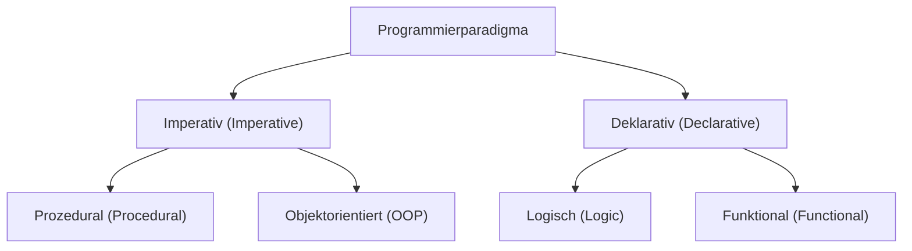
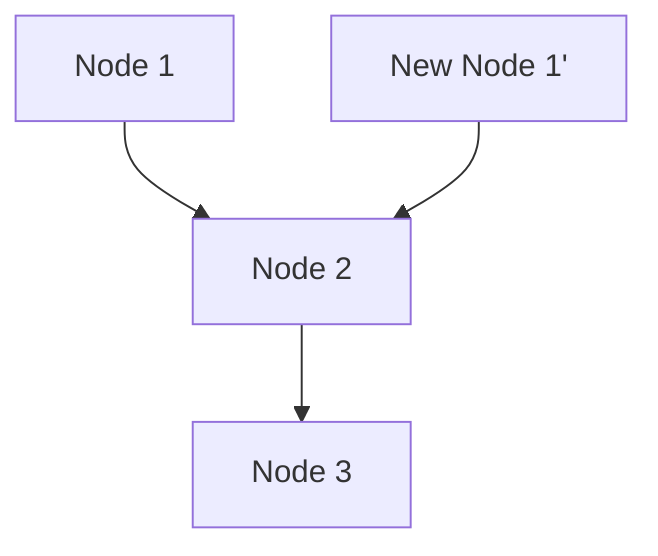

# 1. Einführung: Der Paradigmenwechsel der funktionalen Programmierung

In der modernen Softwareentwicklung ist die **funktionale Programmierung (Functional Programming, FP)** nicht mehr nur ein akademisches Feld, sondern weithin als praktisches Paradigma anerkannt.
Im Vergleich zur historisch dominanten imperativen und objektorientierten Programmierung verfolgt die funktionale Programmierung einen grundlegend anderen Ansatz: „Berechnungen werden als Auswertung mathematischer Funktionen betrachtet, wobei Zustandsänderungen und veränderbare Daten vermieden werden“.

Dieser Artikel bietet eine sehr detaillierte und systematische Erklärung der Grundlagen der funktionalen Programmierung, von Konzepten wie reinen Funktionen und Unveränderlichkeit bis hin zur fortgeschrittenen Idee der „Monade“, an der viele Lernende scheitern.

## 1.1 Klassifizierung von Programmierparadigmen



## 1.2 Lambda-Kalkül: Mathematische Grundlagen

Die theoretische Grundlage der funktionalen Programmierung ist das **Lambda-Kalkül (Lambda Calculus)**, das in den 1930er Jahren von Alonzo Church und anderen entwickelt wurde.
Dieses Berechnungsmodell, das auf Funktionsanwendung und Variablenbindung basiert, hat die gleiche Rechenleistung wie eine Turingmaschine.

Mathematisch wird ein Lambda-Ausdruck wie folgt definiert:


$$
E ::= x \mid \lambda x. E \mid E_1 E_2
$$


Hierbei steht $x$ für eine Variable, $\lambda x. E$ für eine Abstraktion (Funktionsdefinition) und $E_1 E_2$ für eine Funktionsanwendung.

# 2. Reine Funktionen (Pure Functions)

Das wichtigste Konzept, das den Kern der funktionalen Programmierung bildet, ist die **reine Funktion**.

## 2.1 Definition einer reinen Funktion

Eine Funktion gilt als „rein“, wenn sie gleichzeitig die folgenden zwei Bedingungen erfüllt:

1.  **Referenzielle Transparenz (Referential Transparency)** : Für dieselbe Eingabe wird immer genau dieselbe Ausgabe zurückgegeben. Dies bedeutet, dass das Ergebnis der Funktion nicht von lokalen Zuständen, globalen Zuständen, I/O usw. abhängt.
2.  **Fehlen von Seiteneffekten (No Side Effects)** : Die Ausführung der Funktion ändert keinen Zustand des Systems. Das Überschreiben globaler Variablen, das Schreiben in Dateien, das Aktualisieren einer Datenbank, die Ausgabe auf der Konsole usw. gelten als Seiteneffekte.

### Beispiel für eine reine Funktion

```javascript
// Reine Funktion
function add(a, b) {
    return a + b;
}
```

### Beispiel für eine unreine Funktion

```javascript
let total = 0;
// Unreine Funktion (Abhängigkeit von und Änderung eines externen Zustands)
function addToTotal(a) {
    total += a;
    return total;
}
```

## 2.2 Vorteile reiner Funktionen

Reine Funktionen bieten die folgenden starken Vorteile:

-   **Testbarkeit** : Es ist nicht erforderlich, externe Zustände einzurichten, und Tests können nur mit Eingabe-Ausgabe-Paaren abgeschlossen werden.
-   **Sicherheit bei Nebenläufigkeit** : Da keine Zustände geteilt oder geändert werden, treten in Multithreading-Umgebungen keine Race Conditions auf.
-   **Memoisation (Memoization)** : Da bei derselben Eingabe immer dieselbe Ausgabe zurückgegeben wird, können Ergebnisse zwischengespeichert werden, um die Leistung zu optimieren.

# 3. Unveränderlichkeit (Immutability)

Unveränderlichkeit ist die Eigenschaft, dass eine einmal erstellte Datenstruktur oder ein Zustand danach niemals geändert wird.

## 3.1 Vermeidung von Zustandsänderungen

In der imperativen Programmierung erfolgt die Berechnung durch Aktualisierung der Werte von Variablen. In der funktionalen Programmierung wird jedoch der Ansatz verfolgt, anstelle der Änderung vorhandener Daten **neue Daten zu erstellen und zurückzugeben**.

```python
# Imperativer Ansatz (destruktive Änderung)
numbers = [1, 2, 3]
numbers.append(4)

# Funktionaler Ansatz (nicht-destruktiv)
numbers1 = [1, 2, 3]
numbers2 = numbers1 + [4]
```

## 3.2 Persistente Datenstrukturen

Es mag ineffizient erscheinen, jedes Mal neue Daten zu kopieren, während die Unveränderlichkeit beibehalten wird. Viele funktionale Sprachen verwenden jedoch **persistente Datenstrukturen (Persistent Data Structures)**, um die Speichereffizienz und Ausführungsgeschwindigkeit zu optimieren, indem Teile der Datenstruktur vor und nach der Änderung geteilt werden.



Auf diese Weise verwendet die neue Liste die vorhandenen Knoten wieder.

# 4. Das Konzept der Monaden (Monads)

Die größte Hürde beim Erlernen der funktionalen Programmierung ist oft die **Monade (Monad)**.

## 4.1 Was ist eine Monade?

Einfach ausgedrückt ist eine Monade ein „Entwurfsmuster, das den Kontext (Context) einer Berechnung kapselt“. In rein funktionalen Sprachen wird es verwendet, um Seiteneffekte (I/O, Zustandsänderungen, Ausnahmebehandlung usw.) auf sichere und reine Weise zu behandeln.

In der Kategorientheorie (Category Theory) wird eine Monade als Monoid in der Kategorie der Endofunktoren definiert:


\text{Monade}(M) = \langle M, \eta, \mu \rangle


Im Kontext der Programmierung wird eine Monade als Typklasse ausgedrückt, die die folgenden drei Elemente aufweist:

1.  **Typkonstruktor** : Umhüllt einen beliebigen Typ $a$ in einen Kontext $M\ a$.
2.  **return (oder pure)** : Eine Funktion, die einen Wert in den Kontext einer Monade hüllt (Typ: $a \to M\ a$).
3.  **bind (oder >>=, flatMap)** : Eine Funktion, die einen Wert aus einer Monade extrahiert, ihn an die nächste Funktion übergibt und das Ergebnis wieder als Monade zurückgibt (Typ: $M\ a \to (a \to M\ b) \to M\ b$).

## 4.2 Maybe-Monade

Das am leichtesten verständliche Beispiel für eine Monade ist die Maybe- (oder Option-) Monade. Sie drückt den Kontext aus, dass „ein Wert möglicherweise nicht existiert“.

```haskell
data Maybe a = Just a | Nothing
```

Durch die Verwendung der Maybe-Monade können Ketten von Fehlerprüfungen prägnant geschrieben werden.

## 4.3 Monadengesetze

Um als Monade zu fungieren, müssen die folgenden drei Regeln (Monadengesetze) erfüllt sein:

1.  **Linkes neutrales Element** : return a >>= f $\equiv$ f a
2.  **Rechtes neutrales Element** : m >>= return $\equiv$ m
3.  **Assoziativgesetz** : (m >>= f) >>= g $\equiv$ m >>= (\x -> f x >>= g)

# 5. Vorteile der funktionalen Programmierung und Zukunftsaussichten

Die funktionale Programmierung ermöglicht durch ihren deklarativen Stil und ihre starke mathematische Grundlage den Aufbau von Software, die weniger Fehler aufweist, leichter zu testen und hoch skalierbar ist.

-   **Modularität** : Durch die Kombination reiner Funktionen können wiederverwendbare Komponenten erstellt werden.
-   **Einfacheres Debugging** : Die Notwendigkeit, Zustandsänderungen zu verfolgen, wird reduziert.

## Fazit

Konzepte der funktionalen Programmierung wie reine Funktionen, Unveränderlichkeit und Monaden mögen zunächst entmutigend erscheinen. Durch das Verständnis und die Anwendung dieser Konzepte wird es jedoch möglich, robusteren und besser wartbaren Code zu schreiben. Bei der Entwicklung moderner komplexer Systeme wird die Bedeutung der funktionalen Programmierung in Zukunft voraussichtlich noch weiter zunehmen.
