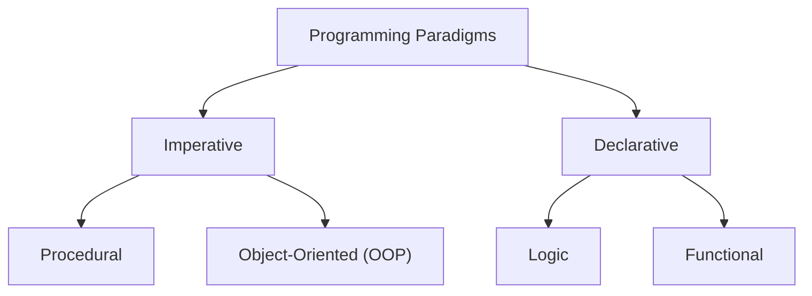
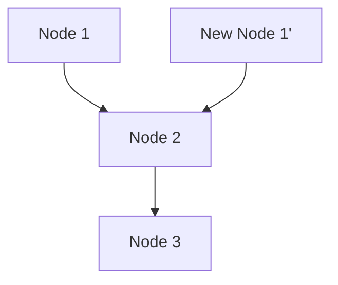

# 1. Introduction: The Paradigm Shift of Functional Programming

In modern software development, **Functional Programming (FP)** is no longer confined to the academic realm but is widely recognized as a practical paradigm.
Compared to historically mainstream imperative and object-oriented programming, functional programming takes a fundamentally different approach of "treating computation as the evaluation of mathematical functions and avoiding state changes and mutable data."

In this article, we will thoroughly and systematically explain everything from the fundamental concepts of functional programming, such as pure functions and immutability, to the advanced concept of "monads," which many learners stumble upon.

## 1.1 Classification of Programming Paradigms



## 1.2 Lambda Calculus: Mathematical Foundations

The theoretical foundation of functional programming lies in **Lambda Calculus**, devised by Alonzo Church and others in the 1930s.
This computational model, based on function application and variable binding, has computational power equivalent to a Turing machine.

Mathematically, a lambda expression is defined as follows:


$$
E ::= x \mid \lambda x. E \mid E_1 E_2
$$


Here, $x$ represents a variable, $\lambda x. E$ represents abstraction (function definition), and $E_1 E_2$ represents function application.

# 2. Pure Functions

The most important concept at the core of functional programming is **pure functions**.

## 2.1 Definition of Pure Functions

A function is considered "pure" when it simultaneously satisfies the following two conditions:

1.  **Referential Transparency** : Always returning the exact same output for the same input. It means the result of the function does not depend on local state, global state, I/O, etc.
2.  **No Side Effects** : Executing the function does not modify any state of the system. Overwriting global variables, writing to files, updating databases, outputting to the console, etc., fall under side effects.

### Example of a Pure Function

```javascript
// Pure function
function add(a, b) {
    return a + b;
}
```

### Example of an Impure Function

```javascript
let total = 0;
// Impure function (dependence on and modification of external state)
function addToTotal(a) {
    total += a;
    return total;
}
```

## 2.2 Benefits of Pure Functions

Pure functions have the following powerful benefits:

-   **Testability** : There is no need to set up external state, and testing is completed solely with input-output pairs.
-   **Concurrency Safety** : Since state is not shared or modified, race conditions do not occur in multi-threaded environments.
-   **Memoization** : Because they always return the same output for the same input, results can be cached to optimize performance.

# 3. Immutability

Immutability is the property that once a data structure or state is created, it is never subsequently modified.

## 3.1 Avoiding State Mutation

In imperative programming, computation proceeds by updating the values of variables, but in functional programming, it takes the approach of **creating and returning new data** instead of modifying existing data.

```python
# Imperative approach (destructive modification)
numbers = [1, 2, 3]
numbers.append(4)

# Functional approach (non-destructive)
numbers1 = [1, 2, 3]
numbers2 = numbers1 + [4]
```

## 3.2 Persistent Data Structures

It might seem inefficient to copy new data every time while maintaining immutability. However, many functional languages optimize memory efficiency and execution speed by using **Persistent Data Structures**, which share parts of the data structure before and after modification.



In this way, the new list reuses existing nodes.

# 4. The Concept of Monads

When learning functional programming, **Monad** is considered the biggest wall.

## 4.1 What is a Monad?

Simply put, a monad is a "design pattern that encapsulates the context of a computation." In pure functional languages, they are used to handle side effects (I/O, state changes, exception handling, etc.) safely and in a pure manner.

In Category Theory, a monad is defined as a monoid in the category of endofunctors:


\text{Monad}(M) = \langle M, \eta, \mu \rangle


In the context of programming, a monad is expressed as a type class with the following three elements:

1.  **Type Constructor** : Wraps an arbitrary type $a$ into a context $M\ a$
2.  **return (or pure)** : A function that wraps a value into a monadic context (Type: $a \to M\ a$)
3.  **bind (or >>=, flatMap)** : A function that extracts a monad's value, passes it to the next function, and returns the result again as a monad (Type: $M\ a \to (a \to M\ b) \to M\ b$)

## 4.2 The Maybe Monad

The most understandable example of a monad is the Maybe (or Option) monad. This represents the context that "a value might not exist".

```haskell
data Maybe a = Just a | Nothing
```

By using the Maybe monad, a chain of error checks can be written concisely.

## 4.3 Monad Laws

To behave as a monad, it must satisfy the following three rules (monad laws).

1.  **Left Identity** : return a >>= f $\equiv$ f a
2.  **Right Identity** : m >>= return $\equiv$ m
3.  **Associativity** : (m >>= f) >>= g $\equiv$ m >>= (\x -> f x >>= g)

# 5. Benefits and Future Prospects of Functional Programming

Functional programming, due to its declarative style and powerful mathematical foundation, enables the construction of software that has fewer bugs, is easy to test, and is highly extensible.

-   **Modularity** : Reusable components can be created by combining pure functions.
-   **Ease of Debugging** : The need to track state changes is reduced.

## Conclusion

Functional programming concepts such as pure functions, immutability, and monads might seem difficult to understand at first. However, by understanding and practicing these concepts, you will be able to write more robust and maintainable code. In the development of modern complex systems, the importance of functional programming will undoubtedly continue to increase in the future.
