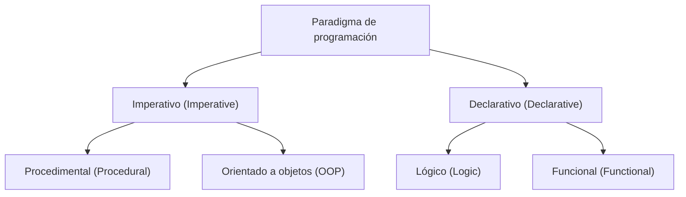
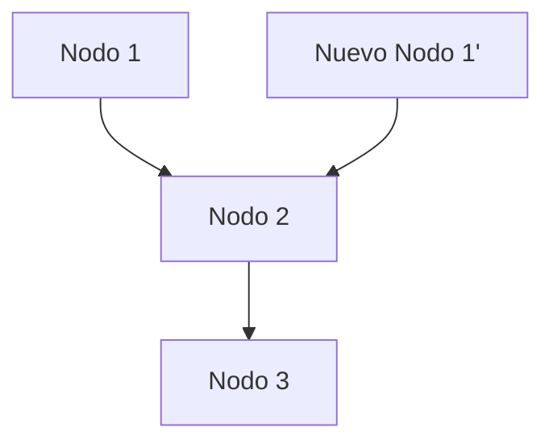

# 1. Introducción: El cambio de paradigma de la programación funcional

En el desarrollo de software moderno, la **programación funcional (Functional Programming, FP)** ya no se limita al ámbito académico, sino que es ampliamente reconocida como un paradigma práctico.
En comparación con la programación imperativa y la programación orientada a objetos, que históricamente han sido dominantes, la programación funcional adopta un enfoque fundamentalmente diferente: "considera la computación como la evaluación de funciones matemáticas y evita el cambio de estado y los datos mutables".

En este artículo, explicaremos de manera extremadamente detallada y sistemática desde los conceptos básicos de la programación funcional, como las funciones puras y la inmutabilidad, hasta el concepto avanzado de "mónada", con el cual muchos estudiantes tropiezan.

## 1.1 Clasificación de los paradigmas de programación



## 1.2 Cálculo Lambda: Fundamentos matemáticos

El fundamento teórico de la programación funcional se encuentra en el **cálculo lambda (Lambda Calculus)**, concebido por Alonzo Church y otros en la década de 1930.
Este modelo computacional, basado en la aplicación de funciones y la vinculación de variables, tiene una capacidad computacional equivalente a la de la máquina de Turing.

Matemáticamente, las expresiones lambda se definen de la siguiente manera:


$$
E ::= x \mid \lambda x. E \mid E_1 E_2
$$


Aquí, $x$ representa una variable, $\lambda x. E$ representa una abstracción (definición de función) y $E_1 E_2$ representa la aplicación de una función.

# 2. Funciones puras (Pure Functions)

El concepto más importante que forma el núcleo de la programación funcional son las **funciones puras**.

## 2.1 Definición de función pura

Decir que una función es "pura" significa que cumple simultáneamente con las dos condiciones siguientes:

1.  **Transparencia referencial (Referential Transparency)** : Para la misma entrada, siempre devuelve exactamente la misma salida. Significa que el resultado de la función no depende del estado local, del estado global, de la E/S (I/O), etc.
2.  **Ausencia de efectos secundarios (No Side Effects)** : La ejecución de la función no modifica ningún estado del sistema. La sobreescritura de variables globales, la escritura en archivos, la actualización de bases de datos, la salida por consola, etc., corresponden a efectos secundarios.

### Ejemplo de función pura

```javascript
// Función pura
function add(a, b) {
    return a + b;
}
```

### Ejemplo de función impura

```javascript
let total = 0;
// Función impura (dependencia y modificación de un estado externo)
function addToTotal(a) {
    total += a;
    return total;
}
```

## 2.2 Ventajas de las funciones puras

Las funciones puras tienen fuertes ventajas como las siguientes:

-   **Facilidad de prueba** : No es necesario configurar el estado externo, y la prueba se completa solo con el par de entrada y salida.
-   **Seguridad en la concurrencia** : Dado que no comparten ni cambian estados, no se producen condiciones de carrera (Race Condition) en entornos multihilo.
-   **Memoización (Memoization)** : Como siempre devuelven la misma salida para la misma entrada, los resultados pueden ser almacenados en caché para optimizar el rendimiento.

# 3. Inmutabilidad (Immutability)

La inmutabilidad es la propiedad por la cual una estructura de datos o estado, una vez creado, nunca se modifica posteriormente.

## 3.1 Evitar cambios de estado

En la programación imperativa, el cálculo avanza actualizando los valores de las variables, pero en la programación funcional, en lugar de modificar los datos existentes, se adopta el enfoque de **crear y devolver nuevos datos**.

```python
# Enfoque imperativo (modificación destructiva)
numbers = [1, 2, 3]
numbers.append(4)

# Enfoque funcional (no destructivo)
numbers1 = [1, 2, 3]
numbers2 = numbers1 + [4]
```

## 3.2 Estructuras de datos persistentes

Puede parecer ineficiente copiar siempre nuevos datos para mantener la inmutabilidad. Sin embargo, muchos lenguajes funcionales utilizan **estructuras de datos persistentes (Persistent Data Structures)** para optimizar la eficiencia de la memoria y la velocidad de ejecución, compartiendo parte de la estructura de datos antes y después del cambio.



De esta manera, la nueva lista reutiliza los nodos existentes.

# 4. Concepto de Mónadas (Monads)

El mayor obstáculo al aprender la programación funcional se considera que es la **mónada (Monad)**.

## 4.1 ¿Qué es una mónada?

En términos simples, una mónada es un "patrón de diseño que encapsula el contexto (Context) de cálculo". En lenguajes funcionales puros, se utilizan para manejar de forma segura y pura los efectos secundarios (E/S, cambios de estado, manejo de excepciones, etc.).

En la teoría de categorías (Category Theory), una mónada se define como un monoide en la categoría de endofuntores:


\text{Mónada}(M) = \langle M, \eta, \mu \rangle


En el contexto de la programación, una mónada se representa como una clase de tipos (type class) con los tres elementos siguientes:

1.  **Constructor de tipos** : Envuelve un tipo arbitrario $a$ en un contexto $M\ a$
2.  **return (o pure)** : Función que envuelve un valor en el contexto de la mónada (Tipo: $a \to M\ a$)
3.  **bind (o >>=, flatMap)** : Función que extrae el valor de la mónada, lo pasa a la siguiente función y devuelve el resultado nuevamente como una mónada (Tipo: $M\ a \to (a \to M\ b) \to M\ b$)

## 4.2 La mónada Maybe

El ejemplo más fácil de entender de una mónada es la mónada Maybe (u Option). Esta representa el contexto de que "un valor podría no existir".

```haskell
data Maybe a = Just a | Nothing
```

Usando la mónada Maybe, se puede escribir de forma concisa una cadena de comprobaciones de errores.

## 4.3 Leyes de las mónadas

Para comportarse como una mónada, es necesario satisfacer las siguientes tres reglas (leyes de las mónadas).

1.  **Elemento neutro por la izquierda** : `return a >>= f` $\equiv$ `f a`
2.  **Elemento neutro por la derecha** : `m >>= return` $\equiv$ `m`
3.  **Asociatividad** : `(m >>= f) >>= g` $\equiv$ `m >>= (\x -> f x >>= g)`

# 5. Ventajas y perspectivas futuras de la programación funcional

La programación funcional, con su estilo declarativo y su sólida base matemática, permite la construcción de software con menos errores, fácil de probar y altamente escalable.

-   **Modularidad** : Al combinar funciones puras, se pueden crear componentes reutilizables.
-   **Facilidad de depuración** : Se reduce la necesidad de rastrear cambios de estado.

## Conclusión

Los conceptos de la programación funcional como las funciones puras, la inmutabilidad y las mónadas pueden parecer difíciles de entender al principio. Sin embargo, al comprender y aplicar estos conceptos, serás capaz de escribir código más robusto y mantenible. En el desarrollo de sistemas complejos modernos, la importancia de la programación funcional seguirá aumentando en el futuro.
