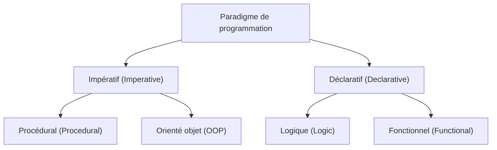
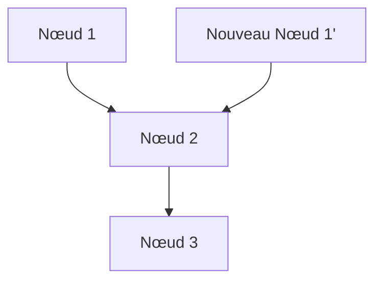

# 1. Introduction : Le changement de paradigme de la programmation fonctionnelle

Dans le développement de logiciels moderne, la **[programmation fonctionnelle](/fr/p/lambda-calculus-functional-programming/) (Functional Programming, FP)** n'est plus seulement confinée au domaine académique, mais est largement reconnue comme un paradigme pratique.
Comparée à la programmation impérative ou orientée objet, qui ont été historiquement dominantes, la [programmation fonctionnelle](/fr/p/lambda-calculus-functional-programming/) adopte une approche fondamentalement différente, consistant à "considérer le calcul comme l'évaluation de fonctions mathématiques et à éviter les changements d'état et les données mutables".

Cet article explique de manière systématique et extrêmement détaillée les concepts de base de la [programmation fonctionnelle](/fr/p/lambda-calculus-functional-programming/), tels que les fonctions pures et l'immuabilité, jusqu'au concept avancé de "monade" sur lequel de nombreux apprenants butent.

## 1.1 Classification des paradigmes de programmation



## 1.2 Calcul lambda : Les fondations mathématiques

Les fondations théoriques de la [programmation fonctionnelle](/fr/p/lambda-calculus-functional-programming/) reposent sur le **calcul lambda ([Lambda Calculus](/fr/p/lambda-calculus-functional-programming/))**, inventé par Alonzo Church et ses collègues dans les années 1930.
Ce modèle de calcul, basé sur l'application de fonctions et la liaison de variables, a une capacité de calcul équivalente à celle d'une machine de Turing.

Mathématiquement, une expression lambda est définie comme suit :

$$
E ::= x \mid \lambda x. E \mid E_1 E_2
$$

Ici, $x$ représente une variable, $\lambda x. E$ représente une abstraction (définition de fonction), et $E_1 E_2$ représente une application de fonction.

# 2. Fonctions pures (Pure Functions)

Le concept le plus important, au cœur de la [programmation fonctionnelle](/fr/p/lambda-calculus-functional-programming/), est celui de **fonction pure**.

## 2.1 Définition d'une fonction pure

Une fonction est dite "pure" lorsqu'elle satisfait simultanément les deux conditions suivantes :

1.  **Transparence référentielle (Referential Transparency)** : Pour la même entrée, elle renvoie toujours exactement la même sortie. Cela signifie que le résultat de la fonction ne dépend pas d'un état local, d'un état global, d'entrées/sorties (I/O), etc.
2.  **Absence d'effets secondaires (No Side Effects)** : L'exécution de la fonction ne modifie aucun état du système. La modification de variables globales, l'écriture dans un fichier, la mise à jour d'une base de données ou l'affichage sur la console sont des exemples d'effets secondaires.

### Exemple de fonction pure

```javascript
// Fonction pure
function add(a, b) {
    return a + b;
}
```

### Exemple de fonction impure

```javascript
let total = 0;
// Fonction impure (dépendance et modification de l'état externe)
function addToTotal(a) {
    total += a;
    return total;
}
```

## 2.2 Avantages des fonctions pures

Les fonctions pures offrent de puissants avantages, tels que :

-   **Testabilité** : Il n'est pas nécessaire de configurer un état externe, les tests se suffisent à eux-mêmes avec des paires d'entrées et de sorties.
-   **Sécurité en traitement parallèle** : Comme elles ne partagent ni ne modifient d'état, il n'y a pas de conditions de concurrence (Race Condition) dans des environnements multithreads.
-   **Mémoïsation (Memoization)** : Puisqu'elles renvoient toujours la même sortie pour une entrée donnée, les résultats peuvent être mis en cache pour optimiser les performances.

# 3. Immuabilité (Immutability)

L'immuabilité est la propriété selon laquelle une structure de données ou un état, une fois créé, n'est jamais modifié par la suite.

## 3.1 Éviter les changements d'état

Dans la programmation impérative, le calcul progresse en mettant à jour la valeur des variables, mais dans la [programmation fonctionnelle](/fr/p/lambda-calculus-functional-programming/), au lieu de modifier les données existantes, on adopte l'approche de **créer et renvoyer de nouvelles données**.

```python
# Approche impérative (modification destructive)
numbers = [1, 2, 3]
numbers.append(4)

# Approche fonctionnelle (non destructive)
numbers1 = [1, 2, 3]
numbers2 = numbers1 + [4]
```

## 3.2 Structures de données persistantes

Copier de nouvelles données à chaque fois pour maintenir l'immuabilité peut sembler inefficace. Cependant, de nombreux langages fonctionnels utilisent des **structures de données persistantes (Persistent Data Structures)** pour optimiser l'efficacité de la mémoire et la vitesse d'exécution en partageant des parties de la structure de données avant et après la modification.



Ainsi, la nouvelle liste réutilise les nœuds existants.

# 4. Le concept de monade (Monads)

Le plus grand obstacle dans l'apprentissage de la [programmation fonctionnelle](/fr/p/lambda-calculus-functional-programming/) est souvent considéré comme étant la **monade (Monad)**.

## 4.1 Qu'est-ce qu'une monade ?

Pour faire simple, une monade est un "modèle de conception qui encapsule le contexte d'un calcul". Dans les langages fonctionnels purs, elle est utilisée pour gérer les effets secondaires (I/O, changements d'état, gestion des exceptions, etc.) d'une manière sûre et pure.

Dans la théorie des catégories (Category Theory), une monade est définie comme un monoïde dans la catégorie des endofoncteurs :

$$
\text{Monade}(M) = \langle M, \eta, \mu \rangle
$$

Dans le contexte de la programmation, une monade est représentée comme une classe de types possédant les trois éléments suivants :

1.  **Constructeur de type** : Enveloppe un type arbitraire $a$ dans un contexte $M\ a$
2.  **return (ou pure)** : Une fonction qui enveloppe une valeur dans le contexte de la monade (Type : $a \to M\ a$)
3.  **bind (ou >>=, flatMap)** : Une fonction qui extrait la valeur de la monade, la passe à la fonction suivante, et renvoie le résultat sous forme de monade à nouveau (Type : $M\ a \to (a \to M\ b) \to M\ b$)

## 4.2 La monade Maybe

L'exemple le plus simple de monade est la monade Maybe (ou Option). Elle représente le contexte "une valeur pourrait ne pas exister".

```haskell
data Maybe a = Just a | Nothing
```

En utilisant la monade Maybe, on peut écrire des chaînes de vérification d'erreurs de manière concise.

## 4.3 Lois des monades

Pour qu'elle se comporte comme une monade, elle doit satisfaire les trois règles suivantes (lois des monades).

1.  **Élément neutre à gauche** : return a >>= f $\equiv$ f a
2.  **Élément neutre à droite** : m >>= return $\equiv$ m
3.  **Associativité** : (m >>= f) >>= g $\equiv$ m >>= (\x -> f x >>= g)

# 5. Avantages de la programmation fonctionnelle et perspectives futures

Grâce à son style déclaratif et à ses solides fondations mathématiques, la [programmation fonctionnelle](/fr/p/lambda-calculus-functional-programming/) permet de construire des logiciels avec moins de bugs, plus faciles à tester et hautement évolutifs.

-   **Modularité** : En combinant des fonctions pures, on peut créer des composants réutilisables.
-   **Facilité de débogage** : Le besoin de suivre les changements d'état est réduit.

## Conclusion

Les concepts de la [programmation fonctionnelle](/fr/p/lambda-calculus-functional-programming/) tels que les fonctions pures, l'immuabilité et les monades peuvent sembler difficiles au début. Cependant, en comprenant et en appliquant ces concepts, il devient possible d'écrire un code plus robuste et plus facile à maintenir. Dans le développement des systèmes complexes d'aujourd'hui, l'importance de la [programmation fonctionnelle](/fr/p/lambda-calculus-functional-programming/) ne fera que croître à l'avenir.
