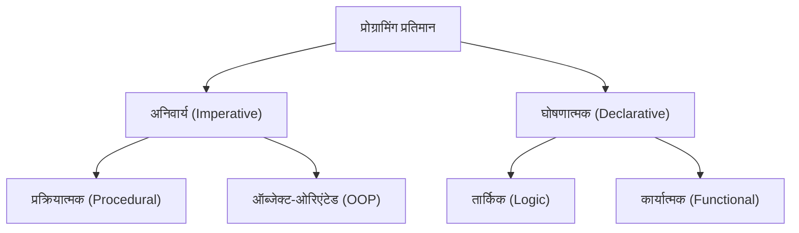
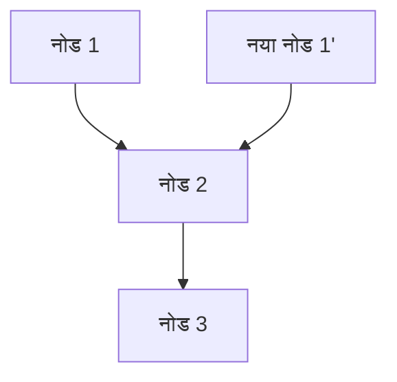

# 1. परिचय: कार्यात्मक प्रोग्रामिंग के रूप में एक प्रतिमान बदलाव

आधुनिक सॉफ्टवेयर विकास में, **कार्यात्मक प्रोग्रामिंग (Functional Programming, FP)** अब केवल एक अकादमिक क्षेत्र तक सीमित नहीं है, बल्कि इसे व्यापक रूप से एक व्यावहारिक प्रतिमान के रूप में मान्यता प्राप्त है।
ऐतिहासिक रूप से मुख्यधारा की अनिवार्य प्रोग्रामिंग और ऑब्जेक्ट-ओरिएंटेड प्रोग्रामिंग की तुलना में, कार्यात्मक प्रोग्रामिंग एक मौलिक रूप से अलग दृष्टिकोण अपनाती है: "गणना को गणितीय कार्यों के मूल्यांकन के रूप में माना जाता है, और स्थिति परिवर्तन या परिवर्तनशील डेटा से बचा जाता है।"

इस लेख में, हम कार्यात्मक प्रोग्रामिंग के मूल सिद्धांतों, जैसे शुद्ध कार्यों और अपरिवर्तनीयता से लेकर "मोनैड" जैसी उन्नत अवधारणाओं तक, जिन्हें समझने में कई शिक्षार्थी संघर्ष करते हैं, को बहुत विस्तार और व्यवस्थित रूप से समझाएंगे।

## 1.1 प्रोग्रामिंग प्रतिमानों का वर्गीकरण



## 1.2 लैम्ब्डा कैलकुलस: गणितीय आधार

कार्यात्मक प्रोग्रामिंग का सैद्धांतिक आधार 1930 के दशक में अलोंजो चर्च और अन्य द्वारा तैयार किया गया **लैम्ब्डा कैलकुलस (Lambda Calculus)** है।
यह गणना मॉडल, जो फ़ंक्शन एप्लिकेशन और वेरिएबल बाइंडिंग पर आधारित है, ट्यूरिंग मशीन के समान कम्प्यूटेशनल शक्ति रखता है।

गणितीय रूप से, एक लैम्ब्डा अभिव्यक्ति को इस प्रकार परिभाषित किया गया है:

$$
E ::= x \mid \lambda x. E \mid E_1 E_2
$$

यहां, $x$ एक चर (variable) है, $\lambda x. E$ अमूर्तता (फ़ंक्शन परिभाषा) को दर्शाता है, और $E_1 E_2$ फ़ंक्शन एप्लिकेशन को दर्शाता है।

# 2. शुद्ध कार्य (Pure Functions)

कार्यात्मक प्रोग्रामिंग के मूल में सबसे महत्वपूर्ण अवधारणा **शुद्ध कार्य** है।

## 2.1 शुद्ध कार्य की परिभाषा

एक फ़ंक्शन को "शुद्ध" कहा जाता है यदि वह एक साथ निम्नलिखित दो शर्तों को पूरा करता है:

1. **संदर्भ पारदर्शकता (Referential Transparency)**: समान इनपुट के लिए हमेशा बिल्कुल समान आउटपुट लौटाना। इसका अर्थ है कि फ़ंक्शन का परिणाम स्थानीय स्थिति, वैश्विक स्थिति, I/O आदि पर निर्भर नहीं करता है।
2. **दुष्प्रभावों का अभाव (No Side Effects)**: फ़ंक्शन को निष्पादित करने से सिस्टम की किसी भी स्थिति में कोई बदलाव नहीं आना चाहिए। वैश्विक चर को फिर से लिखना, फाइलों में लिखना, डेटाबेस को अपडेट करना, कंसोल में आउटपुट करना आदि दुष्प्रभावों के अंतर्गत आते हैं।

### शुद्ध कार्य का उदाहरण

```javascript
// शुद्ध कार्य
function add(a, b) {
    return a + b;
}
```

### गैर-शुद्ध कार्य का उदाहरण

```javascript
let total = 0;
// गैर-शुद्ध कार्य (बाहरी स्थिति पर निर्भरता और परिवर्तन)
function addToTotal(a) {
    total += a;
    return total;
}
```

## 2.2 शुद्ध कार्यों के लाभ

शुद्ध कार्यों के निम्नलिखित शक्तिशाली लाभ हैं:

- **परीक्षण में आसानी**: बाहरी स्थिति को सेट करने की कोई आवश्यकता नहीं है, और परीक्षण केवल इनपुट और आउटपुट जोड़े के साथ पूरा किया जा सकता है।
- **समवर्ती प्रसंस्करण सुरक्षा**: चूंकि स्थिति साझा या परिवर्तित नहीं होती है, इसलिए मल्टी-थ्रेडेड वातावरण में दौड़ की स्थिति (Race Condition) नहीं होती है।
- **मेमोइज़ेशन (Memoization)**: चूंकि समान इनपुट हमेशा समान आउटपुट लौटाता है, इसलिए परिणामों को कैश करके प्रदर्शन को अनुकूलित किया जा सकता है।

# 3. अपरिवर्तनीयता (Immutability)

अपरिवर्तनीयता वह गुण है जिसमें एक बार बनाए गए डेटा संरचनाओं या स्थिति को कभी भी बदला नहीं जाता है।

## 3.1 स्थिति में बदलाव से बचना

अनिवार्य प्रोग्रामिंग में, हम चर के मानों को अपडेट करके गणनाओं को आगे बढ़ाते हैं, लेकिन कार्यात्मक प्रोग्रामिंग में, हम मौजूदा डेटा को संशोधित करने के बजाय **नया डेटा बनाने और वापस करने** का दृष्टिकोण अपनाते हैं।

```python
# अनिवार्य दृष्टिकोण (विनाशकारी परिवर्तन)
numbers = [1, 2, 3]
numbers.append(4)

# कार्यात्मक दृष्टिकोण (गैर-विनाशकारी)
numbers1 = [1, 2, 3]
numbers2 = numbers1 + [4]
```

## 3.2 लगातार डेटा संरचनाएं

अपरिवर्तनीयता को बनाए रखते हुए हर बार नए डेटा की प्रतिलिपि बनाना अक्षम लग सकता है। हालाँकि, कई कार्यात्मक भाषाएँ मेमोरी दक्षता और निष्पादन गति को अनुकूलित करने के लिए **लगातार डेटा संरचनाओं (Persistent Data Structures)** का उपयोग करती हैं, जिससे परिवर्तन के पहले और बाद में डेटा संरचना के हिस्सों को साझा किया जाता है।



इस तरह, नई सूची मौजूदा नोड्स का पुन: उपयोग करती है।

# 4. मोनैड (Monads) की अवधारणा

कार्यात्मक प्रोग्रामिंग सीखते समय, **मोनैड (Monad)** को सबसे बड़ी बाधा माना जाता है।

## 4.1 मोनैड क्या है?

सरल शब्दों में, एक मोनैड "एक डिज़ाइन पैटर्न है जो गणना के संदर्भ (Context) को एनकैप्सुलेट करता है"। शुद्ध कार्यात्मक भाषाओं में, इसका उपयोग दुष्प्रभावों (I/O, स्थिति परिवर्तन, अपवाद हैंडलिंग, आदि) को सुरक्षित और शुद्ध तरीके से संभालने के लिए किया जाता है।

श्रेणी सिद्धांत (Category Theory) में, एक मोनैड को एंडोफंक्टर श्रेणी में एक मोनोइड के रूप में परिभाषित किया गया है:

$$
\text{मोनैड}(M) = \langle M, \eta, \mu \rangle
$$

प्रोग्रामिंग के संदर्भ में, एक मोनैड को निम्नलिखित 3 तत्वों वाले एक प्रकार के वर्ग (type class) के रूप में दर्शाया जाता है:

1. **टाइप कंस्ट्रक्टर**: किसी भी प्रकार $a$ को एक संदर्भ $M\ a$ में लपेटना।
2. **return (या pure)**: एक मान को मोनैड संदर्भ में लपेटने का कार्य (प्रकार: $a \to M\ a$)।
3. **bind (या >>=, flatMap)**: मोनैड से मान निकालने, इसे अगले फ़ंक्शन में पास करने, और परिणाम को फिर से मोनैड के रूप में वापस करने का कार्य (प्रकार: $M\ a \to (a \to M\ b) \to M\ b$)।

## 4.2 Maybe मोनैड

सबसे आसानी से समझा जाने वाला मोनैड उदाहरण Maybe (या Option) मोनैड है। यह उस संदर्भ को व्यक्त करता है जहाँ "हो सकता है कि कोई मान मौजूद न हो"।

```haskell
data Maybe a = Just a | Nothing
```

Maybe मोनैड का उपयोग करके, त्रुटि जाँच श्रृंखलाओं को संक्षेप में लिखा जा सकता है।

## 4.3 मोनैड नियम

मोनैड के रूप में कार्य करने के लिए, इसे निम्नलिखित तीन नियमों (मोनैड नियमों) को पूरा करना होगा।

1. **बायां पहचानकर्ता**: return a >>= f $\equiv$ f a
2. **दायां पहचानकर्ता**: m >>= return $\equiv$ m
3. **साहचर्य**: (m >>= f) >>= g $\equiv$ m >>= (\x -> f x >>= g)

# 5. कार्यात्मक प्रोग्रामिंग के लाभ और भविष्य की संभावनाएं

कार्यात्मक प्रोग्रामिंग, अपनी घोषणात्मक शैली और मजबूत गणितीय नींव के साथ, कम बग, आसान परीक्षण और उच्च मापनीयता (scalability) के साथ सॉफ्टवेयर के निर्माण को सक्षम बनाती है।

- **प्रतिरूपकता (Modularity)**: शुद्ध कार्यों को मिलाकर, पुन: प्रयोज्य घटकों को बनाया जा सकता है।
- **डीबगिंग में आसानी**: स्थिति परिवर्तन को ट्रैक करने की आवश्यकता कम हो जाती है।

## निष्कर्ष

शुद्ध कार्य, अपरिवर्तनीयता और मोनैड जैसी कार्यात्मक प्रोग्रामिंग की अवधारणाएं पहली बार में कठिन लग सकती हैं। हालाँकि, इन अवधारणाओं को समझने और अभ्यास करने से, आप अधिक मजबूत और बनाए रखने योग्य कोड लिख सकेंगे। आधुनिक जटिल प्रणाली विकास में, भविष्य में कार्यात्मक प्रोग्रामिंग का महत्व और भी अधिक बढ़ जाएगा।
