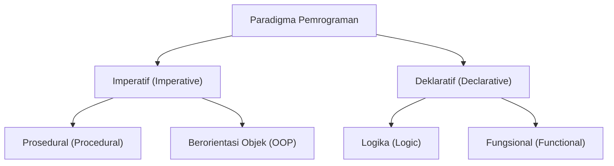
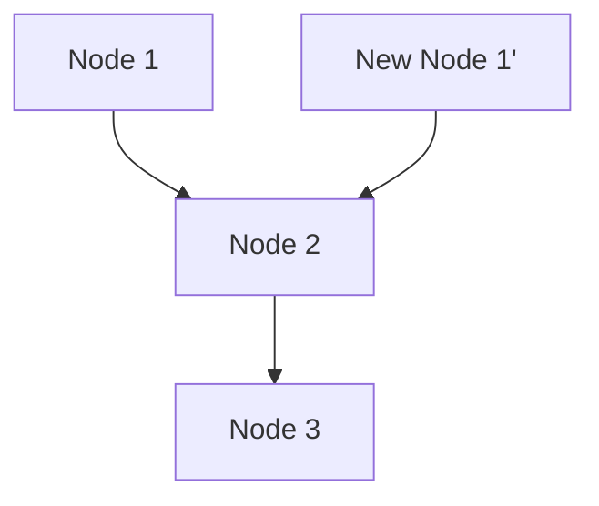

# 1. Pendahuluan: Pergeseran Paradigma Pemrograman Fungsional

Dalam pengembangan perangkat lunak modern, **[pemrograman fungsional](/id/p/lambda-calculus-functional-programming/) (Functional Programming, FP)** tidak lagi terbatas pada ranah akademis, melainkan telah diakui secara luas sebagai paradigma praktis.
Dibandingkan dengan pemrograman imperatif dan pemrograman berorientasi objek yang secara historis menjadi arus utama, [pemrograman fungsional](/id/p/lambda-calculus-functional-programming/) mengambil pendekatan yang secara fundamental berbeda, yaitu "menganggap komputasi sebagai evaluasi dari fungsi matematis dan menghindari perubahan status serta data yang dapat diubah".

Artikel ini akan menjelaskan secara sangat rinci dan sistematis mulai dari konsep dasar [pemrograman fungsional](/id/p/lambda-calculus-functional-programming/) seperti fungsi murni dan imutabilitas, hingga konsep tingkat lanjut yaitu "monad" yang sering kali menjadi sandungan bagi banyak pembelajar.

## 1.1 Klasifikasi Paradigma Pemrograman



## 1.2 Kalkulus Lambda: Dasar Matematis

Dasar teoretis dari [pemrograman fungsional](/id/p/lambda-calculus-functional-programming/) terletak pada **[kalkulus lambda](/id/p/lambda-calculus-functional-programming/) ([Lambda Calculus](/id/p/lambda-calculus-functional-programming/))** yang ditemukan oleh Alonzo Church dan rekan-rekannya pada tahun 1930-an.
Model komputasi yang didasarkan pada penerapan fungsi dan pengikatan variabel ini memiliki kemampuan komputasi yang setara dengan Mesin Turing.

Secara matematis, ekspresi lambda didefinisikan sebagai berikut:


$$
E ::= x \mid \lambda x. E \mid E_1 E_2
$$


Di sini, $x$ adalah variabel, $\lambda x. E$ adalah abstraksi (definisi fungsi), dan $E_1 E_2$ mewakili penerapan fungsi.

# 2. Fungsi Murni (Pure Functions)

Konsep terpenting yang menjadi inti dari [pemrograman fungsional](/id/p/lambda-calculus-functional-programming/) adalah **fungsi murni**.

## 2.1 Definisi Fungsi Murni

Sebuah fungsi dikatakan "murni" jika memenuhi kedua kondisi berikut secara bersamaan:

1.  **Transparansi Referensial (Referential Transparency)** : Untuk input yang sama, selalu mengembalikan output yang benar-benar sama. Ini berarti hasil fungsi tidak bergantung pada status lokal, status global, I/O, dll.
2.  **Ketiadaan Efek Samping (No Side Effects)** : Menjalankan fungsi tidak mengubah status apa pun di dalam sistem. Menulis ulang variabel global, menulis ke file, memperbarui basis data, atau mencetak ke konsol merupakan contoh dari efek samping.

### Contoh Fungsi Murni

```javascript
// Fungsi murni
function add(a, b) {
    return a + b;
}
```

### Contoh Fungsi Tidak Murni

```javascript
let total = 0;
// Fungsi tidak murni (ketergantungan dan perubahan pada status eksternal)
function addToTotal(a) {
    total += a;
    return total;
}
```

## 2.2 Keuntungan Fungsi Murni

Fungsi murni memiliki keuntungan-keuntungan yang kuat sebagai berikut:

-   **Kemudahan Pengujian** : Tidak perlu mengatur status eksternal, dan pengujian dapat diselesaikan hanya dengan pasangan input dan output.
-   **Keamanan Pemrosesan Paralel** : Karena tidak berbagi atau mengubah status, kondisi balapan (Race Condition) di lingkungan multi-utas (multi-thread) tidak akan terjadi.
-   **Memoisasi (Memoization)** : Karena selalu mengembalikan output yang sama untuk input yang sama, Anda dapat menyimpan hasil dalam cache untuk mengoptimalkan kinerja.

# 3. Imutabilitas (Immutability)

Imutabilitas adalah sifat di mana struktur data atau status yang telah dibuat tidak akan pernah bisa diubah lagi setelahnya.

## 3.1 Menghindari Perubahan Status

Dalam pemrograman imperatif, komputasi dilanjutkan dengan memperbarui nilai variabel, tetapi dalam [pemrograman fungsional](/id/p/lambda-calculus-functional-programming/), pendekatan yang diambil adalah **membuat dan mengembalikan data baru** alih-alih mengubah data yang sudah ada.

```python
# Pendekatan imperatif (perubahan destruktif)
numbers = [1, 2, 3]
numbers.append(4)

# Pendekatan fungsional (non-destruktif)
numbers1 = [1, 2, 3]
numbers2 = numbers1 + [4]
```

## 3.2 Struktur Data Persisten

Menyalin data baru setiap kali sambil mempertahankan imutabilitas mungkin tampak tidak efisien. Namun, banyak bahasa fungsional menggunakan **struktur data persisten (Persistent Data Structures)** untuk mengoptimalkan efisiensi memori dan kecepatan eksekusi dengan membagikan sebagian struktur data sebelum dan sesudah perubahan.



Dengan cara ini, daftar yang baru menggunakan kembali node yang sudah ada.

# 4. Konsep Monad (Monads)

Saat mempelajari [pemrograman fungsional](/id/p/lambda-calculus-functional-programming/), hambatan terbesar yang sering dihadapi adalah **monad (Monad)**.

## 4.1 Apa itu Monad?

Secara sederhana, monad adalah "pola desain yang merangkum konteks dari sebuah komputasi (Context)". Dalam bahasa [pemrograman fungsional](/id/p/lambda-calculus-functional-programming/) murni, monad digunakan untuk menangani efek samping (I/O, perubahan status, penanganan pengecualian, dll.) dengan cara yang aman dan murni.

Dalam teori kategori (Category Theory), monad didefinisikan sebagai monoid di dalam kategori endofungtor:


\text{Monad}(M) = \langle M, \eta, \mu \rangle


Dalam konteks pemrograman, monad diekspresikan sebagai kelas tipe yang memiliki 3 elemen berikut:

1.  **Konstruktor Tipe** : Membungkus tipe sembarang $a$ ke dalam konteks $M\ a$
2.  **return (atau pure)** : Fungsi untuk membungkus nilai ke dalam konteks monad (Tipe: $a \to M\ a$)
3.  **bind (atau >>=, flatMap)** : Fungsi untuk mengambil nilai dari monad, meneruskannya ke fungsi berikutnya, dan mengembalikan hasilnya kembali sebagai monad (Tipe: $M\ a \to (a \to M\ b) \to M\ b$)

## 4.2 Monad Maybe

Contoh monad yang paling mudah dipahami adalah monad Maybe (atau Option). Ini merepresentasikan konteks di mana "nilai mungkin tidak ada".

```haskell
data Maybe a = Just a | Nothing
```

Dengan menggunakan monad Maybe, rantai pemeriksaan kesalahan dapat ditulis secara ringkas.

## 4.3 Hukum Monad

Agar dapat berperilaku sebagai monad, ia harus memenuhi 3 aturan berikut (hukum monad).

1.  **Identitas Kiri** : return a >>= f $\equiv$ f a
2.  **Identitas Kanan** : m >>= return $\equiv$ m
3.  **Hukum Asosiatif** : (m >>= f) >>= g $\equiv$ m >>= (\x -> f x >>= g)

# 5. Keuntungan Pemrograman Fungsional dan Prospek ke Depan

Berkat gaya deklaratif dan fondasi matematisnya yang kuat, [pemrograman fungsional](/id/p/lambda-calculus-functional-programming/) memungkinkan untuk membangun perangkat lunak yang sedikit bug, mudah diuji, dan memiliki skalabilitas yang tinggi.

-   **Modularitas** : Dengan menggabungkan fungsi-fungsi murni, komponen yang dapat digunakan kembali dapat dibuat.
-   **Kemudahan Debugging** : Kebutuhan untuk melacak perubahan status akan berkurang.

## Kesimpulan

Konsep-konsep [pemrograman fungsional](/id/p/lambda-calculus-functional-programming/) seperti fungsi murni, imutabilitas, dan monad pada awalnya mungkin terlihat sulit untuk dipahami. Namun, dengan memahami dan mempraktikkan konsep-konsep ini, Anda akan dapat menulis kode yang lebih tangguh dan mudah dipelihara. Dalam pengembangan sistem yang kompleks saat ini, pentingnya [pemrograman fungsional](/id/p/lambda-calculus-functional-programming/) di masa depan akan semakin meningkat.
