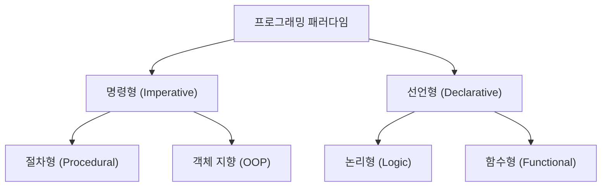
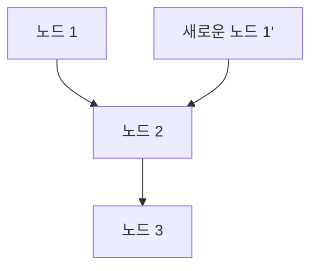

# 1. 서론: 함수형 프로그래밍이라는 패러다임 전환

현대 소프트웨어 개발에 있어서, **함수형 프로그래밍 (Functional Programming, FP)** 은 더 이상 학술적인 영역에 머물지 않고, 실천적인 패러다임으로서 널리 인식되고 있습니다.
역사적으로 주류였던 명령형 프로그래밍이나 객체 지향 프로그래밍과 비교하여, 함수형 프로그래밍은 '계산을 수학적인 함수의 평가로 취급하고, 상태의 변화나 가변적인 데이터를 피한다'라는 근본적으로 다른 접근 방식을 취합니다.

본 기사에서는 함수형 프로그래밍의 기초인 순수 함수나 불변성 같은 개념부터 많은 학습자가 좌절하는 '모나드'라는 고도의 개념까지, 매우 상세하고 체계적으로 해설합니다.

## 1.1 프로그래밍 패러다임의 분류



## 1.2 람다 대수: 수학적 기초

함수형 프로그래밍의 이론적 기초는 알론조 처치 등에 의해 1930년대에 고안된 **람다 대수 (Lambda Calculus)** 에 있습니다.
함수 적용과 변수 바인딩을 기초로 한 이 계산 모델은 튜링 기계와 동등한 계산 능력을 가집니다.

수학적으로 람다식은 다음과 같이 정의됩니다:


$$
E ::= x \mid \lambda x. E \mid E_1 E_2
$$


여기서 $x$ 는 변수, $\lambda x. E$ 는 추상화(함수 정의), $E_1 E_2$ 는 함수 적용을 나타냅니다.

# 2. 순수 함수 (Pure Functions)

함수형 프로그래밍의 핵심을 이루는 가장 중요한 개념이 **순수 함수** 입니다.

## 2.1 순수 함수의 정의

함수가 '순수'하다는 것은 다음의 2가지 조건을 동시에 만족하는 것을 의미합니다:

1.  **참조 투명성 (Referential Transparency)** : 같은 입력에 대해서는 항상 완전히 같은 출력을 반환하는 것. 함수의 결과가 로컬 상태, 전역 상태, I/O 등에 의존하지 않음을 의미합니다.
2.  **부작용의 부재 (No Side Effects)** : 함수를 실행함으로써 시스템의 어떠한 상태도 변경하지 않는 것. 전역 변수의 수정, 파일 쓰기, 데이터베이스 업데이트, 콘솔 출력 등이 부작용에 해당합니다.

### 순수 함수의 예제

```javascript
// 순수 함수
function add(a, b) {
    return a + b;
}
```

### 비순수 함수의 예제

```javascript
let total = 0;
// 비순수 함수 (외부 상태에 대한 의존과 변경)
function addToTotal(a) {
    total += a;
    return total;
}
```

## 2.2 순수 함수의 이점

순수 함수에는 다음과 같은 강력한 이점이 있습니다:

-   **테스트 용이성** : 외부 상태를 설정할 필요가 없으며, 입력과 출력의 쌍만으로 테스트가 완결됩니다.
-   **동시성 처리의 안전성** : 상태를 공유하거나 변경하지 않기 때문에, 멀티스레드 환경에서 경쟁 상태(Race Condition)가 발생하지 않습니다.
-   **메모이제이션 (Memoization)** : 같은 입력에는 항상 같은 출력을 반환하므로, 결과를 캐시하여 성능을 최적화할 수 있습니다.

# 3. 불변성 (Immutability)

불변성이란, 한 번 생성된 데이터 구조나 상태가 그 후 절대 변경되지 않는 성질입니다.

## 3.1 상태 변경 피하기

명령형 프로그래밍에서는 변수의 값을 업데이트함으로써 계산을 진행하지만, 함수형 프로그래밍에서는 기존 데이터를 변경하는 대신, **새로운 데이터를 생성하여 반환하는** 접근 방식을 취합니다.

```python
# 명령형 접근 방식 (파괴적 변경)
numbers = [1, 2, 3]
numbers.append(4)

# 함수형 접근 방식 (비파괴적)
numbers1 = [1, 2, 3]
numbers2 = numbers1 + [4]
```

## 3.2 영속 데이터 구조

불변성을 유지하면서 매번 새로운 데이터를 복사하는 것은 비효율적으로 보일 수 있습니다. 하지만 많은 함수형 언어는 **영속 데이터 구조 (Persistent Data Structures)** 를 사용하여, 변경 전후로 데이터 구조의 일부를 공유함으로써 메모리 효율과 실행 속도를 최적화하고 있습니다.



이처럼 새로운 리스트는 기존 노드를 재사용합니다.

# 4. 모나드 (Monads) 개념

함수형 프로그래밍을 배울 때 가장 큰 장벽으로 여겨지는 것이 **모나드 (Monad)** 입니다.

## 4.1 모나드란 무엇인가?

간단히 말해, 모나드는 '계산의 문맥 (Context) 을 캡슐화하는 디자인 패턴'입니다. 순수 함수형 언어에서 부작용(I/O, 상태 변경, 예외 처리 등)을 안전하고 순수한 방법으로 다루기 위해 사용됩니다.

범주론(Category Theory)에서 모나드는 자기 함자 범주에서의 모노이드로 정의됩니다:


\text{모나드}(M) = \langle M, \eta, \mu \rangle


프로그래밍 문맥에서 모나드는 다음의 3가지 요소를 가지는 타입 클래스로 표현됩니다:

1.  **타입 생성자** : 임의의 타입 $a$ 를 문맥에 감싸는 $M\ a$
2.  **return (또는 pure)** : 값을 모나드 문맥에 감싸는 함수 (타입: $a \to M\ a$)
3.  **bind (또는 >>=, flatMap)** : 모나드의 값을 꺼내어 다음 함수에 전달하고, 결과를 다시 모나드로 반환하는 함수 (타입: $M\ a \to (a \to M\ b) \to M\ b$)

## 4.2 Maybe 모나드

가장 이해하기 쉬운 모나드의 예가 Maybe (또는 Option) 모나드입니다. 이는 '값이 존재하지 않을지도 모른다'라는 문맥을 표현합니다.

```haskell
data Maybe a = Just a | Nothing
```

Maybe 모나드를 사용함으로써, 에러 체크의 연쇄를 간결하게 작성할 수 있습니다.

## 4.3 모나드 법칙

모나드로서 동작하기 위해서는 다음의 3가지 규칙(모나드 법칙)을 만족해야 합니다.

1.  **좌항등원** : return a >>= f $\equiv$ f a
2.  **우항등원** : m >>= return $\equiv$ m
3.  **결합법칙** : (m >>= f) >>= g $\equiv$ m >>= (\x -> f x >>= g)

# 5. 함수형 프로그래밍의 이점과 향후 전망

함수형 프로그래밍은 그 선언적인 스타일과 강력한 수학적 기반에 의해 버그가 적고, 테스트하기 쉬우며, 확장성이 높은 소프트웨어의 구축을 가능하게 합니다.

-   **모듈성** : 순수 함수를 조합함으로써, 재사용 가능한 컴포넌트를 작성할 수 있습니다.
-   **디버깅의 용이성** : 상태 변화를 추적할 필요가 줄어듭니다.

## 결론

순수 함수, 불변성, 모나드와 같은 함수형 프로그래밍의 개념은 처음에는 난해하게 생각될지도 모릅니다. 하지만 이러한 개념을 이해하고 실천함으로써, 보다 견고하고 유지보수성이 높은 코드를 작성할 수 있게 됩니다. 현대의 복잡한 시스템 개발에 있어서 함수형 프로그래밍의 중요성은 앞으로 더욱 커질 것입니다.
