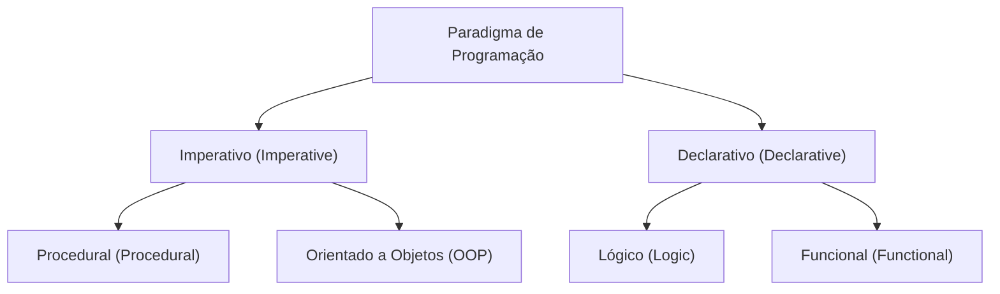
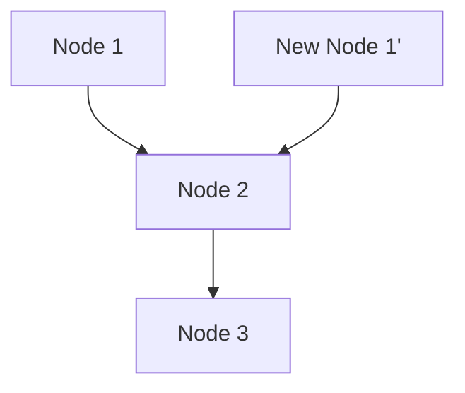

# 1. Introdução: A Mudança de Paradigma da Programação Funcional

No desenvolvimento de software moderno, a **[Programação Funcional](/pt/p/lambda-calculus-functional-programming/) (Functional Programming, FP)** não está mais confinada à área acadêmica, sendo amplamente reconhecida como um paradigma prático.
Comparada à programação imperativa ou orientada a objetos, que foram historicamente dominantes, a [programação funcional](/pt/p/lambda-calculus-functional-programming/) adota uma abordagem fundamentalmente diferente: "trata a computação como a avaliação de funções matemáticas e evita mudanças de estado ou dados mutáveis".

Neste artigo, explicaremos de forma extremamente detalhada e sistemática desde os fundamentos da [programação funcional](/pt/p/lambda-calculus-functional-programming/), como funções puras e imutabilidade, até "mônadas", um conceito avançado onde muitos estudantes encontram dificuldades.

## 1.1 Classificação dos Paradigmas de Programação



## 1.2 Cálculo Lambda: Fundamentos Matemáticos

A base teórica da [programação funcional](/pt/p/lambda-calculus-functional-programming/) reside no **[Cálculo Lambda](/pt/p/lambda-calculus-functional-programming/) ([Lambda Calculus](/pt/p/lambda-calculus-functional-programming/))**, concebido por Alonzo Church e outros na década de 1930.
Este modelo computacional, baseado na aplicação de funções e na ligação de variáveis, tem o mesmo poder computacional de uma máquina de Turing.

Matematicamente, as expressões lambda são definidas da seguinte forma:


$$
E ::= x \mid \lambda x. E \mid E_1 E_2
$$


Aqui, $x$ representa uma variável, $\lambda x. E$ representa uma abstração (definição de função) e $E_1 E_2$ representa a aplicação de uma função.

# 2. Funções Puras (Pure Functions)

O conceito mais importante e central da [programação funcional](/pt/p/lambda-calculus-functional-programming/) é a **função pura**.

## 2.1 Definição de Função Pura

Dizer que uma função é "pura" significa que ela satisfaz simultaneamente as duas condições a seguir:

1.  **Transparência Referencial (Referential Transparency)**: Para a mesma entrada, sempre retorna exatamente a mesma saída. Isso significa que o resultado da função não depende de estados locais, estados globais, I/O, etc.
2.  **Ausência de Efeitos Colaterais (No Side Effects)**: A execução da função não altera nenhum estado do sistema. Modificar variáveis globais, escrever em arquivos, atualizar bancos de dados ou imprimir no console são considerados efeitos colaterais.

### Exemplo de Função Pura

```javascript
// Função pura
function add(a, b) {
    return a + b;
}
```

### Exemplo de Função Impura

```javascript
let total = 0;
// Função impura (dependência e alteração de estado externo)
function addToTotal(a) {
    total += a;
    return total;
}
```

## 2.2 Vantagens das Funções Puras

As funções puras oferecem as seguintes vantagens poderosas:

-   **Facilidade de Teste**: Não é necessário configurar o estado externo, e os testes podem ser concluídos apenas com pares de entrada e saída.
-   **Segurança na Concorrência**: Como não compartilham nem alteram o estado, não ocorrem condições de corrida (Race Condition) em ambientes multithread.
-   **Memoização (Memoization)**: Como sempre retornam a mesma saída para a mesma entrada, os resultados podem ser cacheados para otimizar o desempenho.

# 3. Imutabilidade (Immutability)

Imutabilidade é a propriedade de que, uma vez criada, a estrutura de dados ou o estado nunca mais é modificado.

## 3.1 Evitando Alterações de Estado

Na programação imperativa, a computação avança atualizando os valores das variáveis, mas na [programação funcional](/pt/p/lambda-calculus-functional-programming/), em vez de alterar os dados existentes, adota-se a abordagem de **criar e retornar novos dados**.

```python
# Abordagem imperativa (alteração destrutiva)
numbers = [1, 2, 3]
numbers.append(4)

# Abordagem funcional (não destrutiva)
numbers1 = [1, 2, 3]
numbers2 = numbers1 + [4]
```

## 3.2 Estruturas de Dados Persistentes

Copiar novos dados a cada vez enquanto se mantém a imutabilidade pode parecer ineficiente. No entanto, muitas linguagens funcionais usam **Estruturas de Dados Persistentes (Persistent Data Structures)** para otimizar a eficiência de memória e a velocidade de execução, compartilhando parte da estrutura de dados antes e depois da alteração.



Dessa forma, a nova lista reutiliza os nós existentes.

# 4. Conceito de Mônadas (Monads)

O maior obstáculo ao aprender [programação funcional](/pt/p/lambda-calculus-functional-programming/) é considerado a **Mônada (Monad)**.

## 4.1 O Que É Uma Mônada?

Em termos simples, uma mônada é um "padrão de design que encapsula o contexto (Context) de uma computação". Em linguagens puramente funcionais, elas são usadas para lidar com efeitos colaterais (I/O, alterações de estado, tratamento de exceções, etc.) de forma segura e pura.

Na Teoria das Categorias (Category Theory), uma mônada é definida como um monoide na categoria dos endofuntores:


\text{Mônada}(M) = \langle M, \eta, \mu \rangle


No contexto da programação, uma mônada é representada como uma classe de tipos com os seguintes 3 elementos:

1.  **Construtor de Tipos**: Envolve qualquer tipo $a$ no contexto $M\ a$
2.  **return (ou pure)**: Uma função que envolve um valor no contexto da mônada (Tipo: $a \to M\ a$)
3.  **bind (ou >>=, flatMap)**: Uma função que extrai o valor da mônada, passa-o para a próxima função e retorna o resultado novamente como uma mônada (Tipo: $M\ a \to (a \to M\ b) \to M\ b$)

## 4.2 Mônada Maybe

O exemplo de mônada mais fácil de entender é a mônada Maybe (ou Option). Ela expressa o contexto de "um valor pode não existir".

```haskell
data Maybe a = Just a | Nothing
```

Usando a mônada Maybe, é possível escrever cadeias de verificação de erros de forma concisa.

## 4.3 Leis das Mônadas

Para se comportar como uma mônada, é necessário satisfazer as seguintes 3 regras (leis das mônadas).

1.  **Identidade à Esquerda**: return a >>= f $\equiv$ f a
2.  **Identidade à Direita**: m >>= return $\equiv$ m
3.  **Associatividade**: (m >>= f) >>= g $\equiv$ m >>= (\x -> f x >>= g)

# 5. Vantagens da Programação Funcional e Perspectivas Futuras

Devido ao seu estilo declarativo e forte base matemática, a [programação funcional](/pt/p/lambda-calculus-functional-programming/) permite a construção de software com menos bugs, fácil de testar e altamente escalável.

-   **Modularidade**: Ao combinar funções puras, é possível criar componentes reutilizáveis.
-   **Facilidade de Depuração**: Reduz a necessidade de rastrear alterações de estado.

## Conclusão

Conceitos da [programação funcional](/pt/p/lambda-calculus-functional-programming/) como funções puras, imutabilidade e mônadas podem parecer difíceis no início. No entanto, ao entender e praticar esses conceitos, você será capaz de escrever códigos mais robustos e fáceis de manter. No desenvolvimento de sistemas complexos modernos, a importância da [programação funcional](/pt/p/lambda-calculus-functional-programming/) continuará a crescer no futuro.
