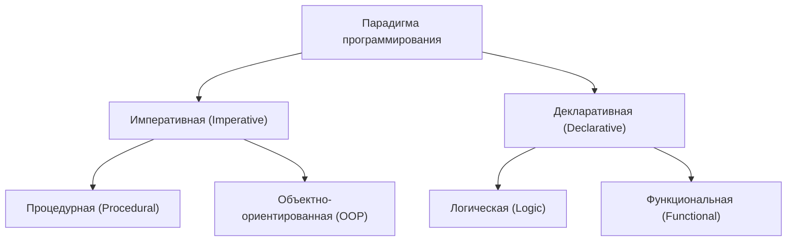
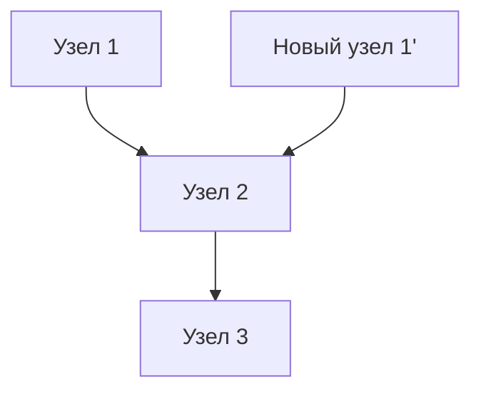

# 1. Введение: Смена парадигмы на функциональное программирование

В современной разработке программного обеспечения **функциональное программирование (Functional Programming, FP)** больше не ограничивается академической сферой и широко признано как практическая парадигма.
По сравнению с исторически доминирующими императивным и объектно-ориентированным программированием, функциональное программирование использует фундаментально иной подход: оно рассматривает вычисления как оценку математических функций и избегает изменения состояния и изменяемых данных.

В этой статье мы подробно и систематично рассмотрим все: от основных концепций функционального программирования, таких как чистые функции и неизменяемость, до продвинутой концепции «монад», на которой спотыкаются многие учащиеся.

## 1.1 Классификация парадигм программирования



## 1.2 Лямбда-исчисление: Математические основы

Теоретической основой функционального программирования является **лямбда-исчисление (Lambda Calculus)**, разработанное Алонзо Черчем и другими в 1930-х годах.
Эта вычислительная модель, основанная на применении функций и связывании переменных, обладает вычислительной мощностью, эквивалентной машине Тьюринга.

Математически лямбда-выражения определяются следующим образом:


$$
E ::= x \mid \lambda x. E \mid E_1 E_2
$$


Здесь $ — переменная, $\lambda x. E$ — абстракция (определение функции), а E_2$ — применение функции.

# 2. Чистые функции (Pure Functions)

Самой важной концепцией, лежащей в основе функционального программирования, являются **чистые функции**.

## 2.1 Определение чистых функций

Функция называется «чистой», если она одновременно удовлетворяет следующим двум условиям:

1.  **Ссылочная прозрачность (Referential Transparency)** : При одинаковых входных данных всегда возвращается абсолютно одинаковый результат. Это означает, что результат функции не зависит от локального состояния, глобального состояния, ввода/вывода и т.д.
2.  **Отсутствие побочных эффектов (No Side Effects)** : Выполнение функции не изменяет никакого состояния системы. Перезапись глобальных переменных, запись в файл, обновление базы данных, вывод в консоль и т.д. являются побочными эффектами.

### Пример чистой функции

```javascript
// Чистая функция
function add(a, b) {
    return a + b;
}
```

### Пример нечистой функции

```javascript
let total = 0;
// Нечистая функция (зависит от внешнего состояния и изменяет его)
function addToTotal(a) {
    total += a;
    return total;
}
```

## 2.2 Преимущества чистых функций

Чистые функции имеют следующие мощные преимущества:

-   **Тестируемость** : Нет необходимости настраивать внешнее состояние, и тесты выполняются только для пар ввода и вывода.
-   **Безопасность параллельной обработки** : Поскольку состояние не разделяется и не изменяется, состояния гонки (Race Condition) в многопоточных средах не возникают.
-   **Мемоизация (Memoization)** : Поскольку одни и те же входные данные всегда возвращают одни и те же выходные данные, результаты можно кэшировать для оптимизации производительности.

# 3. Неизменяемость (Immutability)

Неизменяемость — это свойство, при котором однажды созданная структура данных или состояние никогда не изменяется впоследствии.

## 3.1 Избегание изменения состояния

В императивном программировании вычисления развиваются путем обновления значений переменных, но в функциональном программировании вместо изменения существующих данных используется подход **создания и возврата новых данных**.

```python
# Императивный подход (деструктивное изменение)
numbers = [1, 2, 3]
numbers.append(4)

# Функциональный подход (недеструктивный)
numbers1 = [1, 2, 3]
numbers2 = numbers1 + [4]
```

## 3.2 Персистентные структуры данных

Копирование новых данных каждый раз при сохранении неизменяемости может показаться неэффективным. Однако многие функциональные языки используют **персистентные структуры данных (Persistent Data Structures)** для оптимизации использования памяти и скорости выполнения за счет совместного использования частей структуры данных до и после внесения изменений.



Таким образом, новый список повторно использует существующие узлы.

# 4. Концепция монад (Monads)

Наибольшим препятствием при изучении функционального программирования считаются **монады (Monad)**.

## 4.1 Что такое монада?

Проще говоря, монада — это «паттерн проектирования, инкапсулирующий контекст вычислений». В чистых функциональных языках они используются для безопасной и чистой обработки побочных эффектов (ввод/вывод, изменение состояния, обработка исключений и т.д.).

В теории категорий (Category Theory) монада определяется как моноид в категории эндофункторов:


\text{Монада}(M) = \langle M, \eta, \mu \rangle


В контексте программирования монада представлена как класс типов, имеющий следующие три элемента:

1.  **Конструктор типа** : Оборачивает любой тип $ в контекст \ a$
2.  **return (или pure)** : Функция, которая оборачивает значение в контекст монады (Тип:  \to M\ a$)
3.  **bind (или >>=, flatMap)** : Функция, которая извлекает значение монады, передает его следующей функции и снова возвращает результат как монаду (Тип: \ a \to (a \to M\ b) \to M\ b$)

## 4.2 Монада Maybe

Наиболее понятным примером монады является монада Maybe (или Option). Она представляет контекст, в котором «значение может не существовать».

```haskell
data Maybe a = Just a | Nothing
```

Используя монада Maybe, можно лаконично записать цепочку проверок на ошибки.

## 4.3 Законы монад

Чтобы вести себя как монада, необходимо удовлетворять следующим трем правилам (законам монад).

1.  **Левая единица** : return a >>= f $\equiv$ f a
2.  **Правая единица** : m >>= return $\equiv$ m
3.  **Ассоциативность** : (m >>= f) >>= g $\equiv$ m >>= (\x -> f x >>= g)

# 5. Преимущества функционального программирования и перспективы

Благодаря своему декларативному стилю и мощной математической основе, функциональное программирование позволяет создавать расширяемое программное обеспечение с меньшим количеством ошибок и легким тестированием.

-   **Модульность** : Комбинируя чистые функции, можно создавать переиспользуемые компоненты.
-   **Простота отладки** : Уменьшается необходимость отслеживать изменения состояния.

## Заключение

Концепции функционального программирования, такие как чистые функции, неизменяемость и монады, поначалу могут показаться сложными для понимания. Однако понимание и применение этих концепций на практике позволит вам писать более надежный и легко поддерживаемый код. В современной разработке сложных систем важность функционального программирования будет только расти в будущем.
