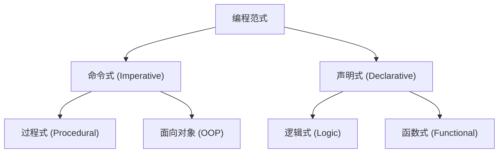
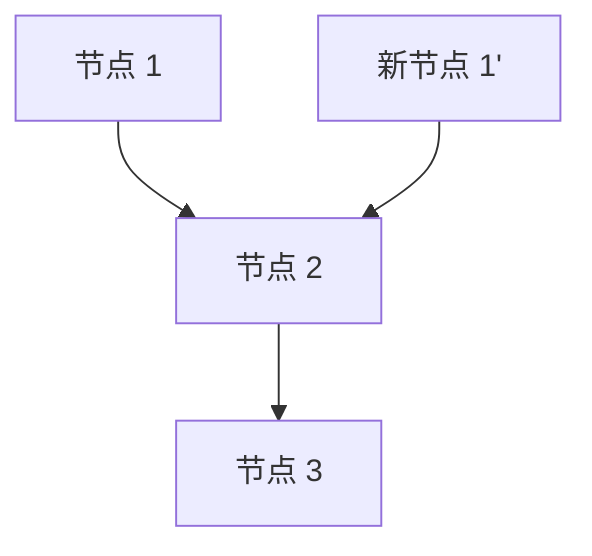

# 1. 引言：函数式编程的范式转变

在现代软件开发中， **函数式编程 (Functional Programming, FP)** 已经不再局限于学术领域，而是作为一种实用的编程范式被广泛认可。
与历史上主流的命令式编程或面向对象编程相比，函数式编程采用了一种根本不同的方法：“将计算视为数学函数的求值，并避免状态的变化和可变数据”。

本文将极其详细且系统地讲解，从函数式编程基础的纯函数和不可变性，到许多学习者容易受挫的高级概念“单子 (Monad)”。

## 1.1 编程范式的分类



## 1.2 Lambda演算：数学基础

函数式编程的理论基础在于阿隆佐·邱奇等人于20世纪30年代发明的 **Lambda演算 (Lambda Calculus)** 。
这种以函数应用和变量绑定为基础的计算模型，具有与图灵机同等的计算能力。

在数学上，Lambda表达式定义如下：

$$
E ::= x \mid \lambda x. E \mid E_1 E_2
$$

在这里，$x$ 是变量，$\lambda x. E$ 表示抽象（函数定义），$E_1 E_2$ 表示函数应用。

# 2. 纯函数 (Pure Functions)

构成函数式编程核心的最重要的概念就是 **纯函数** 。

## 2.1 纯函数的定义

如果一个函数被称为“纯”，意味着它同时满足以下两个条件：

1.  **引用透明性 (Referential Transparency)** ：对于相同的输入，始终返回完全相同的输出。这意味着函数的结果不依赖于局部状态、全局状态、I/O 等。
2.  **无副作用 (No Side Effects)** ：执行函数不会改变系统的任何状态。修改全局变量、写入文件、更新数据库、输出到控制台等都属于副作用。

### 纯函数的示例

```javascript
// 纯函数
function add(a, b) {
    return a + b;
}
```

### 非纯函数的示例

```javascript
let total = 0;
// 非纯函数（依赖并修改外部状态）
function addToTotal(a) {
    total += a;
    return total;
}
```

## 2.2 纯函数的优势

纯函数具有以下强大的优势：

-   **易于测试** ：不需要设置外部状态，仅凭输入和输出对即可完成测试。
-   **并发处理的安全性** ：由于不共享和修改状态，在多线程环境下不会发生竞争条件 (Race Condition)。
-   **记忆化 (Memoization)** ：因为对相同的输入总是返回相同的输出，可以缓存结果以优化性能。

# 3. 不可变性 (Immutability)

不可变性是指数据结构或状态一旦被创建，之后绝不被修改的性质。

## 3.1 避免状态变更

在命令式编程中，我们通过更新变量的值来推进计算；而在函数式编程中，不修改现有数据，而是采取 **创建并返回新数据** 的方法。

```python
# 命令式方法（破坏性修改）
numbers = [1, 2, 3]
numbers.append(4)

# 函数式方法（非破坏性）
numbers1 = [1, 2, 3]
numbers2 = numbers1 + [4]
```

## 3.2 持久化数据结构

保持不可变性并在每次都复制新数据看起来可能效率低下。然而，许多函数式语言使用 **持久化数据结构 (Persistent Data Structures)** ，在修改前后共享部分数据结构，从而优化内存效率和执行速度。



这样，新列表会复用现有的节点。

# 4. 单子 (Monads) 的概念

在学习函数式编程时，被认为是最大障碍的就是 **单子 (Monad)** 。

## 4.1 单子是什么？

简单来说，单子是“封装计算上下文 (Context) 的设计模式”。在纯函数式语言中，它用于以安全且纯粹的方式处理副作用（I/O、状态变更、异常处理等）。

在范畴论 (Category Theory) 中，单子被定义为自函子范畴上的幺半群：

$$
\text{单子}(M) = \langle M, \eta, \mu \rangle
$$

在编程的上下文中，单子被表现为具有以下三个元素的类型类：

1.  **类型构造器** ：将任意类型 $a$ 包装到上下文中的 $M\ a$
2.  **return (或 pure)** ：将值包装到单子上下文中的函数（类型：$a \to M\ a$）
3.  **bind (或 >>=, flatMap)** ：取出单子的值，传递给下一个函数，并再次将结果作为单子返回的函数（类型：$M\ a \to (a \to M\ b) \to M\ b$）

## 4.2 Maybe 单子

最易懂的单子示例是 Maybe (或 Option) 单子。这表达了“值可能不存在”的上下文。

```haskell
data Maybe a = Just a | Nothing
```

通过使用 Maybe 单子，可以简洁地编写错误检查的链式调用。

## 4.3 单子定律

为了表现为单子，必须满足以下三个规则（单子定律）。

1.  **左单位元** ：return a >>= f $\equiv$ f a
2.  **右单位元** ：m >>= return $\equiv$ m
3.  **结合律** ：(m >>= f) >>= g $\equiv$ m >>= (\x -> f x >>= g)

# 5. 函数式编程的优势与未来展望

函数式编程凭借其声明式的风格和强大的数学基础，使得构建漏洞少、易于测试、高扩展性的软件成为可能。

-   **模块化** ：通过组合纯函数，可以创建可重用的组件。
-   **易于调试** ：减少了追踪状态变化的需要。

## 结论

纯函数、不可变性、单子等函数式编程概念，起初可能显得晦涩难懂。但是，通过理解并实践这些概念，将能够编写出更健壮、更易于维护的代码。在现代复杂系统开发中，函数式编程的重要性在未来将进一步提升。
