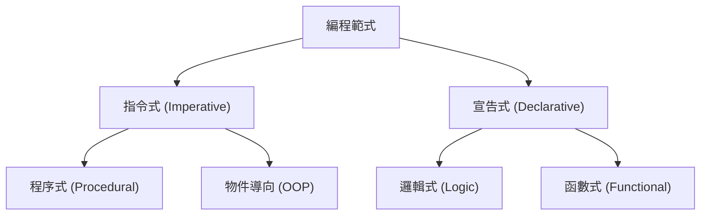
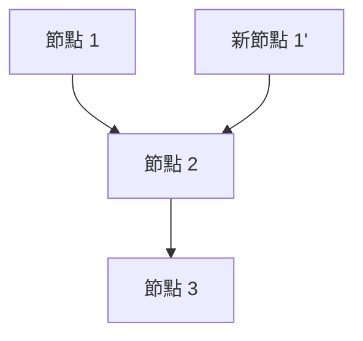

# 1. 簡介：函數式編程的範式轉移

在現代軟體開發中， **函數式編程 (Functional Programming, FP)** 早已不再侷限於學術領域，而是作為一種實用的範式被廣泛認可。
相較於歷史上主流的指令式編程或物件導向編程，函數式編程採取了一種根本不同的方法，即「將計算視為數學函數的求值，並避免狀態改變或可變數據」。

本文將從函數式編程基礎的純函數與不變性等概念開始，到許多學習者容易遇到瓶頸的進階概念「單子 (Monad)」，進行極其詳細且系統性的解說。

## 1.1 編程範式的分類



## 1.2 λ 演算：數學基礎

函數式編程的理論基礎在於由阿隆佐·邱奇等人於 1930 年代所提出的 **λ 演算 (Lambda Calculus)** 。
這個以函數應用與變數綁定為基礎的計算模型，擁有與圖靈機同等的計算能力。

在數學上，λ 運算式定義如下：


$$
E ::= x \mid \lambda x. E \mid E_1 E_2
$$


這裡，$x$ 代表變數，$\lambda x. E$ 代表抽象化（函數定義），$E_1 E_2$ 代表函數應用。

# 2. 純函數 (Pure Functions)

構成函數式編程核心最重要的概念就是 **純函數** 。

## 2.1 純函數的定義

一個函數被稱為「純粹」，是指它同時滿足以下兩個條件：

1.  **參照透明性 (Referential Transparency)** ：對於相同的輸入，總是回傳完全相同的輸出。這意味著函數的結果不依賴於區域狀態、全域狀態或 I/O 等。
2.  **無副作用 (No Side Effects)** ：執行函數不會改變系統的任何狀態。例如修改全域變數、寫入檔案、更新資料庫、輸出到終端機等，皆屬於副作用。

### 純函數的範例

```javascript
// 純函數
function add(a, b) {
    return a + b;
}
```

### 非純函數的範例

```javascript
let total = 0;
// 非純函數（依賴並修改外部狀態）
function addToTotal(a) {
    total += a;
    return total;
}
```

## 2.2 純函數的優勢

純函數具有以下強大的優點：

-   **易於測試** ：不需要設定外部狀態，只需透過輸入與輸出的組合即可完成測試。
-   **並發處理的安全性** ：因為不共享也不改變狀態，在多執行緒環境中不會發生競爭危害 (Race Condition)。
-   **記憶化 (Memoization)** ：由於相同輸入總是得到相同輸出，可以將結果快取起來以最佳化效能。

# 3. 不變性 (Immutability)

不變性是指資料結構或狀態一旦建立後，就絕對不會再被修改的特性。

## 3.1 避免狀態的改變

在指令式編程中，我們透過更新變數的值來推進計算；但在函數式編程中，我們不修改現有資料，而是採取 **建立並回傳新資料** 的方法。

```python
# 指令式方法（破壞性變更）
numbers = [1, 2, 3]
numbers.append(4)

# 函數式方法（非破壞性）
numbers1 = [1, 2, 3]
numbers2 = numbers1 + [4]
```

## 3.2 永續資料結構

每次都為了保持不變性而複製新資料，看起來似乎效率低落。然而，許多函數式語言採用了 **永續資料結構 (Persistent Data Structures)** ，透過在變更前後共享部分資料結構，來最佳化記憶體效率與執行速度。



如此一來，新的列表就能重複利用現有的節點。

# 4. 單子 (Monads) 的概念

在學習函數式編程的過程中，被視為最大障礙的就是 **單子 (Monad)** 。

## 4.1 什麼是單子？

簡單來說，單子是「將計算的上下文 (Context) 封裝起來的設計模式」。在純函數式語言中，它是為了能安全且純粹地處理副作用（I/O、狀態變更、例外處理等）而使用的。

在範疇論 (Category Theory) 中，單子被定義為自函子範疇上的么半群：


\text{單子}(M) = \langle M, \eta, \mu \rangle


在編程的上下文中，單子表現為具備以下三個元素的型別類別 (Type Class)：

1.  **型別建構子** ：將任意型別 $a$ 包裝到上下文 $M\ a$ 中
2.  **return (或 pure)** ：將值包裝進單子上下文的函數（型別：$a \to M\ a$）
3.  **bind (或 >>=, flatMap)** ：取出單子中的值，傳遞給下一個函數，並將結果再次作為單子回傳的函數（型別：$M\ a \to (a \to M\ b) \to M\ b$）

## 4.2 Maybe 單子

最容易理解的單子範例就是 Maybe (或 Option) 單子。它表達了「值可能不存在」的上下文。

```haskell
data Maybe a = Just a | Nothing
```

透過使用 Maybe 單子，可以簡潔地撰寫連續的錯誤檢查。

## 4.3 單子定律

為了表現得像一個單子，必須滿足以下三個規則（單子定律）。

1.  **左單位元素** ：return a >>= f $\equiv$ f a
2.  **右單位元素** ：m >>= return $\equiv$ m
3.  **結合律** ：(m >>= f) >>= g $\equiv$ m >>= (\x -> f x >>= g)

# 5. 函數式編程的優勢與未來展望

函數式編程憑藉其宣告式的風格與強大的數學基礎，使得建立臭蟲較少、易於測試且具備高擴展性的軟體成為可能。

-   **模組化** ：透過組合純函數，可以建立可重複使用的元件。
-   **易於除錯** ：減少了追蹤狀態改變的需求。

## 結論

純函數、不變性與單子等函數式編程的概念，一開始可能會覺得晦澀難懂。然而，只要理解並實踐這些概念，就能寫出更強健且更易於維護的程式碼。在現代複雜的系統開發中，函數式編程的重要性未來將會進一步增加。
