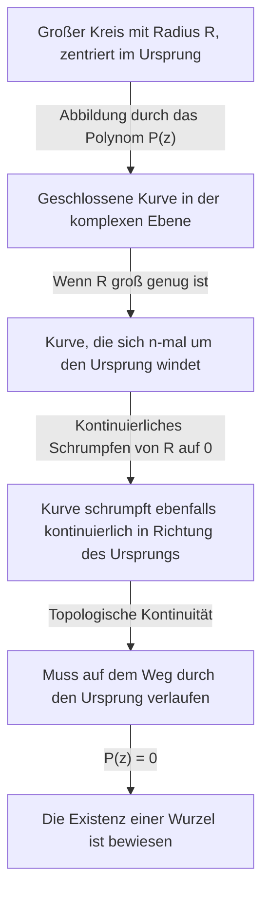

## Einleitung: Die Suche nach Gleichungen und Wurzeln

Die Geschichte der Mathematik ist auch die Geschichte der Suche nach unbekannten Zahlen. Wenn wir in der Mittelschule quadratische Gleichungen studieren, lernen wir die Mitternachtsformel. Wenn wir uns jedoch auf den Bereich der reellen Zahlen beschränken, stellen wir schnell fest, dass es Gleichungen "ohne reelle Lösung" gibt. Beispielsweise hat die Gleichung $x^2 + 1 = 0$ im System der reellen Zahlen keine Lösung. Dies liegt daran, dass das Quadrat einer beliebigen reellen Zahl $x$ immer größer oder gleich $0$ ist, und das Addieren von $1$ niemals $0$ ergeben kann.

Um dieses Problem zu lösen, wurde eine hypothetische Zahl eingeführt, deren Quadrat $-1$ ist – nämlich die imaginäre Einheit $i$. Das Zahlensystem, das diese Einheit einschließt, wird als komplexe Zahlen bezeichnet. Durch die Einführung komplexer Zahlen können die Lösungen für $x^2 + 1 = 0$ als $x = \pm i$ gefunden werden.

Hier stellt sich eine große Frage: "Wenn wir das Zahlensystem auf komplexe Zahlen erweitern, können wir dann sagen, dass jede Gleichung immer eine Lösung haben wird?" Oder: "Werden wir jemals eine weitere neue Art von Zahl einführen müssen?"

Die Mathematik liefert eine sehr klare und schöne Antwort auf diese Frage. Das ist das Thema dieses Artikels: der **[Fundamentalsatz der Algebra](https://kenji.blog/p/fundamental-theorem-of-algebra/)**. Dieser Satz besagt, dass "jedes Polynom $n$-ten Grades mit komplexen Koeffizienten immer eine Wurzel (Lösung) innerhalb der komplexen Zahlen hat". Mit anderen Worten, in dem riesigen Ozean der komplexen Zahlen existiert die Lösung für jede Gleichung immer, was garantiert, dass keine weiteren neuen Zahlen erfunden werden müssen.

In diesem Artikel werden wir diesen **[Fundamentalsatz der Algebra](https://kenji.blog/p/fundamental-theorem-of-algebra/)** im Detail erklären, angefangen bei seinem historischen Hintergrund über einen intuitiven Ansatz basierend auf der Topologie bis hin zur Präsentation eines strengen und schönen Beweises unter Verwendung der komplexen Analysis.

## Historischer Hintergrund des Fundamentalsatzes der Algebra

Der **[Fundamentalsatz der Algebra](https://kenji.blog/p/fundamental-theorem-of-algebra/)** wurde nicht über Nacht bewiesen. Viele große Mathematiker kämpften darum, einen vollständigen Beweis zu erbringen, ohne jemals an der Wahrheit des Satzes zu zweifeln.

Im 17. Jahrhundert wussten Mathematiker wie [René Descartes](https://kenji.blog/p/descartes/) und Albert Girard bereits empirisch, dass "eine Gleichung $n$-ten Grades $n$ Wurzeln haben sollte". Innerhalb des mathematischen Rahmens der damaligen Zeit gab es jedoch keine strenge Möglichkeit, dies zu beweisen.

Zu Beginn des 18. Jahrhunderts versuchten mathematische Riesen wie Jean le Rond d'Alembert und [Leonhard Euler](https://kenji.blog/p/euler/) den Beweis. D'Alembert veröffentlichte 1746 einen Beweis, und der Satz wird in Frankreich manchmal als "Satz von d'Alembert" bezeichnet; nach modernen Maßstäben mangelte es seinem Beweis jedoch in bestimmten Bereichen an topologischer Strenge. Euler versuchte auch zu zeigen, dass jedes Polynom mit reellen Koeffizienten in das Produkt linearer und quadratischer Polynome faktorisiert werden könnte, hinterließ aber eine logische Lücke.

Der erste im Wesentlichen vollständige Beweis für diesen uneinnehmbaren Satz wurde von keinem Geringeren als [Carl Friedrich Gauss](https://kenji.blog/p/gauss/) erbracht. In seiner Dissertation von 1799 wies er auf die Mängel in den Beweisen der vorhergehenden Mathematiker hin und präsentierte einen Beweis, der auf geometrischer Intuition basierte. Gauss lieferte im Laufe seines Lebens vier verschiedene Beweise für diesen Satz, was zeigt, welche Bedeutung er ihm beimaß.

Der heute standardmäßigste und eleganteste Beweis gilt als derjenige, der auf der Theorie der komplexen Analysis basiert, die von dem französischen Mathematiker Joseph Liouville und anderen aufgebaut wurde. In der zweiten Hälfte dieses Artikels werden wir den Beweis mit Hilfe des Satzes von Liouville vorstellen.

## Genaue Formulierung des Satzes

Lassen Sie uns zunächst die Aussage des Satzes in mathematisch genauen Begriffen beschreiben.

**Satz ([Fundamentalsatz der Algebra](https://kenji.blog/p/fundamental-theorem-of-algebra/))**
Für jede natürliche Zahl $n \ge 1$ und komplexe Koeffizienten $a_0, a_1, \dots, a_n$ (wobei $a_n \neq 0$), wird ein Polynom $P(z)$ wie folgt definiert:

$$
P(z) = a_n z^n + a_{n-1} z^{n-1} + \dots + a_1 z + a_0
$$

Dann hat die Gleichung $P(z) = 0$ mindestens eine Lösung in der komplexen Ebene. Das heißt, es existiert eine komplexe Zahl $\alpha$, so dass $P(\alpha) = 0$.

Auf den ersten Blick heißt es nur "mindestens eine", aber durch die Kombination mit dem Polynomrestsatz können wir leicht die stärkere Aussage ableiten, dass "eine Gleichung $n$-ten Grades genau $n$ komplexe Lösungen hat, wenn man die Vielfachheiten mitzählt". (Dieser Punkt wird im Abschnitt "Korollar des Satzes" weiter unten ausführlich erklärt).

## Intuitives Verständnis: Topologischer Ansatz

Bevor wir in den strengen Beweis eintauchen, lassen Sie uns ein intuitives Bild davon erfassen, warum dieser Satz gilt. Hier stellen wir einen Ansatz vor, der das Konzept der "Windungszahl" (Winding number) aus der Topologie verwendet.

Stellen wir einen Punkt in der komplexen Ebene in Polarform als $z = R e^{i\theta}$ dar. Hier ist $R$ der Abstand (Radius) vom Ursprung, und $\theta$ ist der Winkel.

Betrachten Sie das Polynom $P(z) = a_n z^n + a_{n-1} z^{n-1} + \dots + a_0$. Wenn $R$ sehr groß ist, wird der Betrag von $z$ massiv, und der Wert des Polynoms wird fast vollständig vom Term höchsten Grades $a_n z^n$ dominiert. Das heißt, wenn $R$ groß genug ist, können wir $P(z) \approx a_n z^n$ annähern.

Nehmen wir nun an, wir lassen $z$ einen vollen Kreis entlang eines riesigen Kreises mit dem Radius $R$ wandern. Wenn $\theta$ sich von $0$ bis $2\pi$ ändert, wird der Winkel von $z^n$ zu $n\theta$, was sich von $0$ bis $2n\pi$ ändert. Dies bedeutet, dass die von $P(z)$ gezeichnete Bahn zu einer geschlossenen Kurve wird, die sich genau $n$-mal um den Ursprung der komplexen Ebene windet.

Stellen Sie sich als Nächstes den Prozess vor, bei dem dieser Radius $R$ kontinuierlich verkleinert wird. Wenn $R$ allmählich abnimmt, verformt sich auch die von $P(z)$ gezeichnete geschlossene Kurve kontinuierlich. Schließlich, wenn $R = 0$, schrumpft die Kurve auf einen einzigen Punkt, $P(0) = a_0$.

Kontinuität ist hier der Schlüssel. Eine große Schleife, die sich anfangs $n$-mal um den Ursprung wand, schrumpft letztendlich auf einen einzigen Punkt, der den Ursprung nicht enthält. Topologisch ist es unmöglich, dass die Schleife kontinuierlich auf einen vom Ursprung entfernten Punkt schrumpft, ohne den Ursprung zu kreuzen. Mit anderen Worten, irgendwo im Schrumpfungsprozess muss diese Kurve durch den Ursprung ($0$) verlaufen.

Der Moment, in dem die Kurve durch den Ursprung verläuft, bedeutet genau, dass ein $z$ existiert, so dass $P(z) = 0$. Dies ist der intuitive Grund, warum immer eine Lösung existieren muss.

## Vorbereitung aus der Komplexen Analysis: Satz von Liouville

Nachdem wir ein intuitives Verständnis erlangt haben, werden wir nun den schönsten und strengsten Beweis der modernen Mathematik vorstellen. Dieser Beweis nutzt eine mächtige Waffe der komplexen Analysis: den **Satz von Liouville**.

Die komplexe Analysis ist das Gebiet, das sich mit der Infinitesimalrechnung von Funktionen komplexer Variablen befasst. Im Gegensatz zu Funktionen reeller Zahlen ist die Differenzierbarkeit (Holomorphie) komplexer Funktionen eine extrem starke Bedingung; eine komplexe Funktion, die auch nur einmal differenzierbar ist, hat die erstaunliche Eigenschaft, unendlich oft differenzierbar zu sein und in eine Taylorreihe entwickelt werden zu können.

Eine Funktion, die in der gesamten komplexen Ebene differenzierbar (holomorph) ist, wird als **ganze Funktion** bezeichnet. Polynome $P(z)$ und die Exponentialfunktion $e^z$ sind typische Beispiele für ganze Funktionen.

Der Satz von Liouville ist ein zutiefst mächtiger Satz bezüglich dieser ganzen Funktionen.

**Satz (Satz von Liouville)**
Jede beschränkte ganze Funktion muss eine konstante Funktion sein.

Hier bedeutet "beschränkt", dass für alle komplexen Zahlen $z$ der Betrag der Funktion $|f(z)|$ eine bestimmte reelle Zahl $M$ nicht überschreitet; das heißt, es existiert ein $M$, so dass $|f(z)| \le M$.

In der Welt der reellen Zahlen ist eine Funktion wie $f(x) = \sin(x)$ über die gesamte Zahlengerade differenzierbar und durch $-1 \le \sin(x) \le 1$ beschränkt. Sie ist keine konstante Funktion. Der Satz von Liouville besagt jedoch, dass dies in der komplexen Welt niemals passieren kann. Wenn eine Funktion in der gesamten komplexen Ebene holomorph ist und ihr Wert nicht gegen unendlich divergiert, ist sie lediglich eine flache Konstante.

## Strenger Beweis des Fundamentalsatzes der Algebra

Lassen Sie uns nun den [Fundamentalsatz der Algebra](https://kenji.blog/p/fundamental-theorem-of-algebra/) mit Hilfe des Satzes von Liouville beweisen. Sie werden von der Brillanz dieses Beweises erstaunt sein. Hier verwenden wir einen Beweis durch Widerspruch.

**Beweis**

Nehmen wir an, dass für ein beliebiges Polynom $n$-ten Grades ($n \ge 1$) mit komplexen Koeffizienten $P(z) = a_n z^n + \dots + a_1 z + a_0$ (wobei $a_n \neq 0$) die Gleichung $P(z) = 0$ keine Lösung in der komplexen Ebene hat.

Das heißt, nehmen wir an, dass $P(z) \neq 0$ für alle komplexen Zahlen $z$ gilt.

Dann definieren Sie eine neue Funktion $f(z)$ wie folgt:

$$
f(z) = \frac{1}{P(z)}
$$

Nach unserer Annahme wird der Nenner $P(z)$ niemals $0$, so dass diese Funktion $f(z)$ nirgendwo in der komplexen Ebene Singularitäten (Punkte, an denen der Nenner $0$ ist) aufweist. Da das Polynom $P(z)$ überall holomorph (differenzierbar) ist, ist auch sein Kehrwert holomorph, solange er nicht gleich $0$ ist. Daher ist $f(z)$ eine Funktion, die in der gesamten komplexen Ebene holomorph ist, also eine **ganze Funktion**.

Als Nächstes untersuchen wir das Verhalten von $f(z)$, wenn $|z|$ gegen unendlich geht. Unter Verwendung der Dreiecksungleichung wird, wenn $|z|$ ausreichend groß ist, die Größe des Betrags des Polynoms $P(z)$ vom Term höchsten Grades dominiert, was somit gegen unendlich divergiert.

Streng genommen, wenn $|z| \to \infty$,

$$
|P(z)| = |z|^n \left| a_n + \frac{a_{n-1}}{z} + \dots + \frac{a_0}{z^n} \right| \to \infty
$$

Die Tatsache, dass der Betrag von $P(z)$ gegen unendlich divergiert, bedeutet, dass der Betrag seines Kehrwerts $f(z) = 1/P(z)$ gegen $0$ konvergiert.

Das heißt,

$$
\lim_{|z| \to \infty} |f(z)| = 0
$$

Ein Grenzwert von $0$ bedeutet, dass außerhalb eines Kreises mit einem ausreichend großen Radius $R$ der Wert beschränkt werden kann, zum Beispiel $|f(z)| \le 1$.
Andererseits muss eine stetige Funktion innerhalb der abgeschlossenen Kreisscheibenregion (einer beschränkten abgeschlossenen Region), die das Innere des Kreises mit dem Radius $R$ einschließt, einen Maximalwert haben.
Daher überschreitet der Betrag von $f(z)$ sowohl außerhalb als auch innerhalb des Kreises niemals eine bestimmte endliche obere Schranke. Das heißt, $f(z)$ ist eine **beschränkte** Funktion.

Bis zu diesem Punkt haben wir gezeigt, dass $f(z)$ sowohl eine "ganze Funktion" als auch "beschränkt" ist.
Hier wenden wir den **Satz von Liouville** an. Eine beschränkte ganze Funktion muss eine Konstante sein. Daher existiert eine komplexe Zahl $c$, so dass für alle $z$ gilt:

$$
f(z) = c
$$

Da jedoch $\lim_{|z| \to \infty} f(z) = 0$, muss diese Konstante $c$ gleich $0$ sein.
Das heißt, $f(z) = 0$ für alle $z$.

Da aber $f(z) = \frac{1}{P(z)}$, ist es unmöglich, dass die gebrochen rationale Funktion gleich $0$ ist (weil der Zähler $1$ ist). Dies ist ein klarer Widerspruch.

Dieser Widerspruch ergab sich aus unserer Annahme, dass "$P(z) = 0$ keine Lösung in der komplexen Ebene hat".
Somit ist durch Widerspruch bewiesen, dass $P(z) = 0$ mindestens eine Lösung in der komplexen Ebene hat.

(Ende des Beweises)

## Korollar des Satzes: Faktorisierung in Linearfaktoren

Der [Fundamentalsatz der Algebra](https://kenji.blog/p/fundamental-theorem-of-algebra/) garantiert die Existenz von "mindestens einer Lösung". Durch die Kombination dieser Tatsache mit dem **Faktorsatz** für die Polynomdivision können wir beweisen, dass ein Polynom vollständig in ein Produkt von linearen Termen faktorisiert werden kann.

Gegeben sei ein Polynom $n$-ten Grades $P_n(z)$, besagt der [Fundamentalsatz der Algebra](https://kenji.blog/p/fundamental-theorem-of-algebra/), dass eine Lösung $\alpha_1$ existiert, so dass $P_n(\alpha_1) = 0$. Nach dem Faktorsatz hat $P_n(z)$ den Faktor $(z - \alpha_1)$. Das heißt, es kann wie folgt faktorisiert werden:

$$
P_n(z) = (z - \alpha_1) P_{n-1}(z)
$$

Hier ist $P_{n-1}(z)$ ein Polynom vom Grad $n-1$. Wenn $n-1 \ge 1$, können wir den [Fundamentalsatz der Algebra](https://kenji.blog/p/fundamental-theorem-of-algebra/) erneut anwenden, um eine Lösung $\alpha_2$ für $P_{n-1}(z)$ zu finden. Durch $n$-maliges Wiederholen können wir es vollständig wie folgt faktorisieren:

$$
P_n(z) = a_n (z - \alpha_1)(z - \alpha_2) \dots (z - \alpha_n)
$$

Aus diesem Ergebnis können wir die zutiefst schöne und vollständige Schlussfolgerung ziehen, dass **"eine Gleichung $n$-ten Grades mit komplexen Koeffizienten genau $n$ Lösungen hat, wenn man die Vielfachheiten mitzählt"**. Aus diesem Grund wird er als "Fundamentalsatz" bezeichnet.

Darüber hinaus muss für Polynome, bei denen alle Koeffizienten reelle Zahlen sind, wenn $\alpha$ eine Lösung ist, auch ihr komplex Konjugiertes $\overline{\alpha}$ eine Lösung sein. Unter Verwendung dieser Eigenschaft können wir auch die Tatsache ableiten, dass "jedes Polynom mit reellen Koeffizienten innerhalb der reellen Zahlen vollständig in ein Produkt von linearen und quadratischen Polynomen faktorisiert werden kann".

## Fazit

In diesem Artikel haben wir uns eingehend mit dem [Fundamentalsatz der Algebra](https://kenji.blog/p/fundamental-theorem-of-algebra/) befasst und seinen historischen Hintergrund, die topologische Intuition und den komplex analytischen Beweis mit Hilfe des Satzes von Liouville behandelt.

Auf den ersten Blick handelt es sich um einen Satz über algebraische Gleichungen, aber die Tatsache, dass sein elegantester Beweis die Kraft der Analysis (Infinitesimalrechnung) und der Topologie ausleiht, zeigt die Tiefe der Mathematik und die Schönheit, wie verschiedene Bereiche eng miteinander verflochten sind.

Die lange Suche der Menschheit nach den Wurzeln von Gleichungen gewann durch die Einführung der neuen imaginären Zahlen die riesige Bühne der komplexen Ebene, und die Vollständigkeit dieser Bühne wurde durch den [Fundamentalsatz der Algebra](https://kenji.blog/p/fundamental-theorem-of-algebra/) bewiesen. Dieser Satz wurde zum Schlüssel, der die glänzenden Türen zur Galois-Theorie und zur algebraischen Geometrie öffnete, die das Fundament der modernen Mathematik bilden.
