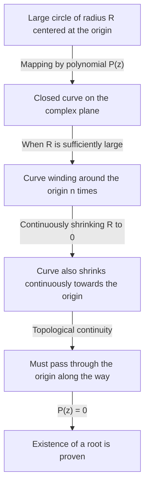

## Introduction: The Quest for Equations and Roots

The history of mathematics is also the history of the quest for unknown numbers. When we study quadratic equations in middle school, we learn the quadratic formula. However, if we restrict ourselves to the realm of real numbers, we quickly notice that there are equations with "no real solutions." For example, the equation $x^2 + 1 = 0$ has no solution in the real number system. This is because the square of any real number $x$ is always greater than or equal to $0$, and adding $1$ can never yield $0$.

To solve this problem, a hypothetical number whose square is $-1$ was introduced—namely, the imaginary unit $i$. The number system that includes this unit is called complex numbers. By introducing complex numbers, the solutions to $x^2 + 1 = 0$ can be found as $x = \pm i$.

Here, a grand question arises: "If we expand the number system to complex numbers, can we say that any equation will always have a solution?" Or, "Will we ever need to introduce yet another new type of number?"

Mathematics provides a very clear and beautiful answer to this question. That is the subject of this article: the **[Fundamental Theorem of Algebra](https://kenji.blog/en/p/fundamental-theorem-of-algebra/)**. This theorem asserts that "any $n$-th degree polynomial with complex coefficients always has a root (solution) within the complex numbers." In other words, within the vast ocean of complex numbers, the solution to any equation always exists, guaranteeing that there is no need to invent any more new numbers.

In this article, we will explain this **[Fundamental Theorem of Algebra](https://kenji.blog/en/p/fundamental-theorem-of-algebra/)** in detail, starting from its historical background, moving to an intuitive approach based on topology, and finally presenting a rigorous and beautiful proof using complex analysis.

## Historical Background of the [Fundamental Theorem of Algebra](https://kenji.blog/en/p/fundamental-theorem-of-algebra/)

The **[Fundamental Theorem of Algebra](https://kenji.blog/en/p/fundamental-theorem-of-algebra/)** was not proven overnight. Many great mathematicians struggled to achieve a complete proof, never doubting the truth of the theorem.

In the 17th century, mathematicians like [René Descartes](https://kenji.blog/en/p/descartes/) and Albert Girard already knew empirically that "an $n$-th degree equation should have $n$ roots." However, within the mathematical framework of the time, there was no rigorous means to prove it.

Entering the 18th century, mathematical giants like Jean le Rond d'Alembert and [Leonhard Euler](https://kenji.blog/en/p/euler/) attempted the proof. D'Alembert published a proof in 1746, and the theorem is sometimes called "d'Alembert's theorem" in France; however, by modern standards, his proof lacked topological rigor in certain areas. Euler also tried to show that any polynomial with real coefficients could be factored into the product of linear and quadratic polynomials, but left a logical gap.

The first essentially complete proof of this impregnable theorem was given by none other than [Carl Friedrich Gauss](https://kenji.blog/en/p/gauss/). In his 1799 doctoral dissertation, he pointed out the flaws in the proofs of preceding mathematicians and presented a proof based on geometric intuition. Gauss provided four different proofs for this theorem over his lifetime, indicating how much importance he attached to it.

The most standard and elegant proof today is considered to be the one based on the theory of complex analysis, built by French mathematician Joseph Liouville and others. In the latter half of this article, we will introduce the proof using Liouville's theorem.

## Precise Statement of the Theorem

First, let us describe the assertion of the theorem in mathematically precise terms.

**Theorem ([Fundamental Theorem of Algebra](https://kenji.blog/en/p/fundamental-theorem-of-algebra/))**
For any natural number $n \ge 1$ and complex coefficients $a_0, a_1, \dots, a_n$ (where $a_n \neq 0$), a polynomial $P(z)$ is defined as follows:

$$
P(z) = a_n z^n + a_{n-1} z^{n-1} + \dots + a_1 z + a_0
$$

Then, the equation $P(z) = 0$ has at least one solution on the complex plane. That is, there exists a complex number $\alpha$ such that $P(\alpha) = 0$.

At first glance, it only says "at least one," but by combining it with the Polynomial Remainder Theorem, we can easily derive the stronger assertion that "an $n$-th degree equation has exactly $n$ complex solutions, counting multiplicities." (This point will be explained in detail in the "Corollaries" section below.)

## Intuitive Understanding: Topological Approach

Before delving into the rigorous proof, let's grasp an intuitive image of why this theorem holds. Here, we introduce an approach using the concept of "winding number" from topology.

Let's represent a point on the complex plane in polar form as $z = R e^{i\theta}$. Here, $R$ is the distance (radius) from the origin, and $\theta$ is the angle.

Consider the polynomial $P(z) = a_n z^n + a_{n-1} z^{n-1} + \dots + a_0$. If $R$ is very large, the absolute value of $z$ becomes massive, and the value of the polynomial is almost entirely dominated by the highest degree term $a_n z^n$. That is, when $R$ is sufficiently large, we can approximate $P(z) \approx a_n z^n$.

Now, suppose we let $z$ travel one full circle along a giant circle of radius $R$. As $\theta$ changes from $0$ to $2\pi$, the angle of $z^n$ becomes $n\theta$, changing from $0$ to $2n\pi$. This means that the trajectory traced by $P(z)$ becomes a closed curve that winds around the origin of the complex plane exactly $n$ times.

Next, imagine the process of continuously shrinking this radius $R$. As $R$ gradually decreases, the closed curve traced by $P(z)$ also continuously deforms. Eventually, when $R = 0$, the curve shrinks to a single point, $P(0) = a_0$.

Continuity is the key here. A large loop that initially wound around the origin $n$ times ultimately shrinks to a single point that does not contain the origin. Topologically, it is impossible for the loop to shrink continuously to a point away from the origin without crossing the origin. In other words, somewhere in the shrinking process, this curve must pass through the origin ($0$).

The moment the curve passes through the origin, it means exactly that there exists a $z$ such that $P(z) = 0$. This is the intuitive reason why a solution must always exist.

## Preparation from Complex Analysis: Liouville's Theorem

Having gained an intuitive understanding, we will now introduce the most beautiful and rigorous proof in modern mathematics. This proof uses a powerful weapon of complex analysis: **Liouville's Theorem**.

Complex analysis is the field that deals with the calculus of functions of complex variables. Unlike functions of real numbers, differentiability (holomorphy) of complex functions is an extremely strong condition; a complex function that is differentiable even once has the astonishing property of being infinitely differentiable and capable of being expanded into a Taylor series.

A function that is differentiable (holomorphic) over the entire complex plane is called an **entire function**. Polynomials $P(z)$ and the exponential function $e^z$ are typical examples of entire functions.

Liouville's theorem is a profoundly powerful theorem regarding these entire functions.

**Theorem (Liouville's Theorem)**
Every bounded entire function must be a constant function.

Here, "bounded" means that for all complex numbers $z$, the absolute value of the function $|f(z)|$ does not exceed a certain real number $M$; that is, there exists an $M$ such that $|f(z)| \le M$.

In the world of real numbers, a function like $f(x) = \sin(x)$ is differentiable over the entire number line and is bounded by $-1 \le \sin(x) \le 1$. It is not a constant function. However, Liouville's theorem asserts that this can never happen in the complex world. If a function is holomorphic over the entire complex plane and its value does not diverge to infinity, it is merely a flat constant.

## Rigorous Proof of the [Fundamental Theorem of Algebra](https://kenji.blog/en/p/fundamental-theorem-of-algebra/)

Let us now prove the [Fundamental Theorem of Algebra](https://kenji.blog/en/p/fundamental-theorem-of-algebra/) using Liouville's theorem. You will be amazed by the brilliance of this proof. Here, we use a proof by contradiction.

**Proof**

Assume that for any $n$-th degree ($n \ge 1$) polynomial with complex coefficients $P(z) = a_n z^n + \dots + a_1 z + a_0$ (where $a_n \neq 0$), the equation $P(z) = 0$ has no solution on the complex plane.

That is, assume $P(z) \neq 0$ for all complex numbers $z$.

Then, define a new function $f(z)$ as follows:

$$
f(z) = \frac{1}{P(z)}
$$

By our assumption, the denominator $P(z)$ never becomes $0$, so this function $f(z)$ has no singularities (points where the denominator is $0$) anywhere on the complex plane. Since the polynomial $P(z)$ is everywhere holomorphic (differentiable), its reciprocal is also holomorphic as long as it does not equal $0$. Therefore, $f(z)$ is a function holomorphic over the entire complex plane, that is, an **entire function**.

Next, we examine the behavior of $f(z)$ as $|z|$ approaches infinity. Using the triangle inequality, when $|z|$ is sufficiently large, the magnitude of the absolute value of the polynomial $P(z)$ is dominated by the highest degree term, thus diverging to infinity.

Strictly speaking, as $|z| \to \infty$,

$$
|P(z)| = |z|^n \left| a_n + \frac{a_{n-1}}{z} + \dots + \frac{a_0}{z^n} \right| \to \infty
$$

The fact that the absolute value of $P(z)$ diverges to infinity means that the absolute value of its reciprocal $f(z) = 1/P(z)$ converges to $0$.

That is,

$$
\lim_{|z| \to \infty} |f(z)| = 0
$$

A limit of $0$ means that outside a circle with a sufficiently large radius $R$, the value can be bounded, for instance, $|f(z)| \le 1$.
On the other hand, inside the closed disk region (a bounded closed region) including the interior of the circle of radius $R$, a continuous function must have a maximum value.
Therefore, both outside and inside the circle, the absolute value of $f(z)$ never exceeds a certain finite upper bound. That is, $f(z)$ is a **bounded** function.

Up to this point, we have shown that $f(z)$ is both an "entire function" and "bounded."
Here, we apply **Liouville's theorem**. A bounded entire function must be a constant. Therefore, there exists a complex number $c$ such that for all $z$,

$$
f(z) = c
$$

However, since $\lim_{|z| \to \infty} f(z) = 0$, this constant $c$ must be $0$.
That is, $f(z) = 0$ for all $z$.

But since $f(z) = \frac{1}{P(z)}$, it is impossible for the fractional function to equal $0$ (because the numerator is $1$). This is a clear contradiction.

This contradiction arose from our assumption that "$P(z) = 0$ has no solution on the complex plane."
Thus, by contradiction, it is proven that $P(z) = 0$ has at least one solution on the complex plane.

(End of proof)

## Corollary: Factorization into Linear Factors

The [Fundamental Theorem of Algebra](https://kenji.blog/en/p/fundamental-theorem-of-algebra/) guarantees the existence of "at least one solution." By combining this fact with the **Factor Theorem** for polynomial division, we can prove that a polynomial can be completely factored into a product of linear terms.

Given an $n$-th degree polynomial $P_n(z)$, the [Fundamental Theorem of Algebra](https://kenji.blog/en/p/fundamental-theorem-of-algebra/) states that there exists a solution $\alpha_1$ such that $P_n(\alpha_1) = 0$. According to the Factor Theorem, $P_n(z)$ has $(z - \alpha_1)$ as a factor. That is, it can be factored as follows:

$$
P_n(z) = (z - \alpha_1) P_{n-1}(z)
$$

Here, $P_{n-1}(z)$ is a polynomial of degree $n-1$. If $n-1 \ge 1$, we can apply the [Fundamental Theorem of Algebra](https://kenji.blog/en/p/fundamental-theorem-of-algebra/) again to find a solution $\alpha_2$ for $P_{n-1}(z)$. By repeating this $n$ times, we can completely factorize it as follows:

$$
P_n(z) = a_n (z - \alpha_1)(z - \alpha_2) \dots (z - \alpha_n)
$$

From this result, we can derive the profoundly beautiful and complete conclusion that **"an $n$-th degree equation with complex coefficients has exactly $n$ solutions, counting multiplicities."** This is why it is called the "Fundamental Theorem."

Moreover, for polynomials where all coefficients are real numbers, if $\alpha$ is a solution, its complex conjugate $\overline{\alpha}$ must also be a solution. Utilizing this property, we can also derive the fact that "any polynomial with real coefficients can be completely factored into a product of linear and quadratic polynomials within the real numbers."

## Conclusion

In this article, we have looked in detail at the [Fundamental Theorem of Algebra](https://kenji.blog/en/p/fundamental-theorem-of-algebra/), covering its historical background, topological intuition, and complex analytic proof using Liouville's theorem.

At first glance, it is a theorem about algebraic equations, but the fact that its most elegant proof borrows the power of analysis (calculus) and topology demonstrates the profundity of mathematics and the beauty of how different fields are closely intertwined.

Humanity's long quest to find the roots of equations gained the vast stage of the complex plane through the introduction of the new imaginary numbers, and the completeness of this stage was proven by the [Fundamental Theorem of Algebra](https://kenji.blog/en/p/fundamental-theorem-of-algebra/). This theorem became the key that opened the brilliant doors leading to [Galois theory](https://kenji.blog/en/p/galois-theory/) and algebraic geometry, which form the bedrock of modern mathematics.
