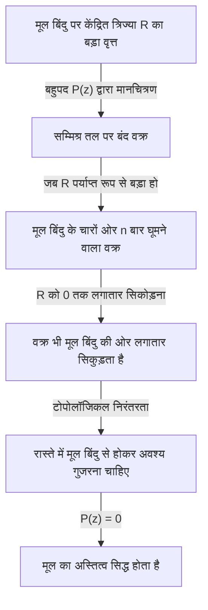

## प्रस्तावना: समीकरणों और मूलों की खोज

गणित का इतिहास अज्ञात संख्याओं की खोज का भी इतिहास है। जब हम माध्यमिक विद्यालय में द्विघात समीकरणों का अध्ययन करते हैं, तो हम द्विघात सूत्र सीखते हैं। हालाँकि, यदि हम खुद को वास्तविक संख्याओं के क्षेत्र तक ही सीमित रखते हैं, तो हम जल्दी ही ध्यान देते हैं कि "वास्तविक समाधान न होने" वाले समीकरण भी मौजूद हैं। उदाहरण के लिए, समीकरण $x^2 + 1 = 0$ का वास्तविक संख्या प्रणाली में कोई समाधान नहीं है। ऐसा इसलिए है क्योंकि किसी भी वास्तविक संख्या $x$ का वर्ग हमेशा $0$ से बड़ा या उसके बराबर होता है, और $1$ जोड़ने पर कभी भी $0$ नहीं मिल सकता है।

इस समस्या को हल करने के लिए, एक काल्पनिक संख्या पेश की गई जिसका वर्ग $-1$ है - अर्थात्, काल्पनिक इकाई $i$। वह संख्या प्रणाली जिसमें यह इकाई शामिल है, सम्मिश्र संख्याएँ कहलाती है। सम्मिश्र संख्याओं को प्रस्तुत करके, $x^2 + 1 = 0$ के समाधान को $x = \pm i$ के रूप में पाया जा सकता है।

यहाँ, एक बड़ा प्रश्न उठता है: "यदि हम सम्मिश्र संख्याओं तक संख्या प्रणाली का विस्तार करते हैं, तो क्या हम यह कह सकते हैं कि किसी भी समीकरण का हमेशा एक समाधान होगा?" या, "क्या हमें कभी भी किसी अन्य प्रकार की संख्या को प्रस्तुत करने की आवश्यकता होगी?"

गणित इस प्रश्न का बहुत ही स्पष्ट और सुंदर उत्तर देता है। यही इस लेख का विषय है: **[बीजगणित का मौलिक प्रमेय](https://kenji.blog/p/fundamental-theorem-of-algebra/)**। यह प्रमेय यह दावा करता है कि "सम्मिश्र गुणांकों वाले किसी भी $n$-घात के बहुपद का सम्मिश्र संख्याओं के भीतर हमेशा एक मूल (समाधान) होता है।" दूसरे शब्दों में, सम्मिश्र संख्याओं के विशाल महासागर के भीतर, किसी भी समीकरण का समाधान हमेशा मौजूद होता है, जिससे यह गारंटी मिलती है कि कोई और नई संख्याएँ आविष्कार करने की आवश्यकता नहीं है।

इस लेख में, हम इस **बीजगणित के मौलिक प्रमेय** की इसके ऐतिहासिक पृष्ठभूमि से लेकर टोपोलॉजी पर आधारित एक सहज दृष्टिकोण और अंततः सम्मिश्र विश्लेषण का उपयोग करके एक कठोर और सुंदर प्रमाण प्रस्तुत करते हुए विस्तार से व्याख्या करेंगे।

## बीजगणित के मौलिक प्रमेय की ऐतिहासिक पृष्ठभूमि

**[बीजगणित का मौलिक प्रमेय](https://kenji.blog/p/fundamental-theorem-of-algebra/)** रातोरात सिद्ध नहीं हुआ था। कई महान गणितज्ञों ने इस प्रमेय की सच्चाई पर कभी संदेह किए बिना, एक पूर्ण प्रमाण प्राप्त करने के लिए संघर्ष किया।

17वीं शताब्दी में, [रेने डेसकार्टेस](https://kenji.blog/p/descartes/) और अल्बर्ट गिरार्ड जैसे गणितज्ञ पहले से ही अनुभवजन्य रूप से जानते थे कि "एक $n$-घात के समीकरण के $n$ मूल होने चाहिए।" हालाँकि, उस समय के गणितीय ढांचे के भीतर, इसे सिद्ध करने का कोई कठोर साधन नहीं था।

18वीं शताब्दी में प्रवेश करते हुए, जीन ले रोंड डी'अलेम्बर्ट और [लियोनहार्ड यूलर](https://kenji.blog/p/euler/) जैसे गणितीय दिग्गजों ने प्रमाण का प्रयास किया। डी'अलेम्बर्ट ने 1746 में एक प्रमाण प्रकाशित किया, और इस प्रमेय को फ्रांस में कभी-कभी "डी'अलेम्बर्ट का प्रमेय" कहा जाता है; हालाँकि, आधुनिक मानकों के अनुसार, उनके प्रमाण में कुछ क्षेत्रों में टोपोलॉजिकल कठोरता की कमी थी। यूलर ने भी यह दिखाने का प्रयास किया कि वास्तविक गुणांक वाले किसी भी बहुपद को रैखिक और द्विघात बहुपदों के गुणनफल में विभाजित किया जा सकता है, लेकिन एक तार्किक अंतर छोड़ दिया।

इस अभेद्य प्रमेय का पहला अनिवार्य रूप से पूर्ण प्रमाण [कार्ल फ्रेडरिक गॉस](https://kenji.blog/p/gauss/) के अलावा किसी और ने नहीं दिया था। अपने 1799 के डॉक्टरेट शोध प्रबंध में, उन्होंने पूर्ववर्ती गणितज्ञों के प्रमाणों में खामियों को इंगित किया और ज्यामितीय अंतर्ज्ञान पर आधारित एक प्रमाण प्रस्तुत किया। गॉस ने अपने पूरे जीवन में इस प्रमेय के लिए चार अलग-अलग प्रमाण दिए, जो यह दर्शाता है कि उन्होंने इसे कितना महत्व दिया था।

आज सबसे मानक और सुरुचिपूर्ण प्रमाण सम्मिश्र विश्लेषण के सिद्धांत पर आधारित माना जाता है, जिसे फ्रांसीसी गणितज्ञ जोसेफ लिउविले और अन्य लोगों द्वारा बनाया गया था। इस लेख के उत्तरार्ध में, हम लिउविले के प्रमेय का उपयोग करके प्रमाण प्रस्तुत करेंगे।

## प्रमेय का सटीक विवरण

सबसे पहले, आइए प्रमेय के दावे का गणितीय रूप से सटीक शब्दों में वर्णन करें।

**प्रमेय ([बीजगणित का मौलिक प्रमेय](https://kenji.blog/p/fundamental-theorem-of-algebra/))**
किसी भी प्राकृतिक संख्या $n \ge 1$ और सम्मिश्र गुणांकों $a_0, a_1, \dots, a_n$ (जहाँ $a_n \neq 0$) के लिए, एक बहुपद $P(z)$ को इस प्रकार परिभाषित किया गया है:

$$
P(z) = a_n z^n + a_{n-1} z^{n-1} + \dots + a_1 z + a_0
$$

तब, समीकरण $P(z) = 0$ का सम्मिश्र तल पर कम से कम एक समाधान होता है। अर्थात्, एक सम्मिश्र संख्या $\alpha$ मौजूद है जिससे कि $P(\alpha) = 0$ हो।

पहली नज़र में, यह केवल "कम से कम एक" कहता है, लेकिन इसे बहुपद शेष प्रमेय के साथ जोड़कर, हम आसानी से यह मजबूत दावा प्राप्त कर सकते हैं कि "एक $n$-घात के समीकरण में बहुलता की गिनती करते हुए, बिल्कुल $n$ सम्मिश्र समाधान होते हैं।" (इस बिंदु को नीचे "प्रमेय के उपप्रमेय" अनुभाग में विस्तार से समझाया जाएगा)।

## सहज ज्ञान युक्त समझ: टोपोलॉजिकल दृष्टिकोण

कठोर प्रमाण में गहराई तक जाने से पहले, आइए यह समझें कि यह प्रमेय क्यों लागू होता है। यहाँ, हम टोपोलॉजी से "घुमावदार संख्या" (Winding number) की अवधारणा का उपयोग करते हुए एक दृष्टिकोण प्रस्तुत करते हैं।

मान लीजिए कि हम ध्रुवीय रूप में सम्मिश्र तल पर एक बिंदु को $z = R e^{i\theta}$ के रूप में दर्शाते हैं। यहाँ, $R$ मूल बिंदु से दूरी (त्रिज्या) है, और $\theta$ कोण है।

बहुपद $P(z) = a_n z^n + a_{n-1} z^{n-1} + \dots + a_0$ पर विचार करें। यदि $R$ बहुत बड़ा है, तो $z$ का निरपेक्ष मान विशाल हो जाता है, और बहुपद का मान लगभग पूरी तरह से उच्चतम घात वाले पद $a_n z^n$ द्वारा हावी हो जाता है। अर्थात्, जब $R$ पर्याप्त रूप से बड़ा हो, तो हम $P(z) \approx a_n z^n$ का अनुमान लगा सकते हैं।

अब, मान लीजिए कि हम $z$ को $R$ त्रिज्या वाले एक विशाल वृत्त के साथ एक पूरा चक्कर लगाने देते हैं। जैसे-जैसे $\theta$ $0$ से $2\pi$ में बदलता है, $z^n$ का कोण $n\theta$ हो जाता है, जो $0$ से $2n\pi$ में बदल जाता है। इसका मतलब है कि $P(z)$ द्वारा पता लगाया गया प्रक्षेपवक्र एक बंद वक्र बन जाता है जो सम्मिश्र तल के मूल बिंदु के चारों ओर बिल्कुल $n$ बार घूमता है।

इसके बाद, इस त्रिज्या $R$ को लगातार सिकोड़ने की प्रक्रिया की कल्पना करें। जैसे-जैसे $R$ धीरे-धीरे कम होता जाता है, $P(z)$ द्वारा पता लगाया गया बंद वक्र भी लगातार विकृत होता जाता है। अंततः, जब $R = 0$ हो जाता है, तो वक्र एक ही बिंदु, $P(0) = a_0$ तक सिकुड़ जाता है।

निरंतरता यहाँ कुंजी है। एक बड़ा लूप जो शुरू में मूल बिंदु के चारों ओर $n$ बार घूमता था, अंततः एक ऐसे बिंदु तक सिकुड़ जाता है जिसमें मूल बिंदु नहीं होता है। टोपोलॉजिकल रूप से, लूप के लिए मूल बिंदु को पार किए बिना मूल बिंदु से दूर किसी बिंदु तक लगातार सिकुड़ना असंभव है। दूसरे शब्दों में, सिकुड़ने की प्रक्रिया में कहीं न कहीं, यह वक्र मूल बिंदु ($0$) से होकर अवश्य गुजरना चाहिए।

जैसे ही वक्र मूल बिंदु से होकर गुजरता है, इसका मतलब ठीक यही है कि एक $z$ मौजूद है जिससे कि $P(z) = 0$ हो। यह एक सहज कारण है कि एक समाधान हमेशा मौजूद क्यों होना चाहिए।

## सम्मिश्र विश्लेषण से तैयारी: लिउविले का प्रमेय

सहज ज्ञान युक्त समझ प्राप्त करने के बाद, अब हम आधुनिक गणित में सबसे सुंदर और कठोर प्रमाण प्रस्तुत करेंगे। यह प्रमाण सम्मिश्र विश्लेषण के एक शक्तिशाली हथियार का उपयोग करता है: **लिउविले का प्रमेय**।

सम्मिश्र विश्लेषण वह क्षेत्र है जो सम्मिश्र चर के कार्यों के कलन से संबंधित है। वास्तविक संख्याओं के कार्यों के विपरीत, सम्मिश्र कार्यों की अवकलनीयता (होलोमॉर्फी) एक अत्यंत मजबूत स्थिति है; एक सम्मिश्र फ़ंक्शन जो एक बार भी अवकलनीय होता है, उसमें असीम रूप से अवकलनीय होने और टेलर श्रृंखला में विस्तारित होने में सक्षम होने का आश्चर्यजनक गुण होता है।

एक फ़ंक्शन जो संपूर्ण सम्मिश्र तल पर अवकलनीय (होलोमोर्फिक) है, उसे **संपूर्ण फ़ंक्शन** (Entire function) कहा जाता है। बहुपद $P(z)$ और घातांकीय फ़ंक्शन $e^z$ संपूर्ण फ़ंक्शन के विशिष्ट उदाहरण हैं।

लिउविले का प्रमेय इन संपूर्ण फ़ंक्शनों के संबंध में एक अत्यंत शक्तिशाली प्रमेय है।

**प्रमेय (लिउविले का प्रमेय)**
प्रत्येक परिबद्ध संपूर्ण फ़ंक्शन एक स्थिर फ़ंक्शन होना चाहिए।

यहाँ, "परिबद्ध" का अर्थ है कि सभी सम्मिश्र संख्याओं $z$ के लिए, फ़ंक्शन का निरपेक्ष मान $|f(z)|$ एक निश्चित वास्तविक संख्या $M$ से अधिक नहीं है; अर्थात्, एक $M$ मौजूद है जिससे कि $|f(z)| \le M$ हो।

वास्तविक संख्याओं की दुनिया में, $f(x) = \sin(x)$ जैसा एक फ़ंक्शन पूरी संख्या रेखा पर अवकलनीय है और $-1 \le \sin(x) \le 1$ द्वारा परिबद्ध है। यह एक स्थिर फ़ंक्शन नहीं है। हालाँकि, लिउविले का प्रमेय यह दावा करता है कि सम्मिश्र दुनिया में ऐसा कभी नहीं हो सकता है। यदि कोई फ़ंक्शन संपूर्ण सम्मिश्र तल पर होलोमोर्फिक है और उसका मान अनंत की ओर विचलित नहीं होता है, तो वह केवल एक सपाट स्थिरांक है।

## बीजगणित के मौलिक प्रमेय का कठोर प्रमाण

आइए अब लिउविले के प्रमेय का उपयोग करके बीजगणित के मौलिक प्रमेय को सिद्ध करें। आप इस प्रमाण की प्रतिभा से चकित रह जाएंगे। यहाँ, हम विरोधाभास द्वारा प्रमाण का उपयोग करते हैं।

**प्रमाण**

मान लें कि सम्मिश्र गुणांकों (जहाँ $a_n \neq 0$) के साथ किसी भी $n$-घात ($n \ge 1$) के बहुपद $P(z) = a_n z^n + \dots + a_1 z + a_0$ के लिए, समीकरण $P(z) = 0$ का सम्मिश्र तल पर कोई समाधान नहीं है।

अर्थात्, मान लें कि सभी सम्मिश्र संख्याओं $z$ के लिए $P(z) \neq 0$ है।

फिर, एक नया फ़ंक्शन $f(z)$ निम्नानुसार परिभाषित करें:

$$
f(z) = \frac{1}{P(z)}
$$

हमारी धारणा से, भाजक $P(z)$ कभी $0$ नहीं होता है, इसलिए इस फ़ंक्शन $f(z)$ की सम्मिश्र तल पर कहीं भी विलक्षणता (वे बिंदु जहाँ भाजक $0$ हो) नहीं है। चूँकि बहुपद $P(z)$ हर जगह होलोमोर्फिक (अवकलनीय) है, इसलिए इसका व्युत्क्रम भी होलोमोर्फिक है, बशर्ते यह $0$ के बराबर न हो। इसलिए, $f(z)$ संपूर्ण सम्मिश्र तल पर होलोमोर्फिक एक फ़ंक्शन है, अर्थात् एक **संपूर्ण फ़ंक्शन** है।

इसके बाद, हम $f(z)$ के व्यवहार की जांच करते हैं क्योंकि $|z|$ अनंत की ओर पहुंचता है। त्रिभुज असमानता का उपयोग करते हुए, जब $|z|$ पर्याप्त रूप से बड़ा होता है, तो बहुपद $P(z)$ के निरपेक्ष मान का परिमाण उच्चतम घात वाले पद पर हावी होता है, इस प्रकार अनंत की ओर विचलित होता है।

कठोर रूप से कहें तो, चूँकि $|z| \to \infty$ है,

$$
|P(z)| = |z|^n \left| a_n + \frac{a_{n-1}}{z} + \dots + \frac{a_0}{z^n} \right| \to \infty
$$

$P(z)$ का निरपेक्ष मान अनंत की ओर विचलित होने का तथ्य यह है कि इसके व्युत्क्रम $f(z) = 1/P(z)$ का निरपेक्ष मान $0$ में अभिसरित हो जाता है।

अर्थात्,

$$
\lim_{|z| \to \infty} |f(z)| = 0
$$

$0$ की सीमा का मतलब है कि पर्याप्त रूप से बड़े त्रिज्या $R$ वाले वृत्त के बाहर, मान को परिबद्ध किया जा सकता है, उदाहरण के लिए, $|f(z)| \le 1$।
दूसरी ओर, त्रिज्या $R$ के वृत्त के आंतरिक भाग सहित बंद डिस्क क्षेत्र (एक परिबद्ध बंद क्षेत्र) के भीतर, निरंतर फ़ंक्शन का अधिकतम मान होना चाहिए।
इसलिए, वृत्त के बाहर और अंदर दोनों जगह, $f(z)$ का निरपेक्ष मान कभी भी एक निश्चित परिमित ऊपरी सीमा से अधिक नहीं होता है। अर्थात्, $f(z)$ एक **परिबद्ध** फ़ंक्शन है।

इस बिंदु तक, हमने दिखाया है कि $f(z)$ एक "संपूर्ण फ़ंक्शन" और "परिबद्ध" दोनों है।
यहाँ, हम **लिउविले का प्रमेय** लागू करते हैं। एक परिबद्ध संपूर्ण फ़ंक्शन एक स्थिरांक होना चाहिए। इसलिए, एक सम्मिश्र संख्या $c$ मौजूद है जिससे कि सभी $z$ के लिए,

$$
f(z) = c
$$

हालाँकि, चूँकि $\lim_{|z| \to \infty} f(z) = 0$ है, यह स्थिरांक $c$ अवश्य $0$ होना चाहिए।
अर्थात्, सभी $z$ के लिए $f(z) = 0$।

लेकिन चूँकि $f(z) = \frac{1}{P(z)}$ है, भिन्नात्मक फ़ंक्शन का $0$ के बराबर होना असंभव है (क्योंकि अंश $1$ है)। यह एक स्पष्ट विरोधाभास है।

यह विरोधाभास हमारी इस धारणा से उत्पन्न हुआ है कि "सम्मिश्र तल पर $P(z) = 0$ का कोई समाधान नहीं है।"
इस प्रकार, विरोधाभास से, यह सिद्ध होता है कि $P(z) = 0$ का सम्मिश्र तल पर कम से कम एक समाधान होता है।

(प्रमाण का अंत)

## प्रमेय का उपप्रमेय: रैखिक कारकों में गुणनखंडन

[बीजगणित का मौलिक प्रमेय](https://kenji.blog/p/fundamental-theorem-of-algebra/) "कम से कम एक समाधान" के अस्तित्व की गारंटी देता है। बहुपद विभाजन के लिए **कारक प्रमेय** के साथ इस तथ्य को मिलाकर, हम यह सिद्ध कर सकते हैं कि एक बहुपद को रैखिक पदों के गुणनफल में पूरी तरह से विभाजित किया जा सकता है।

$n$-घात वाले बहुपद $P_n(z)$ को देखते हुए, [बीजगणित का मौलिक प्रमेय](https://kenji.blog/p/fundamental-theorem-of-algebra/) यह बताता है कि एक समाधान $\alpha_1$ मौजूद है जिससे कि $P_n(\alpha_1) = 0$ हो। कारक प्रमेय के अनुसार, $P_n(z)$ का एक कारक $(z - \alpha_1)$ होता है। अर्थात्, इसे निम्नानुसार विभाजित किया जा सकता है:

$$
P_n(z) = (z - \alpha_1) P_{n-1}(z)
$$

यहाँ, $P_{n-1}(z)$ घात $n-1$ का बहुपद है। यदि $n-1 \ge 1$ है, तो हम $P_{n-1}(z)$ के लिए एक समाधान $\alpha_2$ खोजने के लिए फिर से [बीजगणित का मौलिक प्रमेय](https://kenji.blog/p/fundamental-theorem-of-algebra/) लागू कर सकते हैं। इसे $n$ बार दोहराकर, हम इसे निम्नानुसार पूरी तरह से गुणनखंडित कर सकते हैं:

$$
P_n(z) = a_n (z - \alpha_1)(z - \alpha_2) \dots (z - \alpha_n)
$$

इस परिणाम से, हम यह अत्यंत सुंदर और पूर्ण निष्कर्ष निकाल सकते हैं कि **"सम्मिश्र गुणांक वाले $n$-घात के समीकरण के ठीक $n$ समाधान होते हैं, बहुलता की गिनती करते हुए।"** यही कारण है कि इसे "मौलिक प्रमेय" कहा जाता है।

इसके अलावा, बहुपदों के लिए जहाँ सभी गुणांक वास्तविक संख्याएँ हैं, यदि $\alpha$ एक समाधान है, तो इसके सम्मिश्र संयुग्म $\overline{\alpha}$ को भी एक समाधान होना चाहिए। इस गुणधर्म का उपयोग करते हुए, हम यह तथ्य भी निकाल सकते हैं कि "वास्तविक गुणांक वाले किसी भी बहुपद को वास्तविक संख्याओं के भीतर रैखिक और द्विघात बहुपदों के गुणनफल में पूरी तरह से विभाजित किया जा सकता है।"

## निष्कर्ष

इस लेख में, हमने बीजगणित के मौलिक प्रमेय पर विस्तार से विचार किया है, इसकी ऐतिहासिक पृष्ठभूमि, टोपोलॉजिकल अंतर्ज्ञान और लिउविले के प्रमेय का उपयोग करके सम्मिश्र विश्लेषणात्मक प्रमाण को शामिल किया है।

पहली नज़र में, यह बीजीय समीकरणों के बारे में एक प्रमेय है, लेकिन यह तथ्य कि इसका सबसे सुरुचिपूर्ण प्रमाण विश्लेषण (कलन) और टोपोलॉजी की शक्ति को उधार लेता है, गणित की गहराई और विभिन्न क्षेत्रों को एक साथ कितनी निकटता से आपस में जुड़े हुए हैं, इसकी सुंदरता को प्रदर्शित करता है।

समीकरणों के मूल खोजने की मानवता की लंबी खोज ने नई काल्पनिक संख्याओं की शुरुआत के माध्यम से सम्मिश्र तल का विशाल मंच प्राप्त किया, और इस मंच की पूर्णता बीजगणित के मौलिक प्रमेय द्वारा सिद्ध की गई थी। यह प्रमेय गैलोज थ्योरी और बीजीय ज्यामिति की ओर ले जाने वाले शानदार दरवाजे खोलने वाली कुंजी बन गया, जो आधुनिक गणित का आधार बनाते हैं।
