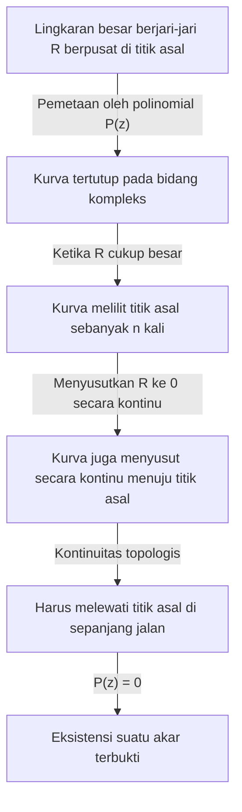

## Pengantar: Pencarian Persamaan dan Akar

Sejarah matematika juga merupakan sejarah pencarian angka-angka yang tidak diketahui. Saat kita mempelajari persamaan kuadrat di sekolah menengah, kita mempelajari rumus kuadrat. Namun, jika kita membatasi diri pada ranah bilangan real, kita dengan cepat menyadari bahwa ada persamaan "tanpa solusi real". Misalnya, persamaan $x^2 + 1 = 0$ tidak memiliki solusi dalam sistem bilangan real. Hal ini karena kuadrat dari sembarang bilangan real $x$ selalu lebih besar atau sama dengan $0$, dan menambahkan $1$ tidak akan pernah bisa menghasilkan $0$.

Untuk memecahkan masalah ini, angka hipotetis yang kuadratnya adalah $-1$ diperkenalkan—yaitu, unit imajiner $i$. Sistem bilangan yang mencakup unit ini disebut bilangan kompleks. Dengan memperkenalkan bilangan kompleks, solusi untuk $x^2 + 1 = 0$ dapat ditemukan sebagai $x = \pm i$.

Di sini, muncul pertanyaan besar: "Jika kita memperluas sistem bilangan ke bilangan kompleks, dapatkah kita mengatakan bahwa setiap persamaan akan selalu memiliki solusi?" Atau, "Akankah kita perlu memperkenalkan jenis bilangan baru lainnya?"

Matematika memberikan jawaban yang sangat jelas dan indah untuk pertanyaan ini. Itulah pokok bahasan artikel ini: **[Teorema Fundamental Aljabar](https://kenji.blog/p/fundamental-theorem-of-algebra/)**. Teorema ini menegaskan bahwa "sebarang polinomial berderajat $n$ dengan koefisien kompleks selalu memiliki akar (solusi) dalam bilangan kompleks". Dengan kata lain, di dalam lautan bilangan kompleks yang luas, solusi dari persamaan apa pun selalu ada, menjamin bahwa tidak perlu lagi menemukan bilangan baru.

Dalam artikel ini, kita akan menjelaskan **[Teorema Fundamental Aljabar](https://kenji.blog/p/fundamental-theorem-of-algebra/)** ini secara terperinci, mulai dari latar belakang sejarahnya, beralih ke pendekatan intuitif berdasarkan topologi, dan akhirnya menyajikan bukti yang ketat dan indah menggunakan analisis kompleks.

## Latar Belakang Sejarah [Teorema Fundamental Aljabar](https://kenji.blog/p/fundamental-theorem-of-algebra/)

**[Teorema Fundamental Aljabar](https://kenji.blog/p/fundamental-theorem-of-algebra/)** tidak dibuktikan dalam semalam. Banyak ahli matematika hebat berjuang untuk mencapai bukti yang lengkap, tidak pernah meragukan kebenaran teorema tersebut.

Pada abad ke-17, ahli matematika seperti [René Descartes](https://kenji.blog/p/descartes/) dan Albert Girard sudah mengetahui secara empiris bahwa "persamaan derajat $n$ harus memiliki $n$ akar". Namun, dalam kerangka matematika pada waktu itu, tidak ada cara yang ketat untuk membuktikannya.

Memasuki abad ke-18, raksasa matematika seperti Jean le Rond d'Alembert dan [Leonhard Euler](https://kenji.blog/p/euler/) mencoba pembuktiannya. D'Alembert menerbitkan bukti pada tahun 1746, dan teorema itu terkadang disebut "teorema d'Alembert" di Prancis; namun, menurut standar modern, buktinya kurang memiliki keketatan topologi di bidang-bidang tertentu. Euler juga mencoba untuk menunjukkan bahwa sebarang polinomial dengan koefisien real dapat difaktorkan menjadi produk dari polinomial linear dan kuadrat, tetapi meninggalkan celah logika.

Bukti pertama yang pada dasarnya lengkap dari teorema yang tak tertembus ini diberikan oleh [Carl Friedrich Gauss](https://kenji.blog/p/gauss/). Dalam disertasi doktoralnya tahun 1799, ia menunjukkan kelemahan dalam bukti-bukti para ahli matematika sebelumnya dan menyajikan bukti yang didasarkan pada intuisi geometris. Gauss memberikan empat bukti berbeda untuk teorema ini sepanjang hidupnya, yang menunjukkan betapa pentingnya ia melampirkan hal itu.

Bukti yang paling standar dan elegan saat ini dianggap sebagai bukti yang didasarkan pada teori analisis kompleks, yang dibangun oleh ahli matematika Prancis Joseph Liouville dan lainnya. Pada paruh kedua artikel ini, kita akan memperkenalkan bukti yang menggunakan teorema Liouville.

## Pernyataan Teorema yang Tepat

Pertama-tama, mari kita jelaskan penegasan teorema dalam istilah yang tepat secara matematis.

**Teorema ([Teorema Fundamental Aljabar](https://kenji.blog/p/fundamental-theorem-of-algebra/))**
Untuk setiap bilangan asli $n \ge 1$ dan koefisien kompleks $a_0, a_1, \dots, a_n$ (di mana $a_n \neq 0$), polinomial $P(z)$ didefinisikan sebagai berikut:

$$
P(z) = a_n z^n + a_{n-1} z^{n-1} + \dots + a_1 z + a_0
$$

Kemudian, persamaan $P(z) = 0$ memiliki setidaknya satu solusi pada bidang kompleks. Artinya, terdapat bilangan kompleks $\alpha$ sedemikian rupa sehingga $P(\alpha) = 0$.

Sepintas, hanya dikatakan "setidaknya satu", tetapi dengan menggabungkannya dengan teorema sisa polinomial, kita dapat dengan mudah memperoleh penegasan yang lebih kuat bahwa "persamaan berderajat $n$ memiliki tepat $n$ solusi kompleks, dengan menghitung kelipatannya". (Poin ini akan dijelaskan secara terperinci pada bagian "Akibat Teorema" di bawah ini).

## Pemahaman Intuitif: Pendekatan Topologi

Sebelum menggali bukti yang ketat, mari kita pahami gambaran intuitif tentang mengapa teorema ini berlaku. Di sini, kami memperkenalkan pendekatan menggunakan konsep "bilangan putar" (Winding number) dari topologi.

Mari kita representasikan sebuah titik pada bidang kompleks dalam bentuk polar sebagai $z = R e^{i\theta}$. Di sini, $R$ adalah jarak (jari-jari) dari titik asal, dan $\theta$ adalah sudutnya.

Pertimbangkan polinomial $P(z) = a_n z^n + a_{n-1} z^{n-1} + \dots + a_0$. Jika $R$ sangat besar, nilai absolut dari $z$ menjadi masif, dan nilai polinomial hampir sepenuhnya didominasi oleh suku berderajat tertinggi $a_n z^n$. Yaitu, ketika $R$ cukup besar, kita dapat mendekati $P(z) \approx a_n z^n$.

Sekarang, misalkan kita membiarkan $z$ melakukan perjalanan satu lingkaran penuh di sepanjang lingkaran raksasa berjari-jari $R$. Saat $\theta$ berubah dari $0$ hingga $2\pi$, sudut $z^n$ menjadi $n\theta$, berubah dari $0$ hingga $2n\pi$. Ini berarti bahwa lintasan yang dilacak oleh $P(z)$ menjadi kurva tertutup yang memutari titik asal bidang kompleks tepat sebanyak $n$ kali.

Selanjutnya, bayangkan proses mengecilkan jari-jari $R$ ini secara terus-menerus. Saat $R$ berkurang secara bertahap, kurva tertutup yang dilacak oleh $P(z)$ juga berubah bentuk secara terus-menerus. Pada akhirnya, ketika $R = 0$, kurva tersebut menyusut menjadi satu titik, $P(0) = a_0$.

Kontinuitas adalah kuncinya di sini. Sebuah putaran besar yang awalnya memutari titik asal sebanyak $n$ kali akhirnya menyusut menjadi satu titik yang tidak berisi titik asal. Secara topologis, tidak mungkin putaran tersebut menyusut terus-menerus ke titik yang jauh dari titik asal tanpa melintasi titik asal. Dengan kata lain, di suatu tempat dalam proses penyusutan, kurva ini harus melewati titik asal ($0$).

Saat kurva melewati titik asal, itu berarti tepat bahwa terdapat $z$ sedemikian rupa sehingga $P(z) = 0$. Inilah alasan intuitif mengapa solusi harus selalu ada.

## Persiapan dari Analisis Kompleks: Teorema Liouville

Setelah memperoleh pemahaman intuitif, kini kami akan memperkenalkan bukti terindah dan paling ketat dalam matematika modern. Bukti ini menggunakan senjata ampuh dari analisis kompleks: **Teorema Liouville**.

Analisis kompleks adalah bidang yang membahas kalkulus fungsi variabel kompleks. Tidak seperti fungsi bilangan real, diferensiabilitas (holomorfisme) fungsi kompleks adalah kondisi yang sangat kuat; fungsi kompleks yang dapat dideiferensiasikan meskipun hanya sekali memiliki sifat menakjubkan karena dapat dideiferensiasikan secara tak terhingga dan dapat diekspansi menjadi deret Taylor.

Fungsi yang dapat dideiferensiasikan (holomorfik) di seluruh bidang kompleks disebut **fungsi utuh** (entire function). Polinomial $P(z)$ dan fungsi eksponensial $e^z$ adalah contoh tipikal dari fungsi utuh.

Teorema Liouville adalah teorema yang sangat kuat mengenai fungsi-fungsi utuh ini.

**Teorema (Teorema Liouville)**
Setiap fungsi utuh yang terbatas haruslah merupakan fungsi konstan.

Di sini, "terbatas" berarti bahwa untuk semua bilangan kompleks $z$, nilai absolut dari fungsi $|f(z)|$ tidak melebihi bilangan real $M$ tertentu; yaitu, ada $M$ sedemikian rupa sehingga $|f(z)| \le M$.

Dalam dunia bilangan real, suatu fungsi seperti $f(x) = \sin(x)$ dapat dideiferensiasikan di seluruh garis bilangan dan dibatasi oleh $-1 \le \sin(x) \le 1$. Fungsi ini bukanlah fungsi konstan. Namun, teorema Liouville menegaskan bahwa ini tidak akan pernah terjadi di dunia kompleks. Jika sebuah fungsi bersifat holomorfik di seluruh bidang kompleks dan nilainya tidak menyimpang menuju ketakterhinggaan, fungsi tersebut hanyalah sebuah konstanta datar.

## Bukti Ketat [Teorema Fundamental Aljabar](https://kenji.blog/p/fundamental-theorem-of-algebra/)

Sekarang mari kita buktikan [Teorema Fundamental Aljabar](https://kenji.blog/p/fundamental-theorem-of-algebra/) dengan menggunakan teorema Liouville. Anda akan kagum dengan kecemerlangan bukti ini. Di sini, kita menggunakan pembuktian dengan kontradiksi.

**Bukti**

Asumsikan bahwa untuk sebarang polinomial berderajat $n$ ($n \ge 1$) dengan koefisien kompleks $P(z) = a_n z^n + \dots + a_1 z + a_0$ (di mana $a_n \neq 0$), persamaan $P(z) = 0$ tidak memiliki solusi pada bidang kompleks.

Artinya, asumsikan $P(z) \neq 0$ untuk semua bilangan kompleks $z$.

Kemudian, definisikan fungsi baru $f(z)$ sebagai berikut:

$$
f(z) = \frac{1}{P(z)}
$$

Berdasarkan asumsi kita, penyebut $P(z)$ tidak pernah menjadi $0$, sehingga fungsi $f(z)$ ini tidak memiliki singularitas (titik di mana penyebutnya $0$) di mana pun pada bidang kompleks. Karena polinomial $P(z)$ ada di mana-mana holomorfik (dapat dideiferensiasi), kebalikannya juga holomorfik asalkan tidak sama dengan $0$. Oleh karena itu, $f(z)$ adalah fungsi yang holomorfik di seluruh bidang kompleks, yaitu **fungsi utuh**.

Selanjutnya, kita meneliti perilaku $f(z)$ saat $|z|$ mendekati tak terhingga. Dengan menggunakan ketaksamaan segitiga, ketika $|z|$ cukup besar, besaran nilai mutlak polinomial $P(z)$ didominasi oleh suku derajat tertinggi, sehingga menyimpang menuju tak terhingga.

Tegasnya, saat $|z| \to \infty$,

$$
|P(z)| = |z|^n \left| a_n + \frac{a_{n-1}}{z} + \dots + \frac{a_0}{z^n} \right| \to \infty
$$

Fakta bahwa nilai mutlak $P(z)$ menyimpang menuju ketakterhinggaan berarti bahwa nilai mutlak kebalikannya $f(z) = 1/P(z)$ berkonvergen ke $0$.

Artinya,

$$
\lim_{|z| \to \infty} |f(z)| = 0
$$

Batas $0$ berarti di luar lingkaran dengan jari-jari $R$ yang cukup besar, nilainya dapat dibatasi, misalnya, $|f(z)| \le 1$.
Di sisi lain, di dalam wilayah cakram tertutup (wilayah tertutup terbatas) yang mencakup bagian dalam lingkaran berjari-jari $R$, fungsi kontinu harus memiliki nilai maksimum.
Oleh karena itu, baik di luar maupun di dalam lingkaran, nilai absolut dari $f(z)$ tidak pernah melampaui batas atas berhingga tertentu. Artinya, $f(z)$ adalah fungsi **terbatas**.

Sampai pada titik ini, kami telah menunjukkan bahwa $f(z)$ adalah "fungsi utuh" dan "terbatas".
Di sini, kita menerapkan **teorema Liouville**. Fungsi utuh yang terbatas haruslah sebuah konstanta. Oleh karena itu, terdapat sebuah bilangan kompleks $c$ sedemikian rupa sehingga untuk semua $z$,

$$
f(z) = c
$$

Namun, karena $\lim_{|z| \to \infty} f(z) = 0$, maka konstanta $c$ ini haruslah $0$.
Artinya, $f(z) = 0$ untuk semua $z$.

Akan tetapi, karena $f(z) = \frac{1}{P(z)}$, tidak mungkin fungsi pecahan sama dengan $0$ (karena pembilangnya adalah $1$). Ini adalah kontradiksi yang jelas.

Kontradiksi ini muncul dari asumsi kita bahwa "$P(z) = 0$ tidak memiliki solusi pada bidang kompleks".
Jadi, berdasarkan kontradiksi, terbukti bahwa $P(z) = 0$ memiliki setidaknya satu solusi pada bidang kompleks.

(Akhir pembuktian)

## Akibat Teorema: Faktorisasi ke dalam Faktor Linear

[Teorema Fundamental Aljabar](https://kenji.blog/p/fundamental-theorem-of-algebra/) menjamin keberadaan "setidaknya satu solusi". Dengan menggabungkan fakta ini dengan **Teorema Faktor** untuk pembagian polinomial, kita dapat membuktikan bahwa polinomial dapat difaktorkan sepenuhnya ke dalam produk bentuk linear.

Mengingat polinomial $P_n(z)$ derajat $n$, [Teorema Fundamental Aljabar](https://kenji.blog/p/fundamental-theorem-of-algebra/) menyatakan bahwa terdapat solusi $\alpha_1$ sedemikian rupa sehingga $P_n(\alpha_1) = 0$. Menurut Teorema Faktor, $P_n(z)$ memiliki $(z - \alpha_1)$ sebagai sebuah faktor. Yaitu, dapat difaktorkan sebagai berikut:

$$
P_n(z) = (z - \alpha_1) P_{n-1}(z)
$$

Di sini, $P_{n-1}(z)$ adalah polinomial berderajat $n-1$. Jika $n-1 \ge 1$, kita dapat menerapkan [Teorema Fundamental Aljabar](https://kenji.blog/p/fundamental-theorem-of-algebra/) lagi untuk menemukan solusi $\alpha_2$ dari $P_{n-1}(z)$. Dengan mengulangi ini $n$ kali, kita dapat memfaktorkannya sepenuhnya sebagai berikut:

$$
P_n(z) = a_n (z - \alpha_1)(z - \alpha_2) \dots (z - \alpha_n)
$$

Dari hasil ini, kita dapat menarik kesimpulan yang sangat indah dan lengkap bahwa **"persamaan berderajat $n$ dengan koefisien kompleks memiliki tepat $n$ solusi, dengan menghitung kelipatannya"**. Karena itulah dinamakan "Teorema Fundamental".

Lebih dari itu, untuk polinomial di mana semua koefisiennya berupa bilangan real, jika $\alpha$ adalah solusi, konjugat kompleksnya $\overline{\alpha}$ juga harus menjadi solusi. Menggunakan properti ini, kita juga dapat menurunkan fakta bahwa "setiap polinomial dengan koefisien real dapat sepenuhnya difaktorkan menjadi produk dari polinomial linear dan kuadrat dalam bilangan real".

## Kesimpulan

Dalam artikel ini, kita telah melihat secara rinci pada [Teorema Fundamental Aljabar](https://kenji.blog/p/fundamental-theorem-of-algebra/), mencakup latar belakang sejarahnya, intuisi topologi, dan bukti analitis kompleksnya yang menggunakan teorema Liouville.

Sepintas, ini adalah teorema tentang persamaan aljabar, tetapi fakta bahwa buktinya yang paling elegan meminjam kekuatan analisis (kalkulus) dan topologi menunjukkan kedalaman matematika dan keindahan bagaimana berbagai bidang saling terkait erat.

Pencarian panjang umat manusia untuk menemukan akar-akar persamaan memperoleh panggung bidang kompleks yang luas melalui diperkenalkannya bilangan-bilangan imajiner baru, dan kelengkapan panggung ini dibuktikan oleh [Teorema Fundamental Aljabar](https://kenji.blog/p/fundamental-theorem-of-algebra/). Teorema ini menjadi kunci yang membuka pintu-pintu cemerlang yang mengarah pada teori Galois dan geometri aljabar, yang menjadi landasan matematika modern.
