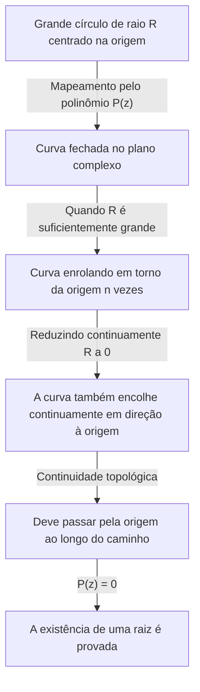

## Introdução: A Busca por Equações e Raízes

A história da matemática é também a história da busca por números desconhecidos. Quando estudamos equações do segundo grau no ensino médio, aprendemos a fórmula quadrática. No entanto, se nos restringirmos ao domínio dos números reais, logo notamos que existem equações "sem solução real". Por exemplo, a equação $x^2 + 1 = 0$ não tem solução no sistema dos números reais. Isso ocorre porque o quadrado de qualquer número real $x$ é sempre maior ou igual a $0$, e adicionar $1$ nunca pode resultar em $0$.

Para resolver este problema, foi introduzido um número hipotético cujo quadrado é $-1$, ou seja, a unidade imaginária $i$. O sistema numérico que inclui esta unidade é chamado de números complexos. Ao introduzir números complexos, as soluções para $x^2 + 1 = 0$ podem ser encontradas como $x = \pm i$.

Aqui, surge uma grande questão: "Se expandirmos o sistema numérico para números complexos, podemos dizer que qualquer equação sempre terá uma solução?" Ou, "Alguma vez precisaremos introduzir outro novo tipo de número?"

A matemática fornece uma resposta muito clara e bela a esta questão. Esse é o assunto deste artigo: o **[Teorema Fundamental da Álgebra](https://kenji.blog/pt/p/fundamental-theorem-of-algebra/)**. Este teorema afirma que "qualquer polinômio de grau $n$ com coeficientes complexos sempre tem uma raiz (solução) dentro dos números complexos". Em outras palavras, no vasto oceano dos números complexos, a solução para qualquer equação sempre existe, garantindo que não há necessidade de inventar mais números novos.

Neste artigo, explicaremos detalhadamente este **[Teorema Fundamental da Álgebra](https://kenji.blog/pt/p/fundamental-theorem-of-algebra/)**, partindo do seu contexto histórico, passando para uma abordagem intuitiva baseada na topologia e, finalmente, apresentando uma prova rigorosa e bela usando análise complexa.

## Contexto Histórico do [Teorema Fundamental da Álgebra](https://kenji.blog/pt/p/fundamental-theorem-of-algebra/)

O **[Teorema Fundamental da Álgebra](https://kenji.blog/pt/p/fundamental-theorem-of-algebra/)** não foi provado da noite para o dia. Muitos grandes matemáticos lutaram para alcançar uma prova completa, nunca duvidando da verdade do teorema.

No século XVII, matemáticos como [René Descartes](https://kenji.blog/pt/p/descartes/) e Albert Girard já sabiam empiricamente que "uma equação de grau $n$ deveria ter $n$ raízes". No entanto, dentro da estrutura matemática da época, não havia meios rigorosos para prová-lo.

Entrando no século XVIII, gigantes matemáticos como Jean le Rond d'Alembert e [Leonhard Euler](https://kenji.blog/pt/p/euler/) tentaram a prova. D'Alembert publicou uma prova em 1746, e o teorema é por vezes chamado de "teorema de d'Alembert" na França; no entanto, pelos padrões modernos, a sua prova carecia de rigor topológico em certas áreas. Euler também tentou mostrar que qualquer polinômio com coeficientes reais poderia ser fatorado no produto de polinômios lineares e quadráticos, mas deixou uma lacuna lógica.

A primeira prova essencialmente completa deste teorema inexpugnável foi dada por ninguém menos que [Carl Friedrich Gauss](https://kenji.blog/pt/p/gauss/). Em sua dissertação de doutorado de 1799, ele apontou as falhas nas provas dos matemáticos anteriores e apresentou uma prova baseada na intuição geométrica. Gauss forneceu quatro provas diferentes para este teorema ao longo da sua vida, indicando a importância que lhe atribuía.

A prova mais padrão e elegante hoje é considerada aquela baseada na teoria da análise complexa, construída pelo matemático francês Joseph Liouville e outros. Na segunda metade deste artigo, introduziremos a prova usando o teorema de Liouville.

## Enunciado Preciso do Teorema

Primeiro, vamos descrever a afirmação do teorema em termos matematicamente precisos.

**Teorema ([Teorema Fundamental da Álgebra](https://kenji.blog/pt/p/fundamental-theorem-of-algebra/))**
Para qualquer número natural $n \ge 1$ e coeficientes complexos $a_0, a_1, \dots, a_n$ (onde $a_n \neq 0$), um polinômio $P(z)$ é definido da seguinte forma:

$$
P(z) = a_n z^n + a_{n-1} z^{n-1} + \dots + a_1 z + a_0
$$

Então, a equação $P(z) = 0$ tem pelo menos uma solução no plano complexo. Ou seja, existe um número complexo $\alpha$ tal que $P(\alpha) = 0$.

À primeira vista, diz apenas "pelo menos uma", mas ao combiná-la com o teorema do resto dos polinômios, podemos facilmente derivar a afirmação mais forte de que "uma equação de grau $n$ tem exatamente $n$ soluções complexas, contando as multiplicidades". (Este ponto será explicado em detalhe na seção "Corolário do Teorema" abaixo).

## Compreensão Intuitiva: Abordagem Topológica

Antes de mergulhar na prova rigorosa, vamos captar uma imagem intuitiva de por que este teorema é válido. Aqui, introduzimos uma abordagem usando o conceito de "índice de curva" (Winding number) da topologia.

Vamos representar um ponto no plano complexo na forma polar como $z = R e^{i\theta}$. Aqui, $R$ é a distância (raio) da origem e $\theta$ é o ângulo.

Considere o polinômio $P(z) = a_n z^n + a_{n-1} z^{n-1} + \dots + a_0$. Se $R$ for muito grande, o valor absoluto de $z$ torna-se massivo, e o valor do polinômio é quase inteiramente dominado pelo termo de maior grau $a_n z^n$. Ou seja, quando $R$ é suficientemente grande, podemos aproximar $P(z) \approx a_n z^n$.

Agora, suponha que deixamos $z$ percorrer um círculo completo ao longo de um círculo gigante de raio $R$. À medida que $\theta$ muda de $0$ para $2\pi$, o ângulo de $z^n$ torna-se $n\theta$, mudando de $0$ para $2n\pi$. Isso significa que a trajetória traçada por $P(z)$ torna-se uma curva fechada que se enrola em torno da origem do plano complexo exatamente $n$ vezes.

Em seguida, imagine o processo de reduzir continuamente este raio $R$. À medida que $R$ diminui gradualmente, a curva fechada traçada por $P(z)$ também se deforma continuamente. Eventualmente, quando $R = 0$, a curva encolhe para um único ponto, $P(0) = a_0$.

A continuidade é a chave aqui. Um grande laço que inicialmente se enrolava em torno da origem $n$ vezes acaba por encolher para um único ponto que não contém a origem. Topologicamente, é impossível que o laço encolha continuamente para um ponto longe da origem sem cruzar a origem. Em outras palavras, em algum lugar do processo de encolhimento, esta curva deve passar pela origem ($0$).

O momento em que a curva passa pela origem significa exatamente que existe um $z$ tal que $P(z) = 0$. Esta é a razão intuitiva pela qual uma solução deve sempre existir.

## Preparação da Análise Complexa: Teorema de Liouville

Tendo obtido uma compreensão intuitiva, introduziremos agora a prova mais bela e rigorosa da matemática moderna. Esta prova usa uma arma poderosa da análise complexa: o **Teorema de Liouville**.

A análise complexa é o campo que trata do cálculo de funções de variáveis complexas. Ao contrário das funções de números reais, a diferenciabilidade (holomorfia) de funções complexas é uma condição extremamente forte; uma função complexa que é diferenciável mesmo que uma única vez tem a propriedade surpreendente de ser infinitamente diferenciável e capaz de ser expandida numa série de Taylor.

Uma função que é diferenciável (holomorfa) sobre todo o plano complexo é chamada de **função inteira**. Os polinômios $P(z)$ e a função exponencial $e^z$ são exemplos típicos de funções inteiras.

O teorema de Liouville é um teorema profundamente poderoso a respeito destas funções inteiras.

**Teorema (Teorema de Liouville)**
Toda função inteira limitada deve ser uma função constante.

Aqui, "limitada" significa que para todos os números complexos $z$, o valor absoluto da função $|f(z)|$ não excede um certo número real $M$; isto é, existe um $M$ tal que $|f(z)| \le M$.

No mundo dos números reais, uma função como $f(x) = \sin(x)$ é diferenciável ao longo de toda a reta numérica e é limitada por $-1 \le \sin(x) \le 1$. Não é uma função constante. No entanto, o teorema de Liouville afirma que isso nunca pode acontecer no mundo complexo. Se uma função é holomorfa sobre todo o plano complexo e o seu valor não diverge para o infinito, é meramente uma constante plana.

## Prova Rigorosa do [Teorema Fundamental da Álgebra](https://kenji.blog/pt/p/fundamental-theorem-of-algebra/)

Vamos agora provar o [Teorema Fundamental da Álgebra](https://kenji.blog/pt/p/fundamental-theorem-of-algebra/) usando o teorema de Liouville. Você ficará surpreso com o brilhantismo desta prova. Aqui, usamos uma prova por contradição (redução ao absurdo).

**Prova**

Assuma que para qualquer polinômio $P(z) = a_n z^n + \dots + a_1 z + a_0$ de grau $n$ ($n \ge 1$) com coeficientes complexos (onde $a_n \neq 0$), a equação $P(z) = 0$ não tem solução no plano complexo.

Isto é, assuma que $P(z) \neq 0$ para todos os números complexos $z$.

A seguir, defina uma nova função $f(z)$ da seguinte forma:

$$
f(z) = \frac{1}{P(z)}
$$

Pela nossa suposição, o denominador $P(z)$ nunca se torna $0$, então esta função $f(z)$ não tem singularidades (pontos onde o denominador é $0$) em nenhum lugar do plano complexo. Uma vez que o polinômio $P(z)$ é holomorfo (diferenciável) em todos os lugares, o seu recíproco também é holomorfo, desde que não seja igual a $0$. Portanto, $f(z)$ é uma função holomorfa sobre todo o plano complexo, isto é, uma **função inteira**.

A seguir, examinamos o comportamento de $f(z)$ à medida que $|z|$ se aproxima do infinito. Usando a desigualdade triangular, quando $|z|$ é suficientemente grande, a magnitude do valor absoluto do polinômio $P(z)$ é dominada pelo termo de maior grau, divergindo assim para o infinito.

Estritamente falando, à medida que $|z| \to \infty$,

$$
|P(z)| = |z|^n \left| a_n + \frac{a_{n-1}}{z} + \dots + \frac{a_0}{z^n} \right| \to \infty
$$

O fato de que o valor absoluto de $P(z)$ diverge para o infinito significa que o valor absoluto de seu recíproco $f(z) = 1/P(z)$ converge para $0$.

Isto é,

$$
\lim_{|z| \to \infty} |f(z)| = 0
$$

Um limite de $0$ significa que fora de um círculo com um raio $R$ suficientemente grande, o valor pode ser limitado, por exemplo, $|f(z)| \le 1$.
Por outro lado, dentro da região do disco fechado (uma região fechada limitada) que inclui o interior do círculo de raio $R$, uma função contínua deve ter um valor máximo.
Portanto, tanto fora como dentro do círculo, o valor absoluto de $f(z)$ nunca excede um certo limite superior finito. Isto é, $f(z)$ é uma função **limitada**.

Até este ponto, mostramos que $f(z)$ é tanto uma "função inteira" como "limitada".
Aqui, aplicamos o **teorema de Liouville**. Uma função inteira limitada deve ser uma constante. Portanto, existe um número complexo $c$ tal que para todo $z$,

$$
f(z) = c
$$

No entanto, como $\lim_{|z| \to \infty} f(z) = 0$, esta constante $c$ deve ser $0$.
Isto é, $f(z) = 0$ para todos os $z$.

Mas como $f(z) = \frac{1}{P(z)}$, é impossível que a função fracionária seja igual a $0$ (porque o numerador é $1$). Esta é uma contradição clara.

Esta contradição surgiu da nossa suposição de que "$P(z) = 0$ não tem solução no plano complexo".
Assim, por contradição, fica provado que $P(z) = 0$ tem pelo menos uma solução no plano complexo.

(Fim da prova)

## Corolário do Teorema: Fatorização em Fatores Lineares

O [Teorema Fundamental da Álgebra](https://kenji.blog/pt/p/fundamental-theorem-of-algebra/) garante a existência de "pelo menos uma solução". Ao combinar este fato com o **Teorema do Fator** para a divisão polinomial, podemos provar que um polinômio pode ser completamente fatorado em um produto de termos lineares.

Dado um polinômio $P_n(z)$ de grau $n$, o [Teorema Fundamental da Álgebra](https://kenji.blog/pt/p/fundamental-theorem-of-algebra/) estabelece que existe uma solução $\alpha_1$ tal que $P_n(\alpha_1) = 0$. De acordo com o Teorema do Fator, $P_n(z)$ tem $(z - \alpha_1)$ como um fator. Isto é, pode ser fatorado da seguinte forma:

$$
P_n(z) = (z - \alpha_1) P_{n-1}(z)
$$

Aqui, $P_{n-1}(z)$ é um polinômio de grau $n-1$. Se $n-1 \ge 1$, podemos aplicar novamente o [Teorema Fundamental da Álgebra](https://kenji.blog/pt/p/fundamental-theorem-of-algebra/) para encontrar uma solução $\alpha_2$ para $P_{n-1}(z)$. Repetindo isso $n$ vezes, podemos fatorá-lo completamente da seguinte forma:

$$
P_n(z) = a_n (z - \alpha_1)(z - \alpha_2) \dots (z - \alpha_n)
$$

A partir deste resultado, podemos derivar a conclusão profundamente bela e completa de que **"uma equação de grau $n$ com coeficientes complexos tem exatamente $n$ soluções, contando as multiplicidades"**. É por isso que é chamado de "Teorema Fundamental".

Além disso, para polinômios em que todos os coeficientes são números reais, se $\alpha$ é uma solução, o seu conjugado complexo $\overline{\alpha}$ também deve ser uma solução. Utilizando esta propriedade, também podemos derivar o fato de que "qualquer polinômio com coeficientes reais pode ser completamente fatorado num produto de polinômios lineares e quadráticos dentro dos números reais".

## Conclusão

Neste artigo, analisamos em detalhe o [Teorema Fundamental da Álgebra](https://kenji.blog/pt/p/fundamental-theorem-of-algebra/), cobrindo o seu contexto histórico, a intuição topológica e a prova analítica complexa usando o teorema de Liouville.

À primeira vista, é um teorema sobre equações algébricas, mas o fato de a sua prova mais elegante tomar emprestado o poder da análise (cálculo) e da topologia demonstra a profundidade da matemática e a beleza de como diferentes campos estão intimamente entrelaçados.

A longa busca da humanidade para encontrar as raízes das equações ganhou o vasto palco do plano complexo através da introdução dos novos números imaginários, e a completude deste palco foi provada pelo [Teorema Fundamental da Álgebra](https://kenji.blog/pt/p/fundamental-theorem-of-algebra/). Este teorema tornou-se a chave que abriu as portas brilhantes que conduzem à teoria de Galois e à geometria algébrica, que formam a base da matemática moderna.
