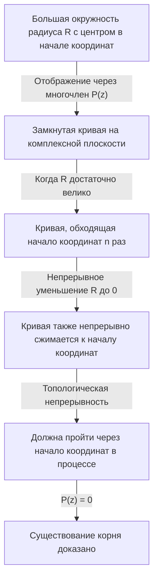

## Введение: Поиск уравнений и корней

История математики — это также история поиска неизвестных чисел. Когда в средней школе мы изучаем квадратные уравнения, мы узнаем формулу корней. Однако, если мы ограничимся областью действительных чисел, то быстро заметим, что существуют уравнения, не имеющие «действительных решений». Например, уравнение $x^2 + 1 = 0$ не имеет решений в системе действительных чисел. Это происходит потому, что квадрат любого действительного числа $x$ всегда больше или равен $0$, и прибавление $1$ никогда не может дать $0$.

Чтобы решить эту проблему, было введено гипотетическое число, квадрат которого равен $-1$ — а именно, мнимая единица $i$. Система чисел, включающая эту единицу, называется комплексными числами. Благодаря введению комплексных чисел решения уравнения $x^2 + 1 = 0$ можно найти как $x = \pm i$.

Здесь возникает грандиозный вопрос: «Если мы расширим систему чисел до комплексных чисел, можем ли мы сказать, что любое уравнение всегда будет иметь решение?» Или же: «Придется ли нам когда-нибудь вводить еще один новый тип чисел?»

Математика дает очень четкий и красивый ответ на этот вопрос. Именно этому и посвящена данная статья: **Основной теореме алгебры**. Эта теорема утверждает, что «любой многочлен степени $n$ с комплексными коэффициентами всегда имеет корень (решение) в области комплексных чисел». Иными словами, в огромном океане комплексных чисел решение любого уравнения всегда существует, что гарантирует отсутствие необходимости изобретать новые числа.

В этой статье мы подробно объясним эту **Основную теорему алгебры**, начиная с её исторического контекста, перейдя к интуитивному подходу, основанному на топологии, и, наконец, представив строгое и красивое доказательство с использованием комплексного анализа.

## Исторический контекст Основной теоремы алгебры

**Основная теорема алгебры** не была доказана за одну ночь. Многие великие математики боролись за создание полного доказательства, никогда не сомневаясь в истинности самой теоремы.

В 17 веке такие математики, как Рене Декарт и Альбер Жирар, уже эмпирически знали, что «уравнение $n$-й степени должно иметь $n$ корней». Однако в математических рамках того времени не существовало строгого способа это доказать.

С наступлением 18 века за доказательство взялись такие гиганты математики, как Жан Лерон Д'Аламбер и Леонард Эйлер. Д'Аламбер опубликовал свое доказательство в 1746 году, и во Франции теорему иногда называют «теоремой Д'Аламбера»; однако по современным стандартам его доказательству не хватало топологической строгости в некоторых областях. Эйлер также пытался показать, что любой многочлен с действительными коэффициентами можно разложить на произведение линейных и квадратичных многочленов, но оставил логический пробел.

Первое по сути полное доказательство этой неприступной теоремы дал не кто иной, как Карл Фридрих Гаусс. В своей докторской диссертации 1799 года он указал на недостатки в доказательствах предшествующих математиков и представил доказательство, основанное на геометрической интуиции. Гаусс представил четыре различных доказательства этой теоремы в течение своей жизни, что свидетельствует о том, какое значение он ей придавал.

Сегодня самым стандартным и элегантным доказательством считается то, которое основано на теории комплексного анализа, созданной французским математиком Жозефом Лиувиллем и другими. Во второй половине этой статьи мы представим доказательство с использованием теоремы Лиувилля.

## Точная формулировка теоремы

Сначала давайте опишем утверждение теоремы в математически точных терминах.

**Теорема (Основная теорема алгебры)**
Для любого натурального числа $n \ge 1$ и комплексных коэффициентов $a_0, a_1, \dots, a_n$ (где $a_n \neq 0$), многочлен $P(z)$ определяется следующим образом:

$$
P(z) = a_n z^n + a_{n-1} z^{n-1} + \dots + a_1 z + a_0
$$

Тогда уравнение $P(z) = 0$ имеет хотя бы одно решение на комплексной плоскости. То есть существует такое комплексное число $\alpha$, что $P(\alpha) = 0$.

На первый взгляд, здесь говорится только «хотя бы одно», но, объединив это с теоремой Безу, мы легко можем вывести более сильное утверждение о том, что «уравнение $n$-й степени имеет ровно $n$ комплексных решений с учетом кратностей». (Этот момент будет подробно объяснен в разделе «Следствие из теоремы» ниже.)

## Интуитивное понимание: Топологический подход

Прежде чем углубляться в строгое доказательство, давайте сформируем интуитивное представление о том, почему эта теорема справедлива. Здесь мы представляем подход с использованием концепции «индекса кривой» (Winding number) из топологии.

Давайте представим точку на комплексной плоскости в полярной форме как $z = R e^{i\theta}$. Здесь $R$ — расстояние (радиус) от начала координат, а $\theta$ — угол.

Рассмотрим многочлен $P(z) = a_n z^n + a_{n-1} z^{n-1} + \dots + a_0$. Если $R$ очень велико, абсолютное значение $z$ становится огромным, и значение многочлена почти полностью определяется членом с наивысшей степенью $a_n z^n$. То есть, когда $R$ достаточно велико, мы можем приближенно считать, что $P(z) \approx a_n z^n$.

Теперь предположим, что мы заставляем $z$ совершить полный оборот вдоль гигантской окружности радиуса $R$. Когда $\theta$ изменяется от $0$ до $2\pi$, угол $z^n$ становится $n\theta$, изменяясь от $0$ до $2n\pi$. Это означает, что траектория, описываемая $P(z)$, становится замкнутой кривой, которая обходит вокруг начала координат комплексной плоскости ровно $n$ раз.

Далее представьте себе процесс непрерывного уменьшения этого радиуса $R$. По мере постепенного уменьшения $R$ замкнутая кривая, описываемая $P(z)$, также непрерывно деформируется. В конце концов, когда $R = 0$, кривая сжимается в одну точку, $P(0) = a_0$.

Здесь ключевым моментом является непрерывность. Большая петля, которая изначально обходила начало координат $n$ раз, в конечном итоге сжимается в одну точку, которая не содержит начало координат. Топологически невозможно, чтобы петля непрерывно сжалась в точку, удаленную от начала координат, не пересекая при этом само начало координат. Другими словами, где-то в процессе сжатия эта кривая должна пройти через начало координат ($0$).

Момент, когда кривая проходит через начало координат, означает именно то, что существует такое $z$, при котором $P(z) = 0$. Это интуитивная причина, по которой решение должно существовать всегда.

## Подготовка из комплексного анализа: Теорема Лиувилля

Получив интуитивное понимание, мы теперь представим самое красивое и строгое доказательство в современной математике. Это доказательство использует мощное оружие комплексного анализа: **Теорему Лиувилля**.

Комплексный анализ — это область, которая занимается исчислением функций комплексных переменных. В отличие от функций действительных чисел, дифференцируемость (голоморфность) комплексных функций является чрезвычайно сильным условием; комплексная функция, дифференцируемая хотя бы один раз, обладает удивительным свойством быть бесконечно дифференцируемой и может быть разложена в ряд Тейлора.

Функция, которая дифференцируема (голоморфна) на всей комплексной плоскости, называется **целой функцией**. Многочлены $P(z)$ и экспоненциальная функция $e^z$ являются типичными примерами целых функций.

Теорема Лиувилля — это глубоко мощная теорема, касающаяся таких целых функций.

**Теорема (Теорема Лиувилля)**
Всякая ограниченная целая функция является константой.

Здесь слово «ограниченная» означает, что для всех комплексных чисел $z$ абсолютное значение функции $|f(z)|$ не превышает некоторого действительного числа $M$; то есть существует такое $M$, что $|f(z)| \le M$.

В мире действительных чисел такая функция, как $f(x) = \sin(x)$, дифференцируема на всей числовой прямой и ограничена условием $-1 \le \sin(x) \le 1$. Она не является константой. Однако теорема Лиувилля утверждает, что в комплексном мире такого никогда не может произойти. Если функция голоморфна на всей комплексной плоскости и ее значение не расходится к бесконечности, она является просто плоской константой.

## Строгое доказательство Основной теоремы алгебры

Теперь давайте докажем Основную теорему алгебры с помощью теоремы Лиувилля. Вы будете поражены гениальностью этого доказательства. Здесь мы используем доказательство от противного.

**Доказательство**

Предположим, что для любого многочлена $n$-й степени ($n \ge 1$) с комплексными коэффициентами $P(z) = a_n z^n + \dots + a_1 z + a_0$ (где $a_n \neq 0$) уравнение $P(z) = 0$ не имеет решений на комплексной плоскости.

То есть предположим, что $P(z) \neq 0$ для всех комплексных чисел $z$.

Затем определим новую функцию $f(z)$ следующим образом:

$$
f(z) = \frac{1}{P(z)}
$$

По нашему предположению, знаменатель $P(z)$ никогда не становится равным $0$, поэтому эта функция $f(z)$ нигде на комплексной плоскости не имеет особых точек (точек, где знаменатель равен $0$). Поскольку многочлен $P(z)$ везде голоморфен (дифференцируем), обратная ему функция также голоморфна, пока она не равна $0$. Следовательно, $f(z)$ является функцией, голоморфной на всей комплексной плоскости, то есть **целой функцией**.

Далее мы исследуем поведение $f(z)$ при стремлении $|z|$ к бесконечности. Используя неравенство треугольника, когда $|z|$ достаточно велико, величина абсолютного значения многочлена $P(z)$ доминируется членом наивысшей степени, тем самым расходясь к бесконечности.

Строго говоря, при $|z| \to \infty$,

$$
|P(z)| = |z|^n \left| a_n + \frac{a_{n-1}}{z} + \dots + \frac{a_0}{z^n} \right| \to \infty
$$

Тот факт, что абсолютное значение $P(z)$ расходится к бесконечности, означает, что абсолютное значение его обратной величины $f(z) = 1/P(z)$ сходится к $0$.

То есть,

$$
\lim_{|z| \to \infty} |f(z)| = 0
$$

Предел, равный $0$, означает, что вне круга с достаточно большим радиусом $R$ значение может быть ограничено, например, $|f(z)| \le 1$.
С другой стороны, внутри замкнутой области круга (ограниченной замкнутой области), включающей внутреннюю часть круга радиуса $R$, непрерывная функция должна иметь максимальное значение.
Поэтому как вне, так и внутри круга абсолютное значение $f(z)$ никогда не превышает некоторого конечного верхнего предела. То есть $f(z)$ является **ограниченной** функцией.

До этого момента мы показали, что $f(z)$ является одновременно «целой функцией» и «ограниченной».
Здесь мы применяем **теорему Лиувилля**. Ограниченная целая функция должна быть константой. Следовательно, существует такое комплексное число $c$, что для всех $z$

$$
f(z) = c
$$

Однако, поскольку $\lim_{|z| \to \infty} f(z) = 0$, эта константа $c$ должна быть равна $0$.
То есть $f(z) = 0$ для всех $z$.

Но поскольку $f(z) = \frac{1}{P(z)}$, дробная функция не может быть равна $0$ (потому что числитель равен $1$). Это явное противоречие.

Это противоречие возникло из-за нашего предположения о том, что «$P(z) = 0$ не имеет решений на комплексной плоскости».
Таким образом, от противного доказано, что уравнение $P(z) = 0$ имеет хотя бы одно решение на комплексной плоскости.

(Конец доказательства)

## Следствие из теоремы: Разложение на линейные множители

Основная теорема алгебры гарантирует существование «хотя бы одного решения». Объединив этот факт с **Теоремой Безу** для деления многочленов, мы можем доказать, что многочлен можно полностью разложить на произведение линейных членов.

Учитывая многочлен $n$-й степени $P_n(z)$, Основная теорема алгебры утверждает, что существует решение $\alpha_1$ такое, что $P_n(\alpha_1) = 0$. Согласно Теореме Безу, $P_n(z)$ имеет в качестве множителя $(z - \alpha_1)$. То есть его можно разложить на множители следующим образом:

$$
P_n(z) = (z - \alpha_1) P_{n-1}(z)
$$

Здесь $P_{n-1}(z)$ — многочлен степени $n-1$. Если $n-1 \ge 1$, мы можем снова применить Основную теорему алгебры, чтобы найти решение $\alpha_2$ для $P_{n-1}(z)$. Повторяя это $n$ раз, мы можем полностью разложить его на множители следующим образом:

$$
P_n(z) = a_n (z - \alpha_1)(z - \alpha_2) \dots (z - \alpha_n)
$$

Из этого результата мы можем вывести глубоко красивый и законченный вывод о том, что **«уравнение $n$-й степени с комплексными коэффициентами имеет ровно $n$ решений с учетом кратностей»**. Именно поэтому она называется «Основной теоремой».

Более того, для многочленов, где все коэффициенты являются действительными числами, если $\alpha$ является решением, его комплексно-сопряженное $\overline{\alpha}$ также должно быть решением. Используя это свойство, мы также можем вывести тот факт, что «любой многочлен с действительными коэффициентами может быть полностью разложен на произведение линейных и квадратичных многочленов в области действительных чисел».

## Заключение

В этой статье мы подробно рассмотрели Основную теорему алгебры, охватив её исторический контекст, топологическую интуицию и комплексное аналитическое доказательство с использованием теоремы Лиувилля.

На первый взгляд, это теорема об алгебраических уравнениях, но тот факт, что её самое элегантное доказательство заимствует мощь анализа (исчисления) и топологии, демонстрирует глубину математики и красоту того, как тесно переплетены различные её области.

Долгий поиск человечеством корней уравнений обрел огромную сцену комплексной плоскости благодаря введению новых мнимых чисел, и полнота этой сцены была доказана Основной теоремой алгебры. Эта теорема стала ключом, который открыл сияющие двери, ведущие к теории Галуа и алгебраической геометрии, которые составляют основу современной математики.
