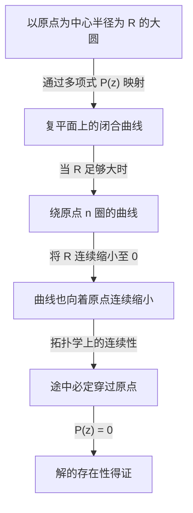

## 引言：方程与解的探索

数学的历史也是探索未知数的历史。当我们在中学学习一元二次方程时，会学到求根公式。然而，如果仅仅考虑实数范围，我们很快就会发现存在“无实数解”的方程。例如，方程 $x^2 + 1 = 0$ 在实数范围内就没有解。因为任何实数 $x$ 的平方都必然大于或等于 $0$，加上 $1$ 是绝不可能等于 $0$ 的。

为了解决这个问题，数学家引入了一个平方等于 $-1$ 的假想数，即虚数单位 $i$。包含它的数系被称为复数。通过引入复数，$x^2 + 1 = 0$ 的解就可以求出，即 $x = \pm i$。

这时，一个宏大的疑问产生了：“如果把数的范围扩大到复数，是否可以断言任何方程都一定会有解？”或者说，“未来是否还需要引入更新种类的数呢？”

对于这个疑问，数学准备了一个极其明确且优美的答案。这就是本文的主题—— **[代数基本定理](https://kenji.blog/p/fundamental-theorem-of-algebra/)** （[Fundamental Theorem of Algebra](https://kenji.blog/p/fundamental-theorem-of-algebra/)）。该定理断言：“任何复系数的 $n$ 次多项式，在复数范围内必定存在根（解）。”也就是说，在复数这片广袤的数字海洋中，任何方程的解必定存在，保证了我们再也不需要去创造新的数系。

在本文中，我们将详细讲解这个 **[代数基本定理](https://kenji.blog/p/fundamental-theorem-of-algebra/)** ，从它的历史背景出发，介绍基于拓扑学直觉的方法，最后展示利用复分析进行严谨而优美的证明。

## [代数基本定理](https://kenji.blog/p/fundamental-theorem-of-algebra/)的历史背景

**[代数基本定理](https://kenji.blog/p/fundamental-theorem-of-algebra/)** 并非一朝一夕就能证明的。许多伟大的数学家从未怀疑过这个定理的真理，并为得到其完整证明而努力奋斗。

在17世纪，[勒内·笛卡尔](https://kenji.blog/p/descartes/)和阿尔贝·吉拉尔等数学家已经在经验上认识到了“ $n$ 次方程应有 $n$ 个根”这一事实。然而，在当时的数学框架下，缺乏严谨证明的手段。

进入18世纪，让·勒朗·达朗贝尔和[莱昂哈德·欧拉](https://kenji.blog/p/euler/)等巨星开始挑战证明。达朗贝尔在1746年发表了证明，因此该定理在法国有时被称为“达朗贝尔定理”，但以现代的标准来看，他的证明在拓扑学的严密性上存在缺陷。欧拉也曾试图证明实系数多项式都可以分解为一次式和二次式的乘积，但留下了逻辑上的空白。

真正对这个坚不可摧的定理给出第一个实质性完整证明的，正是[卡尔·弗里德里希·高斯](https://kenji.blog/p/gauss/)。在1799年的博士论文中，他指出了前人证明中的缺陷，并提供了一个基于几何直觉的证明。高斯一生中为这个定理给出了4种不同的证明，足以见得他对此定理的重视程度。

现代被认为最标准且最优雅的证明，是基于法国数学家约瑟夫·刘维尔等人所建立的复分析（函数论）理论。在本文的后半部分，我们将介绍利用刘维尔定理的证明。

## 定理的准确表述

首先，让我们用准确的数学语言来描述定理的表述。

**定理（[代数基本定理](https://kenji.blog/p/fundamental-theorem-of-algebra/)）**
对于任意满足 $n \ge 1$ 的自然数 $n$，以及复数系数 $a_0, a_1, \dots, a_n$ （其中 $a_n \neq 0$ ），定义多项式 $P(z)$ 如下：

$$
P(z) = a_n z^n + a_{n-1} z^{n-1} + \dots + a_1 z + a_0
$$

此时，方程 $P(z) = 0$ 在复平面上至少有一个解。即，存在复数 $\alpha$ 使得 $P(\alpha) = 0$。

乍一看仅仅是在说“至少有一个”，但结合多项式余数定理，我们很容易就能推导出更强的表述：“ $n$ 次方程在计入重根的情况下，刚好有 $n$ 个复数解。”（关于这一点，将在后文的“定理的推论”中详细说明。）

## 直观理解：拓扑学方法

在进入严谨证明之前，让我们先抓住这个定理为何成立的直观印象。在这里，我们介绍一种运用拓扑学概念“环绕数（Winding number）”的方法。

让我们将复平面上的点用极坐标形式表示为 $z = R e^{i\theta}$。其中 $R$ 是到原点的距离（半径）， $\theta$ 是角度。

考虑多项式 $P(z) = a_n z^n + a_{n-1} z^{n-1} + \dots + a_0$。如果 $R$ 极大， $z$ 的绝对值就会变得巨大，多项式的值将几乎完全由最高次项 $a_n z^n$ 主导。也就是说，当 $R$ 足够大时，可以近似认为 $P(z) \approx a_n z^n$。

现在，假设让 $z$ 沿着半径为 $R$ 的巨大圆周绕行一圈。当 $\theta$ 从 $0$ 变化到 $2\pi$ 时， $z^n$ 的角度变成 $n\theta$，因此会从 $0$ 变化到 $2n\pi$。这意味着 $P(z)$ 描绘出的轨迹，将成为在复平面上恰好绕原点转了 $n$ 圈的闭合曲线。

接下来，想象一下将这个半径 $R$ 连续缩小的过程。随着 $R$ 逐渐变小， $P(z)$ 描绘的闭合曲线也会连续地发生形变。最终当 $R = 0$ 时，曲线将收缩到 $P(0) = a_0$ 这一个点上。

这里的关键在于连续性。最初绕原点 $n$ 圈的大圆环，最终要缩小到一个不穿过原点的单一坐标点。在拓扑学上，圆环要在不越过原点的情况下连续收缩并汇聚到偏离原点的一点，是不可能做到的。换句话说，在收缩过程的某处，这条曲线必定会穿过原点（ $0$ ）。

曲线穿过原点的瞬间，正意味着存在使得 $P(z) = 0$ 的 $z$。这就是解必定存在的直观理由。

## 复分析的准备：刘维尔定理

在获得了直观理解之后，终于要向大家介绍现代数学中最优美、最严谨的证明了。这个证明运用了复分析的强力武器： **刘维尔定理** （Liouville's Theorem）。

复分析是处理以复数为变量的函数（复变函数）微积分的领域。与实数函数不同，复变函数的可微性（全纯性）是一个极强的条件，只要复变函数能求导一次，它就具有能无限次求导并可进行泰勒展开的惊人性质。

在整个复平面上处处可微（全纯）的函数被称为 **整函数** （Entire function）。多项式 $P(z)$ 和指数函数 $e^z$ 等都是整函数的典型代表。

刘维尔定理正是关于这种整函数的一个极其强大的定理。

**定理（刘维尔定理）**
有界的整函数必为常数函数。

这里的“有界”，意味着对于所有的复数 $z$，函数的绝对值 $|f(z)|$ 不会超过某个实数 $M$，即存在 $M$ 使得 $|f(z)| \le M$。

在实数世界里，像 $f(x) = \sin(x)$ 这样的函数，在整个数轴上可微，同时满足 $-1 \le \sin(x) \le 1$，也就是有界。但它并非定值函数。然而，刘维尔定理断言，在复数世界里这种事绝对不会发生。如果在整个复平面上全纯，并且函数值没有发散到无限的彼方，那它就只能是一个平坦的常数。

## [代数基本定理](https://kenji.blog/p/fundamental-theorem-of-algebra/)的严谨证明

那么，让我们运用刘维尔定理来证明[代数基本定理](https://kenji.blog/p/fundamental-theorem-of-algebra/)吧。你定会惊讶于这证明的精妙。在这里，我们使用反证法（Proof by contradiction）。

**证明**

对于任意的 $n$ 次（ $n \ge 1$ ）复系数多项式 $P(z) = a_n z^n + \dots + a_1 z + a_0$ （其中 $a_n \neq 0$ ），假设方程 $P(z) = 0$ 在复平面上没有解。

即假设对于所有的复数 $z$，都有 $P(z) \neq 0$。

此时，我们定义一个新函数 $f(z)$ 如下：

$$
f(z) = \frac{1}{P(z)}
$$

根据假设，分母 $P(z)$ 永远不会为 $0$，因此该函数 $f(z)$ 在整个复平面上都没有奇点（使得分母为 $0$ 的点）。多项式 $P(z)$ 处处全纯（可微），只要它不为 $0$，其倒数也全纯。因此， $f(z)$ 是在整个复平面上全纯的函数，也就是 **整函数** 。

接下来，考察当 $|z|$ 趋向于无穷大时 $f(z)$ 的表现。利用三角不等式可知，当 $|z|$ 足够大时，多项式 $P(z)$ 的绝对值大小受最高次项主导，从而发散至无穷大。

严密地写，当 $|z| \to \infty$ 时，

$$
|P(z)| = |z|^n \left| a_n + \frac{a_{n-1}}{z} + \dots + \frac{a_0}{z^n} \right| \to \infty
$$

$P(z)$ 的绝对值发散至无穷大，也就意味着它的倒数 $f(z) = 1/P(z)$ 的绝对值收敛至 $0$。

即，

$$
\lim_{|z| \to \infty} |f(z)| = 0
$$

极限为 $0$ 意味着，在某个半径 $R$ 足够大的圆外部，可以将其值压制住，例如 $|f(z)| \le 1$。
另一方面，在包含半径 $R$ 圆内部的闭圆盘区域（有界闭区域）上，连续函数必定拥有最大值。
因此，无论在圆外还是圆内， $f(z)$ 的绝对值都不会超过某个有限的上限。即， $f(z)$ 是一个 **有界** 函数。

到此为止，已经证明了 $f(z)$ 既是“整函数”，又是“有界的”。
在这里应用 **刘维尔定理** 。有界的整函数必须是常数函数。因此，存在某个复数 $c$，使得对所有的 $z$ 都有

$$
f(z) = c
$$

然而，由于 $\lim_{|z| \to \infty} f(z) = 0$，这个常数 $c$ 必定为 $0$。
即对于所有的 $z$ 都有 $f(z) = 0$。

但是，因为 $f(z) = \frac{1}{P(z)}$，分式函数是不可能为 $0$ 的（因为分子为 $1$ ）。这是一个明显的矛盾。

这个矛盾，是由我们假设“ $P(z) = 0$ 在复平面上没有解”所导致的。
所以通过反证法，证明了 $P(z) = 0$ 在复数平面上至少存在一个解。

（证明完毕）

## 定理的推论：分解为一次式的乘积

[代数基本定理](https://kenji.blog/p/fundamental-theorem-of-algebra/)保证了“至少存在一个解”。将这个事实与关于多项式除法的 **因式定理** （Factor Theorem）结合起来，就可以证明多项式能够完全分解为一次式的乘积。

当有一个 $n$ 次多项式 $P_n(z)$ 时，根据[代数基本定理](https://kenji.blog/p/fundamental-theorem-of-algebra/)，存在解 $\alpha_1$ 使得 $P_n(\alpha_1) = 0$。根据因式定理， $P_n(z)$ 必含有因式 $(z - \alpha_1)$。即可以像下面这样因式分解：

$$
P_n(z) = (z - \alpha_1) P_{n-1}(z)
$$

这里的 $P_{n-1}(z)$ 是 $n-1$ 次的多项式。如果 $n-1 \ge 1$，就可以再次应用[代数基本定理](https://kenji.blog/p/fundamental-theorem-of-algebra/)找到 $P_{n-1}(z)$ 的解 $\alpha_2$。通过重复 $n$ 次，最终可以完全因式分解如下：

$$
P_n(z) = a_n (z - \alpha_1)(z - \alpha_2) \dots (z - \alpha_n)
$$

从这个结果，我们可以推导出 **“复数系数的 $n$ 次方程，计入重根刚好有 $n$ 个解”** 这一极为优美且完整的结论。这就是它被称为“基本定理”的原因所在。

此外，对于系数全为实数的多项式，如果 $\alpha$ 是解，那么它的复共轭 $\overline{\alpha}$ 也必然是解。利用这个性质还可以推导出“任意实系数多项式都可以在实数范围内完全因式分解为一次式和二次式的乘积”这一事实。

## 结语

在本文中，我们围绕[代数基本定理](https://kenji.blog/p/fundamental-theorem-of-algebra/)，详细审视了它的历史背景、拓扑学的直观认识，以及利用刘维尔定理所做的复分析证明。

乍看之下这是一个关于代数方程的定理，但其最为优雅的证明却是借助分析学（微积分）和拓扑学的力量完成的，这一点展现了数学这门学问的深奥，以及各个分支领域紧密相连的美感。

人类寻求方程解的漫长探索，借由引入虚数这一全新的数，获得了复平面这片广阔的舞台，而[代数基本定理](https://kenji.blog/p/fundamental-theorem-of-algebra/)则证明了这个舞台的完整性。这个定理，成为了打开通往现代数学根基——伽罗瓦理论与代数几何学辉煌大门的一把钥匙。
