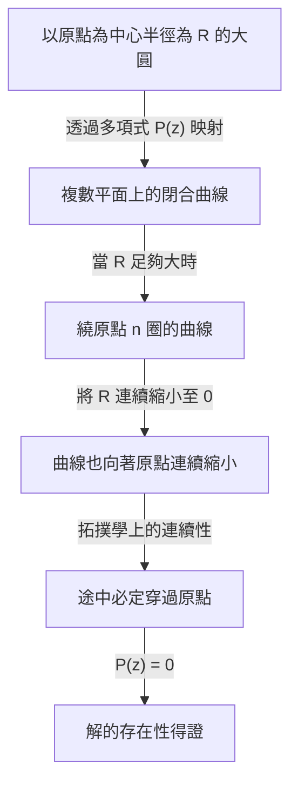

## 引言：方程式與解的探索

數學的歷史也是探索未知數的歷史。當我們在國中學習一元二次方程式時，會學到求根公式。然而，如果僅僅考慮實數範圍，我們很快就會發現存在「無實數解」的方程式。例如，方程式 $x^2 + 1 = 0$ 在實數範圍內就沒有解。因為任何實數 $x$ 的平方都必然大於或等於 $0$，加上 $1$ 是絕不可能等於 $0$ 的。

為了解決這個問題，數學家引入了一個平方等於 $-1$ 的假想數，即虛數單位 $i$。包含它的數系被稱為複數。透過引入複數，$x^2 + 1 = 0$ 的解就可以求出，即 $x = \pm i$。

這時，一個宏大的疑問產生了：「如果把數的範圍擴大到複數，是否可以斷言任何方程式都一定會有解？」或者說，「未來是否還需要引入更新種類的數呢？」

對於這個疑問，數學準備了一個極其明確且優美的答案。這就是本文的主題—— **代數基本定理** （Fundamental Theorem of Algebra）。該定理斷言：「任何複係數的 $n$ 次多項式，在複數範圍內必定存在根（解）。」也就是說，在複數這片廣袤的數字海洋中，任何方程式的解必定存在，保證了我們再也不需要去創造新的數系。

在本文中，我們將詳細講解這個 **代數基本定理** ，從它的歷史背景出發，介紹基於拓撲學直覺的方法，最後展示利用複變分析進行嚴謹而優美的證明。

## 代數基本定理的歷史背景

**代數基本定理** 並非一朝一夕就能證明的。許多偉大的數學家從未懷疑過這個定理的真理，並為得到其完整證明而努力奮鬥。

在17世紀，勒內·笛卡兒和阿爾貝·吉拉爾等數學家已經在經驗上認識到了「 $n$ 次方程式應有 $n$ 個根」這一事實。然而，在當時的數學框架下，缺乏嚴謹證明的手段。

進入18世紀，尚·勒朗·達朗貝爾和李昂哈德·歐拉等巨星開始挑戰證明。達朗貝爾在1746年發表了證明，因此該定理在法國有時被稱為「達朗貝爾定理」，但以現代的標準來看，他的證明在拓撲學的嚴密性上存在缺陷。歐拉也曾試圖證明實係數多項式都可以分解為一次式和二次式的乘積，但留下了邏輯上的空白。

真正對這個堅不可摧的定理給出第一個實質性完整證明的，正是卡爾·弗里德里希·高斯。在1799年的博士論文中，他指出了前人證明中的缺陷，並提供了一個基於幾何直覺的證明。高斯一生中為這個定理給出了4種不同的證明，足以見得他對此定理的重視程度。

現代被認為最標準且最優雅的證明，是基於法國數學家約瑟夫·李歐維爾等人所建立的複變分析（函數論）理論。在本文的後半部分，我們將介紹利用李歐維爾定理的證明。

## 定理的準確表述

首先，讓我們用準確的數學語言來描述定理的表述。

**定理（代數基本定理）**
對於任意滿足 $n \ge 1$ 的自然數 $n$，以及複數係數 $a_0, a_1, \dots, a_n$ （其中 $a_n \neq 0$ ），定義多項式 $P(z)$ 如下：

$$
P(z) = a_n z^n + a_{n-1} z^{n-1} + \dots + a_1 z + a_0
$$

此時，方程式 $P(z) = 0$ 在複數平面上至少有一個解。即，存在複數 $\alpha$ 使得 $P(\alpha) = 0$。

乍看之下僅僅是在說「至少有一個」，但結合多項式餘式定理，我們很容易就能推導出更強的表述：「 $n$ 次方程式在計入重根的情況下，剛好有 $n$ 個複數解。」（關於這一點，將在後文的「定理的推論」中詳細說明。）

## 直觀理解：拓撲學方法

在進入嚴謹證明之前，讓我們先抓住這個定理為何成立的直觀印象。在這裡，我們介紹一種運用拓撲學概念「環繞數（Winding number）」的方法。

讓我們將複數平面上的點用極座標形式表示為 $z = R e^{i\theta}$。其中 $R$ 是到原點的距離（半徑）， $\theta$ 是角度。

考慮多項式 $P(z) = a_n z^n + a_{n-1} z^{n-1} + \dots + a_0$。如果 $R$ 極大， $z$ 的絕對值就會變得巨大，多項式的值將幾乎完全由最高次項 $a_n z^n$ 主導。也就是說，當 $R$ 足夠大時，可以近似認為 $P(z) \approx a_n z^n$。

現在，假設讓 $z$ 沿著半徑為 $R$ 的巨大圓周繞行一圈。當 $\theta$ 從 $0$ 變化到 $2\pi$ 時， $z^n$ 的角度變成 $n\theta$，因此會從 $0$ 變化到 $2n\pi$。這意味著 $P(z)$ 描繪出的軌跡，將成為在複數平面上恰好繞原點轉了 $n$ 圈的閉合曲線。

接下來，想像一下將這個半徑 $R$ 連續縮小的過程。隨著 $R$ 逐漸變小， $P(z)$ 描繪的閉合曲線也會連續地發生形變。最終當 $R = 0$ 時，曲線將收縮到 $P(0) = a_0$ 這一個點上。

這裡的關鍵在於連續性。最初繞原點 $n$ 圈的大圓環，最終要縮小到一個不穿過原點的單一座標點。在拓撲學上，圓環要在不越過原點的情況下連續收縮並匯聚到偏離原點的一點，是不可能做到的。換句話說，在收縮過程的某處，這條曲線必定會穿過原點（ $0$ ）。

曲線穿過原點的瞬間，正意味著存在使得 $P(z) = 0$ 的 $z$。這就是解必定存在的直觀理由。

## 複變分析的準備：李歐維爾定理

在獲得了直觀理解之後，終於要向大家介紹現代數學中最優美、最嚴謹的證明了。這個證明運用了複變分析的強力武器： **李歐維爾定理** （Liouville's Theorem）。

複變分析是處理以複數為變數的函數（複變函數）微積分的領域。與實數函數不同，複變函數的可微性（全純性）是一個極強的條件，只要複變函數能求導一次，它就具有能無限次求導並可進行泰勒展開的驚人性質。

在整個複數平面上處處可微（全純）的函數被稱為 **整函數** （Entire function）。多項式 $P(z)$ 和指數函數 $e^z$ 等都是整函數的典型代表。

李歐維爾定理正是關於這種整函數的一個極其強大的定理。

**定理（李歐維爾定理）**
有界的整函數必為常數函數。

這裡的「有界」，意味著對於所有的複數 $z$，函數的絕對值 $|f(z)|$ 不會超過某個實數 $M$，即存在 $M$ 使得 $|f(z)| \le M$。

在實數世界裡，像 $f(x) = \sin(x)$ 這樣的函數，在整個數線上可微，同時滿足 $-1 \le \sin(x) \le 1$，也就是有界。但它並非定值函數。然而，李歐維爾定理斷言，在複數世界裡這種事絕對不會發生。如果在整個複數平面上全純，並且函數值沒有發散到無限的彼方，那它就只能是一個平坦的常數。

## 代數基本定理的嚴謹證明

那麼，讓我們運用李歐維爾定理來證明代數基本定理吧。你定會驚訝於這證明的精妙。在這裡，我們使用反證法（Proof by contradiction）。

**證明**

對於任意的 $n$ 次（ $n \ge 1$ ）複係數多項式 $P(z) = a_n z^n + \dots + a_1 z + a_0$ （其中 $a_n \neq 0$ ），假設方程式 $P(z) = 0$ 在複數平面上沒有解。

即假設對於所有的複數 $z$，都有 $P(z) \neq 0$。

此時，我們定義一個新函數 $f(z)$ 如下：

$$
f(z) = \frac{1}{P(z)}
$$

根據假設，分母 $P(z)$ 永遠不會為 $0$，因此該函數 $f(z)$ 在整個複數平面上都沒有奇點（使得分母為 $0$ 的點）。多項式 $P(z)$ 處處全純（可微），只要它不為 $0$，其倒數也全純。因此， $f(z)$ 是在整個複數平面上全純的函數，也就是 **整函數** 。

接下來，考察當 $|z|$ 趨向於無窮大時 $f(z)$ 的表現。利用三角不等式可知，當 $|z|$ 足夠大時，多項式 $P(z)$ 的絕對值大小受最高次項主導，從而發散至無窮大。

嚴密地寫，當 $|z| \to \infty$ 時，

$$
|P(z)| = |z|^n \left| a_n + \frac{a_{n-1}}{z} + \dots + \frac{a_0}{z^n} \right| \to \infty
$$

$P(z)$ 的絕對值發散至無窮大，也就意味著它的倒數 $f(z) = 1/P(z)$ 的絕對值收斂至 $0$。

即，

$$
\lim_{|z| \to \infty} |f(z)| = 0
$$

極限為 $0$ 意味著，在某個半徑 $R$ 足夠大的圓外部，可以將其值壓制住，例如 $|f(z)| \le 1$。
另一方面，在包含半徑 $R$ 圓內部的閉圓盤區域（有界閉區域）上，連續函數必定擁有最大值。
因此，無論在圓外還是圓內， $f(z)$ 的絕對值都不會超過某個有限的上限。即， $f(z)$ 是一個 **有界** 函數。

到此為止，已經證明了 $f(z)$ 既是「整函數」，又是「有界的」。
在這裡應用 **李歐維爾定理** 。有界的整函數必須是常數函數。因此，存在某個複數 $c$，使得對所有的 $z$ 都有

$$
f(z) = c
$$

然而，由於 $\lim_{|z| \to \infty} f(z) = 0$，這個常數 $c$ 必定為 $0$。
即對於所有的 $z$ 都有 $f(z) = 0$。

但是，因為 $f(z) = \frac{1}{P(z)}$，分式函數是不可能為 $0$ 的（因為分子為 $1$ ）。這是一個明顯的矛盾。

這個矛盾，是由我們假設「 $P(z) = 0$ 在複數平面上沒有解」所導致的。
所以透過反證法，證明了 $P(z) = 0$ 在複數平面上至少存在一個解。

（證明完畢）

## 定理的推論：分解為一次式的乘積

代數基本定理保證了「至少存在一個解」。將這個事實與關於多項式除法的 **因式定理** （Factor Theorem）結合起來，就可以證明多項式能夠完全分解為一次式的乘積。

當有一個 $n$ 次多項式 $P_n(z)$ 時，根據代數基本定理，存在解 $\alpha_1$ 使得 $P_n(\alpha_1) = 0$。根據因式定理， $P_n(z)$ 必含有因式 $(z - \alpha_1)$。即可以像下面這樣因式分解：

$$
P_n(z) = (z - \alpha_1) P_{n-1}(z)
$$

這裡的 $P_{n-1}(z)$ 是 $n-1$ 次的多項式。如果 $n-1 \ge 1$，就可以再次應用代數基本定理找到 $P_{n-1}(z)$ 的解 $\alpha_2$。透過重複 $n$ 次，最終可以完全因式分解如下：

$$
P_n(z) = a_n (z - \alpha_1)(z - \alpha_2) \dots (z - \alpha_n)
$$

從這個結果，我們可以推導出 **「複數係數的 $n$ 次方程式，計入重根剛好有 $n$ 個解」** 這一極為優美且完整的結論。這就是它被稱為「基本定理」的原因所在。

此外，對於係數全為實數的多項式，如果 $\alpha$ 是解，那麼它的複共軛 $\overline{\alpha}$ 也必然是解。利用這個性質還可以推導出「任意實係數多項式都可以完全因式分解為實數領域上的一次式和二次式的乘積」這一事實。

## 結語

在本文中，我們圍繞代數基本定理，詳細審視了它的歷史背景、拓撲學的直觀認識，以及利用李歐維爾定理所做的複變分析證明。

乍看之下這是一個關於代數方程式的定理，但其最為優雅的證明卻是藉助分析學（微積分）和拓撲學的力量完成的，這一點展現了數學這門學問的深奧，以及各個分支領域緊密相連的美感。

人類尋求方程式解的漫長探索，藉由引入虛數這一全新的數，獲得了複數平面這片廣闊的舞台，而代數基本定理則證明了這個舞台的完整性。這個定理，成為了打開通往現代數學根基——伽羅瓦理論與代數幾何學輝煌大門的一把鑰匙。
