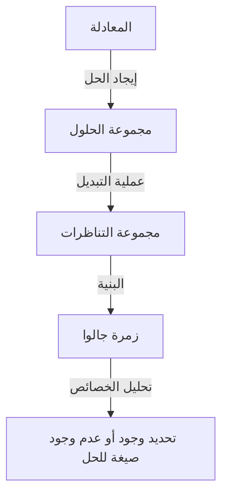
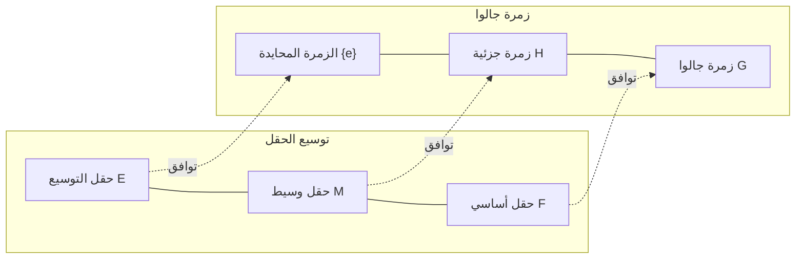

# 1. مقدمة: ما هي نظرية جالوا؟

في تاريخ الرياضيات، تُعد **نظرية جالوا** ([Galois Theory](https://kenji.blog/p/galois-theory/)) واحدة من أكثر النظريات دراماتيكية وعمقاً.
تم بناء هذه النظرية في أوائل القرن التاسع عشر على يد عالم الرياضيات الفرنسي الشاب [إيفاريست جالوا](https://kenji.blog/p/galois/) ([Évariste Galois](https://kenji.blog/p/galois/)).
حلت نظرية جالوا بنجاح المعضلة القديمة: "لماذا لا توجد صيغة عامة للحل لمعادلات الدرجة الخامسة فما فوق؟" باستخدام مفهوم جديد تماماً وهو **الزمرة** (Group).

في هذا المقال، سنشرح بأكبر قدر ممكن من التعمق والتبسيط كل شيء بدءاً من الأفكار الأساسية لنظرية جالوا، مروراً بخلفيتها التاريخية، وصولاً إلى تأثيرها على الرياضيات الحديثة. دعونا نفتح أبواب الجبر ونلامس جمال التناظر.

## 1.1 ما هي صيغة حل المعادلة؟

تحتوي المعادلة التربيعية $ax^2 + bx + c = 0$ التي نتعلمها في المرحلة الإعدادية على صيغة الحل التالية:

$$
x = \frac{-b \pm \sqrt{b^2 - 4ac}}{2a}
$$

توضح هذه الصيغة أنه من خلال تطبيق العمليات الحسابية الأربع (الجمع، الطرح، الضرب، القسمة) والجذور (الجذر التربيعي، الجذر التكعيبي، إلخ) عدداً محدوداً من المرات على المعاملات $a, b, c$، يمكن دائماً استنتاج حل لأي معادلة تربيعية.
اكتشف علماء الرياضيات الإيطاليون في القرن السادس عشر (كاردانو، تارتاليا، فيراري وغيرهم) أن لمعادلات الدرجة الثالثة والرابعة أيضاً صيغ حل تستخدم العمليات الحسابية الأربع والجذور، على الرغم من كونها أكثر تعقيداً. كانت هذه الاكتشافات بمثابة طفرة كبيرة في تاريخ الرياضيات.

ومع ذلك، بالنسبة لـ **معادلة الدرجة الخامسة** $ax^5 + bx^4 + cx^3 + dx^2 + ex + f = 0$، حاول العديد من علماء الرياضيات العباقرة مثل أويلر ولاجرانج على مدى قرون إيجاد صيغة للحل، لكن لم ينجح أحد منهم. ركز لاجرانج على تباديل الحلول وتمكن من إيجاد خيط للحل، لكنه لم يصل إلى إثبات كامل. لاحقاً، أثبت روفيني وآبيل "عدم وجود صيغة حل عامة لمعادلات الدرجة الخامسة فما فوق" (مبرهنة آبيل-روفيني)، لكنهم لم يتمكنوا من تقديم معيار أساسي يحدد أي المعادلات يمكن حلها وأيها لا يمكن.

# 2. التناظر وميلاد نظرية الزمر

كان الإنجاز الأكبر لجالوا هو عدم النظر إلى حلول المعادلة كمجرد "أرقام"، بل التركيز على **التناظر** (Symmetry) بين الحلول. لقد وصف البنية المتأصلة التي تمتلكها المعادلة باستخدام مفهوم جديد يسمى "الزمرة".

## 2.1 تبديل الحلول وزمرة جالوا

لنفكر في عملية تبديل (تباديل) حلول معادلة معينة.
إذا بقيت العلاقة الرياضية بين الحلول (العلاقة ككثيرة حدود بمعاملات كسرية) محفوظة حتى بعد تبديل الحلول، فيمكن القول إن هذا التبديل "يحافظ على تناظر المعادلة".
اكتشف جالوا أن مجموعة هذه التباديل التي تحافظ على التناظر تمتلك بنية رياضية تُسمى **الزمرة**. تُسمى هذه الزمرة بـ **زمرة جالوا** (Galois Group) لتلك المعادلة.

## 2.2 أساسيات نظرية الزمر والزمر القابلة للحل

هنا، دعونا نقدم المفاهيم الأساسية لنظرية الزمر.
الزمرة $G$ هي مجموعة مُعرَّف عليها عملية واحدة (على سبيل المثال، الضرب أو التركيب) وتحقق الشروط الثلاثة التالية:

1. **قانون التجميع**: لأي $a, b, c \in G$، يتحقق أن $(a \cdot b) \cdot c = a \cdot (b \cdot c)$.
2. **وجود العنصر المحايد**: يوجد عنصر $e \in G$ بحيث لأي $a \in G$، يتحقق أن $a \cdot e = e \cdot a = a$.
3. **وجود العنصر المعكوس**: لأي $a \in G$، يوجد $a^{-1} \in G$ بحيث يكون $a \cdot a^{-1} = a^{-1} \cdot a = e$.

أثبت جالوا أن "إمكانية حل المعادلة بالجذور" (القدرة على التعبير عن الحل باستخدام مزيج من العمليات الحسابية الأربع والجذور) تكافئ تماماً امتلاك زمرة جالوا لتلك المعادلة لخاصية خاصة تُسمى **الزمرة القابلة للحل** (Solvable Group). بعبارة أبسط، الزمرة القابلة للحل هي الزمرة التي إذا قمنا بتفكيكها إلى أجزاء أصغر فأصغر، نصل في النهاية إلى زمرة إبدالية (زمرة دائرية) في أبسط صورها.

# 3. لماذا لا يمكن حل معادلة الدرجة الخامسة؟

باستخدام نظرية جالوا، يصبح من الواضح والمدهش لماذا لا توجد صيغة حل لمعادلات الدرجة الخامسة فما فوق.

## 3.1 توسيع الحقول وتوافق جالوا

يمكن النظر إلى عملية حل المعادلة كعملية توسيع تدريجي لمجموعة الأعداد (**الحقل**، Field). الحقل هو مجموعة يمكن فيها إجراء العمليات الحسابية الأربع بحرية (مثل: مجموعة الأعداد الكسرية، مجموعة الأعداد الحقيقية).
على سبيل المثال، نبدأ من مجموعة الأعداد الكسرية $\mathbb{Q}$ ونضيف الجذور التي تشكل مكونات حل المعادلة لإنشاء حقل جديد. يُسمى هذا بـ **توسيع الحقل**.

توضح المبرهنة الأساسية التي تمثل قلب نظرية جالوا وجود علاقة تقابل جميلة بنسبة 1 إلى 1 (**توافق جالوا**) بين "الحقول الوسيطة لتوسيع الحقل" و "الزمر الجزئية لزمرة جالوا". توجد علاقة عكسية رائعة، حيث يتوافق الحقل الأكبر مع الزمرة الأصغر، ويتوافق الحقل الأصغر مع الزمرة الأكبر.

## 3.2 عدم قابلية الحل للزمرة المتناوبة من الدرجة الخامسة

بشكل عام، زمرة جالوا لمعادلة من الدرجة $n$ هي **الزمرة المتماثلة** $S_n$ والتي تتكون من جميع التباديل للحلول الـ $n$.
من المعروف أنه في حالة $n=2, 3, 4$، تكون الزمرة المتماثلة $S_n$ زمرة قابلة للحل. هذا يتوافق مع وجود صيغ حل لمعادلات الدرجة الثانية والثالثة والرابعة.

ومع ذلك، في حالة $n \ge 5$، يتغير هيكل الزمرة المتماثلة $S_n$ بشكل كبير. **الزمرة المتناوبة** $A_5$ (الزمرة المكونة من التباديل الزوجية فقط) الموجودة داخل $S_5$ هي "زمرة بسيطة" لا تحتوي على زمر جزئية ناظمية سوى الزمرة التافهة، وهي أيضاً غير أبيلية (غير إبدالية).
مثل هذه الزمر البسيطة غير الإبدالية ليست زُمراً قابلة للحل.
لذلك، فإن زمرة جالوا $S_5$ لمعادلة عامة من الدرجة الخامسة ليست زمرة قابلة للحل، ونتيجة لذلك يثبت أنه "لا توجد صيغة للحل بواسطة الجذور".

$$
\text{زمرة جالوا للمعادلة العامة من الدرجة الخامسة } S_5 \text{ ليست زمرة قابلة للحل}
$$

هذا لا يعني ببساطة أنه "لم يتم العثور على الصيغة بعد"، بل يمثل حقيقة قاطعة بأن "مثل هذه الصيغة لا يمكن أن توجد رياضياً".

# 4. حياة [إيفاريست جالوا](https://kenji.blog/p/galois/)

في حين أن جمال نظرية جالوا يتألق ببراعة في تاريخ الرياضيات، فإن حياة جالوا الدرامية نفسها تستمر في سحر الكثير من الناس.

وُلد جالوا في عام 1811 بالقرب من باريس، فرنسا. أظهر موهبة رياضية استثنائية منذ سن المراهقة، لكن رواد الرياضيات في ذلك الوقت (مثل كوشي، فورييه، وبواسون) لم يتمكنوا من فهم مدى ابتكار نظريته، وعانى من سوء الحظ حيث فُقدت أوراقه البحثية أو أُعيدت إليه بدعوى أن "الشرح غير كافٍ وغير مفهوم". كما فشل مرتين في امتحان القبول في مدرسة البوليتكنيك بسبب صدامات مع الممتحنين.

بالإضافة إلى ذلك، انغمس في الأنشطة السياسية كجمهوري متحمس. تم طرده من المدرسة بسبب تصريحاته وأفعاله المتطرفة ضد النظام الملكي، بل وتعرض للسجن. على الرغم من كونه عبقرياً في الرياضيات، إلا أن شغفه كان دائماً موجهاً نحو الثورة السياسية والاجتماعية.

وفي عام 1832، تورط جالوا في مبارزة بالمسدسات بسبب نزاع عاطفي (وهناك نظرية تقول إنها كانت مؤامرة سياسية).
في الليلة التي سبقت المبارزة، توقع وفاته وخشي أن تضيع نظريته الرياضية. فكتب بسرعة واستمر طوال الليل في تدوين ملخص لنظريته في رسالة إلى صديقه أوجست شوفالييه.
ويُقال إن على هامش تلك الرسالة، كتب الكلمات الحزينة: "ليس لدي وقت!" (Je n'ai pas le temps!).

أُصيب جالوا في بطنه خلال المبارزة التي جرت في 30 مايو، وتوفي في اليوم التالي عن عمر يناهز 20 عاماً فقط.
الملاحظات المعقدة التي تركها خلفه، تم فك تشفيرها وتنظيمها بعناية بواسطة جوزيف ليوفيل بعد أكثر من 10 سنوات، وأخيراً نُشرت في مجلة أكاديمية في عام 1846. لم يُعرف المحتوى المذهل لهذه الملاحظات إلا بعد وفاته بفترة طويلة، مما أحدث صدمة في عالم الرياضيات.

# 5. تأثير نظرية جالوا على الرياضيات الحديثة

إن البذور التجريدية التي زرعها جالوا مثل "الزمرة" و "توسيع الحقل" قد غيرت مسار الرياضيات اللاحقة بشكل جذري.
ليس من المبالغة القول إن **الجبر التجريدي** الحديث تطور متخذاً نظرية جالوا كنقطة انطلاق. ترسخ أسلوب إيجاد البنية ودراستها في أي مجموعة من الكائنات، ليس فقط الأعداد، بل أيضاً في كثيرات الحدود والمصفوفات والدوال وغيرها.

علاوة على ذلك، تلعب فكرة التعامل مع التناظر كزمرة دوراً أساسياً ليس فقط في الرياضيات، بل في مجموعة واسعة من المجالات مثل الفيزياء، الكيمياء، وعلوم المعلومات.
على سبيل المثال، يُبنى النموذج القياسي لفيزياء الجسيمات على نظرية الزمر المستمرة المعروفة بـ زمر لي، كما أن نظرية التشفير التي تدعم أمن اتصالات المعلومات، ونظرية الترميز التي تصحح أخطاء نقل البيانات (مثل رمز ريد-سولومون المستخدم في الأقراص المدمجة، وأقراص الفيديو الرقمية، ورموز الاستجابة السريعة QR وغيرها) هي تطبيقات مباشرة لنظرية جالوا على الحقول المنتهية.

# 6. خلاصة وآفاق

تُعلمنا نظرية جالوا أن وراء المعادلات التي تبدو للوهلة الأولى كمجرد ترتيب معقد للمعادلات الرياضية، يختبئ هيكل هندسي جميل يتمثل في التناظر.
إن النظرية التي وُلدت لإظهار النتيجة "السلبية" المتمثلة في عدم إمكانية حل معادلة الدرجة الخامسة، أصبحت في النهاية ضوءاً هائلاً ينير الرياضيات الحديثة بأكملها، وفتحت عالماً جديداً تماماً في الرياضيات، وهذا يُعد بلا شك أكبر مفارقة ومعجزة في تاريخ العلوم.

إن رحلة استكشاف جمال التناظر المخفي في المعادلات بدأت من جالوا ولا تزال مستمرة حتى اليوم في الرياضيات المتقدمة (مثل برنامج لانجلاندز). لا يزال الإلهام الذي تركه جالوا في حياته القصيرة يمنحنا إلهاماً لا حدود له حتى بعد مرور ما يقرب من 200 عام.
