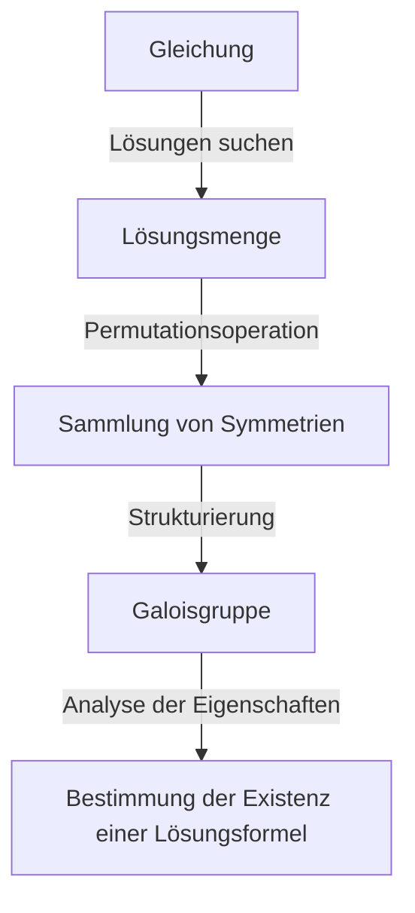
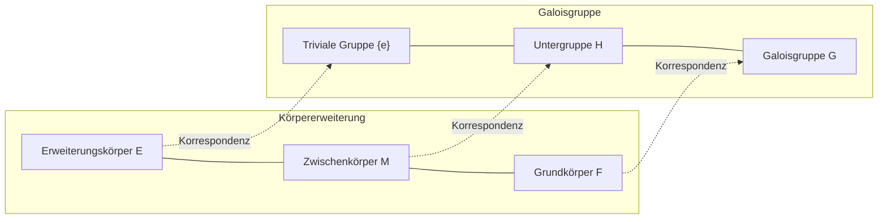

# 1. Einleitung: Was ist die Galois-Theorie?

In der Geschichte der Mathematik ist eine der dramatischsten und zugleich tiefgründigsten Theorien die **Galois-Theorie** (Galois Theory).
Diese Theorie wurde zu Beginn des 19. Jahrhunderts von dem jungen französischen Mathematiker Évariste Galois entwickelt.
Die Galois-Theorie löste das alte und schwierige Problem "Warum gibt es keine allgemeine Lösungsformel für Gleichungen fünften oder höheren Grades?" brillant, indem sie das völlig neue Konzept der **Gruppe** (Group) nutzte.

In diesem Artikel werden wir die grundlegenden Ideen der Galois-Theorie, ihren historischen Hintergrund und ihren Einfluss auf die moderne Mathematik so tief und verständlich wie möglich erklären. Öffnen wir die Tür zur Algebra und lassen wir uns von der Schönheit der Symmetrie berühren.

## 1.1 Was ist eine Lösungsformel für Gleichungen?

Für die quadratische Gleichung $ax^2 + bx + c = 0$, die wir in der Mittelschule lernen, gibt es die folgende Lösungsformel:

$$
x = \frac{-b \pm \sqrt{b^2 - 4ac}}{2a}
$$

Diese Formel zeigt, dass man für die Koeffizienten $a, b, c$ durch eine endliche Anzahl von Grundrechenarten (Addition, Subtraktion, Multiplikation, Division) und Wurzelziehen (Quadratwurzel, Kubikwurzel usw.) immer die Lösung finden kann, egal um welche quadratische Gleichung es sich handelt.
Für Gleichungen dritten und vierten Grades fanden italienische Mathematiker im 16. Jahrhundert (Cardano, Tartaglia, Ferrari usw.) heraus, dass es, wenn auch komplexer, ebenfalls Lösungsformeln unter Verwendung von Grundrechenarten und Wurzeln gibt. Dies waren große Durchbrüche in der Geschichte der Mathematik.

Für die **Gleichung 5. Grades** $ax^5 + bx^4 + cx^3 + dx^2 + ex + f = 0$ jedoch versuchten viele geniale Mathematiker wie Euler und Lagrange jahrhundertelang, eine Lösungsformel zu finden, aber niemand war erfolgreich. Lagrange konzentrierte sich auf die Permutation von Lösungen und fand einen Ansatzpunkt zur Lösung, kam aber nicht zu einem vollständigen Beweis. Später bewiesen Ruffini und Abel, dass "es keine allgemeine Lösungsformel für Gleichungen 5. und höheren Grades gibt" (Satz von Abel-Ruffini), aber sie konnten kein grundlegendes Kriterium dafür liefern, welche Gleichungen lösbar sind und welche nicht.

# 2. Symmetrie und die Geburt der Gruppentheorie

Das größte Verdienst von Galois war es, die Lösungen von Gleichungen nicht einfach als "Zahlen" zu betrachten, sondern sich auf die **Symmetrie** (Symmetry) zwischen den Lösungen zu konzentrieren. Er beschrieb die inhärente Struktur einer Gleichung mit einem neuen Konzept namens "Gruppe".

## 2.1 Permutation von Lösungen und die Galoisgruppe

Betrachten wir die Operation des Vertauschens (Permutation) der Lösungen einer Gleichung.
Wenn die Beziehungen (als Polynome mit rationalen Koeffizienten), die zwischen den Lösungen bestehen, auch nach dem Vertauschen der Lösungen erhalten bleiben, sagt man, dass diese Permutation "die Symmetrie der Gleichung erhält".
Galois entdeckte, dass die Menge der Permutationen, die diese Symmetrie erhalten, eine mathematische Struktur namens **Gruppe** bildet. Diese Gruppe wird als die **Galoisgruppe** (Galois Group) der Gleichung bezeichnet.

## 2.2 Grundlagen der Gruppentheorie und auflösbare Gruppen

Lassen Sie uns hier die grundlegenden Konzepte der Gruppentheorie vorstellen.
Eine Gruppe $G$ ist eine Menge, auf der eine einzige Operation (z.B. Multiplikation oder Verknüpfung) definiert ist und die die folgenden 3 Bedingungen erfüllt:

1. **Assoziativgesetz**: Für beliebige $a, b, c \in G$ gilt $(a \cdot b) \cdot c = a \cdot (b \cdot c)$.
2. **Existenz des neutralen Elements**: Es existiert ein Element $e \in G$, sodass für jedes $a \in G$ gilt: $a \cdot e = e \cdot a = a$.
3. **Existenz des inversen Elements**: Für jedes $a \in G$ existiert ein $a^{-1} \in G$, sodass $a \cdot a^{-1} = a^{-1} \cdot a = e$ gilt.

Galois bewies, dass die Tatsache, dass eine Gleichung "durch Radikale auflösbar ist" (die Lösung kann als Kombination von Grundrechenarten und Wurzeln ausgedrückt werden), völlig äquivalent dazu ist, dass die Galoisgruppe der Gleichung eine spezielle Eigenschaft hat, die als **auflösbare Gruppe** (Solvable Group) bezeichnet wird. Eine auflösbare Gruppe ist, grob gesagt, eine Gruppe, die, wenn man sie immer weiter zerlegt, letztendlich bei der einfachsten kommutativen Gruppe (zyklischen Gruppe) ankommt.

# 3. Warum sind Gleichungen 5. Grades unlösbar?

Mithilfe der Galois-Theorie wird erstaunlich klar, warum es für Gleichungen ab dem 5. Grad keine Lösungsformel gibt.

## 3.1 Körpererweiterung und Galoiskorrespondenz

Der Prozess des Lösens einer Gleichung kann als ein Prozess der allmählichen Erweiterung einer Menge von Zahlen (eines **Körpers**, Field) verstanden werden. Ein Körper ist eine Menge, in der die vier Grundrechenarten frei ausgeführt werden können (z.B. die Menge aller rationalen Zahlen, aller reellen Zahlen usw.).
Wir beginnen beispielsweise mit der Menge der rationalen Zahlen $\mathbb{Q}$ und bilden einen neuen Körper, indem wir Wurzeln hinzufügen, die Bestandteile der Lösungen der Gleichung sind. Dies wird als **Körpererweiterung** bezeichnet.

Der Hauptsatz, das Herzstück der Galois-Theorie, zeigt, dass es eine wunderschöne 1-zu-1-Korrespondenz (**Galoiskorrespondenz**) zwischen den "Zwischenkörpern der Körpererweiterung" und den "Untergruppen der Galoisgruppe" gibt. Es existiert eine brillante umgekehrte Beziehung: Ein größerer Körper entspricht einer kleineren Gruppe, und ein kleinerer Körper entspricht einer größeren Gruppe.

## 3.2 Die Unauflösbarkeit der alternierenden Gruppe vom Grad 5

Die Galoisgruppe einer allgemeinen Gleichung $n$-ten Grades ist die **symmetrische Gruppe** $S_n$, die aus allen Permutationen der $n$ Lösungen besteht.
Für $n=2, 3, 4$ ist bekannt, dass die symmetrische Gruppe $S_n$ eine auflösbare Gruppe ist. Dies entspricht der Tatsache, dass es Lösungsformeln für Gleichungen 2., 3. und 4. Grades gibt.

Für $n \ge 5$ ändert sich die Struktur der symmetrischen Gruppe $S_n$ jedoch dramatisch. Die in $S_5$ enthaltene **alternierende Gruppe** $A_5$ (die Gruppe, die nur aus geraden Permutationen besteht) ist eine "einfache Gruppe", die nur triviale Normalteiler hat, und sie ist nicht-abelsch (nicht-kommutativ).
Solche einfachen, nicht-kommutativen Gruppen sind keine auflösbaren Gruppen.
Folglich ist die Galoisgruppe $S_5$ einer allgemeinen Gleichung 5. Grades keine auflösbare Gruppe, womit bewiesen ist, dass "keine Lösungsformel durch Radikale existiert".

$$
\text{Die Galoisgruppe einer allgemeinen Gleichung 5. Grades } S_5 \text{ ist keine auflösbare Gruppe}
$$

Dies bedeutet nicht einfach, dass "noch keine Formel gefunden wurde", sondern stellt die definitive Tatsache dar, dass "eine solche Formel mathematisch nicht existieren kann".

# 4. Das Leben von Évariste Galois

Während die Schönheit der Galois-Theorie in der Geschichte der Mathematik strahlt, zieht auch das dramatische Leben von Galois selbst weiterhin viele Menschen in seinen Bann.

Galois wurde 1811 in der Nähe von Paris, Frankreich, geboren. Obwohl er sein außergewöhnliches mathematisches Talent schon in seinen Teenagerjahren entfaltete, verstanden die Autoritäten der damaligen mathematischen Welt (wie Cauchy, Fourier und Poisson) die extreme Neuartigkeit seiner Theorien nicht. Er erlitt das Pech, dass seine Arbeiten verloren gingen oder als "unzureichend erklärt und unverständlich" zurückgewiesen wurden. Er scheiterte auch zweimal bei der Aufnahmeprüfung für die École Polytechnique, weil er mit den Prüfern aneinandergeriet.

Außerdem stürzte er sich als leidenschaftlicher Republikaner in politische Aktivitäten. Wegen seiner radikalen Äußerungen gegen die Monarchie wurde er von der Schule verwiesen und sogar ins Gefängnis geworfen. Obwohl er ein mathematisches Genie war, richtete sich seine Leidenschaft immer auch auf politische und gesellschaftliche Revolution.

Im Jahr 1832 geriet Galois aufgrund von Verwicklungen in Liebesangelegenheiten (manche Theorien besagen, es sei eine politische Verschwörung gewesen) in ein Pistolenduell.
In der Nacht vor dem Duell ahnte er seinen Tod und fürchtete, dass seine mathematischen Theorien verloren gehen würden. In einem Brief an seinen Freund Auguste Chevalier schrieb er die Nacht durch hastig die Hauptpunkte seiner Theorien nieder.
Es wird berichtet, dass er die tragischen Worte "Ich habe keine Zeit! (Je n'ai pas le temps!)" an den Rand dieses Briefes kritzelte.

Galois, der am nächsten Tag, dem 30. Mai, im Duell in den Bauch getroffen wurde, verstarb am darauffolgenden Tag im Alter von nur 20 Jahren.
Die komplexen Notizen, die er hinterließ, wurden mehr als 10 Jahre später von Joseph Liouville sorgfältig entschlüsselt und organisiert und schließlich 1846 in einer akademischen Zeitschrift veröffentlicht. Erst lange nach seinem Tod wurde ihr erstaunlicher Inhalt der Welt bekannt und erschütterte die mathematische Gemeinschaft.

# 5. Der Einfluss der Galois-Theorie auf die moderne Mathematik

Die abstrakten Samen wie "Gruppe" und "Körpererweiterung", die Galois gesät hat, veränderten die spätere Mathematik grundlegend.
Es ist keine Übertreibung zu sagen, dass sich die moderne **abstrakte Algebra** mit der Galois-Theorie als Ausgangspunkt entwickelt hat. Der Ansatz, Strukturen in Ansammlungen von beliebigen Objekten (nicht nur Zahlen, sondern auch Polynome, Matrizen, Funktionen usw.) zu finden und zu studieren, etablierte sich.

Darüber hinaus spielt der Gedanke, Symmetrie als Gruppe zu begreifen, eine grundlegende Rolle nicht nur in der Mathematik, sondern in einer Vielzahl von Bereichen wie Physik, Chemie und Informatik.
Zum Beispiel ist das Standardmodell der Teilchenphysik auf der Theorie der kontinuierlichen Gruppen, den sogenannten Lie-Gruppen, aufgebaut. Auch die Kryptographie, die die Sicherheit der Informationskommunikation gewährleistet, und die Kodierungstheorie zur Korrektur von Fehlern in der Datenkommunikation (wie der Reed-Solomon-Code, der für CDs, DVDs und QR-Codes verwendet wird) sind direkte Anwendungen der Galois-Theorie über endlichen Körpern.

# 6. Zusammenfassung und Ausblick

Die Galois-Theorie lehrt uns, dass sich hinter den Gleichungen, die auf den ersten Blick wie eine komplizierte Aneinanderreihung von mathematischen Formeln aussehen, wunderschöne geometrische Strukturen der Symmetrie verbergen.
Dass eine Theorie, die geboren wurde, um das "negative" Ergebnis zu zeigen, dass Gleichungen 5. Grades unlösbar sind, letztendlich zu einem riesigen Licht wurde, das die gesamte moderne Mathematik beleuchtet und eine völlig neue mathematische Welt eröffnet hat, ist das größte Paradoxon und ein Wunder in der Geschichte der Wissenschaft.

Die Reise zur Erforschung der Schönheit der in Gleichungen verborgenen Symmetrie begann mit Galois und setzt sich heute in der Spitzenmathematik (wie dem Langlands-Programm) fort. Der Blitz der Inspiration, den Galois in seinem kurzen Leben hinterlassen hat, inspiriert uns auch fast 200 Jahre später noch grenzenlos.
