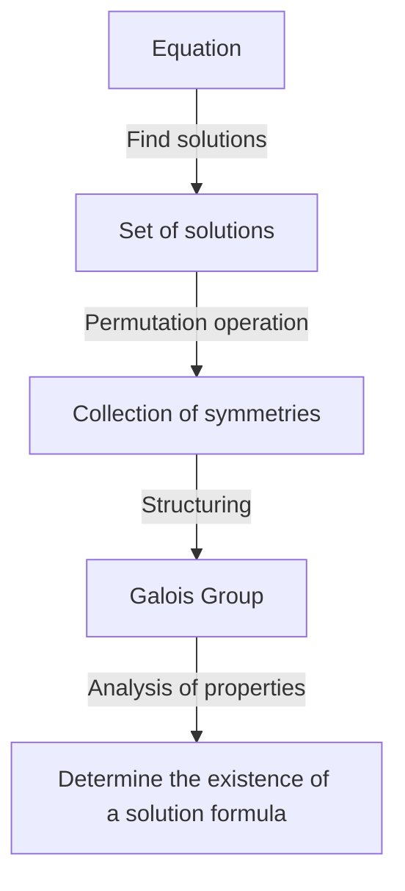
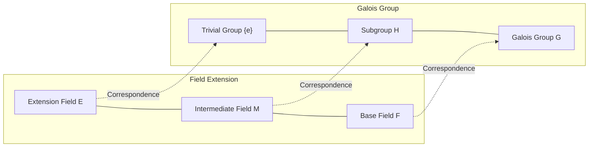

# 1. Introduction: What is Galois Theory?

In the history of mathematics, one of the most dramatic and profound theories is **Galois Theory**.
This theory was constructed in the early 19th century by the young French mathematician Évariste Galois.
Galois Theory brilliantly solved the age-old problem of "Why is there no general formula for equations of degree 5 or higher?" by using a completely new concept called a **Group**.

In this article, we will explain everything from the basic ideas of [Galois theory](https://kenji.blog/p/galois-theory/) to its historical background and its impact on modern mathematics as deeply and clearly as possible. Let's open the door to algebra and touch the beauty of symmetry.

## 1.1 What is a Solution Formula for an Equation?

The quadratic equation $ax^2 + bx + c = 0$ we learn in junior high school has the following solution formula:

$$
x = \frac{-b \pm \sqrt{b^2 - 4ac}}{2a}
$$

This formula shows that for the coefficients $a, b, c$, you can always derive a solution for any quadratic equation just by applying the four arithmetic operations (addition, subtraction, multiplication, division) and roots (square roots, cube roots, etc.) a finite number of times.
For cubic and quartic equations, although more complex, similar solution formulas using the four arithmetic operations and roots exist, which were discovered by 16th-century Italian mathematicians (Cardano, Tartaglia, Ferrari, etc.). These were major breakthroughs in the history of mathematics.

However, for the **quintic equation** $ax^5 + bx^4 + cx^3 + dx^2 + ex + f = 0$, many genius mathematicians over the centuries, such as Euler and Lagrange, attempted to find a solution formula, but no one succeeded. Lagrange focused on the permutations of solutions and caught a clue to the solution, but did not reach a complete proof. Later, Ruffini and Abel proved that "there is no general solution formula for equations of degree 5 or higher" (the Abel-Ruffini theorem), but they could not provide a fundamental criterion for which equations can be solved and which cannot.

# 2. Symmetry and the Birth of Group Theory

Galois's greatest achievement was not treating the solutions of equations as mere "numbers", but focusing on the **symmetry** among the solutions. He described the inherent structure of an equation using a new concept called a "group".

## 2.1 Permutation of Solutions and the Galois Group

Consider the operation of swapping (permuting) the solutions of an equation.
If the relational expressions holding among the solutions (relations as polynomials with rational coefficients) are preserved even when the solutions are swapped, that permutation is said to "preserve the symmetry of the equation".
Galois discovered that the collection of permutations preserving such symmetry has a mathematical structure called a **group**. This group is called the **Galois Group** of the equation.

## 2.2 Basics of Group Theory and Solvable Groups

Here, let's introduce the basic concepts of group theory.
A group $G$ is a set with a single operation (e.g., multiplication or composition) defined, satisfying the following three conditions:

1. **Associative law**: For any $a, b, c \in G$, $(a \cdot b) \cdot c = a \cdot (b \cdot c)$ holds.
2. **Existence of an identity element**: There exists an element $e \in G$ such that for any $a \in G$, $a \cdot e = e \cdot a = a$ holds.
3. **Existence of an inverse element**: For any $a \in G$, there exists an $a^{-1} \in G$ such that $a \cdot a^{-1} = a^{-1} \cdot a = e$ holds.

Galois proved that an equation being "solvable by radicals" (the solutions can be expressed by combinations of the four arithmetic operations and roots) and its Galois group having a special property called a **Solvable Group** are perfectly equivalent. Roughly speaking, a solvable group is a group that, when broken down into smaller and smaller pieces, eventually leads to the simplest commutative groups (cyclic groups).

# 3. Why Can't Quintic Equations Be Solved?

By using [Galois theory](https://kenji.blog/p/galois-theory/), the reason why there is no solution formula for equations of degree 5 or higher becomes surprisingly clear.

## 3.1 Field Extensions and the Galois Correspondence

The process of solving an equation can be seen as a process of gradually expanding a set of numbers (a **Field**). A field is a set where the four arithmetic operations can be freely performed (e.g., the set of all rational numbers, the set of all real numbers, etc.).
For example, starting from the set of rational numbers $\mathbb{Q}$, we create a new field by adding roots which are components of the equation's solutions. This is called a **field extension**.

The fundamental theorem, which is the heart of [Galois theory](https://kenji.blog/p/galois-theory/), shows that there is a beautiful one-to-one correspondence (**Galois correspondence**) between "intermediate fields of a field extension" and "subgroups of a Galois group". A magnificent inverse relationship exists, where a larger field corresponds to a smaller group, and a smaller field corresponds to a larger group.

## 3.2 Insolvability of the Alternating Group of Degree 5

The Galois group of a general equation of degree $n$ is the **symmetric group** $S_n$ consisting of all permutations of the $n$ solutions.
For $n=2, 3, 4$, the symmetric group $S_n$ is known to be a solvable group. This corresponds to the existence of solution formulas for quadratic, cubic, and quartic equations.

However, for $n \ge 5$, the structure of the symmetric group $S_n$ changes significantly. The **alternating group** $A_5$ (a group consisting only of even permutations) contained in $S_5$ is a "simple group" that has no normal subgroups other than the trivial ones, and it is non-abelian (non-commutative).
Such simple non-commutative groups are not solvable groups.
Therefore, the Galois group $S_5$ of a general quintic equation is no longer a solvable group, and as a result, it is proved that "a solution formula using radicals does not exist".

$$
\text{The Galois group } S_5 \text{ of a general quintic equation is not a solvable group}
$$

This does not simply mean "a formula hasn't been found yet," but shows the definitive fact that "such a formula cannot mathematically exist."

# 4. The Life of Évariste Galois

While the beauty of [Galois theory](https://kenji.blog/p/galois-theory/) shines brilliantly in the history of mathematics, Galois's own dramatic life also never ceases to captivate many people.

Galois was born in 1811 near Paris, France. He blossomed with extraordinary mathematical talent from his teenage years, but the authorities of the mathematical world at the time (such as Cauchy, Fourier, and Poisson) could not understand the sheer novelty of his theories. He suffered misfortune, with his papers being lost or rejected as "insufficiently explained and incomprehensible." He also failed the entrance exam for the École Polytechnique twice due to clashes with examiners.

Moreover, as an enthusiastic republican, he immersed himself in political activities. He was expelled from school for his radical statements against the monarchy, and even experienced imprisonment. Despite being a mathematical genius, his passion was always directed toward politics and social revolution as well.

Then, in 1832, Galois ended up in a pistol duel over a romantic entanglement (some theories suggest it was a political conspiracy).
On the eve of the duel, he had a premonition of his death and feared that his mathematical theories would be lost. He stayed up all night frantically writing down the essence of his theories in a letter to his friend Auguste Chevalier.
It is said that the tragic words "I have no time! (Je n'ai pas le temps!)" were scribbled in the margins of that letter.

Shot in the abdomen during the duel on May 30th, Galois passed away the following day at the mere age of 20.
His difficult notes were carefully deciphered and organized by Joseph Liouville over 10 years later, and were finally published in an academic journal in 1846. It was long after his death that their astonishing contents became known to the world and sent shockwaves through the mathematical community.

# 5. The Impact of Galois Theory on Modern Mathematics

The abstract seeds of "groups" and "field extensions" that Galois sowed greatly transformed subsequent mathematics.
It is no exaggeration to say that modern **abstract algebra** developed with [Galois theory](https://kenji.blog/p/galois-theory/) as its starting point. The style of finding structures in collections of all kinds of objects—not just numbers, but polynomials, matrices, and functions—and studying them has become firmly established.

Furthermore, the idea of capturing symmetry as a group plays a fundamental role not only in mathematics but also in a wide range of fields such as physics, chemistry, and information science.
For example, the Standard Model of particle physics is built on the continuous group theory called Lie groups. Cryptographic theories that support the security of information communication, and coding theories that correct errors in data communication (for instance, the Reed-Solomon codes used in CDs, DVDs, QR codes, etc.) are also direct applications of [Galois theory](https://kenji.blog/p/galois-theory/) over finite fields.

# 6. Conclusion and Outlook

[Galois theory](https://kenji.blog/p/galois-theory/) teaches us that behind the equations, which at first glance look like nothing more than a complex sequence of formulas, lies a beautiful geometric structure of symmetry.
It is perhaps the greatest paradox and miracle in the history of science that a theory born to show the "negative" result that quintic equations cannot be solved, ended up becoming an immense light that illuminated the entirety of modern mathematics, opening up a completely new mathematical world.

The journey exploring the beauty of symmetry hidden in equations started with Galois and continues today into cutting-edge mathematics (such as the Langlands program). The flashes of brilliance left by Galois in his short life continue to provide us with infinite inspiration even now, nearly 200 years later.
