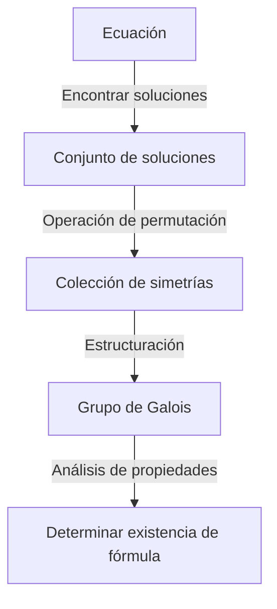
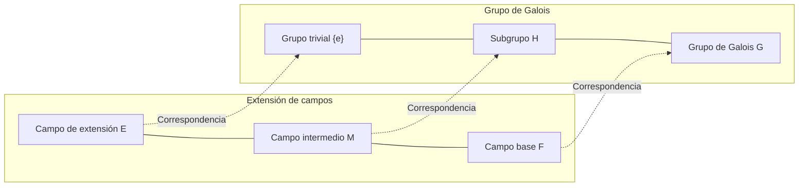

# 1. Introducción: ¿Qué es la Teoría de Galois?

Una de las teorías más dramáticas y profundas en la historia de las matemáticas es la **Teoría de Galois** ([Galois Theory](https://kenji.blog/es/p/galois-theory/)).
Esta teoría fue desarrollada a principios del siglo XIX por el joven matemático francés [Évariste Galois](https://kenji.blog/es/p/galois/).
La Teoría de Galois resolvió brillantemente el antiguo enigma de "¿por qué no existe una fórmula general para ecuaciones de grado 5 o superior?" utilizando un concepto completamente nuevo llamado **grupo** (Group).

En este artículo, explicaremos de la manera más profunda y comprensible posible las ideas básicas de la Teoría de Galois, su contexto histórico y el impacto que ha tenido en las matemáticas modernas. Abramos la puerta del álgebra y experimentemos la belleza de la simetría.

## 1.1 ¿Qué es una fórmula para resolver una ecuación?

La ecuación cuadrática $ax^2 + bx + c = 0$ que aprendemos en la escuela secundaria tiene la siguiente fórmula de resolución:

$$
x = \frac{-b \pm \sqrt{b^2 - 4ac}}{2a}
$$

Esta fórmula muestra que para los coeficientes $a, b, c$, aplicando las cuatro operaciones aritméticas (suma, resta, multiplicación, división) y extracción de raíces (raíz cuadrada, raíz cúbica, etc.) un número finito de veces, siempre se puede encontrar una solución para cualquier ecuación cuadrática.
Matemáticos italianos del siglo XVI (Cardano, Tartaglia, Ferrari, etc.) descubrieron que las ecuaciones de tercer y cuarto grado también tienen fórmulas de resolución utilizando las cuatro operaciones aritméticas y extracción de raíces, aunque de forma más compleja. Estos fueron grandes avances en la historia de las matemáticas.

Sin embargo, para la **ecuación de quinto grado** $ax^5 + bx^4 + cx^3 + dx^2 + ex + f = 0$, muchos genios matemáticos como Euler y Lagrange intentaron encontrar una fórmula durante siglos, pero nadie lo logró. Lagrange se centró en las permutaciones de las soluciones y encontró una pista para la resolución, pero no logró una prueba completa. Posteriormente, Ruffini y Abel demostraron que "no existe una fórmula general para ecuaciones de grado 5 o superior" (Teorema de Abel-Ruffini), pero no pudieron dar un criterio fundamental sobre qué tipo de ecuaciones se pueden resolver y cuáles no.

# 2. La simetría y el nacimiento de la teoría de grupos

El mayor logro de Galois fue no tratar las soluciones de una ecuación simplemente como "números", sino centrarse en la **simetría** (Symmetry) entre las soluciones. Describió la estructura inherente de la ecuación utilizando un nuevo concepto llamado "grupo".

## 2.1 Permutaciones de soluciones y el grupo de Galois

Consideremos la operación de intercambiar las soluciones de una ecuación (permutación).
Si, incluso después de intercambiar las soluciones, las ecuaciones relacionales (como polinomios con coeficientes racionales) que se cumplen entre las soluciones se mantienen, se puede decir que la permutación "conserva la simetría de la ecuación".
Galois descubrió que la colección de estas permutaciones que conservan la simetría tiene una estructura matemática llamada **grupo**. A este grupo se le llama el **grupo de Galois** (Galois Group) de esa ecuación.

## 2.2 Fundamentos de la teoría de grupos y grupos solubles

Ahora, introduzcamos los conceptos básicos de la teoría de grupos.
Un grupo $G$ es un conjunto con una sola operación (como multiplicación o composición) definida, que cumple las siguientes 3 condiciones:

1. **Ley asociativa**: Para cualesquiera $a, b, c \in G$, se cumple $(a \cdot b) \cdot c = a \cdot (b \cdot c)$.
2. **Existencia del elemento neutro**: Existe un elemento $e \in G$ tal que, para cualquier $a \in G$, se cumple $a \cdot e = e \cdot a = a$.
3. **Existencia del elemento inverso**: Para cualquier $a \in G$, existe un $a^{-1} \in G$ tal que $a \cdot a^{-1} = a^{-1} \cdot a = e$.

Galois demostró que el hecho de que una ecuación se pueda "resolver por radicales (las soluciones se pueden expresar como una combinación de las cuatro operaciones aritméticas y extracción de raíces)" es completamente equivalente a que el grupo de Galois de la ecuación tenga una propiedad especial llamada **grupo soluble** (Solvable Group). En términos generales, un grupo soluble es un grupo que, al descomponerse en partes cada vez más pequeñas, finalmente llega al grupo abeliano (grupo cíclico) más simple.

# 3. ¿Por qué las ecuaciones de quinto grado son irresolubles?

Usando la Teoría de Galois, resulta sorprendentemente claro por qué no hay fórmulas para ecuaciones de grado 5 o superior.

## 3.1 Extensión de campos y la correspondencia de Galois

El proceso de resolver una ecuación se puede ver como el proceso de expandir gradualmente un conjunto de números (**campo**, Field). Un campo es un conjunto donde se pueden realizar las cuatro operaciones aritméticas libremente (ej. el conjunto de todos los números racionales, todos los números reales, etc.).
Por ejemplo, comenzando con el conjunto de números racionales $\mathbb{Q}$, creamos un nuevo campo agregando las raíces que son componentes de la solución de la ecuación. Esto se llama **extensión de campos**.

El teorema fundamental, el corazón de la Teoría de Galois, muestra que hay una hermosa correspondencia biunívoca (**correspondencia de Galois**) entre los "campos intermedios de una extensión de campos" y los "subgrupos del grupo de Galois". Existe una brillante relación inversa donde los campos más grandes corresponden a los grupos más pequeños, y los campos más pequeños corresponden a los grupos más grandes.

## 3.2 Insolubilidad del grupo alternante de grado 5

El grupo de Galois de una ecuación general de grado $n$ es el **grupo simétrico** $S_n$ compuesto por todas las permutaciones de $n$ soluciones.
Para $n=2, 3, 4$, se sabe que el grupo simétrico $S_n$ es un grupo soluble. Esto corresponde al hecho de que existen fórmulas para las ecuaciones de segundo, tercer y cuarto grado.

Sin embargo, para $n \ge 5$, la estructura del grupo simétrico $S_n$ cambia enormemente. El **grupo alternante** $A_5$ (grupo compuesto solo por permutaciones pares) contenido en $S_5$ es un "grupo simple" que no tiene subgrupos normales distintos del trivial, y también es no abeliano (no conmutativo).
Tales grupos simples no abelianos no son grupos solubles.
Por lo tanto, el grupo de Galois $S_5$ de una ecuación general de quinto grado no es un grupo soluble y, como resultado, se demuestra que "no existe una fórmula general por radicales".

$$
\text{El grupo de Galois } S_5 \text{ de una ecuación general de quinto grado no es un grupo soluble}
$$

Esto no significa simplemente que "la fórmula aún no se ha encontrado", sino que muestra el hecho decisivo de que "tal fórmula no puede existir matemáticamente".

# 4. La vida de [Évariste Galois](https://kenji.blog/es/p/galois/)

Aunque la belleza de la Teoría de Galois brilla en la historia de las matemáticas, la dramática vida del propio Galois también sigue cautivando a muchas personas.

Galois nació en 1811, cerca de París, Francia. Su extraordinario talento matemático floreció desde que era adolescente, pero las autoridades matemáticas de la época (Cauchy, Fourier, Poisson, etc.) no pudieron entender la abrumadora novedad de su teoría, y enfrentó infortunios como la pérdida de sus trabajos o el ser devueltos como "incomprensibles con explicaciones insuficientes". También falló dos veces en el examen de ingreso a la École Polytechnique debido a enfrentamientos con el entrevistador.

Además, se dedicó fervientemente al activismo político como un entusiasta republicano. Fue expulsado de la escuela e incluso encarcelado por sus palabras y acciones radicales contra la monarquía. A pesar de ser un genio matemático, su pasión siempre estuvo dirigida también hacia la política y la revolución social.

Luego, en 1832, debido a enredos amorosos (algunos dicen que fue una conspiración política), Galois terminó participando en un duelo a pistola.
La noche anterior al duelo, presintiendo su muerte y temiendo que sus teorías matemáticas se perdieran, escribió apresuradamente toda la noche, dejando un resumen de sus teorías a su amigo Auguste Chevalier.
Se dice que en los márgenes de esa carta dejó escrita la triste frase: "¡No tengo tiempo! (Je n'ai pas le temps!)".

Disparado en el abdomen en el duelo del 30 de mayo, Galois falleció al día siguiente con solo 20 años de edad.
Las crípticas notas que dejó fueron cuidadosamente descifradas y organizadas por Joseph Liouville más de 10 años después, y finalmente se publicaron en una revista académica en 1846. Su asombroso contenido se dio a conocer al mundo y conmocionó a la comunidad matemática mucho tiempo después de su muerte.

# 5. El impacto de la Teoría de Galois en las matemáticas modernas

Las semillas abstractas de "grupo" y "extensión de campos" sembradas por Galois transformaron radicalmente las matemáticas posteriores.
No es una exageración decir que el **álgebra abstracta** moderna se desarrolló con la Teoría de Galois como punto de partida. Se estableció el estilo de encontrar estructuras no solo en los números, sino en colecciones de todos los objetos, como polinomios, matrices y funciones, y estudiarlas.

Además, la idea de capturar la simetría como un grupo juega un papel fundamental no solo en matemáticas, sino en una amplia gama de campos como la física, la química y la informática.
Por ejemplo, el modelo estándar de la física de partículas elementales se construye sobre la teoría de grupos continuos llamados grupos de Lie, y la teoría criptográfica que sustenta la seguridad de las comunicaciones de información, así como la teoría de códigos para corregir errores de transmisión de datos (por ejemplo, los códigos Reed-Solomon utilizados en CD, DVD, códigos QR, etc.) son aplicaciones directas de la Teoría de Galois sobre campos finitos.

# 6. Conclusión y perspectivas

La Teoría de Galois nos enseña que detrás de ecuaciones que a simple vista parecen ser solo una compleja lista de fórmulas, se esconde una hermosa estructura geométrica llamada simetría.
La teoría nacida para mostrar un resultado "negativo" de que las ecuaciones de quinto grado no pueden resolverse, terminó siendo una luz inmensa que iluminó todas las matemáticas modernas y abrió un mundo matemático completamente nuevo; se podría decir que esta es la mayor paradoja y un milagro en la historia de la ciencia.

El viaje para explorar la belleza de la simetría oculta en las ecuaciones comenzó con Galois y continúa hoy en las matemáticas de vanguardia (como el Programa de Langlands). La inspiración dejada por Galois en su corta vida continúa dándonos una inspiración infinita incluso hoy, casi 200 años después.
