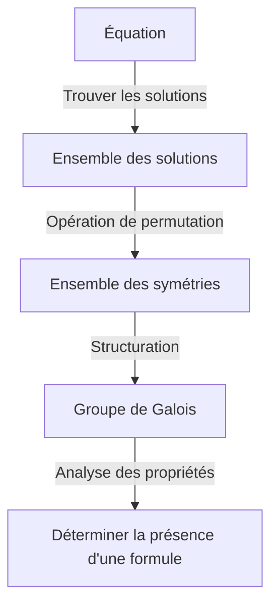
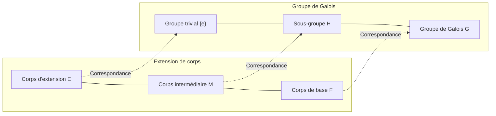

# 1. Introduction : Qu'est-ce que la théorie de Galois ?

L'une des théories les plus dramatiques et profondes de l'histoire des mathématiques est la **théorie de Galois** ([Galois Theory](https://kenji.blog/fr/p/galois-theory/)).
Cette théorie a été construite au début du 19ème siècle par le jeune mathématicien français [Évariste Galois](https://kenji.blog/fr/p/galois/).
La théorie de Galois a brillamment résolu un problème ancien : « Pourquoi n'y a-t-il pas de formule de résolution générale pour les équations de degré 5 ou plus ? » en utilisant un concept totalement nouveau appelé **groupe** (Group).

Dans cet article, nous expliquerons en profondeur et de manière compréhensible les idées de base de la théorie de Galois, son contexte historique et son influence sur les mathématiques modernes. Ouvrons la porte de l'algèbre et découvrons la beauté de la symétrie.

## 1.1 Qu'est-ce qu'une formule de résolution d'équation ?

Pour les équations du second degré $ax^2 + bx + c = 0$ que nous apprenons au collège, il existe la formule de résolution suivante :

$$
x = \frac{-b \pm \sqrt{b^2 - 4ac}}{2a}
$$

Cette formule montre qu'en appliquant un nombre fini d'opérations arithmétiques (addition, soustraction, multiplication, division) et de racines (racine carrée, racine cubique, etc.) aux coefficients $a, b, c$, il est toujours possible de trouver les solutions de n'importe quelle équation du second degré.
Pour les équations du troisième et quatrième degré, bien que plus complexes, des formules de résolution similaires utilisant les opérations arithmétiques et les racines existent, comme l'ont découvert les mathématiciens italiens du 16ème siècle (Cardan, Tartaglia, Ferrari, etc.). Celles-ci représentaient des avancées majeures dans l'histoire des mathématiques.

Cependant, en ce qui concerne les **équations du cinquième degré** $ax^5 + bx^4 + cx^3 + dx^2 + ex + f = 0$, pendant des siècles, de nombreux mathématiciens de génie comme Euler et Lagrange ont tenté de trouver une formule de résolution, mais personne n'a réussi. Lagrange s'est concentré sur les permutations des racines et a trouvé un début de solution, mais n'est pas parvenu à une preuve complète. Plus tard, Ruffini et Abel ont prouvé qu'« il n'y a pas de formule de résolution générale pour les équations de degré 5 ou plus » (théorème d'Abel-Ruffini), mais ils n'ont pas pu donner de critère fondamental pour déterminer quelles équations pouvaient être résolues et lesquelles ne le pouvaient pas.

# 2. La symétrie et la naissance de la théorie des groupes

La plus grande réussite de Galois est de ne pas avoir considéré les solutions d'une équation comme de simples « nombres », mais de s'être concentré sur la **symétrie** (Symmetry) entre les solutions. Il a décrit la structure inhérente de l'équation à l'aide d'un nouveau concept appelé « groupe ».

## 2.1 Permutation des racines et groupe de Galois

Considérons l'opération d'échange (permutation) des solutions d'une équation.
Si, même en échangeant les solutions, les relations mathématiques entre elles (relations en tant que polynômes à coefficients rationnels) sont préservées, on dit que cette permutation « préserve la symétrie de l'équation ».
Galois a découvert que l'ensemble de ces permutations préservant la symétrie possède une structure mathématique appelée **groupe**. Ce groupe est appelé le **groupe de Galois** (Galois Group) de l'équation.

## 2.2 Bases de la théorie des groupes et groupes résolubles

Introduisons ici les concepts fondamentaux de la théorie des groupes.
Un groupe $G$ est un ensemble sur lequel est définie une opération (par exemple la multiplication ou la composition) et qui satisfait aux trois conditions suivantes :

1. **Associativité** : Pour tout $a, b, c \in G$, on a $(a \cdot b) \cdot c = a \cdot (b \cdot c)$.
2. **Existence de l'élément neutre** : Il existe un élément $e \in G$ tel que pour tout $a \in G$, on a $a \cdot e = e \cdot a = a$.
3. **Existence de l'élément inverse** : Pour tout $a \in G$, il existe $a^{-1} \in G$ tel que $a \cdot a^{-1} = a^{-1} \cdot a = e$.

Galois a prouvé que le fait qu'une équation soit « résoluble par radicaux (les solutions peuvent être exprimées par une combinaison d'opérations arithmétiques et de racines) » est parfaitement équivalent au fait que le groupe de Galois de cette équation possède une propriété spéciale et est appelé un **groupe résoluble** (Solvable Group). En gros, un groupe résoluble est un groupe qui, lorsqu'il est décomposé en parties de plus en plus petites, aboutit finalement au groupe commutatif le plus simple (groupe cyclique).

# 3. Pourquoi les équations de degré 5 ne peuvent-elles pas être résolues ?

En utilisant la théorie de Galois, la raison pour laquelle les équations de degré 5 ou plus n'ont pas de formule de résolution devient étonnamment claire.

## 3.1 Extension de corps et correspondance de Galois

Le processus de résolution d'une équation peut être vu comme le processus d'élargissement progressif d'un ensemble de nombres (**corps**, Field). Un corps est un ensemble où les opérations arithmétiques peuvent être effectuées librement (ex : l'ensemble des nombres rationnels, l'ensemble des nombres réels, etc.).
Par exemple, en partant de l'ensemble des nombres rationnels $\mathbb{Q}$, on crée un nouveau corps en ajoutant les racines qui composent les solutions de l'équation. C'est ce qu'on appelle une **extension de corps**.

Le théorème fondamental, qui est le cœur de la théorie de Galois, montre qu'il existe une belle correspondance biunivoque (**correspondance de Galois**) entre les « corps intermédiaires de l'extension de corps » et les « sous-groupes du groupe de Galois ». Il existe une magnifique relation d'inversion : un grand corps correspond à un petit groupe, et un petit corps correspond à un grand groupe.

## 3.2 Non-résolubilité du groupe alterné de degré 5

Le groupe de Galois d'une équation générale de degré $n$ est le **groupe symétrique** $S_n$ composé de toutes les permutations des $n$ solutions.
Pour $n=2, 3, 4$, on sait que le groupe symétrique $S_n$ est un groupe résoluble. Cela correspond à l'existence de formules de résolution pour les équations des 2ème, 3ème et 4ème degrés.

Cependant, lorsque $n \ge 5$, la structure du groupe symétrique $S_n$ change considérablement. Le **groupe alterné** $A_5$ (le groupe composé uniquement de permutations paires) inclus dans $S_5$ est un « groupe simple » qui n'a que des sous-groupes normaux triviaux, et il est non abélien (non commutatif).
Un tel groupe simple non commutatif n'est pas un groupe résoluble.
Par conséquent, le groupe de Galois $S_5$ d'une équation générale du cinquième degré n'est pas un groupe résoluble, ce qui prouve qu'« aucune formule de résolution par radicaux n'existe ».

$$
\text{Le groupe de Galois } S_5 \text{ d'une équation générale du 5ème degré n'est pas résoluble}
$$

Cela ne signifie pas simplement qu'« une formule n'a pas encore été trouvée », mais cela indique le fait déterminant qu'« une telle formule ne peut mathématiquement pas exister ».

# 4. La vie d'[Évariste Galois](https://kenji.blog/fr/p/galois/)

La beauté de la théorie de Galois brille de mille feux dans l'histoire des mathématiques, mais la vie dramatique de Galois lui-même continue également de fasciner de nombreuses personnes.

Galois est né en 1811 près de Paris, en France. Il a révélé son talent exceptionnel pour les mathématiques dès son adolescence, mais les autorités mathématiques de l'époque (tels que Cauchy, Fourier, Poisson) ne comprenaient pas l'aspect extrêmement novateur de sa théorie ; ses articles ont été perdus ou rejetés comme « insuffisamment expliqués et incompréhensibles », le laissant dans l'infortune. Il a également échoué deux fois à l'examen d'entrée de l'École polytechnique, après s'être heurté à ses examinateurs.

De plus, il s'est plongé dans l'activisme politique en tant que républicain fervent. Ses propos radicaux contre la monarchie ont conduit à son expulsion de l'école et même à des peines de prison. Bien qu'il fût un génie des mathématiques, sa passion était toujours dirigée vers la révolution politique et sociale.

Ensuite, en 1832, à cause de complications amoureuses (certaines théories parlent de conspiration politique), Galois a dû se battre en duel au pistolet.
La veille du duel, pressentant sa propre mort, il craignit que sa théorie mathématique ne soit perdue. Il a passé une nuit blanche à écrire à la hâte les points principaux de sa théorie dans une lettre adressée à son ami Auguste Chevalier.
On raconte qu'il a écrit les mots poignants « Je n'ai pas le temps ! » dans les marges de cette lettre.

Abattu à l'abdomen lors du duel le 30 mai, Galois décéda le lendemain à l'âge de 20 ans seulement.
Les notes complexes qu'il a laissées ont été soigneusement déchiffrées et organisées plus de 10 ans plus tard par Joseph Liouville, et ont finalement été publiées dans une revue académique en 1846. Ce n'est que bien après sa mort que le contenu étonnant de ses travaux a été connu du monde entier et a choqué la communauté mathématique.

# 5. L'impact de la théorie de Galois sur les mathématiques modernes

Les graines abstraites semées par Galois, comme les concepts de « groupe » et d'« extension de corps », ont considérablement transformé les mathématiques par la suite.
Il n'est pas exagéré de dire que l'**algèbre abstraite** moderne s'est développée à partir de la théorie de Galois en tant que point de départ. Le style de recherche consistant à trouver des structures dans toutes sortes de collections d'objets – non seulement des nombres, mais aussi des polynômes, des matrices, des fonctions, etc. – et à les étudier, s'est imposé.

De plus, l'idée d'appréhender la symétrie en tant que groupe joue un rôle fondamental non seulement en mathématiques, mais aussi dans un large éventail de domaines tels que la physique, la chimie et l'informatique.
Par exemple, le modèle standard de la physique des particules est construit sur la théorie des groupes continus appelés groupes de Lie, et la cryptographie qui assure la sécurité des communications de l'information, ainsi que la théorie du codage qui corrige les erreurs de transmission de données (par exemple, les codes Reed-Solomon utilisés dans les CD, DVD, codes QR, etc.) sont des applications directes de la théorie de Galois sur les corps finis.

# 6. Conclusion et perspectives

La théorie de Galois nous apprend que derrière les équations, qui à première vue ne semblent être qu'une série de formules complexes, se cache une belle structure géométrique qu'est la symétrie.
C'est le plus grand paradoxe, voire un miracle, de l'histoire des sciences : une théorie née pour démontrer le résultat « négatif » que les équations du 5ème degré ne peuvent pas être résolues est finalement devenue une lumière immense illuminant l'ensemble des mathématiques modernes, ouvrant un tout nouveau monde mathématique.

Le voyage explorant la beauté de la symétrie cachée dans les équations a commencé avec Galois et se poursuit aujourd'hui vers les mathématiques de pointe (comme le programme de Langlands). L'étincelle de génie que Galois a laissée au cours de sa courte vie continue de nous fournir une inspiration infinie, même près de 200 ans plus tard.
