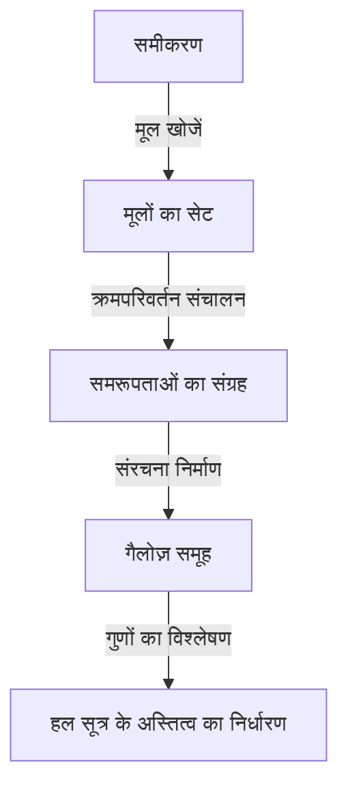
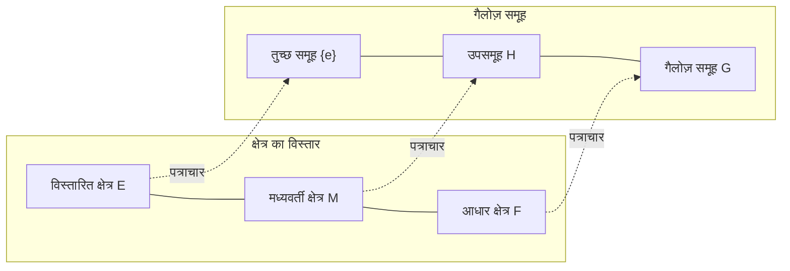

# 1. परिचय: गैलोज़ सिद्धांत क्या है?

गणित के इतिहास में सबसे नाटकीय और गहन सिद्धांतों में से एक **गैलोज़ सिद्धांत** (Galois Theory) है।
यह सिद्धांत 19वीं सदी की शुरुआत में एक युवा फ्रांसीसी गणितज्ञ इवरिस्ते गैलोज़ (Évariste Galois) द्वारा बनाया गया था।
गैलोज़ सिद्धांत ने "5वीं या उससे बड़ी घात के समीकरणों के लिए सामान्य हल सूत्र क्यों नहीं है?" की सदियों पुरानी समस्या को **समूह** (Group) नामक एक पूरी तरह से नई अवधारणा का उपयोग करके शानदार ढंग से हल किया।

इस लेख में, हम गैलोज़ सिद्धांत के मूल विचारों, इसकी ऐतिहासिक पृष्ठभूमि और आधुनिक गणित पर इसके प्रभाव को यथासंभव गहराई और सरलता से समझाएंगे। आइए बीजगणित के द्वार खोलें और समरूपता की सुंदरता का अनुभव करें।

## 1.1 समीकरण का हल सूत्र क्या है?

द्विघात समीकरण $ax^2 + bx + c = 0$ के लिए, जो हम मिडिल स्कूल में सीखते हैं, निम्नलिखित हल सूत्र मौजूद है:

$$
x = \frac{-b \pm \sqrt{b^2 - 4ac}}{2a}
$$

यह सूत्र दर्शाता है कि गुणांक $a, b, c$ पर केवल अंकगणितीय परिचालनों (जोड़, घटाव, गुणा, भाग) और मूलों (वर्गमूल, घनमूल, आदि) को सीमित संख्या में लागू करके, किसी भी द्विघात समीकरण का हल हमेशा निकाला जा सकता है।
16वीं सदी में इतालवी गणितज्ञों (कर्डानो, टार्टाग्लिया, फेरारी, आदि) ने यह खोज की कि घन और चतुर्थ घात समीकरणों के लिए भी, हालांकि वे अधिक जटिल हैं, अंकगणितीय परिचालनों और मूलों का उपयोग करने वाले समान हल सूत्र मौजूद हैं। ये गणित के इतिहास में बड़ी सफलताएं थीं।

हालांकि, **5वीं घात समीकरण** $ax^5 + bx^4 + cx^3 + dx^2 + ex + f = 0$ के लिए, यूलर और लैग्रेंज जैसे कई प्रतिभाशाली गणितज्ञों ने सदियों तक एक हल सूत्र खोजने की कोशिश की, लेकिन कोई भी सफल नहीं हुआ। लैग्रेंज ने मूलों के क्रमपरिवर्तन (permutation) पर ध्यान केंद्रित किया और समाधान का सुराग पाया, लेकिन वह इसे पूरी तरह सिद्ध नहीं कर सके। बाद में, रुफिनी और एबेल ने साबित किया कि "5वीं या उससे बड़ी घात के समीकरणों के लिए कोई सामान्य हल सूत्र मौजूद नहीं है" (एबेल-रुफिनी प्रमेय), लेकिन वे कोई मौलिक मानदंड नहीं दे सके कि किस प्रकार के समीकरण हल किए जा सकते हैं और कौन से नहीं।

# 2. समरूपता और समूह सिद्धांत का जन्म

गैलोज़ की सबसे बड़ी उपलब्धि समीकरण के मूलों को केवल "संख्याओं" के रूप में नहीं, बल्कि उनके बीच की **समरूपता** (Symmetry) पर ध्यान केंद्रित करना था। उन्होंने एक समीकरण की अंतर्निहित संरचना का वर्णन करने के लिए "समूह" की नई अवधारणा का उपयोग किया।

## 2.1 मूलों का क्रमपरिवर्तन और गैलोज़ समूह

मान लीजिए कि हम किसी समीकरण के मूलों की अदला-बदली (क्रमपरिवर्तन) करते हैं।
यदि मूलों के बीच संबंध (तर्कसंगत गुणांक वाले बहुपदों के रूप में संबंध) मूलों की अदला-बदली के बाद भी समान रहते हैं, तो कहा जाता है कि वह क्रमपरिवर्तन "समीकरण की समरूपता को बनाए रखता है।"
गैलोज़ ने खोजा कि ऐसे क्रमपरिवर्तनों का संग्रह जो समरूपता को बनाए रखते हैं, एक गणितीय संरचना बनाते हैं जिसे **समूह** कहा जाता है। इस समूह को उस समीकरण का **गैलोज़ समूह** (Galois Group) कहा जाता है।

## 2.2 समूह सिद्धांत के मूल सिद्धांत और हल करने योग्य समूह

यहां, आइए समूह सिद्धांत की बुनियादी अवधारणाओं का परिचय दें।
समूह $G$ एक ऐसा सेट है जिस पर एक संक्रिया (जैसे गुणा या संयोजन) परिभाषित की गई है, और जो निम्नलिखित तीन शर्तों को पूरा करता है:

1. **साहचर्य नियम** : किसी भी $a, b, c \in G$ के लिए, $(a \cdot b) \cdot c = a \cdot (b \cdot c)$ होता है।
2. **तत्समक अवयव की उपस्थिति** : एक ऐसा अवयव $e \in G$ मौजूद है जिसके लिए, किसी भी $a \in G$ के लिए, $a \cdot e = e \cdot a = a$ होता है।
3. **प्रतिलोम अवयव की उपस्थिति** : किसी भी $a \in G$ के लिए, एक $a^{-1} \in G$ मौजूद है जिसके लिए $a \cdot a^{-1} = a^{-1} \cdot a = e$ होता है।

गैलोज़ ने साबित किया कि एक समीकरण के "मूलों द्वारा हल होने योग्य" (अर्थात हल को अंकगणितीय संक्रियाओं और मूलों के संयोजन के रूप में व्यक्त किया जा सकता है) होने और उस समीकरण के गैलोज़ समूह के एक विशेष गुण, जिसे **हल करने योग्य समूह** (Solvable Group) कहा जाता है, के समतुल्य होने के बीच पूर्ण समानता है। सरल शब्दों में, एक हल करने योग्य समूह वह है जिसे धीरे-धीरे छोटे भागों में विभाजित करने पर अंततः सबसे सरल क्रमविनिमेय समूह (चक्रीय समूह) प्राप्त होता है।

# 3. 5वीं घात के समीकरण हल क्यों नहीं किए जा सकते?

गैलोज़ सिद्धांत का उपयोग करने पर यह आश्चर्यजनक रूप से स्पष्ट हो जाता है कि 5वीं या उससे बड़ी घात के समीकरणों के लिए हल सूत्र क्यों नहीं है।

## 3.1 क्षेत्र का विस्तार और गैलोज़ पत्राचार

एक समीकरण को हल करने की प्रक्रिया को संख्याओं के एक सेट ( **क्षेत्र** , Field) का धीरे-धीरे विस्तार करने की प्रक्रिया के रूप में देखा जा सकता है। एक क्षेत्र वह सेट है जहाँ चारों अंकगणितीय संक्रियाएं स्वतंत्र रूप से की जा सकती हैं (उदाहरण: सभी परिमेय संख्याएं, सभी वास्तविक संख्याएं, आदि)।
उदाहरण के लिए, हम परिमेय संख्याओं के सेट $\mathbb{Q}$ से शुरू करते हैं, और समीकरण के मूलों के घटकों (मूलों) को जोड़कर एक नया क्षेत्र बनाते हैं। इसे **क्षेत्र का विस्तार** कहा जाता है।

गैलोज़ सिद्धांत का मुख्य भाग, इसका मौलिक प्रमेय, दर्शाता है कि "क्षेत्र के विस्तार के मध्यवर्ती क्षेत्रों" और "गैलोज़ समूह के उपसमूहों" के बीच एक सुंदर एक-से-एक पत्राचार ( **गैलोज़ पत्राचार** ) है। एक अद्भुत विपरीत संबंध मौजूद है: एक बड़ा क्षेत्र एक छोटे समूह से मेल खाता है, और एक छोटा क्षेत्र एक बड़े समूह से मेल खाता है।

## 3.2 5वें एकांतर समूह की गैर-हलशीलता

एक सामान्य $n$-वें घात वाले समीकरण का गैलोज़ समूह **सममित समूह** (Symmetric Group) $S_n$ होता है, जिसमें $n$ मूलों के सभी क्रमपरिवर्तन शामिल होते हैं।
$n=2, 3, 4$ के लिए, यह ज्ञात है कि सममित समूह $S_n$ हल करने योग्य समूह हैं। यह इस बात से मेल खाता है कि द्विघात, त्रिघात और चतुर्थ घात वाले समीकरणों के लिए हल सूत्र मौजूद हैं।

हालांकि, जब $n \ge 5$ होता है, तो सममित समूह $S_n$ की संरचना काफी बदल जाती है। $S_5$ में निहित **एकांतर समूह** $A_5$ (सम क्रमपरिवर्तनों वाला समूह) एक "सरल समूह" है, जिसके केवल तुच्छ सामान्य उपसमूह हैं, और यह गैर-एबेलियन (गैर-क्रमविनिमेय) भी है।
ऐसे सरल गैर-क्रमविनिमेय समूह हल करने योग्य नहीं होते हैं।
इसलिए, एक सामान्य 5वीं घात समीकरण का गैलोज़ समूह $S_5$ हल करने योग्य समूह नहीं है, और इसके परिणामस्वरूप यह सिद्ध हो जाता है कि "मूलों के माध्यम से कोई हल सूत्र मौजूद नहीं है।"

$$
\text{सामान्य 5वीं घात समीकरण का गैलोज़ समूह } S_5 \text{ हल करने योग्य नहीं है}
$$

इसका मतलब सिर्फ यह नहीं है कि "अभी तक कोई सूत्र नहीं मिला है," बल्कि यह एक निर्णायक तथ्य है कि "ऐसा सूत्र गणितीय रूप से मौजूद हो ही नहीं सकता।"

# 4. इवरिस्ते गैलोज़ का जीवन

यद्यपि गैलोज़ सिद्धांत की सुंदरता गणित के इतिहास में शानदार ढंग से चमकती है, गैलोज़ का नाटकीय जीवन भी कई लोगों को आकर्षित करता है।

गैलोज़ का जन्म 1811 में पेरिस, फ्रांस के पास हुआ था। उन्होंने किशोरावस्था से ही अपनी असाधारण गणितीय प्रतिभा दिखाना शुरू कर दिया था, लेकिन उस समय के गणित के दिग्गजों (कॉची, फूरियर, पॉइसन, आदि) को उनके सिद्धांतों की नवीनता समझ में नहीं आई। उनके शोध पत्र खो गए या "अपर्याप्त स्पष्टीकरण, समझ से बाहर" कहकर वापस कर दिए गए। उन्हें इकोले पॉलीटेक्निक की प्रवेश परीक्षा में भी दो बार असफलता का सामना करना पड़ा क्योंकि उन्होंने परीक्षकों के साथ विवाद किया था।

एक उत्साही रिपब्लिकन के रूप में उन्होंने खुद को राजनीतिक गतिविधियों में भी डुबो दिया। राजशाही के खिलाफ उनके चरम बयानों के कारण उन्हें स्कूल से निकाल दिया गया और जेल में भी डाल दिया गया। एक गणितीय प्रतिभा होने के बावजूद, उनका जुनून हमेशा राजनीति और सामाजिक क्रांति की ओर भी निर्देशित था।

और फिर 1832 में, एक प्रेम प्रसंग (कुछ लोग कहते हैं कि यह एक राजनीतिक साजिश थी) के कारण, गैलोज़ एक पिस्तौल द्वंद्वयुद्ध में शामिल हो गए।
द्वंद्वयुद्ध से एक रात पहले, उन्हें अपनी मृत्यु का पूर्वाभास था और डर था कि उनके गणितीय सिद्धांत हमेशा के लिए खो जाएंगे। उन्होंने अपने दोस्त ऑगस्टे शेवेलियर को पत्र लिखा और रात भर जागकर अपने सिद्धांतों के सार को जल्दबाजी में लिखा।
कहा जाता है कि उस पत्र के हाशिये में उन्होंने दिल तोड़ने वाले शब्द लिखे थे: "मेरे पास समय नहीं है! (Je n'ai pas le temps!)"

अगले दिन 30 मई को द्वंद्वयुद्ध में पेट में गोली लगने के बाद, गैलोज़ की अगले दिन मात्र 20 वर्ष की आयु में मृत्यु পরিচत हो गई।
उनके द्वारा छोड़े गए जटिल नोट्स को जोसेफ लिउविल द्वारा सावधानीपूर्वक समझा और व्यवस्थित किया गया, और एक दशक से अधिक समय के बाद, अंततः 1846 में एक अकादमिक पत्रिका में प्रकाशित किया गया। उनके मरने के काफी समय बाद उनके काम की चौंकाने वाली सामग्री दुनिया के सामने आई, जिससे पूरे गणितीय समुदाय में सनसनी फैल गई।

# 5. आधुनिक गणित पर गैलोज़ सिद्धांत का प्रभाव

गैलोज़ द्वारा बोए गए "समूह" और "क्षेत्र विस्तार" जैसे अमूर्त बीजों ने बाद में गणित को काफी हद तक बदल दिया।
आधुनिक **अमूर्त बीजगणित** के बारे में यह कहना अतिशयोक्ति नहीं होगी कि इसका विकास गैलोज़ सिद्धांत के शुरुआती बिंदु से हुआ है। अब केवल संख्याओं के बजाय बहुपदों, आव्यूहों और फलनों जैसी किसी भी वस्तु के संग्रह में संरचना खोजने और उसका अध्ययन करने की शैली स्थापित हो गई है।

साथ ही, समरूपता को एक समूह के रूप में समझने के विचार ने न केवल गणित में बल्कि भौतिकी, रसायन विज्ञान और कंप्यूटर विज्ञान जैसे विभिन्न क्षेत्रों में भी एक मौलिक भूमिका निभाई है।
उदाहरण के लिए, कण भौतिकी का मानक मॉडल ली समूहों (Lie groups) नामक सतत समूहों के सिद्धांत पर बनाया गया है। सूचना संचार की सुरक्षा सुनिश्चित करने वाला क्रिप्टोग्राफी सिद्धांत और डेटा संचार में त्रुटियों को ठीक करने वाला कोडिंग सिद्धांत (जैसे रीड-सोलोमन कोड जिसका उपयोग सीडी, डीवीडी, क्यूआर कोड आदि में किया जाता है) भी परिमित क्षेत्रों पर गैलोज़ सिद्धांत के सीधे अनुप्रयोग हैं।

# 6. निष्कर्ष और आगे का मार्ग

गैलोज़ सिद्धांत हमें सिखाता है कि जो समीकरण पहली नज़र में केवल जटिल गणितीय सूत्रों की एक श्रृंखला प्रतीत होते हैं, उनके पीछे समरूपता की एक सुंदर ज्यामितीय संरचना छिपी होती है।
यह विज्ञान के इतिहास में सबसे बड़ा विरोधाभास और एक चमत्कार है कि 5वीं घात के समीकरणों को हल न कर पाने के "नकारात्मक" परिणाम को दर्शाने के लिए बना सिद्धांत, अंततः एक विशाल प्रकाश बन गया जिसने पूरे आधुनिक गणित को रोशन कर दिया और गणित की एक पूरी तरह से नई दुनिया खोल दी।

समीकरणों में छिपी समरूपता की सुंदरता का पता लगाने की यह यात्रा गैलोज़ से शुरू हुई और आज भी अत्याधुनिक गणित (जैसे लैंग्लैंड्स प्रोग्राम) में जारी है। गैलोज़ ने अपने छोटे से जीवन में जो प्रेरणा छोड़ी, वह लगभग 200 साल बाद भी हमें असीम रूप से प्रेरित कर रही है।
