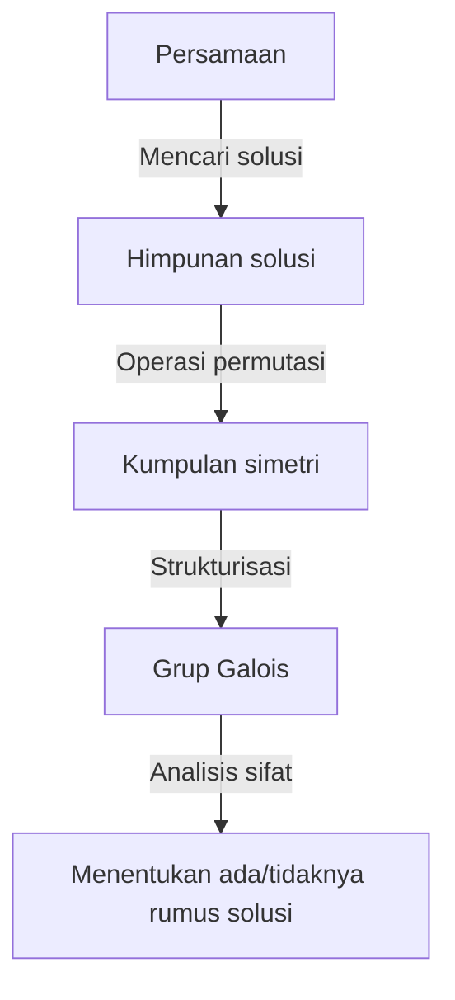
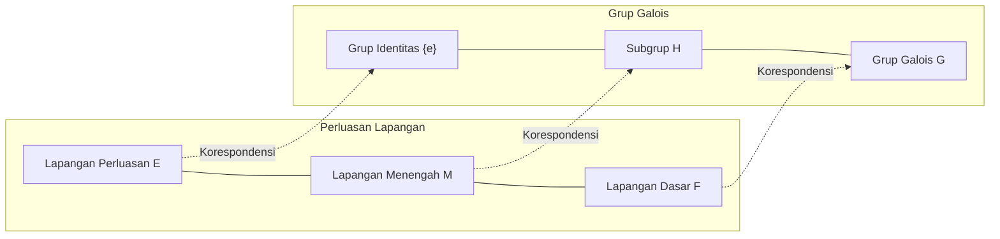

# 1. Pendahuluan: Apa itu Teori Galois?

Dalam sejarah matematika, salah satu teori yang paling dramatis dan paling mendalam adalah **Teori Galois** (Galois Theory).
Teori ini dibangun pada awal abad ke-19 oleh seorang matematikawan muda Prancis, Évariste Galois.
Teori Galois berhasil memecahkan masalah sulit yang sudah ada sejak lama, "Mengapa tidak ada rumus solusi umum untuk persamaan derajat 5 atau lebih?", dengan menggunakan konsep yang sama sekali baru yaitu **Grup** (Group).

Dalam artikel ini, kami akan menjelaskan mulai dari ide dasar Teori Galois, latar belakang sejarahnya, hingga pengaruhnya terhadap matematika modern, sedalam dan semudah mungkin. Mari kita buka pintu aljabar dan sentuh keindahan simetri.

## 1.1 Apa itu Rumus Solusi Persamaan?

Pada persamaan kuadrat $ax^2 + bx + c = 0$ yang kita pelajari di sekolah menengah pertama, terdapat rumus solusi berikut:

$$
x = \frac{-b \pm \sqrt{b^2 - 4ac}}{2a}
$$

Rumus ini menunjukkan bahwa untuk koefisien $a, b, c$, dengan hanya menerapkan empat operasi aritmetika dasar (penjumlahan, pengurangan, perkalian, pembagian) dan akar pangkat (akar kuadrat, akar pangkat tiga, dll.) dalam jumlah terbatas, kita pasti dapat memperoleh solusi untuk persamaan kuadrat apa pun.
Untuk persamaan pangkat tiga (kubik) dan pangkat empat (kuartik), meskipun lebih rumit, rumus solusi menggunakan empat operasi aritmetika dan akar pangkat yang serupa ditemukan oleh para matematikawan Italia pada abad ke-16 (seperti Cardano, Tartaglia, dan Ferrari). Ini merupakan terobosan besar dalam sejarah matematika.

Namun, untuk **persamaan pangkat lima** (kuintik) $ax^5 + bx^4 + cx^3 + dx^2 + ex + f = 0$, selama berabad-abad, banyak matematikawan jenius seperti Euler dan Lagrange mencoba menemukan rumus solusinya, tetapi tidak satu pun berhasil. Lagrange berfokus pada permutasi solusi dan menangkap petunjuk untuk pemecahan, tetapi tidak mencapai pembuktian yang lengkap. Setelah itu, Ruffini dan Abel membuktikan bahwa "tidak ada rumus solusi umum untuk persamaan derajat 5 atau lebih" (Teorema Abel-Ruffini), tetapi mereka tidak dapat memberikan kriteria mendasar mengenai persamaan seperti apa yang dapat dipecahkan dan persamaan seperti apa yang tidak dapat dipecahkan.

# 2. Simetri dan Lahirnya Teori Grup

Pencapaian terbesar Galois adalah ia tidak sekadar menganggap solusi persamaan sebagai "angka" semata, melainkan berfokus pada **simetri** (Symmetry) di antara solusi-solusi tersebut. Ia mendeskripsikan struktur unik yang dimiliki oleh persamaan menggunakan konsep baru yang disebut "grup".

## 2.1 Permutasi Solusi dan Grup Galois

Mari kita pertimbangkan operasi menukar posisi (permutasi) dari solusi-solusi suatu persamaan.
Jika hubungan yang berlaku di antara solusi (hubungan sebagai polinomial dengan koefisien bilangan rasional) tetap dipertahankan meskipun solusi tersebut ditukar posisinya, maka permutasi tersebut dapat dikatakan "mempertahankan simetri persamaan".
Galois menemukan bahwa kumpulan permutasi yang mempertahankan simetri tersebut memiliki struktur matematis yang disebut **Grup**. Grup ini disebut **Grup Galois** (Galois Group) dari persamaan tersebut.

## 2.2 Dasar-dasar Teori Grup dan Grup Solvabel

Di sini, mari kita perkenalkan konsep dasar teori grup.
Grup $G$ adalah suatu himpunan di mana satu operasi (misalnya, perkalian atau komposisi) didefinisikan, dan memenuhi tiga kondisi berikut:

1. **Hukum Asosiatif** : Untuk sembarang $a, b, c \in G$, berlaku $(a \cdot b) \cdot c = a \cdot (b \cdot c)$.
2. **Eksistensi Elemen Identitas** : Terdapat suatu elemen $e \in G$ sehingga untuk sembarang $a \in G$ berlaku $a \cdot e = e \cdot a = a$.
3. **Eksistensi Elemen Invers** : Untuk sembarang $a \in G$, terdapat $a^{-1} \in G$ sehingga $a \cdot a^{-1} = a^{-1} \cdot a = e$.

Galois membuktikan bahwa sebuah persamaan "dapat dipecahkan dengan akar" (solusi dapat diekspresikan dengan kombinasi empat operasi aritmetika dan akar pangkat) ekuivalen sepenuhnya dengan sifat khusus yang disebut **Grup Solvabel** (Solvable Group) pada grup Galois persamaan tersebut. Secara kasar, grup solvabel adalah grup yang, jika kita terus memecahnya menjadi bagian yang lebih kecil, pada akhirnya kita akan mencapai grup komutatif (grup siklik) yang paling sederhana.

# 3. Mengapa Persamaan Pangkat Lima Tidak Dapat Dipecahkan?

Dengan menggunakan Teori Galois, menjadi sangat jelas mengapa tidak ada rumus solusi untuk persamaan derajat 5 atau lebih.

## 3.1 Perluasan Lapangan dan Korespondensi Galois

Proses menyelesaikan persamaan dapat dipahami sebagai proses memperluas himpunan bilangan (**Lapangan**, Field) secara bertahap. Lapangan adalah himpunan di mana empat operasi aritmetika dasar dapat dilakukan secara bebas (contoh: himpunan seluruh bilangan rasional, himpunan seluruh bilangan real, dll.).
Misalnya, kita mulai dari himpunan bilangan rasional $\mathbb{Q}$, lalu menambahkan akar pangkat yang merupakan komponen solusi dari persamaan untuk membuat lapangan baru. Ini disebut **Perluasan Lapangan** (Field Extension).

Teorema fundamental, yang merupakan jantung dari Teori Galois, menunjukkan bahwa terdapat korespondensi satu-satu yang indah (**Korespondensi Galois**) antara "lapangan menengah dari perluasan lapangan" dan "subgrup dari grup Galois". Terdapat hubungan inversi yang luar biasa, di mana lapangan yang besar berkorespondensi dengan grup yang kecil, dan lapangan yang kecil berkorespondensi dengan grup yang besar.

## 3.2 Sifat Non-Solvabel dari Grup Alternating Derajat 5

Grup Galois dari persamaan derajat $n$ umum adalah **Grup Simetrik** $S_n$ yang terdiri dari semua permutasi dari $n$ buah solusi.
Untuk $n=2, 3, 4$, diketahui bahwa grup simetrik $S_n$ adalah grup solvabel. Ini berkorespondensi dengan adanya rumus solusi untuk persamaan derajat 2, 3, dan 4.

Namun, untuk $n \ge 5$, struktur grup simetrik $S_n$ berubah drastis. **Grup Alternating** $A_5$ (grup yang hanya terdiri dari permutasi genap) yang terdapat dalam $S_5$ adalah "grup simpel" yang hanya memiliki subgrup normal yang trivial, dan bersifat non-abelian (non-komutatif).
Grup simpel non-komutatif semacam itu bukanlah grup solvabel.
Oleh karena itu, grup Galois $S_5$ dari persamaan pangkat lima umum bukanlah grup solvabel, dan akibatnya terbukti bahwa "tidak ada rumus solusi menggunakan akar pangkat".

$$
\text{Grup Galois } S_5 \text{ dari persamaan pangkat lima umum bukanlah grup solvabel}
$$

Ini bukan sekadar "rumusnya belum ditemukan", melainkan menunjukkan fakta menentukan bahwa "rumus semacam itu secara matematis tidak mungkin ada".

# 4. Kehidupan Évariste Galois

Meskipun keindahan Teori Galois bersinar cemerlang dalam sejarah matematika, kehidupan dramatis Galois sendiri juga tak henti-hentinya memikat banyak orang.

Galois lahir di dekat Paris, Prancis, pada tahun 1811. Ia mengembangkan bakat luar biasa dalam matematika sejak usia belasan tahun, tetapi teori-teorinya yang terlalu inovatif tidak dipahami oleh para ahli matematika terkemuka pada masa itu (seperti Cauchy, Fourier, dan Poisson), sehingga ia harus menghadapi nasib buruk: makalahnya hilang, atau ditolak karena "penjelasannya tidak cukup dan tidak dapat dipahami". Ia juga dua kali gagal dalam ujian masuk École Polytechnique karena bentrok dengan pengujinya.

Selain itu, ia juga membenamkan dirinya dalam aktivitas politik sebagai pendukung republik (republikan) yang fanatik. Kata-katanya yang radikal terhadap monarki menyebabkan ia dikeluarkan dari sekolah, dan bahkan mengalami penahanan. Meskipun ia seorang jenius matematika, hasratnya selalu diarahkan pada revolusi politik dan sosial juga.

Lalu pada tahun 1832, Galois terlibat dalam duel pistol akibat masalah percintaan (ada juga teori yang menyebutkan bahwa ini adalah konspirasi politik).
Pada malam sebelum duel, ia merasakan bahwa kematiannya sudah dekat dan takut teori matematikanya akan hilang. Ia menulis ringkasan teorinya dengan tergesa-gesa sepanjang malam dan menujukannya kepada temannya, Auguste Chevalier.
Dikatakan bahwa di margin surat itu, ia menulis kata-kata yang memilukan: "Saya tidak punya waktu! (Je n'ai pas le temps!)"

Galois, yang tertembak di perut dalam duel pada tanggal 30 Mei keesokan harinya, meninggal dunia sehari kemudian pada usia yang baru 20 tahun.
Catatan-catatan sulit yang ditinggalkannya baru diuraikan dan disusun secara hati-hati oleh Joseph Liouville lebih dari 10 tahun kemudian, dan akhirnya dipublikasikan di jurnal akademik pada tahun 1846. Isinya yang menakjubkan dikenal dunia dan mengejutkan dunia matematika, lama setelah kematiannya.

# 5. Pengaruh Teori Galois terhadap Matematika Modern

Benih-benih abstrak seperti "grup" dan "perluasan lapangan" yang ditaburkan oleh Galois telah mengubah wajah matematika secara signifikan setelahnya.
Tidak berlebihan untuk mengatakan bahwa **Aljabar Abstrak** modern berkembang dengan Teori Galois sebagai titik tolaknya. Tidak hanya bilangan, tetapi polinomial, matriks, fungsi, dan himpunan objek apa pun kini dianalisis strukturnya, dan gaya penelitian ini menjadi mapan.

Selain itu, gagasan untuk menganggap simetri sebagai grup memainkan peran fundamental di berbagai bidang luas, bukan hanya di matematika, melainkan juga di fisika, kimia, dan ilmu komputer.
Misalnya, Model Standar dalam fisika partikel dibangun di atas teori grup kontinu yang disebut Grup Lie; dan teori kriptografi yang mendukung keamanan komunikasi informasi, serta teori pengkodean yang mengoreksi kesalahan komunikasi data (misalnya kode Reed-Solomon yang digunakan dalam CD, DVD, kode QR, dll.), adalah aplikasi langsung dari Teori Galois pada lapangan berhingga.

# 6. Kesimpulan dan Prospek

Teori Galois mengajarkan kita bahwa di balik persamaan, yang sepintas hanya terlihat seperti deretan rumus matematika rumit, tersembunyi struktur geometris simetri yang indah.
Fakta bahwa sebuah teori yang lahir untuk menunjukkan hasil "negatif" bahwa persamaan pangkat lima tidak dapat dipecahkan, pada akhirnya menjadi cahaya raksasa yang menerangi seluruh matematika modern dan membuka dunia matematika yang sama sekali baru, dapat dikatakan sebagai paradoks terbesar dan keajaiban dalam sejarah sains.

Perjalanan untuk mengeksplorasi keindahan simetri yang tersembunyi dalam persamaan dimulai dari Galois dan berlanjut hingga saat ini ke matematika mutakhir (seperti Program Langlands). Kilatan pencerahan yang ditinggalkan Galois dalam hidupnya yang singkat, terus memberikan inspirasi tak terbatas bagi kita bahkan setelah hampir 200 tahun berlalu.
