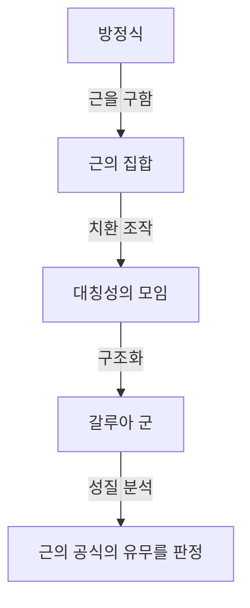
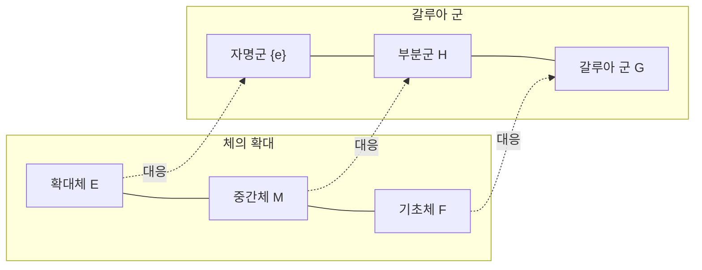

# 1. 서론: 갈루아 이론이란?

수학의 역사에 있어서 가장 드라마틱하고, 또한 가장 심오한 이론 중 하나가 **갈루아 이론** (Galois Theory)입니다.
이 이론은 19세기 초반 프랑스의 젊은 수학자 에바리스트 갈루아(Évariste Galois)에 의해 구축되었습니다.
갈루아 이론은 "왜 5차 이상의 방정식에는 일반적인 근의 공식이 존재하지 않는가?"라는 오래된 난제를, **군** (Group)이라는 완전히 새로운 개념을 사용하여 멋지게 해결했습니다.

본 기사에서는 갈루아 이론의 기본적인 아이디어부터, 그 역사적 배경, 그리고 현대 수학에 미친 영향까지를 최대한 깊고 알기 쉽게 해설합니다. 대수학의 문을 열고, 대칭성의 아름다움에 닿아 봅시다.

## 1.1 방정식의 근의 공식이란?

우리가 중학생 때 배우는 2차 방정식 $ax^2 + bx + c = 0$ 에는 다음과 같은 근의 공식이 존재합니다.

$$
x = \frac{-b \pm \sqrt{b^2 - 4ac}}{2a}
$$

이 공식은 계수 $a, b, c$ 에 대하여 사칙연산(덧셈, 뺄셈, 곱셈, 나눗셈)과 거듭제곱근(제곱근, 세제곱근 등)을 유한 번 적용하는 것만으로, 어떠한 2차 방정식이든 반드시 근을 도출해 낼 수 있음을 보여줍니다.
3차 방정식이나 4차 방정식에도, 보다 복잡하기는 하지만, 동일하게 사칙연산과 거듭제곱근을 이용한 근의 공식이 존재한다는 것이 16세기 이탈리아의 수학자들(카르다노, 타르탈리아, 페라리 등)에 의해 발견되었습니다. 이것들은 수학사에 있어서 큰 돌파구였습니다.

하지만, **5차 방정식** $ax^5 + bx^4 + cx^3 + dx^2 + ex + f = 0$ 에 대해서는 수세기에 걸쳐 오일러나 라그랑주 같은 많은 천재 수학자들이 근의 공식을 찾으려 도전했지만, 그 누구도 성공하지 못했습니다. 라그랑주는 근의 치환에 주목하여 해결의 실마리를 잡았지만, 완전한 증명에는 이르지 못했습니다. 그 후, 루피니와 아벨에 의해 "5차 이상의 방정식에는 일반적인 근의 공식이 존재하지 않는다"는 것이 증명되었지만(아벨-루피니 정리), 어떠한 방정식이면 풀리고 어떠한 방정식이면 풀리지 않는지에 대한 근본적인 기준을 제시하지는 못했습니다.

# 2. 대칭성과 군론의 탄생

갈루아의 최대의 공적은 방정식의 근을 단순한 "수"로서 파악하는 것이 아니라, 근들 사이의 **대칭성** (Symmetry)에 주목한 것입니다. 그는 방정식이 갖는 고유의 구조를 "군"이라는 새로운 개념으로 기술했습니다.

## 2.1 근의 치환과 갈루아 군

어떤 방정식의 근을 뒤바꾸는 조작(치환)을 생각해 봅니다.
만약 근을 뒤바꾸어도 근들 사이에 성립하는 관계식(유리수 계수의 다항식으로서의 관계)이 유지된다면, 그 치환은 "방정식의 대칭성을 유지한다"고 말할 수 있습니다.
갈루아는 이러한 대칭성을 유지하는 치환들의 모임이 **군** 이라는 수학적인 구조를 갖는다는 것을 발견했습니다. 이 군을 그 방정식의 **갈루아 군** (Galois Group)이라고 부릅니다.

## 2.2 군론의 기초와 가해군

여기서 군론의 기본적인 개념을 소개하겠습니다.
군 $G$ 란, 집합에 하나의 연산(예를 들어 곱셈이나 합성)이 정의되어 있으며, 이하의 3가지 조건을 만족하는 것을 말합니다.

1. **결합법칙** : 임의의 $a, b, c \in G$ 에 대하여, $(a \cdot b) \cdot c = a \cdot (b \cdot c)$ 가 성립한다.
2. **항등원의 존재** : 어떤 요소 $e \in G$ 가 존재하여, 임의의 $a \in G$ 에 대하여 $a \cdot e = e \cdot a = a$ 가 성립한다.
3. **역원의 존재** : 임의의 $a \in G$ 에 대하여, $a \cdot a^{-1} = a^{-1} \cdot a = e$ 가 되는 $a^{-1} \in G$ 가 존재한다.

갈루아는 방정식이 "거듭제곱근으로 풀린다(사칙연산과 거듭제곱근의 조합으로 해를 표현할 수 있다)"는 것과, 그 방정식의 갈루아 군이 **가해군** (Solvable Group)이라 불리는 특별한 성질을 갖는 것이 완전히 동치임을 증명했습니다. 가해군이란 대략적으로 말하자면, 군을 점점 잘게 분해해 나갔을 때, 최종적으로 가장 단순한 가환군(순환군)에 도달하게 되는 군을 말합니다.

# 3. 왜 5차 방정식은 풀 수 없는가?

갈루아 이론을 이용하면 왜 5차 이상의 방정식에 근의 공식이 존재하지 않는지가 놀라울 정도로 명확해집니다.

## 3.1 체의 확대와 갈루아 대응

방정식을 푼다는 프로세스는 수의 집합( **체** , Field)을 서서히 넓혀가는 과정으로 파악할 수 있습니다. 체란 사칙연산을 자유롭게 할 수 있는 집합을 말합니다(예: 유리수 전체, 실수 전체 등).
예를 들어, 유리수의 집합 $\mathbb{Q}$ 에서 출발하여, 방정식의 근의 성분인 거듭제곱근을 덧붙임으로써 새로운 체를 만듭니다. 이것을 **체의 확대** 라고 부릅니다.

갈루아 이론의 심장부인 기본 정리는 "체 확대의 중간체"와 "갈루아 군의 부분군" 사이에 아름다운 1대1 대응 관계( **갈루아 대응** )가 있음을 보여줍니다. 큰 체는 작은 군에 대응하고, 작은 체는 큰 군에 대응한다는, 멋진 반전 관계가 존재하는 것입니다.

## 3.2 5차 교대군의 비가해성

일반적인 $n$ 차 방정식의 갈루아 군은 $n$ 개의 근의 모든 치환으로 이루어진 **대칭군** $S_n$ 이 됩니다.
$n=2, 3, 4$ 인 경우, 대칭군 $S_n$ 은 가해군임이 알려져 있습니다. 이것은 2차, 3차, 4차 방정식에 근의 공식이 존재하는 것에 대응합니다.

그러나 $n \ge 5$ 인 경우, 대칭군 $S_n$ 의 구조는 크게 변화합니다. $S_5$ 에 포함된 **교대군** $A_5$ (짝치환으로만 이루어진 군)는 정규 부분군을 자명한 것밖에 갖지 않는 "단순군"이며, 동시에 비아벨(비가환)입니다.
이러한 단순 비가환군은 가해군이 아닙니다.
따라서 일반적인 5차 방정식의 갈루아 군 $S_5$ 는 가해군이 아니게 되며, 결과적으로 "거듭제곱근에 의한 근의 공식은 존재하지 않는다"는 것이 증명되는 것입니다.

$$
\text{일반적인 5차 방정식의 갈루아 군 } S_5 \text{ 는 가해군이 아니다}
$$

이것은 단순히 "아직 공식을 찾지 못했다"는 것이 아니라, "그러한 공식은 수학적으로 존재할 수 없다"는 결정적인 사실을 보여줍니다.

# 4. 에바리스트 갈루아의 생애

갈루아 이론의 아름다움은 수학사에 찬란하게 빛나고 있지만, 갈루아 자신의 극적인 생애 또한 많은 사람들을 매료시켜 마지않습니다.

갈루아는 1811년 프랑스 파리 근교에서 태어났습니다. 그는 10대 때부터 수학의 유례없는 재능을 꽃피웠지만, 당시 수학계의 권위자들(코시나 푸리에, 푸아송 등)에게는 그의 이론의 지나친 참신함이 이해되지 않았고, 논문이 분실되거나 "설명이 불충분하고 이해 불능"이라며 되돌려지는 등의 불우함을 겪었습니다. 에콜 폴리테크니크의 입시에도 면접관과 충돌하여 두 번이나 실패했습니다.

또한, 그는 열광적인 공화주의자로서 정치 활동에도 몰두했습니다. 왕정에 대한 과격한 언동으로 퇴학 처분을 받았고, 나아가 투옥되는 경험도 했습니다. 수학의 천재이면서도 그 열정은 항상 정치와 사회 혁명을 향해 있기도 했습니다.

그리고 1832년, 갈루아는 연애 관계의 얽힘(정치적 음모라는 설도 있습니다)으로 인해 권총 결투를 벌이게 됩니다.
결투 전날 밤, 그는 자신의 죽음을 예감하고 수학적 이론이 소실될 것을 두려워했습니다. 그는 친구인 오귀스트 슈발리에에게 보내는 편지에 자신의 이론의 요지를 밤을 새워 서둘러 적어 남겼습니다.
그 편지의 여백에는 "시간이 없다!(Je n'ai pas le temps!)"라는 비통한 말이 적혀 있었다고 전해집니다.

다음 날인 5월 30일 결투에서 복부에 총을 맞은 갈루아는 다음 날 불과 20세의 나이로 세상을 떠났습니다.
그가 남긴 난해한 메모는 10년 이상이 지난 후 조제프 리우빌에 의해 주의 깊게 해독되고 정리되어, 1846년에 비로소 학술지에 발표되었습니다. 그 경이로운 내용이 세상에 알려지고 수학계에 충격을 준 것은 그가 죽고 나서 한참 뒤의 일이었습니다.

# 5. 갈루아 이론이 현대 수학에 미친 영향

갈루아가 뿌린 "군"이나 "체의 확대"라는 추상적인 씨앗은 그 후의 수학을 크게 변모시켰습니다.
현대의 **추상대수학** 은 갈루아 이론을 출발점으로 하여 발전했다고 해도 과언이 아닙니다. 수뿐만 아니라 다항식이나 행렬, 함수 등 모든 대상의 모임에서 구조를 찾아내어 그것을 연구하는 스타일이 정착되었습니다.

또한, 대칭성을 군으로 파악한다는 생각은 수학뿐만 아니라 물리학이나 화학, 정보과학 등 폭넓은 분야에서 근본적인 역할을 하고 있습니다.
예를 들어 소립자 물리학의 표준 모형은 리 군이라 불리는 연속적인 군의 이론 위에 구축되어 있으며, 정보 통신의 안전을 뒷받침하는 암호 이론이나, 데이터 통신의 오류를 정정하는 부호 이론(예를 들어 CD나 DVD, QR 코드 등에 사용되는 리드-솔로몬 부호 등)도 유한체 위의 갈루아 이론의 직접적인 응용입니다.

# 6. 요약 및 전망

갈루아 이론은 언뜻 보기에 복잡한 수식의 나열로밖에 보이지 않는 방정식의 이면에 대칭성이라는 아름다운 기하학적인 구조가 숨겨져 있음을 가르쳐 줍니다.
5차 방정식이 풀리지 않는다는 "부정적인" 결과를 보여주기 위해 탄생한 이론이 결과적으로 현대 수학 전체를 비추는 거대한 빛이 되어, 전혀 새로운 수학의 세계를 개척한 것은 과학의 역사에 있어서 최대의 역설이자 기적이라고 말할 수 있을 것입니다.

방정식에 숨겨진 대칭성의 아름다움을 탐구하는 여행은 갈루아로부터 시작되어, 현재도 최첨단의 수학(랭글랜즈 프로그램 등)으로 이어지고 있습니다. 갈루아가 짧은 생애에 남긴 번뜩임은 200년 가까이 지난 지금도 여전히 우리에게 무한한 영감을 계속해서 주고 있습니다.
